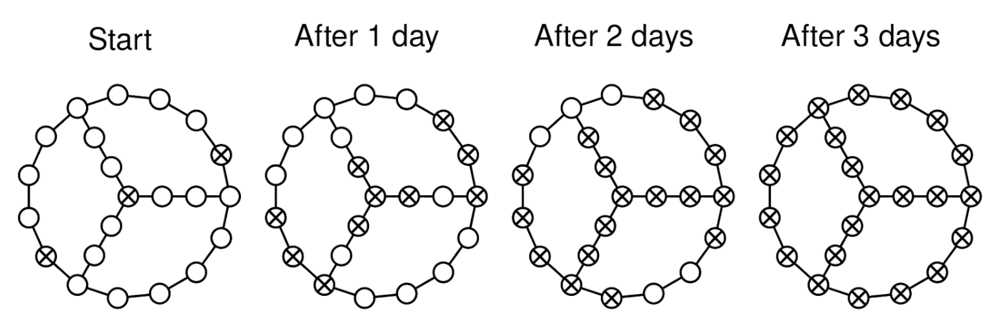
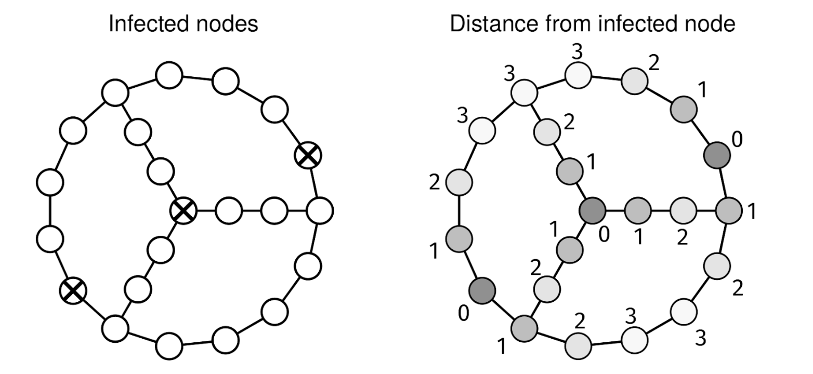

Some computers in a network have been infected by a virus. We are given the adjacency list of an undirected, connected graph, graph, representing the computer network, and an array, infected, with the indices of the infected nodes.

Every day, the virus spreads to all computers directly connected to an infected neighbor computer.

How many days will it take to infect all computers?

For example, for this graph:

Days until all infected

It takes 3 days for the virus to infect all computers.

Example 1:
graph = [
  [1, 2],       # Node 0
  [0, 2],       # Node 1
  [0, 1, 3],    # Node 2
  [2]           # Node 3
]
infected = [0]

Output: 2
On day 1, nodes 1 and 2 get infected
On day 2, node 3 gets infected

Example 2:
graph = [
  [1],          # Node 0
  [0, 2],       # Node 1
  [1, 3],       # Node 2
  [2, 4],       # Node 3
  [3],          # Node 4
]
infected = [0, 4]

Output: 2
The virus spreads through the line graph from both ends.

Example 3:
graph = [
  [1, 2],       # Node 0
  [0, 3],       # Node 1
  [0, 3],       # Node 2
  [1, 2],       # Node 3
]
infected = [0, 3]

Output: 1. With two initial infected nodes, all other nodes are infected after
one day.
Constraints:

1 <= graph.length <= 10^4
graph[i].length < 10^4
0 <= graph[i][j] < graph.length
1 <= infected.length <= graph.length
0 <= infected[i] < graph.length
infected does not contain duplicates
The graph is well-formed, with no parallel edges or self-loops
The graph is connected

See Solution
Problem 36.12 - Days Until All Infected: Solution
JavaScript
A naive solution would be to do a BFS from every infected node. Then, we can look for the node that is the furthest away from any infected node. The runtime would be O((V + E) * k), where k is the number of infected nodes. In the worst case, this becomes O((V + E) * V).

To improve the algorithm, note that all we need for this problem is the distance from every node to its closest infected node. Given those distances, it is easy to find the maximum:

Days until all infected

A variation of BFS called multisource BFS accepts multiple starting nodes and can find the distance from every node to its closest starting node in O(V + E) time. Multisource BFS is like a BFS except that, at the beginning, we add all starting nodes to the queue and set their distances to 0. From there, the main BFS loop works as usual, this time expanding from all starting nodes at the same pace. The visit order will be from closest to furthest from any starting node.

Here is the multisource BFS recipe:

def multisource_BFS(graph, sources):
  Q = Queue()
  distances = {}
  for start in sources:
    Q.push(start)
    distances[start] = 0
  while not Q.empty(): # Normal BFS loop
    node = Q.pop()
    for nbr in graph[node]:
      if nbr not in distances:
        distances[nbr] = distances[node] + 1
        Q.push(nbr)

  # Do something with distances
Here's the implementation:

function allInfected(graph, infected) {
  const Q = new Queue();
  const distances = new Map();

  // Initialize queue with infected nodes
  for (const start of infected) {
    Q.push(start);
    distances.set(start, 0);
  }

  // Multisource BFS
  while (!Q.empty()) {
    const node = Q.pop();
    for (const nbr of graph[node]) {
      if (!distances.has(nbr)) {
        distances.set(nbr, distances.get(node) + 1);
        Q.push(nbr);
      }
    }
  }

  // If any node wasn't reached, graph is disconnected
  if (distances.size < graph.length) {
    return -1;
  }

  // Return max distance - that's how many days it takes
  return Math.max(...distances.values());
}
For JS, we need to provide a queue implementation (or use a third-party one). Here is the linked-list based queue we discussed in the Linked Lists chapter.

class QueueNode {
  constructor(val) {
    this.val = val;
    this.next = null;
  }
}

class Queue {
  constructor() {
    this.head = null;
    this.tail = null;
    this._size = 0;
  }

  empty() {
    return !this.head;
  }

  size() {
    return this._size;
  }

  push(val) {
    const newNode = new QueueNode(val);
    if (this.tail) {
      this.tail.next = newNode;
    }

    this.tail = newNode;
    if (!this.head) {
      this.head = newNode;
    }
    this._size++;
  }

  pop() {
    if (this.empty()) {
      throw new Error("empty queue");
    }
    const val = this.head.val;
    this.head = this.head.next;
    if (!this.head) {
      this.tail = null;
    }
    this._size--;
    return val;
  }
}
Learn more about what to do if you need a Queue in an interview in JS at nilmamano.com/blog/js-queues.

Time & Space Analysis
V: number of nodes in the graph

E: number of edges in the graph

Time: O(V + E)

Space: O(V)

Note: if the graph was given as an edge list instead (which is common in interviews), we would need to convert it to an adjacency list, so the space complexity would be O(V + E).

Tests
Here are some test cases to verify the solution:

function runTests() {
  const tests = [
    // Example from the book
    [
      [
        [1, 14], // 0: Outer ring connections
        [0, 2], // 1
        [1, 3], // 2
        [2, 4], // 3
        [3, 5, 19], // 4: Connector from outer to inner ring
        [4, 6], // 5
        [5, 7], // 6
        [6, 8], // 7
        [7, 9, 21], // 8: Connector from outer to inner ring
        [8, 10], // 9
        [9, 11], // 10
        [10, 12], // 11
        [11, 13], // 12
        [12, 14], // 13
        [0, 13, 15], // 14: Connector from outer to inner ring
        [14, 16], // 15
        [15, 17], // 16
        [16, 18, 20], // 17: Center node connections
        [17, 19], // 18
        [18, 4], // 19
        [17, 21], // 20
        [8, 20], // 21
      ],
      [0, 8, 17], // infected
      3,
    ],
    [
      [[1, 2], [0, 2], [0, 1, 3], [2]], // graph
      [0], // infected
      2, // want
    ],
    // Single node graph
    [[[]], [0], 0],
    // Line graph
    [[[1], [0, 2], [1, 3], [2]], [0], 3],
    // Multiple initial infected nodes
    [
      [
        [1, 2],
        [0, 3],
        [0, 3],
        [1, 2],
      ],
      [0, 3],
      1,
    ],
  ];

  for (const [graph, infected, want] of tests) {
    const got = allInfected(graph, infected);
    if (got !== want) {
      throw new Error(
        `\nallInfected(${JSON.stringify(graph)}, ${JSON.stringify(infected)}): got: ${got}, want: ${want}\n`,
      );
    }
  }
}

runTests();
Recipe 4 - Multisource BFS

def multisource_BFS(graph, sources):
  Q = Queue()
  distances = {}
  for start in sources:
    Q.push(start)
    distances[start] = 0
  while not Q.empty(): # Normal BFS loop.
    node = Q.pop()
    for nbr in graph[node]:
      if nbr not in distances:
        distances[nbr] = distances[node] + 1
        Q.push(nbr)

  # Do something with distances.

  def all_infected(graph, infected):
  Q = deque()
  distances = {}

  # Initialize queue with infected nodes
  for start in infected:
    Q.append(start)
    distances[start] = 0

  # Multisource BFS
  while Q:
    node = Q.popleft()
    for nbr in graph[node]:
      if nbr not in distances:
        distances[nbr] = distances[node] + 1
        Q.append(nbr)

  # If any node wasn't reached, graph is disconnected
  if len(distances) < len(graph):
    return -1

  # Return max distance - that's how many days it takes
  return max(distances.values())
Time & Space Analysis
V: number of nodes in the graph

E: number of edges in the graph

Time: O(V + E)

Space: O(V)

Note: if the graph was given as an edge list instead (which is common in interviews), we would need to convert it to an adjacency list, so the space complexity would be O(V + E).

Tests
Here are some test cases to verify the solution:

def run_tests():
  tests = [
      # Example from the book
      ([
          [1, 14],        # 0: Outer ring connections
          [0, 2],         # 1
          [1, 3],         # 2
          [2, 4],         # 3
          [3, 5, 19],     # 4: Connector from outer to inner ring
          [4, 6],         # 5
          [5, 7],         # 6
          [6, 8],         # 7
          [7, 9, 21],     # 8: Connector from outer to inner ring
          [8, 10],        # 9
          [9, 11],        # 10
          [10, 12],       # 11
          [11, 13],       # 12
          [12, 14],       # 13
          [0, 13, 15],    # 14: Connector from outer to inner ring
          [14, 16],       # 15
          [15, 17],       # 16
          [16, 18, 20],   # 17: Center node connections
          [17, 19],       # 18
          [18, 4],        # 19
          [17, 21],       # 20
          [8, 20]         # 21
      ],
          [0, 8, 17],     # infected
          3),
      (
          [[1, 2], [0, 2], [0, 1, 3], [2]],  # graph
          [0],                               # infected
          2                                  # want
      ),
      # Single node graph
      (
          [[]],
          [0],
          0
      ),
      # Line graph
      (
          [[1], [0, 2], [1, 3], [2]],
          [0],
          3
      ),
      # Multiple initial infected nodes
      (
          [[1, 2], [0, 3], [0, 3], [1, 2]],
          [0, 3],
          1
      )
  ]

  for graph, infected, want in tests:
    got = all_infected(graph, infected)
    assert got == want, f"\nall_infected({graph}, {infected}): got: {got}, want: {want}\n"

run_tests()

class AllInfected {
  public int solve(int[][] graph, int[] infected) {
    Queue<Integer> Q = new ArrayDeque<>();
    Map<Integer, Integer> distances = new HashMap<>();

    // Initialize queue with infected nodes
    for (int start : infected) {
      Q.add(start);
      distances.put(start, 0);
    }

    // Multisource BFS
    while (!Q.isEmpty()) {
      int node = Q.poll();
      for (int nbr : graph[node]) {
        if (!distances.containsKey(nbr)) {
          distances.put(nbr, distances.get(node) + 1);
          Q.add(nbr);
        }
      }
    }

    // If any node wasn't reached, graph is disconnected
    if (distances.size() < graph.length) {
      return -1;
    }

    // Return max distance - that's how many days it takes
    return distances.values().stream().mapToInt(Integer::intValue).max()
        .getAsInt();
  }
}
Time & Space Analysis
V: number of nodes in the graph

E: number of edges in the graph

Time: O(V + E)

Space: O(V)

Note: if the graph was given as an edge list instead (which is common in interviews), we would need to convert it to an adjacency list, so the space complexity would be O(V + E).

Tests
Here are some test cases to verify the solution:

class RunTests {
  public void runTests() {
    Object[][] tests = {
        // Example from the book
        {
            new int[][] {
                { 1, 14 }, // 0: Outer ring connections
                { 0, 2 }, // 1
                { 1, 3 }, // 2
                { 2, 4 }, // 3
                { 3, 5, 19 }, // 4: Connector from outer to inner ring
                { 4, 6 }, // 5
                { 5, 7 }, // 6
                { 6, 8 }, // 7
                { 7, 9, 21 }, // 8: Connector from outer to inner ring
                { 8, 10 }, // 9
                { 9, 11 }, // 10
                { 10, 12 }, // 11
                { 11, 13 }, // 12
                { 12, 14 }, // 13
                { 0, 13, 15 }, // 14: Connector from outer to inner ring
                { 14, 16 }, // 15
                { 15, 17 }, // 16
                { 16, 18, 20 }, // 17: Center node connections
                { 17, 19 }, // 18
                { 18, 4 }, // 19
                { 17, 21 }, // 20
                { 8, 20 } // 21
            },
            new int[] { 0, 8, 17 },
            3
        },
        {
            new int[][] { { 1, 2 }, { 0, 2 }, { 0, 1, 3 }, { 2 } },
            new int[] { 0 },
            2
        },
        // Single node graph
        {
            new int[][] { {} },
            new int[] { 0 },
            0
        },
        // Line graph
        {
            new int[][] { { 1 }, { 0, 2 }, { 1, 3 }, { 2 } },
            new int[] { 0 },
            3
        },
        // Multiple initial infected nodes
        {
            new int[][] { { 1, 2 }, { 0, 3 }, { 0, 3 }, { 1, 2 } },
            new int[] { 0, 3 },
            1
        }
    };

    AllInfected solution = new AllInfected();
    for (Object[] test : tests) {
      int[][] graph = (int[][]) test[0];
      int[] infected = (int[]) test[1];
      int want = (int) test[2];
      int got = solution.solve(graph, infected);
      if (got != want) {
        throw new RuntimeException(String.format(
            "\nsolve(%s, %s): got: %d, want: %d\n",
            java.util.Arrays.deepToString(graph),
            java.util.Arrays.toString(infected),
            got, want));
      }
    }
  }
}

public class Solution {
  public static void main(String[] args) {
    new RunTests().runTests();
  }
}

