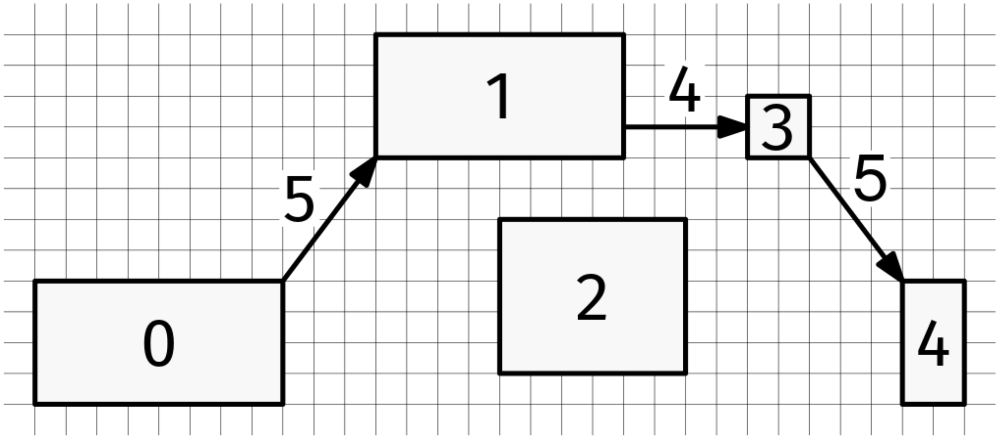

We are given an array, furniture, where each element consists of four integer coordinates, [x_min, y_min, x_max, y_max], indicating the boundary of a rectangular piece of furniture. The furniture pieces are non-overlapping (they can share an edge or a corner).

We are playing the game 'the floor is lava,' where we have to reach from the first piece of furniture (the one at index 0 in furniture) to the last one without touching the floor, only jumping on furniture. If we can jump at most a distance of d, where d is an integer, can we win?

Recall that:

distance((x1, y1), (x2, y2)) = sqrt((x1 - x2)^2 + (y1 - y2)^2).

For example, if this is the furniture and d is 5, we can jump from the furniture labeled 0 to the one labeled 4 with the indicated jumps:

The floor is lava

However, if d is 4 for the same furniture, we can't do it.
Example 1:
furniture = [
  [1, 1, 9, 5],
  [12, 9, 20, 13],
  [16, 2, 22, 7],
  [24, 9, 26, 11],
  [29, 1, 31, 5]
]
d = 5

Output: True
See the image above

Example 2:
furniture = [
  [1, 1, 9, 5],
  [12, 9, 20, 13],
  [16, 2, 22, 7],
  [24, 9, 26, 11],
  [29, 1, 31, 5]
]
d = 4
Output: False
See the image above
Constraints:

1 <= furniture.length <= 1000
furniture[i] is a list of 4 integers
0 <= furniture[i][0] < furniture[i][2] < 10^9
0 <= furniture[i][1] < furniture[i][3] < 10^9
The furniture pieces are non-overlapping
0 < d <= 10^9
All coordinates and distances are floating-point numbers
See Solution
Problem 36.16 - The Floor Is Lava: Solution
Python
To solve this problem, we need to pick up on the fact that it is about things with pairwise relationships. The 'things' are furniture pieces, and the 'relationship' is being at most distance d apart.

This defines a graph, and the question becomes a standard reachability problem in that graph:

"can the node for furniture[0] reach the node for furniture[n-1]?"

Graph reachability questions like this can be answered with either DFS or BFS. We'll see the DFS version.

To build the graph, we need to be able to compute the distance between two pieces of furniture. There are two cases:

If they overlap partially on either coordinate, we can jump in an axis-aligned direction
Otherwise, we need to jump diagonally
To know if two rectangles overlap along the x coordinate, think of each rectangle as a segment [x_min, x_max]. Then, we just need a formula for whether two segments overlap. Similarly for the y coordinate.

def segment_distance(min1, max1, min2, max2):
  return max(0, max(min1, min2) - min(max1, max2))

def distance(furniture1, furniture2):
  x_min1, y_min1, x_max1, y_max1 = furniture1
  x_min2, y_min2, x_max2, y_max2 = furniture2
  # Calculate the x and y gaps between rectangles
  x_gap = segment_distance(x_min1, x_max1, x_min2, x_max2)
  y_gap = segment_distance(y_min1, y_max1, y_min2, y_max2)
  if x_gap == 0:
    return y_gap
  elif y_gap == 0:
    return x_gap
  else:
    return math.sqrt(x_gap**2 + y_gap**2)

def can_reach(furniture, d):
  V = len(furniture)
  graph = [[] for _ in range(V)]
  for i in range(V):
    for j in range(i + 1, V):
      if distance(furniture[i], furniture[j]) <= d:
        graph[i].append(j)
        graph[j].append(i)

  visited = {0}

  def visit(node):
    for nbr in graph[node]:
      if not nbr in visited:
        visited.add(nbr)
        visit(nbr)

  visit(0)
  return V - 1 in visited
Time & Space Analysis
V: the number of furniture pieces

Time: O(V^2)

Extra space: O(V^2)

In the worst case, every piece of furniture is within reach of every other piece of furniture. This means that the graph is dense, and we have O(V^2) edges.

Tests
Here are some test cases to verify the solution:

def run_tests():
  tests = [
      # Example 1 from the book:
      [[[1, 1, 9, 5],
        [12, 9, 20, 13],
        [16, 2, 22, 7],
        [24, 9, 26, 11],
        [29, 1, 31, 5]], 5, True],
      # Example 2 from the book:
      [[[1, 1, 9, 5],
        [12, 9, 20, 13],
        [16, 2, 22, 7],
        [24, 9, 26, 11],
        [29, 1, 31, 5]], 4, False],

      [[[0, 0, 1, 1], [1, 1, 2, 2], [2, 2, 3, 3], [3, 3, 4, 4], [4, 4, 5, 5]], 0, True],
      [[[0, 0, 1, 1], [1, 1, 2, 2], [2, 2, 3, 3], [3, 3, 4, 4], [4, 4, 5, 5]], 1, True],
      [[[0, 0, 1, 1], [1, 1, 2, 2], [3, 3, 4, 4], [4, 4, 5, 5]], 1, False],
      [[[0, 0, 1, 1], [1, 1, 2, 2], [3, 3, 4, 4], [4, 4, 5, 5]], 2, True],
      # Single piece of furniture
      [[[0, 0, 1, 1]], 5, True],
      # Two pieces far apart
      [[[0, 0, 1, 1], [10, 10, 11, 11]], 5, False],
      # Two pieces just within reach
      [[[0, 0, 1, 1], [5, 5, 6, 6]], 5.7, True],
      # Two pieces just out of reach
      [[[0, 0, 1, 1], [5, 5, 6, 6]], 5.6, False],
      # Pieces in a line
      [[[0, 0, 1, 1], [1, 0, 2, 1], [2, 0, 3, 1]], 1.5, True],
  ]
  for furniture, d, want in tests:
    got = can_reach(furniture, d)
    assert got == want, f"\ncan_reach({furniture}, {d}): got: {
        got}, want: {want}\n"

run_tests()

function segmentDistance(min1, max1, min2, max2) {
  return Math.max(0, Math.max(min1, min2) - Math.min(max1, max2));
}

function distance(furniture1, furniture2) {
  const [xMin1, yMin1, xMax1, yMax1] = furniture1;
  const [xMin2, yMin2, xMax2, yMax2] = furniture2;
  // Calculate the x and y gaps between rectangles
  const xGap = segmentDistance(xMin1, xMax1, xMin2, xMax2);
  const yGap = segmentDistance(yMin1, yMax1, yMin2, yMax2);
  if (xGap === 0) {
    return yGap;
  } else if (yGap === 0) {
    return xGap;
  } else {
    return Math.sqrt(xGap ** 2 + yGap ** 2);
  }
}

function canReach(furniture, d) {
  const V = furniture.length;
  const graph = Array(V)
    .fill()
    .map(() => []);
  for (let i = 0; i < V; i++) {
    for (let j = i + 1; j < V; j++) {
      if (distance(furniture[i], furniture[j]) <= d) {
        graph[i].push(j);
        graph[j].push(i);
      }
    }
  }

  const visited = new Set([0]);

  function visit(node) {
    for (const nbr of graph[node]) {
      if (!visited.has(nbr)) {
        visited.add(nbr);
        visit(nbr);
      }
    }
  }

  visit(0);
  return visited.has(V - 1);
}
Time & Space Analysis
V: the number of furniture pieces

Time: O(V^2)

Extra space: O(V^2)

In the worst case, every piece of furniture is within reach of every other piece of furniture. This means that the graph is dense, and we have O(V^2) edges.

Tests
Here are some test cases to verify the solution:

function runTests() {
  const tests = [
    // Example 1 from the book:
    [
      [
        [1, 1, 9, 5],
        [12, 9, 20, 13],
        [16, 2, 22, 7],
        [24, 9, 26, 11],
        [29, 1, 31, 5],
      ],
      5,
      true,
    ],
    // Example 2 from the book:
    [
      [
        [1, 1, 9, 5],
        [12, 9, 20, 13],
        [16, 2, 22, 7],
        [24, 9, 26, 11],
        [29, 1, 31, 5],
      ],
      4,
      false,
    ],
    // Line of furniture pieces
    [
      [
        [0, 0, 1, 1],
        [1, 1, 2, 2],
        [2, 2, 3, 3],
        [3, 3, 4, 4],
        [4, 4, 5, 5],
      ],
      0,
      true,
    ],
    [
      [
        [0, 0, 1, 1],
        [1, 1, 2, 2],
        [2, 2, 3, 3],
        [3, 3, 4, 4],
        [4, 4, 5, 5],
      ],
      1,
      true,
    ],
    [
      [
        [0, 0, 1, 1],
        [1, 1, 2, 2],
        [3, 3, 4, 4],
        [4, 4, 5, 5],
      ],
      1,
      false,
    ],
    [
      [
        [0, 0, 1, 1],
        [1, 1, 2, 2],
        [3, 3, 4, 4],
        [4, 4, 5, 5],
      ],
      2,
      true,
    ],
    // Single piece of furniture
    [[[0, 0, 1, 1]], 5, true],
    // Two pieces far apart
    [
      [
        [0, 0, 1, 1],
        [10, 10, 11, 11],
      ],
      5,
      false,
    ],
    // Two pieces just within reach
    [
      [
        [0, 0, 1, 1],
        [5, 5, 6, 6],
      ],
      5.7,
      true,
    ],
    // Two pieces just out of reach
    [
      [
        [0, 0, 1, 1],
        [5, 5, 6, 6],
      ],
      5.6,
      false,
    ],
    // Pieces in a line
    [
      [
        [0, 0, 1, 1],
        [1, 0, 2, 1],
        [2, 0, 3, 1],
      ],
      1.5,
      true,
    ],
  ];
  for (const [furniture, d, want] of tests) {
    const got = canReach(furniture, d);
    if (got !== want) {
      throw new Error(
        `\ncanReach(${JSON.stringify(furniture)}, ${d}): got: ${got}, want: ${want}\n`,
      );
    }
  }
}

runTests();

class CanReach {
  private double segmentDistance(double min1, double max1, double min2,
      double max2) {
    return Math.max(0, Math.max(min1, min2) - Math.min(max1, max2));
  }

  private double distance(List<Double> furniture1, List<Double> furniture2) {
    double xMin1 = furniture1.get(0);
    double yMin1 = furniture1.get(1);
    double xMax1 = furniture1.get(2);
    double yMax1 = furniture1.get(3);

    double xMin2 = furniture2.get(0);
    double yMin2 = furniture2.get(1);
    double xMax2 = furniture2.get(2);
    double yMax2 = furniture2.get(3);

    double xGap = segmentDistance(xMin1, xMax1, xMin2, xMax2);
    double yGap = segmentDistance(yMin1, yMax1, yMin2, yMax2);

    if (xGap == 0) {
      return yGap;
    } else if (yGap == 0) {
      return xGap;
    } else {
      return Math.sqrt(xGap * xGap + yGap * yGap);
    }
  }

  public boolean solve(List<List<Double>> furniture, double d) {
    int V = furniture.size();
    List<List<Integer>> graph = new ArrayList<>();
    for (int i = 0; i < V; i++) {
      graph.add(new ArrayList<>());
    }

    for (int i = 0; i < V; i++) {
      for (int j = i + 1; j < V; j++) {
        if (distance(furniture.get(i), furniture.get(j)) <= d) {
          graph.get(i).add(j);
          graph.get(j).add(i);
        }
      }
    }

    Set<Integer> visited = new HashSet<>();
    visited.add(0);
    visit(graph, visited, 0);
    return visited.contains(V - 1);
  }

  private void visit(List<List<Integer>> graph, Set<Integer> visited,
      int node) {
    for (int nbr : graph.get(node)) {
      if (!visited.contains(nbr)) {
        visited.add(nbr);
        visit(graph, visited, nbr);
      }
    }
  }
}
Time & Space Analysis
V: the number of furniture pieces

Time: O(V^2)

Extra space: O(V^2)

In the worst case, every piece of furniture is within reach of every other piece of furniture. This means that the graph is dense, and we have O(V^2) edges.

Tests
Here are some test cases to verify the solution:

record TestCase(List<List<Double>> furniture, double d, boolean want) {
}

class RunTests {
  public void runTests() {
    TestCase[] tests = {
        // Example 1 from the book:
        new TestCase(
            List.of(
                List.of(1.0, 1.0, 9.0, 5.0),
                List.of(12.0, 9.0, 20.0, 13.0),
                List.of(16.0, 2.0, 22.0, 7.0),
                List.of(24.0, 9.0, 26.0, 11.0),
                List.of(29.0, 1.0, 31.0, 5.0)),
            5.0,
            true),
        // Example 2 from the book:
        new TestCase(
            List.of(
                List.of(1.0, 1.0, 9.0, 5.0),
                List.of(12.0, 9.0, 20.0, 13.0),
                List.of(16.0, 2.0, 22.0, 7.0),
                List.of(24.0, 9.0, 26.0, 11.0),
                List.of(29.0, 1.0, 31.0, 5.0)),
            4.0,
            false),
        new TestCase(
            List.of(
                List.of(0.0, 0.0, 1.0, 1.0),
                List.of(1.0, 1.0, 2.0, 2.0),
                List.of(2.0, 2.0, 3.0, 3.0),
                List.of(3.0, 3.0, 4.0, 4.0),
                List.of(4.0, 4.0, 5.0, 5.0)),
            0.0,
            true),
        new TestCase(
            List.of(
                List.of(0.0, 0.0, 1.0, 1.0),
                List.of(1.0, 1.0, 2.0, 2.0),
                List.of(2.0, 2.0, 3.0, 3.0),
                List.of(3.0, 3.0, 4.0, 4.0),
                List.of(4.0, 4.0, 5.0, 5.0)),
            1.0,
            true),
        new TestCase(
            List.of(
                List.of(0.0, 0.0, 1.0, 1.0),
                List.of(1.0, 1.0, 2.0, 2.0),
                List.of(3.0, 3.0, 4.0, 4.0),
                List.of(4.0, 4.0, 5.0, 5.0)),
            1.0,
            false),
        new TestCase(
            List.of(
                List.of(0.0, 0.0, 1.0, 1.0),
                List.of(1.0, 1.0, 2.0, 2.0),
                List.of(3.0, 3.0, 4.0, 4.0),
                List.of(4.0, 4.0, 5.0, 5.0)),
            2.0,
            true),
        // Single piece of furniture
        new TestCase(
            List.of(List.of(0.0, 0.0, 1.0, 1.0)),
            5.0,
            true),
        // Two pieces far apart
        new TestCase(
            List.of(
                List.of(0.0, 0.0, 1.0, 1.0),
                List.of(10.0, 10.0, 11.0, 11.0)),
            5.0,
            false),
        // Two pieces just within reach
        new TestCase(
            List.of(
                List.of(0.0, 0.0, 1.0, 1.0),
                List.of(5.0, 5.0, 6.0, 6.0)),
            5.7,
            true),
        // Two pieces just out of reach
        new TestCase(
            List.of(
                List.of(0.0, 0.0, 1.0, 1.0),
                List.of(5.0, 5.0, 6.0, 6.0)),
            5.6,
            false),
        // Pieces in a line
        new TestCase(
            List.of(
                List.of(0.0, 0.0, 1.0, 1.0),
                List.of(1.0, 0.0, 2.0, 1.0),
                List.of(2.0, 0.0, 3.0, 1.0)),
            1.5,
            true)
    };

    CanReach solution = new CanReach();
    for (TestCase test : tests) {
      boolean got = solution.solve(test.furniture(), test.d());
      if (got != test.want()) {
        throw new RuntimeException(String.format(
            "\nsolve(%s, %f): got: %b, want: %b\n",
            test.furniture(), test.d(), got, test.want()));
      }
    }
  }
}

public class Solution {
  public static void main(String[] args) {
    new RunTests().runTests();
  }
}