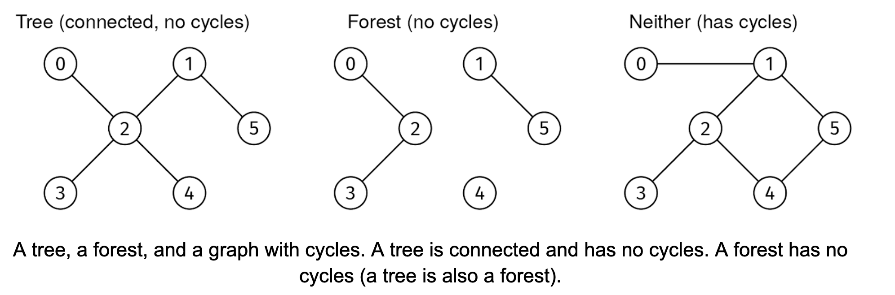

Given a non-empty adjacency list of an undirected graph, graph, return whether it is a tree. A graph is a tree if it is acyclic and connected.

Tree check 1

Example 1:
graph = [
  [2],           # Node 0
  [2, 5],        # Node 1
  [0, 1, 3, 4],  # Node 2
  [2],           # Node 3
  [2],           # Node 4
  [1]            # Node 5
]
Output: True
See left graph in the picture above

Example 2:
graph = [
  [2],           # Node 0
  [5],           # Node 1
  [0, 3],        # Node 2
  [2],           # Node 3
  [],            # Node 4
  [1]            # Node 5
]
Output: False
This graph is not connected
See center graph in the picture above

Example 3:
graph = [
  [1],           # Node 0
  [0, 2, 5],     # Node 1
  [1, 3, 4],     # Node 2
  [2],           # Node 3
  [2, 5],        # Node 4
  [1, 4]         # Node 5
]
Output: False
This graph is not acyclic
See right graph in the picture above
Constraints:

1 ≤ graph.length ≤ 1000
graph[i].length < 1000
0 ≤ graph[i][j] < graph.length
The adjacency list is properly formatted, with no parallel edges or self-loops
See Solution
Problem 36.3 - Tree Check: Solution
Python
The type of graph traversal we use for this problem doesn't matter. We can use DFS or BFS. We'll see the DFS approach.

We can break down the problem into checking if the graph is connected and acyclic.

Checking if it is connected is easy: we can start a DFS (or BFS) from any node and check that the size of the visited set is V.

To determine if the graph is acyclic, every time we visit a node, node, and we iterate through one of its neighbors, nbr, there are three cases:

nbr is not visited yet. We can visit it normally.
nbr is in visited, and it is not the node we arrived to node from (the predecessor of node). This indicates a cycle.
nbr is in visited but it is the predecessor of node. Predecessors are always in the visited set, but that doesn't mean there is a cycle. We can ignore it.
In the implementation below, we use a "nonlocal" variable, found_cycle, which can be seen from all the recursive calls.

Here is the implementation:

def is_tree(graph):
  # Start from node 0 (the starting node doesn't matter).
  predecessors = {0: None}
  found_cycle = False

  def visit(node):
    nonlocal found_cycle
    if found_cycle:
      return
    for nbr in graph[node]:
      if nbr not in predecessors:
        predecessors[nbr] = node
        visit(nbr)
      elif nbr != predecessors[node]:
        found_cycle = True

  visit(0)
  connected = len(predecessors) == len(graph)
  return not found_cycle and connected
Alternative solution
A simpler way to check if a connected graph is a tree is by leveraging this property: a tree has exactly V - 1 edges.

So, instead of directly detecting edges that close cycles, we could have simply counted the number of edges and compared it to V - 1.

To see why this is true, imagine that we start with an empty graph and start adding edges, one at a time, without creating cycles. Initially, the empty graph has V connected components. Each time we add an edge without forming a cycle, we connect two nodes in different connected components, reducing the number of connected components by one. After adding V - 1 edges without creating any cycles, only one connected component remains. We cannot add any more edges or we would create a cycle.

Time & Space Analysis
V: the number of nodes in the graph

E: the number of edges in the graph

Time: O(V + E)

Extra space: O(V)

Note: if the graph was given as an edge list instead (which is common in interviews), the space complexity for constructing the adjacency list would be O(V + E). However, we can return False immediately for any graph without E == V - 1 edges. With this optimization, the adjacency list takes O(V) space.

Tests
Here are some test cases to verify the solution:

def run_tests():
  tests = [
    # Example 1 from the book
    ([[2], [2, 5], [0, 1, 3, 4], [2], [2], [1]], True),
    # Example 2 from the book
    ([[2], [5], [0, 3], [2], [], [1]], False),
    # Example 3 from the book
    ([[1], [0, 2, 5], [1, 3, 4], [2], [2, 5], [1, 4]], False),
    # Single node
    ([[]], True),
    # Two nodes connected
    ([[1], [0]], True),
    # Two nodes disconnected
    ([[], []], False),
    # Line graph (valid tree)
    ([[1], [0, 2], [1, 3], [2]], True),
    # Cycle
    ([[1, 3], [2, 0], [3, 1], [0, 2]], False),
    # Complete graph K4 (not a tree)
    ([[1, 2, 3], [0, 2, 3], [0, 1, 3], [0, 1, 2]], False),
    # Star graph
    ([[1, 2, 3, 4], [0], [0], [0], [0]], True),
  ]
  for graph, want in tests:
    got = is_tree(graph)
    assert got == want, f"\nis_tree({graph}): got: {got}, want: {want}\n"

run_tests()
function isTree(graph) {
  // Start from node 0 (the starting node doesn't matter).
  const predecessors = new Map([[0, null]]);
  let foundCycle = false;

  function visit(node) {
    if (foundCycle) {
      return;
    }
    for (const nbr of graph[node]) {
      if (!predecessors.has(nbr)) {
        predecessors.set(nbr, node);
        visit(nbr);
      } else if (nbr !== predecessors.get(node)) {
        foundCycle = true;
      }
    }
  }

  visit(0);
  const connected = predecessors.size === graph.length;
  return !foundCycle && connected;
}
Alternative solution
A simpler way to check if a connected graph is a tree is by leveraging this property: a tree has exactly V - 1 edges.

So, instead of directly detecting edges that close cycles, we could have simply counted the number of edges and compared it to V - 1.

To see why this is true, imagine that we start with an empty graph and start adding edges, one at a time, without creating cycles. Initially, the empty graph has V connected components. Each time we add an edge without forming a cycle, we connect two nodes in different connected components, reducing the number of connected components by one. After adding V - 1 edges without creating any cycles, only one connected component remains. We cannot add any more edges or we would create a cycle.

Time & Space Analysis
V: the number of nodes in the graph

E: the number of edges in the graph

Time: O(V + E)

Extra space: O(V)

Note: if the graph was given as an edge list instead (which is common in interviews), the space complexity for constructing the adjacency list would be O(V + E). However, we can return False immediately for any graph without E == V - 1 edges. With this optimization, the adjacency list takes O(V) space.

Tests
Here are some test cases to verify the solution:

function isTree(graph) {
  // Start from node 0 (the starting node doesn't matter).
  const predecessors = new Map([[0, null]]);
  let foundCycle = false;

  function visit(node) {
    if (foundCycle) {
      return;
    }
    for (const nbr of graph[node]) {
      if (!predecessors.has(nbr)) {
        predecessors.set(nbr, node);
        visit(nbr);
      } else if (nbr !== predecessors.get(node)) {
        foundCycle = true;
      }
    }
  }

  visit(0);
  const connected = predecessors.size === graph.length;
  return !foundCycle && connected;
}
Alternative solution
A simpler way to check if a connected graph is a tree is by leveraging this property: a tree has exactly V - 1 edges.

So, instead of directly detecting edges that close cycles, we could have simply counted the number of edges and compared it to V - 1.

To see why this is true, imagine that we start with an empty graph and start adding edges, one at a time, without creating cycles. Initially, the empty graph has V connected components. Each time we add an edge without forming a cycle, we connect two nodes in different connected components, reducing the number of connected components by one. After adding V - 1 edges without creating any cycles, only one connected component remains. We cannot add any more edges or we would create a cycle.

Time & Space Analysis
V: the number of nodes in the graph

E: the number of edges in the graph

Time: O(V + E)

Extra space: O(V)

Note: if the graph was given as an edge list instead (which is common in interviews), the space complexity for constructing the adjacency list would be O(V + E). However, we can return False immediately for any graph without E == V - 1 edges. With this optimization, the adjacency list takes O(V) space.

Tests
Here are some test cases to verify the solution:

function runTests() {
  const tests = [
    // Example 1 from the book
    [[[2], [2, 5], [0, 1, 3, 4], [2], [2], [1]], true],
    // Example 2 from the book
    [[[2], [5], [0, 3], [2], [], [1]], false],
    // Example 3 from the book
    [[[1], [0, 2, 5], [1, 3, 4], [2], [2, 5], [1, 4]], false],
    // Single node
    [[[]], true],
    // Two nodes connected
    [[[1], [0]], true],
    // Two nodes disconnected
    [[[], []], false],
    // Line graph (valid tree)
    [[[1], [0, 2], [1, 3], [2]], true],
    // Cycle
    [[[1, 3], [2, 0], [3, 1], [0, 2]], false],
    // Complete graph K4 (not a tree)
    [[[1, 2, 3], [0, 2, 3], [0, 1, 3], [0, 1, 2]], false],
    // Star graph
    [[[1, 2, 3, 4], [0], [0], [0], [0]], true],
  ];
  for (const [graph, want] of tests) {
    const got = isTree(graph);
    if (got !== want) {
      throw new Error(
        `\nisTree(${JSON.stringify(graph)}): got: ${got}, want: ${want}\n`,
      );
    }
  }
}

runTests();

class IsTree {
  private Map<Integer, Integer> predecessors;
  private boolean foundCycle;
  private int[][] graph;

  public IsTree(int[][] g) {
    this.graph = g;
    this.foundCycle = false;
    this.predecessors = new HashMap<>();
    this.predecessors.put(0, -1);
  }

  public boolean solve() {
    visit(0);
    boolean connected = predecessors.size() == graph.length;
    return !foundCycle && connected;
  }

  private void visit(int node) {
    if (foundCycle) {
      return;
    }
    for (int nbr : graph[node]) {
      if (!predecessors.containsKey(nbr)) {
        predecessors.put(nbr, node);
        visit(nbr);
      } else if (nbr != predecessors.get(node)) {
        foundCycle = true;
      }
    }
  }
}
Alternative solution
A simpler way to check if a connected graph is a tree is by leveraging this property: a tree has exactly V - 1 edges.

So, instead of directly detecting edges that close cycles, we could have simply counted the number of edges and compared it to V - 1.

To see why this is true, imagine that we start with an empty graph and start adding edges, one at a time, without creating cycles. Initially, the empty graph has V connected components. Each time we add an edge without forming a cycle, we connect two nodes in different connected components, reducing the number of connected components by one. After adding V - 1 edges without creating any cycles, only one connected component remains. We cannot add any more edges or we would create a cycle.

Time & Space Analysis
V: the number of nodes in the graph

E: the number of edges in the graph

Time: O(V + E)

Extra space: O(V)

Note: if the graph was given as an edge list instead (which is common in interviews), the space complexity for constructing the adjacency list would be O(V + E). However, we can return False immediately for any graph without E == V - 1 edges. With this optimization, the adjacency list takes O(V) space.

Tests
Here are some test cases to verify the solution:

class RunTests {
  public void runTests() {
    Object[][] tests = {
        // Example 1 from the book
        { new int[][] { { 2 }, { 2, 5 }, { 0, 1, 3, 4 }, { 2 }, { 2 }, { 1 } },
            true },
        // Example 2 from the book
        { new int[][] { { 2 }, { 5 }, { 0, 3 }, { 2 }, {}, { 1 } }, false },
        // Example 3 from the book
        { new int[][] { { 1 }, { 0, 2, 5 }, { 1, 3, 4 }, { 2 }, { 2, 5 },
            { 1, 4 } }, false },
        // Single node
        { new int[][] { {} }, true },
        // Two nodes connected
        { new int[][] { { 1 }, { 0 } }, true },
        // Two nodes disconnected
        { new int[][] { {}, {} }, false },
        // Line graph (valid tree)
        { new int[][] { { 1 }, { 0, 2 }, { 1, 3 }, { 2 } }, true },
        // Cycle
        { new int[][] { { 1, 3 }, { 2, 0 }, { 3, 1 }, { 0, 2 } }, false },
        // Complete graph K4 (not a tree)
        { new int[][] { { 1, 2, 3 }, { 0, 2, 3 }, { 0, 1, 3 }, { 0, 1, 2 } },
            false },
        // Star graph
        { new int[][] { { 1, 2, 3, 4 }, { 0 }, { 0 }, { 0 }, { 0 } }, true },
    };

    for (Object[] test : tests) {
      int[][] graph = (int[][]) test[0];
      boolean want = (boolean) test[1];
      IsTree solution = new IsTree(graph);
      boolean got = solution.solve();
      if (got != want) {
        throw new RuntimeException(String.format(
            "\nsolve(%s): got: %b, want: %b\n",
            java.util.Arrays.deepToString(graph), got, want));
      }
    }
  }
}

public class Solution {
  public static void main(String[] args) {
    new RunTests().runTests();
  }
}