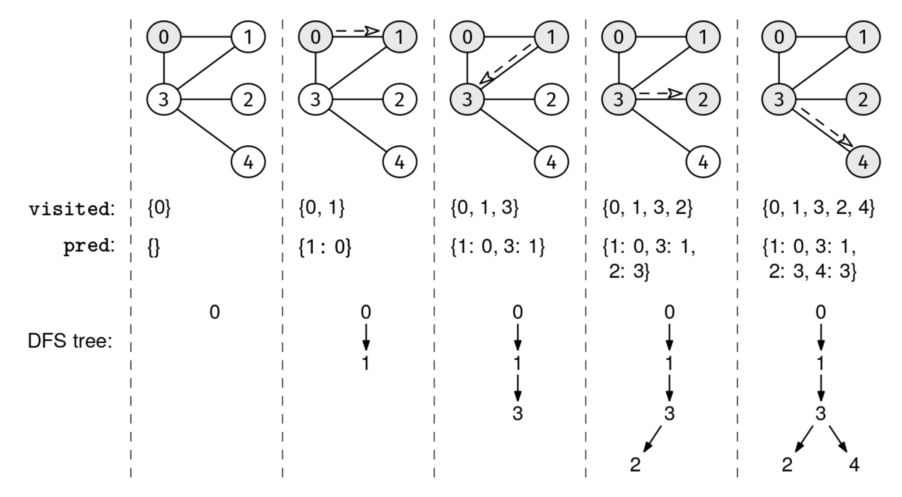

Given the adjacency list of an undirected, connected graph, graph, return a set of edges forming a spanning tree.

A spanning tree is a subset of edges that connects (i.e., "spans") every node and has no cycles.

Example 1:
graph = [
  [1],
  [0, 2, 5],
  [1, 3, 4],
  [2],
  [2, 5],
  [1, 4]
]
Output: [[0, 1], [1, 2], [2, 3], [2, 4], [4, 5]]
There are other valid answers

Example 2:
graph = [[1], [0]]
Output: [[0, 1]]
A single edge is a valid spanning tree for two nodes.

Example 3:
graph = [
  [1, 2],
  [0, 2],
  [0, 1]
]
Output: [[0, 1], [0, 2]]
There are other valid answers, like [[0, 1], [1, 2]].

Example 4:
graph = [[]]
Output: []
This graph has a single node and no edges.
Constraints:

1 ≤ graph.length ≤ 1000
graph[i].length < 1000
0 ≤ graph[i][j] < graph.length
The adjacency list is properly formatted, with no parallel edges or self-loops
The graph is connected
See Solution
Problem 36.4 - Spanning Tree: Solution
Python
The type of graph traversal we use for this problem doesn't matter. We can use DFS or BFS. We'll see the DFS approach.

During DFS, we can track the predecessors of each node in a map, which is the node we visited it from.

The map of predecessors forms a tree known as the DFS tree:

DFS Tree

If the graph is connected, DFS will visit every node once, so the DFS tree will be a spanning tree.

Thus, we just need to compute the predecessors map as usual and return an array with one edge per entry in the predecessors map.

Here's the implementation:

def spanning_tree(graph):
  visited = set()
  predecessors = {}  # Maps node -> predecessor in DFS tree

  def dfs(node):
    visited.add(node)
    for nbr in graph[node]:
      if nbr not in visited:
        predecessors[nbr] = node
        dfs(nbr)

  # Start DFS from node 0
  dfs(0)

  # Convert predecessors map to list of edges
  edges = []
  for node, pred in predecessors.items():
    edges.append([pred, node])

  return edges
Time & Space Analysis
V: the number of nodes in the graph

E: the number of edges in the graph

Time: O(E) - since the graph is connected, V ≤ E + 1, so O(V + E) = O(E)

Extra space: O(V) - a spanning tree has V - 1 edges

Note: if the graph was given as an edge list instead (which is common in interviews), we would need to convert it to an adjacency list, so the space complexity would be O(V + E).

Tests
Here are some test cases to verify the solution:

def run_tests():
  tests = [
      # Example from the book
      [[1], [0, 2, 5], [1, 3, 4], [2], [2, 5], [1, 4]],
      # Single edge
      [[1], [0]],
      # Line graph
      [[1], [0, 2], [1]],
      # Star graph
      [[1, 2, 3], [0], [0], [0]],
      # Complete graph
      [[1, 2], [0, 2], [0, 1]],
      # Single node graph
      [[]]
  ]

  for graph in tests:
    got = spanning_tree(graph)
    # Since there can be multiple valid spanning trees,
    # we check that:
    # 1. We have V-1 edges
    # 2. Each edge connects valid nodes
    # 3. The edges form a tree (no cycles)
    V = len(graph)
    assert len(got) == V - 1, \
        f"\nspanning_tree({graph}): got wrong number of edges: {got}"

    # Check edges are valid
    for u, v in got:
      assert 0 <= u < V and 0 <= v < V, \
          f"\nspanning_tree({graph}): invalid node in edge {[u, v]}"
      assert v in graph[u] and u in graph[v], \
          f"\nspanning_tree({graph}): invalid edge {[u, v]}"

    # Check no cycles by counting reachable nodes
    adj = [[] for _ in range(V)]
    for u, v in got:
      adj[u].append(v)
      adj[v].append(u)

    visited = set()

    def dfs_check(node, parent):
      visited.add(node)
      for nbr in adj[node]:
        if nbr != parent:
          if nbr in visited:
            return False
          if not dfs_check(nbr, node):
            return False
      return True

    assert dfs_check(0, -1) and len(visited) == V, \
        f"\nspanning_tree({graph}): edges do not form a tree: {got}"

run_tests()
function spanningTree(graph) {
  const visited = new Set();
  const predecessors = new Map(); // Maps node -> predecessor in DFS tree

  function dfs(node) {
    visited.add(node);
    for (const nbr of graph[node]) {
      if (!visited.has(nbr)) {
        predecessors.set(nbr, node);
        dfs(nbr);
      }
    }
  }

  // Start DFS from node 0
  dfs(0);

  // Convert predecessors map to list of edges
  const edges = [];
  for (const [node, pred] of predecessors) {
    edges.push([pred, node]);
  }

  return edges;
}
Time & Space Analysis
V: the number of nodes in the graph

E: the number of edges in the graph

Time: O(E) - since the graph is connected, V ≤ E + 1, so O(V + E) = O(E)

Extra space: O(V) - a spanning tree has V - 1 edges

Note: if the graph was given as an edge list instead (which is common in interviews), we would need to convert it to an adjacency list, so the space complexity would be O(V + E).

Tests
Here are some test cases to verify the solution:

function runTests() {
  const tests = [
    // Example from the book
    [[1], [0, 2, 5], [1, 3, 4], [2], [2, 5], [1, 4]],
    // Single edge
    [[1], [0]],
    // Line graph
    [[1], [0, 2], [1]],
    // Star graph
    [[1, 2, 3], [0], [0], [0]],
    // Complete graph
    [
      [1, 2],
      [0, 2],
      [0, 1],
    ],
    // Single node graph
    [[]],
  ];

  for (const graph of tests) {
    const got = spanningTree(graph);
    // Since there can be multiple valid spanning trees,
    // we check that:
    // 1. We have V-1 edges
    // 2. Each edge connects valid nodes
    // 3. The edges form a tree (no cycles)
    const V = graph.length;
    if (got.length !== V - 1) {
      throw new Error(
        `\nspanningTree(${JSON.stringify(graph)}): got wrong number of edges: ${JSON.stringify(got)}`,
      );
    }

    // Check edges are valid
    for (const [u, v] of got) {
      if (!(0 <= u && u < V && 0 <= v && v < V)) {
        throw new Error(
          `\nspanningTree(${JSON.stringify(graph)}): invalid node in edge ${JSON.stringify([u, v])}`,
        );
      }
      if (!(graph[u].includes(v) && graph[v].includes(u))) {
        throw new Error(
          `\nspanningTree(${JSON.stringify(graph)}): invalid edge ${JSON.stringify([u, v])}`,
        );
      }
    }

    // Check no cycles by counting reachable nodes
    const adj = Array(V)
      .fill()
      .map(() => []);
    for (const [u, v] of got) {
      adj[u].push(v);
      adj[v].push(u);
    }

    const visited = new Set();

    function dfsCheck(node, parent) {
      visited.add(node);
      for (const nbr of adj[node]) {
        if (nbr !== parent) {
          if (visited.has(nbr)) {
            return false;
          }
          if (!dfsCheck(nbr, node)) {
            return false;
          }
        }
      }
      return true;
    }

    if (!(dfsCheck(0, -1) && visited.size === V)) {
      throw new Error(
        `\nspanningTree(${JSON.stringify(graph)}): edges do not form a tree: ${JSON.stringify(got)}`,
      );
    }
  }
}

runTests();

class SpanningTree {
  private Set<Integer> visited;
  private Map<Integer, Integer> predecessors;

  public List<List<Integer>> solve(List<List<Integer>> graph) {
    visited = new HashSet<>();
    predecessors = new HashMap<>();

    // Start DFS from node 0
    dfs(0, graph);

    // Convert predecessors map to list of edges
    List<List<Integer>> edges = new ArrayList<>();
    for (Map.Entry<Integer, Integer> entry : predecessors.entrySet()) {
      int node = entry.getKey();
      int pred = entry.getValue();
      edges.add(List.of(pred, node));
    }

    return edges;
  }

  private void dfs(int node, List<List<Integer>> graph) {
    visited.add(node);
    for (int nbr : graph.get(node)) {
      if (!visited.contains(nbr)) {
        predecessors.put(nbr, node);
        dfs(nbr, graph);
      }
    }
  }
}
Time & Space Analysis
V: the number of nodes in the graph

E: the number of edges in the graph

Time: O(E) - since the graph is connected, V ≤ E + 1, so O(V + E) = O(E)

Extra space: O(V) - a spanning tree has V - 1 edges

Note: if the graph was given as an edge list instead (which is common in interviews), we would need to convert it to an adjacency list, so the space complexity would be O(V + E).

Tests
Here are some test cases to verify the solution:

record TestCase(List<List<Integer>> graph) {
}

class RunTests {
  public void runTests() {
    TestCase[] tests = {
        // Example from the book
        new TestCase(List.of(
            List.of(1),
            List.of(0, 2, 5),
            List.of(1, 3, 4),
            List.of(2),
            List.of(2, 5),
            List.of(1, 4))),
        // Single edge
        new TestCase(List.of(
            List.of(1),
            List.of(0))),
        // Line graph
        new TestCase(List.of(
            List.of(1),
            List.of(0, 2),
            List.of(1))),
        // Star graph
        new TestCase(List.of(
            List.of(1, 2, 3),
            List.of(0),
            List.of(0),
            List.of(0))),
        // Complete graph
        new TestCase(List.of(
            List.of(1, 2),
            List.of(0, 2),
            List.of(0, 1))),
        // Single node graph
        new TestCase(List.of(List.of()))
    };

    SpanningTree solution = new SpanningTree();
    for (TestCase test : tests) {
      List<List<Integer>> got = solution.solve(test.graph());

      // Since there can be multiple valid spanning trees,
      // we check that:
      // 1. We have V-1 edges
      // 2. Each edge connects valid nodes
      // 3. The edges form a tree (no cycles)
      int V = test.graph().size();
      if (got.size() != V - 1) {
        throw new RuntimeException(String.format(
            "\nsolve(%s): got wrong number of edges: %s",
            test.graph(), got));
      }

      // Check edges are valid
      for (List<Integer> edge : got) {
        int u = edge.get(0), v = edge.get(1);
        if (u < 0 || u >= V || v < 0 || v >= V) {
          throw new RuntimeException(String.format(
              "\nsolve(%s): invalid node in edge %s",
              test.graph(), edge));
        }
        if (!test.graph().get(u).contains(v)
            || !test.graph().get(v).contains(u)) {
          throw new RuntimeException(String.format(
              "\nsolve(%s): invalid edge %s",
              test.graph(), edge));
        }
      }

      // Check no cycles by counting reachable nodes
      List<List<Integer>> adj = new ArrayList<>();
      for (int i = 0; i < V; i++) {
        adj.add(new ArrayList<>());
      }
      for (List<Integer> edge : got) {
        int u = edge.get(0), v = edge.get(1);
        adj.get(u).add(v);
        adj.get(v).add(u);
      }

      Set<Integer> visited = new HashSet<>();
      if (!dfsCheck(0, -1, visited, adj) || visited.size() != V) {
        throw new RuntimeException(String.format(
            "\nsolve(%s): edges do not form a tree: %s",
            test.graph(), got));
      }
    }
  }

  private boolean dfsCheck(int node, int parent, Set<Integer> visited,
      List<List<Integer>> adj) {
    visited.add(node);
    for (int nbr : adj.get(node)) {
      if (nbr != parent) {
        if (visited.contains(nbr)) {
          return false;
        }
        if (!dfsCheck(nbr, node, visited, adj)) {
          return false;
        }
      }
    }
    return true;
  }
}

public class Solution {
  public static void main(String[] args) {
    new RunTests().runTests();
  }
}