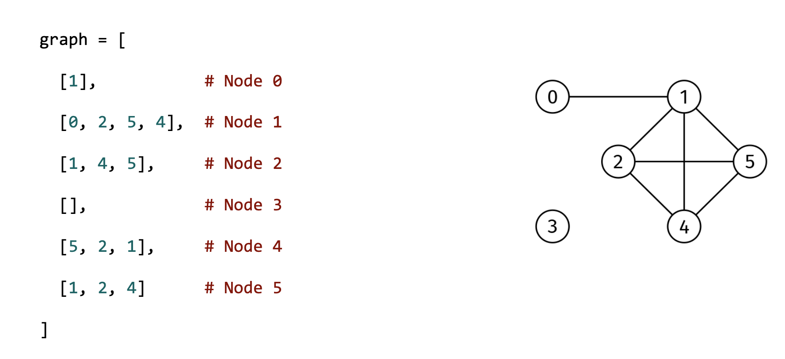

You are given the adjacency list of an undirected graph, graph, as well as an array, queries, of length k, where queries[i] is a pair of node indices. Return a boolean array of length k where the i-th element indicates if the nodes in queries[i] are in the same connected component.

A connected component is a maximal set of nodes that are all reachable from each other.

Example 1
graph = [
  [1],           # Node 0
  [0, 2, 5, 4],  # Node 1
  [1, 4, 5],     # Node 2
  [],            # Node 3
  [5, 2, 1],     # Node 4
  [1, 2, 4]      # Node 5
]
queries = [[0, 4], [0, 3]]

Output: [True, False]
The True corresponds to query [0, 4] and the False to query [0, 3].

Example 2:
graph = [
  [1],           # Node 0
  [0, 2],        # Node 1
  [1]            # Node 2
]
queries = [[0, 2], [0, 1]]

Output: [True, True]
All nodes are in the same connected component.

Example 3:
graph = [
  [1],           # Node 0
  [0],           # Node 1
  [3],           # Node 2
  [2]            # Node 3
]
queries = [[0, 1], [0, 2], [2, 3]]

Output: [True, False, True]
The graph has two connected components: {0, 1} and {2, 3}.
Graph from Example 1:

Reachability Queries

Constraints:

graph.length ≤ 1000
graph[i].length < 1000
0 ≤ graph[i][j] < graph.length
The adjacency list is properly formatted, with no parallel edges or self-loops
queries.length ≤ 1000
0 ≤ queries[i][0], queries[i][1] < graph.length
queries[i][0] != queries[i][1]

See Solution
Problem 36.5 - Reachability Queries: Solution
Python
The type of graph traversal we use for this problem doesn't matter. We can use DFS or BFS. We'll see the DFS approach.

We could do a DFS for each query. However, if the number of queries is potentially large, a more efficient approach is to precompute a map from each node to a connected component identifier.

Two nodes are in the same connected component if they have the same connected component identifier.

To compute this map, we can use the connected component loop recipe:

connected_component_loop(graph):
  visited = shared set across all c.c.
  for node in graph:
    if node not visited yet:
      # Found a new c.c.
      # Visit all nodes in the c.c.
      visited.add(node)
      visit(node, visited)  # DFS or BFS
Whenever we start a DFS through a new connected component, we increase the connected-component identifier.

Here's the implementation:

def connected_component_queries(graph, queries):
  node_to_cc = {}

  def visit(node, cc_id):
    if node in node_to_cc:
      return
    node_to_cc[node] = cc_id
    for nbr in graph[node]:
      visit(nbr, cc_id)

  cc_id = 0
  for node in range(len(graph)):
    if not node in node_to_cc:
      visit(node, cc_id)
      cc_id += 1

  res = []
  for node1, node2 in queries:
    res.append(node_to_cc[node1] == node_to_cc[node2])
  return res
Time & Space Analysis
V: the number of nodes in the graph

E: the number of edges in the graph

k: the number of queries

Time: O(V + E + k)

Extra space: O(V)

Note: if the graph was given as an edge list instead (which is common in interviews), we would need to convert it to an adjacency list, so the space complexity would be O(V + E).

Tests
Here are some test cases to verify the solution:

def run_tests():
  tests = [
      # Cycle graph with 6 nodes
      [[[1, 5], [0, 2, 4], [1, 3, 5], [2, 4], [1, 3, 5], [0, 2, 4]],
       [(0, 4), (0, 3)],
          [True, True]],
      # Example
      [[[1], [0, 2, 5, 4], [1, 4, 5], [], [5, 2, 1], [1, 2, 4]],
       [(0, 4), (0, 3)],
          [True, False]],
      # Simple line graph
      [[[1], [0, 2], [1]],
          [(0, 2), (0, 1)],
          [True, True]],
      # Disconnected components
      [[[1], [0], [3], [2]],
          [(0, 1), (0, 2), (2, 3)],
          [True, False, True]],
      # Complete graph
      [[[1, 2], [0, 2], [0, 1]],
          [(0, 1), (1, 2), (0, 2)],
          [True, True, True]],
      # Single node
      [[[]],
          [(0, 0)],
          [True]],
      # Empty queries
      [[[1], [0]],
          [],
          []]
  ]
  for graph, queries, want in tests:
    got = connected_component_queries(graph, queries)
    assert got == want, f"\nconnected_component_queries({graph}, {queries}): got: {
        got}, want: {want}\n"

run_tests()
function connectedComponentQueries(graph, queries) {
  const nodeToCc = new Map();

  function visit(node, ccId) {
    if (nodeToCc.has(node)) {
      return;
    }
    nodeToCc.set(node, ccId);
    for (const nbr of graph[node]) {
      visit(nbr, ccId);
    }
  }

  let ccId = 0;
  for (let node = 0; node < graph.length; node++) {
    if (!nodeToCc.has(node)) {
      visit(node, ccId);
      ccId++;
    }
  }

  const res = [];
  for (const [node1, node2] of queries) {
    res.push(nodeToCc.get(node1) === nodeToCc.get(node2));
  }
  return res;
}
Time & Space Analysis
V: the number of nodes in the graph

E: the number of edges in the graph

k: the number of queries

Time: O(V + E + k)

Extra space: O(V)

Note: if the graph was given as an edge list instead (which is common in interviews), we would need to convert it to an adjacency list, so the space complexity would be O(V + E).

Tests
Here are some test cases to verify the solution:

function runTests() {
  const tests = [
    // Cycle graph with 6 nodes
    [
      [
        [1, 5],
        [0, 2, 4],
        [1, 3, 5],
        [2, 4],
        [1, 3, 5],
        [0, 2, 4],
      ],
      [
        [0, 4],
        [0, 3],
      ],
      [true, true],
    ],
    // Example
    [
      [[1], [0, 2, 5, 4], [1, 4, 5], [], [5, 2, 1], [1, 2, 4]],
      [
        [0, 4],
        [0, 3],
      ],
      [true, false],
    ],
    // Simple line graph
    [
      [[1], [0, 2], [1]],
      [
        [0, 2],
        [0, 1],
      ],
      [true, true],
    ],
    // Disconnected components
    [
      [[1], [0], [3], [2]],
      [
        [0, 1],
        [0, 2],
        [2, 3],
      ],
      [true, false, true],
    ],
    // Complete graph
    [
      [
        [1, 2],
        [0, 2],
        [0, 1],
      ],
      [
        [0, 1],
        [1, 2],
        [0, 2],
      ],
      [true, true, true],
    ],
    // Single node
    [[[]], [[0, 0]], [true]],
    // Empty queries
    [[[1], [0]], [], []],
  ];
  for (const [graph, queries, want] of tests) {
    const got = connectedComponentQueries(graph, queries);
    if (JSON.stringify(got) !== JSON.stringify(want)) {
      throw new Error(
        `\nconnectedComponentQueries(${JSON.stringify(graph)}, ${JSON.stringify(queries)}): got: ${JSON.stringify(got)}, want: ${JSON.stringify(want)}\n`,
      );
    }
  }
}

runTests();

class ConnectedComponentQueries {
  private Map<Integer, Integer> nodeToCc;

  private void visit(List<List<Integer>> graph, int node, int ccId) {
    if (nodeToCc.containsKey(node)) {
      return;
    }
    nodeToCc.put(node, ccId);
    for (int nbr : graph.get(node)) {
      visit(graph, nbr, ccId);
    }
  }

  public List<Boolean> solve(List<List<Integer>> graph,
      List<List<Integer>> queries) {
    nodeToCc = new HashMap<>();

    int ccId = 0;
    for (int node = 0; node < graph.size(); node++) {
      if (!nodeToCc.containsKey(node)) {
        visit(graph, node, ccId);
        ccId++;
      }
    }

    Boolean[] res = new Boolean[queries.size()];
    for (int i = 0; i < queries.size(); i++) {
      int node1 = queries.get(i).get(0);
      int node2 = queries.get(i).get(1);
      res[i] = nodeToCc.get(node1).equals(nodeToCc.get(node2));
    }
    return Arrays.asList(res);
  }
}
Time & Space Analysis
V: the number of nodes in the graph

E: the number of edges in the graph

k: the number of queries

Time: O(V + E + k)

Extra space: O(V)

Note: if the graph was given as an edge list instead (which is common in interviews), we would need to convert it to an adjacency list, so the space complexity would be O(V + E).

Tests
Here are some test cases to verify the solution:

class RunTests {
  public void runTests() {
    Object[][] tests = {
        // Cycle graph with 6 nodes
        { new int[][] {
            { 1, 5 },
            { 0, 2, 4 },
            { 1, 3, 5 },
            { 2, 4 },
            { 1, 3, 5 },
            { 0, 2, 4 }
        },
            new int[][] {
                { 0, 4 },
                { 0, 3 }
            },
            new boolean[] { true, true }
        },
        // Example
        { new int[][] {
            { 1 },
            { 0, 2, 5, 4 },
            { 1, 4, 5 },
            {},
            { 5, 2, 1 },
            { 1, 2, 4 }
        },
            new int[][] {
                { 0, 4 },
                { 0, 3 }
            },
            new boolean[] { true, false }
        },
        // Simple line graph
        { new int[][] {
            { 1 },
            { 0, 2 },
            { 1 }
        },
            new int[][] {
                { 0, 2 },
                { 0, 1 }
            },
            new boolean[] { true, true }
        },
        // Disconnected components
        { new int[][] {
            { 1 },
            { 0 },
            { 3 },
            { 2 }
        },
            new int[][] {
                { 0, 1 },
                { 0, 2 },
                { 2, 3 }
            },
            new boolean[] { true, false, true }
        },
        // Complete graph
        { new int[][] {
            { 1, 2 },
            { 0, 2 },
            { 0, 1 }
        },
            new int[][] {
                { 0, 1 },
                { 1, 2 },
                { 0, 2 }
            },
            new boolean[] { true, true, true }
        },
        // Single node
        { new int[][] {
            {}
        },
            new int[][] {
                { 0, 0 }
            },
            new boolean[] { true }
        },
        // Empty queries
        { new int[][] {
            { 1 },
            { 0 }
        },
            new int[][] {},
            new boolean[] {}
        }
    };

    ConnectedComponentQueries solution = new ConnectedComponentQueries();
    for (Object[] test : tests) {
      int[][] graphArray = (int[][]) test[0];
      int[][] queriesArray = (int[][]) test[1];
      boolean[] wantArray = (boolean[]) test[2];

      List<List<Integer>> graph = Arrays.stream(graphArray)
          .map(row -> Arrays.stream(row).boxed().collect(Collectors.toList()))
          .collect(Collectors.toList());
      List<List<Integer>> queries = Arrays.stream(queriesArray)
          .map(row -> Arrays.stream(row).boxed().collect(Collectors.toList()))
          .collect(Collectors.toList());
      List<Boolean> want = new ArrayList<>();
      for (boolean b : wantArray) {
        want.add(b);
      }

      List<Boolean> got = solution.solve(graph, queries);
      if (!got.equals(want)) {
        throw new RuntimeException(String.format(
            "\nsolve(%s, %s): got: %s, want: %s\n",
            graph, queries, got, want));
      }
    }
  }
}

public class Solution {
  public static void main(String[] args) {
    new RunTests().runTests();
  }
}

