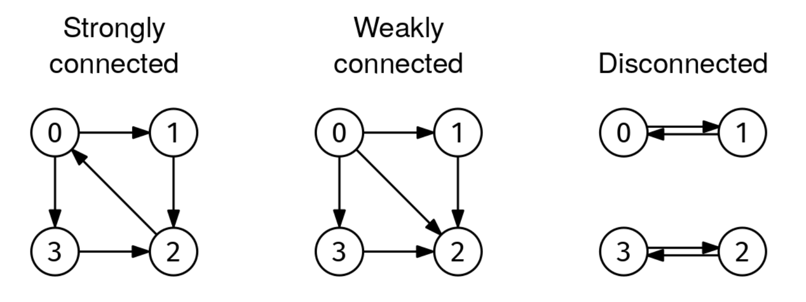

Given the adjacency list of a non-empty directed graph, graph, return whether it is strongly connected.

A directed graph is strongly connected if every node can reach every other node (in a directed graph, it is possible that node1 can reach node2 but not the other way around).

Below is an image of strongly connected, weakly connected, and disconnected directed graphs. A directed graph is weakly connected if it would be connected if edges didn't have directions.

Strongly Connected Graph

Example 1:
graph = [
  [1, 3],    # Node 0
  [2],       # Node 1
  [0],       # Node 2
  [2]        # Node 3
]

Output: True
Left graph in the image above

Example 2:
graph = [
  [1, 2, 3], # Node 0
  [2],       # Node 1
  [],        # Node 2
  [2]        # Node 3
]

Output: False
Middle graph in the image above
Node 2 cannot reach node 0, among others

Example 3:
graph = [
  [1],       # Node 0
  [0],       # Node 1
  [3],       # Node 2
  [2]        # Node 3
]

Output: False
Right graph in the image above
Node 0 cannot reach node 3, among others
Constraints:

1 ≤ graph.length ≤ 1000
graph[i].length < 1000
0 ≤ graph[i][j] < graph.length
The adjacency list is properly formatted, with no parallel edges or self-loops
The graph is directed

See Solution
Problem 36.6 - Strongly Connected Graph: Solution
Python
The type of graph traversal we use for this problem doesn't matter. We can use DFS or BFS. We'll see the DFS approach.

For directed graphs, it is not enough to check if a specific node can reach every node. For instance, in the middle graph, node 0 can reach every node, but the graph is not strongly connected:

Strongly Connected Graph
A naive solution is to do a DFS from every node. There is a trick that allows us to solve this problem efficiently: let u be any node in a directed graph. The graph is strongly connected if and only if:

u can reach every node, and
every node can reach u
Why? On the one hand, if either condition is missing, the graph is not strongly connected because at least one node can't reach u or be reached from u. On the other hand, if the two conditions hold, you can go from any node to any other node. For instance, if you want to go from node1 to node2, you can go from node1 to u and from u to node2.

This trick gives us two conditions that we can check in linear time:

We pick any node, say the one with index 0
To check if node 0 can reach every node, we do a normal DFS from it
To check if every node can reach node 0, we reverse the directions of all the edges in the adjacency list and do a DFS on the reversed graph. If there is a path from node 0 to node 7 in the reversed graph, that means that there is a path from 7 to 0 in the original graph.
Here's the implementation:

def visit(graph, visited, node):
  if node in visited:
    return
  visited.add(node)
  for nbr in graph[node]:
    visit(graph, visited, nbr)

def strongly_connected(graph):
  V = len(graph)
  visited = set()
  visit(graph, visited, 0)
  if len(visited) < V:
    return False

  reverse_graph = [[] for _ in range(V)]
  for node in range(V):
    for nbr in graph[node]:
      reverse_graph[nbr].append(node)

  reverse_visited = set()
  visit(reverse_graph, reverse_visited, 0)
  return len(reverse_visited) == V
Time & Space Analysis
V: the number of nodes in the graph

E: the number of edges in the graph

Time: O(V + E)

Extra space: O(V + E) - for the reversed adjacency list

Tests
Here are some test cases to verify the solution:

def run_tests():
  tests = [
      # Example strongly connected
      [[[1], [2], [0]], True],
      # Example not strongly connected
      [[[1], [2], []], False],
      # Single node
      [[[]], True],
      # Two nodes, strongly connected
      [[[1], [0]], True],
      # Two nodes, not strongly connected
      [[[1], []], False],
      # Cycle of 4 nodes
      [[[1], [2], [3], [0]], True],
      # Almost cycle of 4 nodes, missing one edge
      [[[1], [2], [3], []], False],
      # Complete graph
      [[[1, 2], [0, 2], [0, 1]], True],
  ]
  for graph, want in tests:
    got = strongly_connected(graph)
    assert got == want, f"\nstrongly_connected({graph}): got: {
        got}, want: {want}\n"

run_tests()

function visit(graph, visited, node) {
  if (visited.has(node)) {
    return;
  }
  visited.add(node);
  for (const nbr of graph[node]) {
    visit(graph, visited, nbr);
  }
}

function stronglyConnected(graph) {
  const V = graph.length;
  const visited = new Set();
  visit(graph, visited, 0);
  if (visited.size < V) {
    return false;
  }

  const reverseGraph = Array(V)
    .fill()
    .map(() => []);
  for (let node = 0; node < V; node++) {
    for (const nbr of graph[node]) {
      reverseGraph[nbr].push(node);
    }
  }

  const reverseVisited = new Set();
  visit(reverseGraph, reverseVisited, 0);
  return reverseVisited.size === V;
}
Time & Space Analysis
V: the number of nodes in the graph

E: the number of edges in the graph

Time: O(V + E)

Extra space: O(V + E) - for the reversed adjacency list

Tests
Here are some test cases to verify the solution:

function runTests() {
  const tests = [
    // Example strongly connected
    [[[1], [2], [0]], true],
    // Example not strongly connected
    [[[1], [2], []], false],
    // Single node
    [[[]], true],
    // Two nodes, strongly connected
    [[[1], [0]], true],
    // Two nodes, not strongly connected
    [[[1], []], false],
    // Cycle of 4 nodes
    [[[1], [2], [3], [0]], true],
    // Almost cycle of 4 nodes, missing one edge
    [[[1], [2], [3], []], false],
    // Complete graph
    [
      [
        [1, 2],
        [0, 2],
        [0, 1],
      ],
      true,
    ],
  ];
  for (const [graph, want] of tests) {
    const got = stronglyConnected(graph);
    if (got !== want) {
      throw new Error(
        `\nstronglyConnected(${JSON.stringify(graph)}): got: ${got}, want: ${want}\n`,
      );
    }
  }
}

runTests();

class StronglyConnected {
  private void visit(List<List<Integer>> graph, Set<Integer> visited,
      int node) {
    if (visited.contains(node)) {
      return;
    }
    visited.add(node);
    for (int nbr : graph.get(node)) {
      visit(graph, visited, nbr);
    }
  }

  public boolean solve(List<List<Integer>> graph) {
    int V = graph.size();
    Set<Integer> visited = new HashSet<>();
    visit(graph, visited, 0);
    if (visited.size() < V) {
      return false;
    }

    List<List<Integer>> reverseGraph = new ArrayList<>();
    for (int i = 0; i < V; i++) {
      reverseGraph.add(new ArrayList<>());
    }
    for (int node = 0; node < V; node++) {
      for (int nbr : graph.get(node)) {
        reverseGraph.get(nbr).add(node);
      }
    }

    Set<Integer> reverseVisited = new HashSet<>();
    visit(reverseGraph, reverseVisited, 0);
    return reverseVisited.size() == V;
  }
}
Time & Space Analysis
V: the number of nodes in the graph

E: the number of edges in the graph

Time: O(V + E)

Extra space: O(V + E) - for the reversed adjacency list

Tests
Here are some test cases to verify the solution:

record TestCase(List<List<Integer>> graph, boolean want) {
}

class RunTests {
  public void runTests() {
    TestCase[] tests = {
        // Example strongly connected
        new TestCase(
            List.of(List.of(1), List.of(2), List.of(0)),
            true),
        // Example not strongly connected
        new TestCase(
            List.of(List.of(1), List.of(2), List.of()),
            false),
        // Single node
        new TestCase(
            List.of(List.of()),
            true),
        // Two nodes, strongly connected
        new TestCase(
            List.of(List.of(1), List.of(0)),
            true),
        // Two nodes, not strongly connected
        new TestCase(
            List.of(List.of(1), List.of()),
            false),
        // Cycle of 4 nodes
        new TestCase(
            List.of(List.of(1), List.of(2), List.of(3), List.of(0)),
            true),
        // Almost cycle of 4 nodes, missing one edge
        new TestCase(
            List.of(List.of(1), List.of(2), List.of(3), List.of()),
            false),
        // Complete graph
        new TestCase(
            List.of(List.of(1, 2), List.of(0, 2), List.of(0, 1)),
            true)
    };

    StronglyConnected solution = new StronglyConnected();
    for (TestCase test : tests) {
      boolean got = solution.solve(test.graph());
      if (got != test.want()) {
        throw new RuntimeException(String.format(
            "\nsolve(%s): got: %b, want: %b\n",
            test.graph(), got, test.want()));
      }
    }
  }
}

public class Solution {
  public static void main(String[] args) {
    new RunTests().runTests();
  }
}

