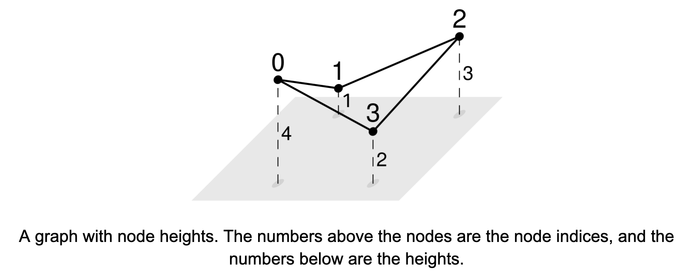

We're given the adjacency list, graph, of a non-empty, undirected graph with V nodes and an array, heights, of length V, where heights[i] is a floating-point number representing the height of node i.

A connected component is a maximal set of nodes such that there is a path between any two nodes in the set.

The elevation gain of an edge is the absolute difference of the heights of its endpoints. The hilliness of a connected component is the average elevation gain of the edges in it, or 0 if it has a single node. The hilliest connected component is the one with maximum hilliness.

Find the hilliest connected component and return its hilliness.

Example 1:
graph = [
   [1, 3],       # Node 0
   [0, 2],       # Node 1
   [1, 3],       # Node 2
   [0, 2]        # Node 3
]
heights = [4.0, 1.0, 3.0, 2.0]

Output: 2.0
The graph has a single connected component
The edge elevation gains are:
- |4 - 1| = 3 for [0, 1]
- |1 - 3| = 2 for [1, 2]
- |3 - 2| = 1 for [2, 3]
- |2 - 4| = 2 for [3, 0]
The average is 2

Example 2:
graph = [
   []           # Node 0
]
heights = [5.0]

Output: 0.0
A single-node connected component has hilliness 0

Example 3:
graph = [
   [1],          # Node 0
   [0],          # Node 1
   [3],          # Node 2
   [2]           # Node 3
]
heights = [1.5, 5.5, 0.0, 5.0]

Output: 5.0
The graph has two components:
- {0, 1}, with a single edge with elevation gain 4.0
- {2, 3}, with a single edge with elevation gain 5.0

Example 4:
graph = [
   [1, 2],       # Node 0
   [0, 2],       # Node 1
   [0, 1]        # Node 2
]
heights = [3.0, 3.0, 3.0]
Output: 0.0
When all nodes have the same height, the elevation gain is 0 for all edges
Example 1:

Hilliest connected component 1

Constraints:

1 ≤ graph.length ≤ 1000
graph[i].length < 1000
0 ≤ graph[i][j] < graph.length
The adjacency list is properly formatted, with no parallel edges or self-loops
heights.length = graph.length
0 ≤ heights[i] < 10^9
heights[i] is a floating-point number

See Solution
Problem 36.7 - Hilliest Connected Component: Solution
Python
This problem introduces the concept of node weights, which we have to use to compute the hilliness of each connected component. We use the break down the problem booster and solve it in two steps:

Label each node with a connected component ID. We can use the 'Connected-component loop' recipe for this:
connected_component_loop(graph):
  visited = shared set across all c.c.
  for node in graph:
    if node not visited yet:
      # Found a new c.c.
      # Visit all nodes in the c.c.
      visited.add(node)
      visit(node, visited)  # DFS or BFS
The traversal we use doesn't matter. We can use DFS or BFS. We'll see the DFS approach.

Compute the hilliness of each connected component. When computing averages, it is often easiest to focus on computing the numerator (the sum of elevation gains) and denominator (the number of edges) separately and dividing at the very end.
Since the graph is undirected, we need to be careful to count each node once. We can do this by only considering neighbors with higher indices. For instance, if we have edge [3, 7] we only consider it when processing the neighbors of 3, but not the neighbors of 7.

def label_nodes_with_cc_ids(graph):
  node_to_cc = {}

  def visit(node, cc_id):
    if node in node_to_cc:
      return
    node_to_cc[node] = cc_id
    for nbr in graph[node]:
      visit(nbr, cc_id)

  cc_id = 0
  for node in range(len(graph)):
    if node not in node_to_cc:
      visit(node, cc_id)
      cc_id += 1

  return node_to_cc

def max_hilliness(graph, heights):
  node_to_cc = label_nodes_with_cc_ids(graph)
  V = len(graph)
  cc_to_elevation_gain_sum = {}
  cc_to_num_edges = {}
  for node in range(V):
    cc = node_to_cc[node]
    if cc not in cc_to_num_edges:
      cc_to_elevation_gain_sum[cc] = 0
      cc_to_num_edges[cc] = 0
    for nbr in graph[node]:
      if nbr > node:  # Only count each edge once.
        cc_to_num_edges[cc] += 1
        cc_to_elevation_gain_sum[cc] += abs(heights[node] - heights[nbr])
  res = 0
  for cc in cc_to_num_edges:
    if cc_to_num_edges[cc] > 0:
      res = max(res, cc_to_elevation_gain_sum[cc] / cc_to_num_edges[cc])
  return res
We could have also solved the problem in a single pass, computing each connected component's hilliness as we traverse it.

Time & Space Analysis
V: the number of nodes in the graph

E: the number of edges in the graph

Time: O(V + E)

Extra space: O(V)

Note: if the graph was given as an edge list instead (which is common in interviews), we would need to convert it to an adjacency list, so the space complexity would be O(V + E).

Tests
Here are some test cases to verify the solution:

def run_tests():
  tests = [
      # Example
      [[[1, 3], [0, 2], [1, 3], [0, 2]], [4, 1, 3, 2], 2],
      # Single node component
      [[[]], [5], 0],
      # Two disconnected components
      [[[1], [0], [3], [2]], [1.5, 5.5, 0.0, 5.0], 5],
      # All nodes same height
      [[[1, 2], [0, 2], [0, 1]], [3, 3, 3], 0],
      # Line graph
      [[[1], [0, 2], [1]], [1, 5, 2], 3.5],
      # Complete graph
      [[[1, 2, 3], [0, 2, 3], [0, 1, 3], [0, 1, 2]],
       [1, 4, 7, 10], (3 + 6 + 9 + 3 + 6 + 3) / 6]
  ]
  for graph, heights, want in tests:
    got = max_hilliness(graph, heights)
    assert abs(
        got - want) < 0.0001, f"\nmax_hilliness({graph}, {heights}): got: {got}, want: {want}\n"

run_tests()

function labelNodesWithCcIds(graph) {
  const nodeToCc = new Map();

  function visit(node, ccId) {
    if (nodeToCc.has(node)) {
      return;
    }
    nodeToCc.set(node, ccId);
    for (const nbr of graph[node]) {
      visit(nbr, ccId);
    }
  }

  let ccId = 0;
  for (let node = 0; node < graph.length; node++) {
    if (!nodeToCc.has(node)) {
      visit(node, ccId);
      ccId++;
    }
  }

  return nodeToCc;
}

function maxHilliness(graph, heights) {
  const nodeToCc = labelNodesWithCcIds(graph); // Same as Problem 4.
  const V = graph.length;
  const ccToElevationGainSum = new Map();
  const ccToNumEdges = new Map();

  for (let node = 0; node < V; node++) {
    const cc = nodeToCc.get(node);
    if (!ccToNumEdges.has(cc)) {
      ccToElevationGainSum.set(cc, 0);
      ccToNumEdges.set(cc, 0);
    }
    for (const nbr of graph[node]) {
      if (nbr > node) {
        ccToNumEdges.set(cc, ccToNumEdges.get(cc) + 1);
        ccToElevationGainSum.set(
          cc,
          ccToElevationGainSum.get(cc) + Math.abs(heights[node] - heights[nbr]),
        );
      }
    }
  }

  let res = 0;
  for (const cc of ccToNumEdges.keys()) {
    if (ccToNumEdges.get(cc) > 0) {
      res = Math.max(res, ccToElevationGainSum.get(cc) / ccToNumEdges.get(cc));
    }
  }
  return res;
}
We could have also solved the problem in a single pass, computing each connected component's hilliness as we traverse it.

Time & Space Analysis
V: the number of nodes in the graph

E: the number of edges in the graph

Time: O(V + E)

Extra space: O(V)

Note: if the graph was given as an edge list instead (which is common in interviews), we would need to convert it to an adjacency list, so the space complexity would be O(V + E).

Tests
Here are some test cases to verify the solution:

function runTests() {
  const tests = [
    // Example
    [
      [
        [1, 3],
        [0, 2],
        [1, 3],
        [0, 2],
      ],
      [4, 1, 3, 2],
      2,
    ],
    // Single node component
    [[[]], [5], 0],
    // Two disconnected components
    [[[1], [0], [3], [2]], [1.5, 5.5, 0.0, 5.0], 5],
    // All nodes same height
    [
      [
        [1, 2],
        [0, 2],
        [0, 1],
      ],
      [3, 3, 3],
      0,
    ],
    // Line graph
    [[[1], [0, 2], [1]], [1, 5, 2], 3.5],
    // Complete graph
    [
      [
        [1, 2, 3],
        [0, 2, 3],
        [0, 1, 3],
        [0, 1, 2],
      ],
      [1, 4, 7, 10],
      (3 + 6 + 9 + 3 + 6 + 3) / 6,
    ],
  ];
  for (const [graph, heights, want] of tests) {
    const got = maxHilliness(graph, heights);
    if (!(Math.abs(got - want) < 0.0001)) {
      throw new Error(
        `\nmaxHilliness(${JSON.stringify(graph)}, ${JSON.stringify(heights)}): got: ${got}, want: ${want}\n`,
      );
    }
  }
}

runTests();

class MaxHilliness {
  Map<Integer, Integer> nodeToCc;
  List<List<Integer>> graph;

  private void visit(int node, int ccId) {
    if (nodeToCc.containsKey(node)) {
      return;
    }
    nodeToCc.put(node, ccId);
    for (int nbr : graph.get(node)) {
      visit(nbr, ccId);
    }
  }

  private void labelNodesWithCcIds() {
    int ccId = 0;
    for (int node = 0; node < graph.size(); node++) {
      if (!nodeToCc.containsKey(node)) {
        visit(node, ccId);
        ccId++;
      }
    }
  }

  public double solve(List<List<Integer>> graph, List<Double> heights) {
    this.graph = graph;
    nodeToCc = new HashMap<>();
    labelNodesWithCcIds();
    int V = graph.size();
    Map<Integer, Double> ccToElevationGainSum = new HashMap<>();
    Map<Integer, Integer> ccToNumEdges = new HashMap<>();

    for (int node = 0; node < V; node++) {
      int cc = nodeToCc.get(node);
      ccToElevationGainSum.putIfAbsent(cc, 0.0);
      ccToNumEdges.putIfAbsent(cc, 0);

      for (int nbr : graph.get(node)) {
        if (nbr > node) {
          ccToNumEdges.put(cc, ccToNumEdges.get(cc) + 1);
          ccToElevationGainSum.put(cc, ccToElevationGainSum.get(cc) +
              Math.abs(heights.get(node) - heights.get(nbr)));
        }
      }
    }

    double res = 0;
    for (int cc : ccToNumEdges.keySet()) {
      if (ccToNumEdges.get(cc) > 0) {
        res = Math.max(res,
            ccToElevationGainSum.get(cc) / ccToNumEdges.get(cc));
      }
    }
    return res;
  }
}
We could have also solved the problem in a single pass, computing each connected component's hilliness as we traverse it.

Time & Space Analysis
V: the number of nodes in the graph

E: the number of edges in the graph

Time: O(V + E)

Extra space: O(V)

Note: if the graph was given as an edge list instead (which is common in interviews), we would need to convert it to an adjacency list, so the space complexity would be O(V + E).

Tests
Here are some test cases to verify the solution:

class RunTests {
  public void runTests() {
    Object[][] tests = {
        // Example
        {
            new int[][] {
                { 1, 3 },
                { 0, 2 },
                { 1, 3 },
                { 0, 2 }
            },
            new double[] { 4.0, 1.0, 3.0, 2.0 },
            2.0
        },
        // Single node component
        {
            new int[][] {
                {}
            },
            new double[] { 5.0 },
            0.0
        },
        // Two disconnected components
        {
            new int[][] {
                { 1 },
                { 0 },
                { 3 },
                { 2 }
            },
            new double[] { 1.5, 5.5, 0.0, 5.0 },
            5.0
        },
        // All nodes same height
        {
            new int[][] {
                { 1, 2 },
                { 0, 2 },
                { 0, 1 }
            },
            new double[] { 3.0, 3.0, 3.0 },
            0.0
        },
        // Line graph
        {
            new int[][] {
                { 1 },
                { 0, 2 },
                { 1 }
            },
            new double[] { 1.0, 5.0, 2.0 },
            3.5
        },
        // Complete graph
        {
            new int[][] {
                { 1, 2, 3 },
                { 0, 2, 3 },
                { 0, 1, 3 },
                { 0, 1, 2 }
            },
            new double[] { 1.0, 4.0, 7.0, 10.0 },
            5.0
        }
    };

    MaxHilliness solution = new MaxHilliness();
    for (Object[] test : tests) {
      int[][] adjList = (int[][]) test[0];
      Object heightsObj = test[1];
      double want = (double) test[2];

      // Convert adjacency list array to List<List<Integer>>
      List<List<Integer>> graph = new ArrayList<>();
      for (int[] neighbors : adjList) {
        List<Integer> nbrList = new ArrayList<>();
        for (int nbr : neighbors) {
          nbrList.add(nbr);
        }
        graph.add(nbrList);
      }

      // Convert heights array to List<Double>
      List<Double> heightsList = new ArrayList<>();
      if (heightsObj instanceof int[]) {
        int[] heights = (int[]) heightsObj;
        for (int h : heights) {
          heightsList.add((double) h);
        }
      } else if (heightsObj instanceof double[]) {
        double[] heights = (double[]) heightsObj;
        for (double h : heights) {
          heightsList.add(h);
        }
      }

      double got = solution.solve(graph, heightsList);
      if (Math.abs(got - want) >= 0.0001) {
        throw new RuntimeException(String.format(
            "\nsolve(%s, %s): got: %f, want: %f\n",
            graph, heightsList, got, want));
      }
    }
  }
}

public class Solution {
  public static void main(String[] args) {
    new RunTests().runTests();
  }
}

