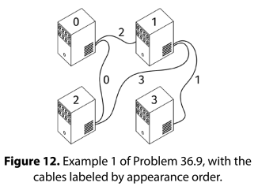
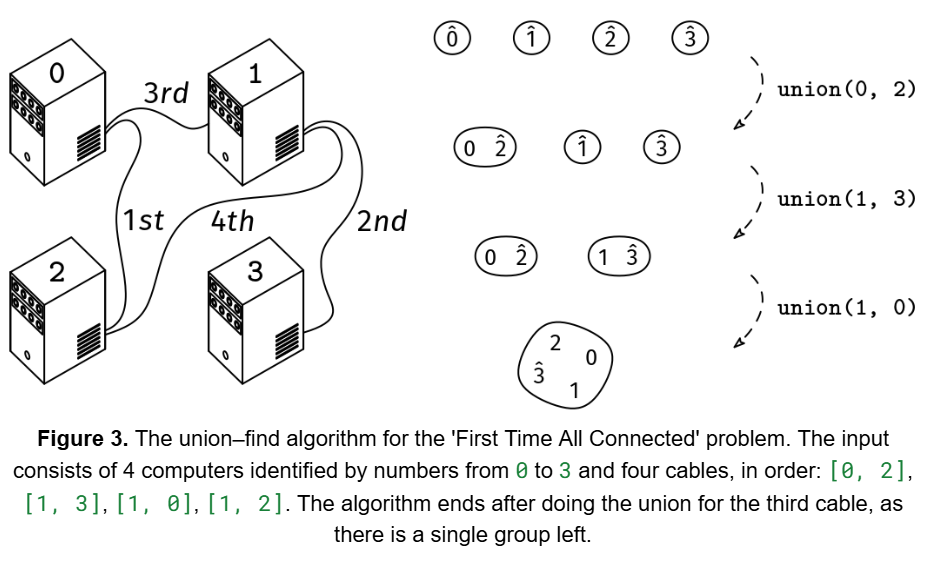

We are given V >= 2, the number of computers in a data center. The computers are identified with indices from 0 to V - 1.

We are also given a list, cables, of length E where each element is a pair [x, y], with 0 ≤ x, y < V and x != y, indicating that we should connect the computers with indices x and y with a cable.

If we add the cables in the order of the list, at what point will all the computers be connected (meaning that there is a path of cables between every pair of computers)?

Return the index of the cable in cables after which all the computers are connected or -1 if that never happens.

For example, in this figure, if we add the cables in order, the computers become all connected after adding cables 0, 1, and 2.

First Time All Connected 1

Example 1:
V = 4
cables = [
  [0, 2],
  [1, 3],
  [0, 1],
  [1, 2]
]

Output: 2
See image above

Example 2:
V = 3
cables = [[0, 1]]

Output: -1
It's impossible to connect 3 computers with only one cable

Example 3
V = 4
cables = [[0, 1], [1, 2], [2, 0], [2, 3], [3, 0]]

Output: 3
Redundant cables don't affect the result
Constraints:

2 <= V <= 10^4
0 <= E <= 10^5
0 <= cables[i][0], cables[i][1] < V
cables[i][0] != cables[i][1]
all the cables are unique
See Solution
Problem 36.9 - First Time All Connected: Solution
Java
Binary search solution
The type of graph traversal we use for this problem doesn't matter. We can use DFS or BFS. We'll see the DFS approach.

A naive solution would be to add the edges one by one in order, and do a DFS after each one to check if the graph is connected. This would take O(E * (V + E)) time.

A better solution is to use the guess-and-check technique from the binary search chapter. The goal is to find the transition point in the list of cables where the graph goes from disconnected to connected.

Before adding any cables, the graph is clearly not connected, so we are before the transition point.
After adding all cables, the graph may be connected or not. We can check if it is in a preprocessing step. If it is not, we can return -1; if it is, then we are after the transition point.
We can binary search for the transition point using the transition-point recipe:

transition_point_recipe()
  define is_before(val) to return whether val is 'before'
  initialize l and r to the first and last values in the range
  handle edge cases:
    - the range is empty
    - l is 'after'  (the whole range is 'after')
    - r is 'before' (the whole range is 'before')

  while l and r are not next to each other (r - l > 1)
    mid = (l + r) / 2
    if is_before(mid)
      l = mid
    else
      r = mid

  return l (the last 'before'), r (the first 'after'), or something else,
         depending on the problem
We can write a helper function is_before(cable_index) that returns whether the graph is still disconnected after adding the cables up to cable_index. This helper function does a DFS starting at any node and using only cables up to cable_index.

Then, we can binary search for the first index where this function returns False.

class FirstTimeAllConnected {
  private void visit(List<List<Integer>> graph, java.util.Set<Integer> visited,
      int node) {
    for (int nbr : graph.get(node)) {
      if (!visited.contains(nbr)) {
        visited.add(nbr);
        visit(graph, visited, nbr);
      }
    }
  }

  private boolean isBefore(int cableIndex, int V, int[][] cables) {
    // Build adjacency list representation using ArrayList
    List<List<Integer>> graph = new ArrayList<>();
    for (int i = 0; i < V; i++) {
      graph.add(new ArrayList<>());
    }

    // Fill lists
    for (int i = 0; i <= cableIndex; i++) {
      int node1 = cables[i][0];
      int node2 = cables[i][1];
      graph.get(node1).add(node2);
      graph.get(node2).add(node1);
    }

    java.util.Set<Integer> visited = new java.util.HashSet<>();
    visited.add(0);
    visit(graph, visited, 0);
    return visited.size() < V;
  }

  public int solve(int V, int[][] cables) {
    // Base case - no cables
    if (cables.length == 0) {
      return -1;
    }

    int l = 0, r = cables.length - 1;
    if (isBefore(r, V, cables)) {
      return -1;
    }
    while (r - l > 1) {
      int mid = l + (r - l) / 2;
      if (isBefore(mid, V, cables)) {
        l = mid;
      } else {
        r = mid;
      }
    }
    return r;
  }
}
Union-find solution
We can make a faster solution using the union-find data structure (See the Union-Find online chapter).

The union-find groups represent sets of computers that are connected directly or indirectly. At the beginning, each computer is in its own group. Then, for each cable, in the order of the list, we use the find() method to check if the two computers have the same representative, meaning that they are already in the same connected group. If not, we union their groups with the union() method. We repeat this until there is a single group left.

class FirstTimeAllConnectedUnionFind {
  public int solve(int V, int[][] cables) {
    UnionFind uf = new UnionFind();
    for (int x = 0; x < V; x++) {
      uf.add(x);
    }
    int groups = V;
    for (int i = 0; i < cables.length; i++) {
      int x = cables[i][0];
      int y = cables[i][1];

      // If x and y are not in the same group yet, union their groups
      if (uf.find(x) != uf.find(y)) {
        uf.union(x, y);
        groups--;
        if (groups == 1) {
          return i;
        }
      }
    }
    return -1;
  }
}
First Time All Connected 2

Recall that we need to know how to implement the Union Find data structure:

public class UnionFind {
  private HashMap<Integer, Integer> parent;
  private HashMap<Integer, Integer> size;

  public UnionFind() {
    parent = new HashMap<>();
    size = new HashMap<>();
  }

  // Assumes x is not already in the UnionFind.
  public void add(int x) {
    parent.put(x, x);
    size.put(x, 1);
  }

  // Assumes x is already in the UnionFind.
  public int find(int x) {
    int root = parent.get(x);
    while (parent.get(root) != root) {
      root = parent.get(root);
    }

    // Path compression
    while (x != root) {
      int next = parent.get(x);
      parent.put(x, root);
      x = next;
    }

    return root;
  }

  // Assumes x and y are already in the UnionFind.
  public void union(int x, int y) {
    int reprX = find(x);
    int reprY = find(y);

    if (reprX == reprY) {
      return; // They are already in the same set
    }

    if (size.get(reprX) < size.get(reprY)) {
      size.put(reprY, size.get(reprY) + size.get(reprX));
      parent.put(reprX, reprY);
    } else {
      size.put(reprX, size.get(reprX) + size.get(reprY));
      parent.put(reprY, reprX);
    }
  }

  // Returns the size of the set containing x.
  // Assumes x is already in the UnionFind.
  public int getSetSize(int x) {
    return size.get(find(x));
  }
}
Time & Space Analysis
V: the number of nodes in the graph
E: the number of edges in the graph
For the binary search solution:

Time: O((V + E) * log(E))

Extra space: O(V + E) - for the adjacency list

O(V + E) is the runtime of one graph traversal

Binary search over the list of cables adds a logarithmic factor

For the union-find solution:

Time: O(E * alpha(V))

Extra space: O(V) - for the union-find data structure

The union-find has size O(V)

We do O(E) operations on the union-find

alpha(V) is the inverse Ackermann function

Tests
Here are some tests to verify the solution:

class RunTests {
  public void runTests() {
    Object[][] tests = {
        // Case from picture - becomes connected after cables[2]
        { 4, new int[][] { { 0, 2 }, { 1, 3 }, { 0, 1 }, { 1, 2 } }, 2 },
        // Edge case - never gets fully connected
        { 3, new int[][] { { 0, 1 } }, -1 },
        // Edge case - gets connected with final cable
        { 3, new int[][] { { 0, 1 }, { 1, 2 } }, 1 },
        // Larger test case
        { 5, new int[][] { { 0, 1 }, { 2, 3 }, { 1, 2 }, { 3, 4 }, { 0, 4 } },
            3 },
        // Edge case - redundant cables don't affect result
        { 4, new int[][] { { 0, 1 }, { 1, 2 }, { 2, 0 }, { 2, 3 }, { 3, 0 } },
            3 },
        // No edges added
        { 4, new int[][] {}, -1 },
        // One edge added
        { 4, new int[][] { { 0, 1 } }, -1 }
    };

    FirstTimeAllConnected solution1 = new FirstTimeAllConnected();
    FirstTimeAllConnectedUnionFind solution2 = new FirstTimeAllConnectedUnionFind();

    for (Object[] test : tests) {
      int V = (int) test[0];
      int[][] cables = (int[][]) test[1];
      int want = (int) test[2];

      int got1 = solution1.solve(V, cables);
      if (got1 != want) {
        throw new RuntimeException(String.format(
            "\nFirstTimeAllConnected.solve(%d, %s): got: %d, want: %d\n",
            V, java.util.Arrays.deepToString(cables), got1, want));
      }

      int got2 = solution2.solve(V, cables);
      if (got2 != want) {
        throw new RuntimeException(String.format(
            "\nFirstTimeAllConnectedUnionFind.solve(%d, %s): got: %d, want: %d\n",
            V, java.util.Arrays.deepToString(cables), got2, want));
      }
    }
  }
}

public class Solution {
  public static void main(String[] args) {
    new RunTests().runTests();
  }
}

def first_time_all_connected(V, cables):
  
  def visit(graph, visited, node):
    for nbr in graph[node]:
      if nbr not in visited:
        visited.add(nbr)
        visit(graph, visited, nbr)

  def is_before(cable_index):
    graph = [[] for _ in range(V)]
    for i in range(cable_index + 1):
      node1, node2 = cables[i]
      graph[node1].append(node2)
      graph[node2].append(node1)
    visited = {0}
    visit(graph, visited, 0)
    return len(visited) < V

  l, r = 0, len(cables) - 1
  if is_before(r):
    return -1
  while r - l > 1:
    mid = l + (r - l) // 2
    if is_before(mid):
      l = mid
    else:
      r = mid
  return r
Union-find solution
We can make a faster solution using the union-find data structure (See the Union-Find online chapter).

The union-find groups represent sets of computers that are connected directly or indirectly. At the beginning, each computer is in its own group. Then, for each cable, in the order of the list, we use the find() method to check if the two computers have the same representative, meaning that they are already in the same connected group. If not, we union their groups with the union() method. We repeat this until there is a single group left.

def first_time_all_connected_union_find(V, cables):
  uf = UnionFind()
  for x in range(V):
    uf.add(x)
  groups = V
  for i in range(len(cables)):
    x, y = cables[i]

    # If x and y are not in the same group yet, union their groups.
    if uf.find(x) != uf.find(y):
      uf.union(x, y)
      groups -= 1
      if groups == 1:
        return i
  return -1
  class UnionFind:
  def __init__(self):
    self.parent = {}
    self.size = {}

  # Assumes x is not already in the UnionFind.
  def add(self, x):
    self.parent[x] = x
    self.size[x] = 1

  # Assumes x is already in the UnionFind.
  def find(self, x):
    root = self.parent[x]
    while self.parent[root] != root:
      root = self.parent[root]
    while x != root:
      self.parent[x], x = root, self.parent[x]
    return root

  # Assumes x and y are already in the UnionFind.
  def union(self, x, y):
    repr_x, repr_y = self.find(x), self.find(y)
    if repr_x == repr_y:
      return  # They are already in the same set.
    if self.size[repr_x] < self.size[repr_y]:
      self.size[repr_y] += self.size[repr_x]
      self.parent[repr_x] = repr_y
    else:
      self.size[repr_x] += self.size[repr_y]
      self.parent[repr_y] = repr_x
Time & Space Analysis
V: the number of nodes in the graph
E: the number of edges in the graph
For the binary search solution:

Time: O((V + E) * log(E))

Extra space: O(V + E) - for the adjacency list

O(V + E) is the runtime of one graph traversal

Binary search over the list of cables adds a logarithmic factor

For the union-find solution:

Time: O(E * alpha(V))

Extra space: O(V) - for the union-find data structure

The union-find has size O(V)

We do O(E) operations on the union-find

alpha(V) is the inverse Ackermann function

Tests
Here are some tests to verify the solution:

def run_tests():
  tests = [
      # Case from picture - becomes connected after cables[2].
      (4, [(0, 2), (1, 3), (0, 1), (1, 2)], 2),
      # Edge case - never gets fully connected
      (3, [(0, 1)], -1),
      # Edge case - gets connected with final cable
      (3, [(0, 1), (1, 2)], 1),
      # Larger test case
      (5, [(0, 1), (2, 3), (1, 2), (3, 4), (0, 4)], 3),
      # Edge case - redundant cables don't affect result
      (4, [(0, 1), (1, 2), (2, 0), (2, 3), (3, 0)], 3),
      # No edges added.
      (4, [], -1),
      # One edge added.
      (4, [(0, 1)], -1),
  ]
  for V, cables, want in tests:
    got = first_time_all_connected(V, cables)
    assert (
        got == want
    ), f"first_time_all_connected({V}, {cables}): got: {got}, want {want}\n"
    got = first_time_all_connected_union_find(V, cables)
    assert (
        got == want
    ), f"first_time_all_connected_union_find({V}, {cables}): got: {got}, want {want}\n"

run_tests()

Recipe 3 - Graph BFS

def graph_BFS(graph, start):
  Q = Queue()
  Q.push(start)
  distances = {start: 0}
  while not Q.empty():
    node = Q.pop()
    for nbr in graph[node]:
      if nbr not in distances:
        distances[nbr] = distances[node] + 1
        Q.push(nbr)

  # Do something with distances.
function firstTimeAllConnected(V, cables) {

  function visit(graph, visited, node) {
    for (const nbr of graph[node]) {
      if (!visited.has(nbr)) {
        visited.add(nbr);
        visit(graph, visited, nbr);
      }
    }
  }

  function isBefore(cableIndex) {
    const graph = Array(V)
      .fill()
      .map(() => []);
    for (let i = 0; i <= cableIndex; i++) {
      const [node1, node2] = cables[i];
      graph[node1].push(node2);
      graph[node2].push(node1);
    }
    const visited = new Set([0]);
    visit(graph, visited, 0);
    return visited.size < V;
  }

  let l = 0,
    r = cables.length - 1;
  if (isBefore(r)) {
    return -1;
  }
  while (r - l > 1) {
    const mid = l + Math.floor((r - l) / 2);
    if (isBefore(mid)) {
      l = mid;
    } else {
      r = mid;
    }
  }
  return r;
}
Union-find solution
We can make a faster solution using the union-find data structure (See the Union-Find online chapter).

The union-find groups represent sets of computers that are connected directly or indirectly. At the beginning, each computer is in its own group. Then, for each cable, in the order of the list, we use the find() method to check if the two computers have the same representative, meaning that they are already in the same connected group. If not, we union their groups with the union() method. We repeat this until there is a single group left.

function firstTimeAllConnectedUnionFind(V, cables) {
  const uf = new UnionFind();
  for (let x = 0; x < V; x++) {
    uf.add(x);
  }
  let groups = V;
  for (let i = 0; i < cables.length; i++) {
    const [x, y] = cables[i];

    // If x and y are not in the same group yet, union their groups.
    if (uf.find(x) !== uf.find(y)) {
      uf.union(x, y);
      groups--;
      if (groups === 1) {
        return i;
      }
    }
  }
  return -1;
}
First Time All Connected 2
Recall that we need to know how to implement the Union Find data structure:

class UnionFind {
  constructor() {
    this.parent = {};
    this.size = {};
  }

  // Assumes x is not already in the UnionFind.
  add(x) {
    this.parent[x] = x;
    this.size[x] = 1;
  }

  // Assumes x is already in the UnionFind.
  find(x) {
    let root = this.parent[x];
    while (this.parent[root] !== root) {
      root = this.parent[root];
    }
    while (x !== root) {
      const parent = this.parent[x];
      this.parent[x] = root;
      x = parent;
    }
    return root;
  }

  // Assumes x and y are already in the UnionFind.
  union(x, y) {
    const reprX = this.find(x);
    const reprY = this.find(y);
    if (reprX === reprY) return; // They are already in the same set.

    if (this.size[reprX] < this.size[reprY]) {
      this.size[reprY] += this.size[reprX];
      this.parent[reprX] = reprY;
    } else {
      this.size[reprX] += this.size[reprY];
      this.parent[reprY] = reprX;
    }
  }
}
Time & Space Analysis
V: the number of nodes in the graph
E: the number of edges in the graph
For the binary search solution:

Time: O((V + E) * log(E))

Extra space: O(V + E) - for the adjacency list

O(V + E) is the runtime of one graph traversal

Binary search over the list of cables adds a logarithmic factor

For the union-find solution:

Time: O(E * alpha(V))

Extra space: O(V) - for the union-find data structure

The union-find has size O(V)

We do O(E) operations on the union-find

alpha(V) is the inverse Ackermann function

Tests
Here are some tests to verify the solution:

function runTests() {
  const tests = [
    // Case from picture - becomes connected after cables[2].
    [
      4,
      [
        [0, 2],
        [1, 3],
        [0, 1],
        [1, 2],
      ],
      2,
    ],
    // Edge case - never gets fully connected
    [3, [[0, 1]], -1],
    // Edge case - gets connected with final cable
    [
      3,
      [
        [0, 1],
        [1, 2],
      ],
      1,
    ],
    // Larger test case
    [
      5,
      [
        [0, 1],
        [2, 3],
        [1, 2],
        [3, 4],
        [0, 4],
      ],
      3,
    ],
    // Edge case - redundant cables don't affect result
    [
      4,
      [
        [0, 1],
        [1, 2],
        [2, 0],
        [2, 3],
        [3, 0],
      ],
      3,
    ],
    // No edges added.
    [4, [], -1],
    // One edge added.
    [4, [[0, 1]], -1],
  ];
  for (const [V, cables, want] of tests) {
    let got = firstTimeAllConnected(V, cables);
    if (got !== want) {
      throw new Error(
        `\nfirstTimeAllConnected(${V}, ${JSON.stringify(cables)}): got: ${got}, want: ${want}\n`,
      );
    }
    got = firstTimeAllConnectedUnionFind(V, cables);
    if (got !== want) {
      throw new Error(
        `\nfirstTimeAllConnectedUnionFind(${V}, ${JSON.stringify(cables)}): got: ${got}, want: ${want}\n`,
      );
    }
  }
}

runTests();
