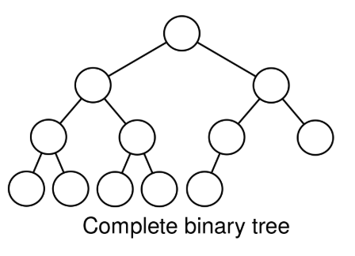
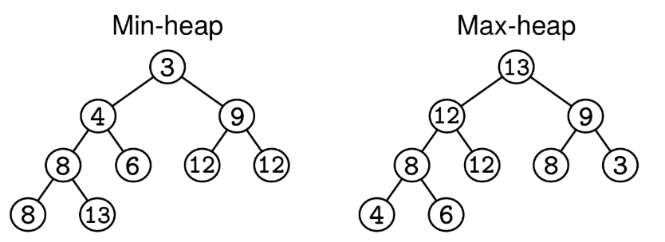
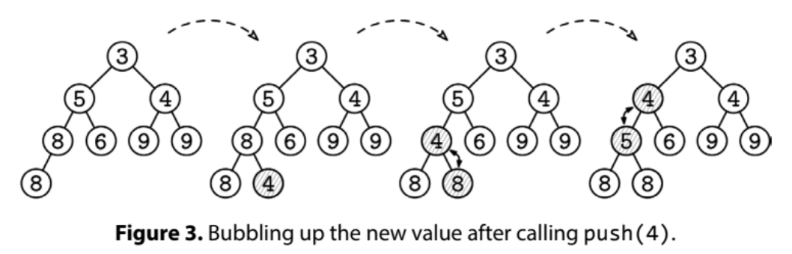
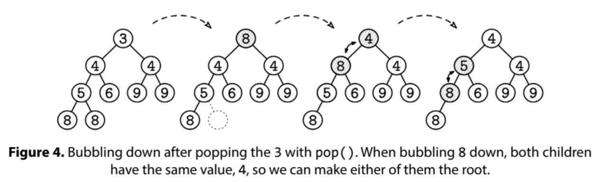
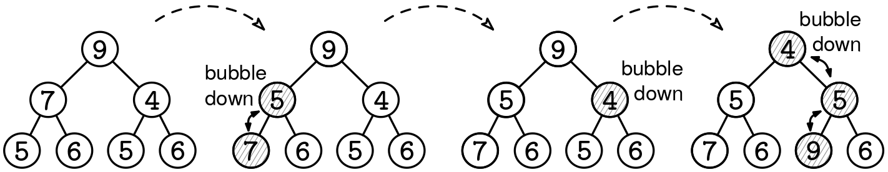
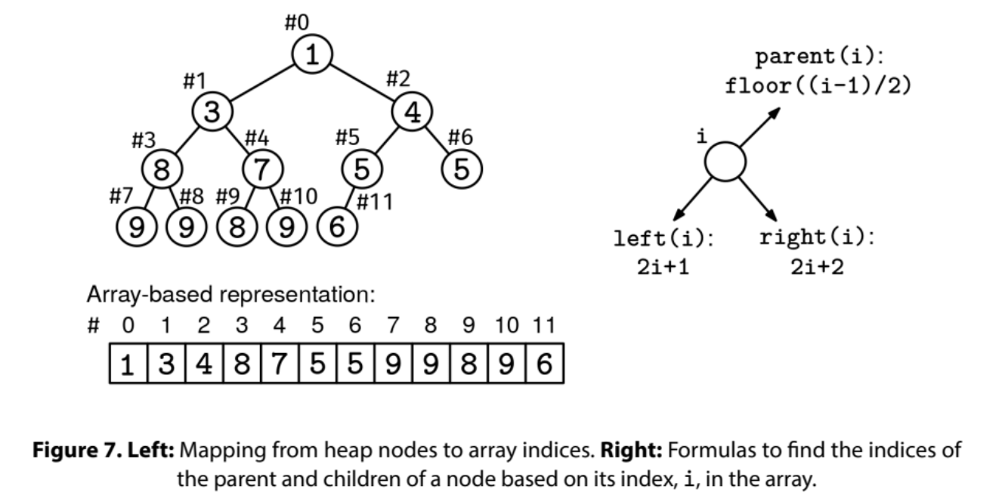

Assume your language does not support a heap or priority queue. Implement a Heap class from scratch with:

A constructor that receives an optional list of elements to be heapified, and
Operations size(), top(), push(elem), and pop().
Constraints:

The number of elements is at most 10^5
If your language is typed, you can either make the type of the elements be generic, or use integers.
You can either make it a min-heap or make it generic by receiving a comparator function, higher_priority, in the constructor.
This is the API:

initialize(higher_priority, heap):
  initializes a heap with the elements in `heap` (if any)
  sets higher_priority() as the method to compare element priorities
  higher_priority() should have this signature:
  higher_priority(x, y):
      returns true if x has higher priority than y, false otherwise

push(elem): adds an element to the priority queue.

pop(): removes and returns the highest-priority element.
If the heap is empty, return null.

top(): returns the highest-priority element without removing it.

size(): returns the number of elements in the priority queue

Example 1:
heap = Heap(higher_priority: <)  # Min-heap
heap.push(4)  # Elements ordered by priority: 4
heap.push(8)  # Elements ordered by priority: 4, 8
heap.push(2)  # Elements ordered by priority: 2, 4, 8
heap.push(6)  # Elements ordered by priority: 2, 4, 6, 8
heap.push(1)  # Elements ordered by priority: 1, 2, 4, 6, 8
heap.pop()    # Returns 1. Elements ordered by priority: 2, 4, 6, 8
heap.pop()    # Returns 2. Elements ordered by priority: 4, 6, 8
heap.top()    # Returns 6. Elements ordered by priority: 6, 8
heap.pop()    # Returns 6. Elements ordered by priority: 8
heap.top()    # Returns 8. Elements ordered by priority: 8
heap.pop()    # Returns 8.
heap.size()   # Returns 0.
heap.top()    # Returns null.
heap.pop()    # Returns null.

Example 2:
heap = Heap(higher_priority: >, heap = [1, 8, 2, 6, 4])  # Max-heap
heap.top()     # Returns 8. Elements ordered by priority: 8, 6, 4, 2, 1
heap.pop()     # Returns 8. Elements ordered by priority: 6, 4, 2, 1
heap.pop()     # Returns 6. Elements ordered by priority: 4, 2, 1
heap.pop()     # Returns 4. Elements ordered by priority: 2, 1

See Solution
Problem 37.1 - Implement a Heap: Solution
Python
The implementation of heaps is a funny thing. We say they are priority queues (with push() and pop(), etc.), we visualize them as binary trees, and, as we'll see, we typically implement them with dynamic arrays!

The Heap Property
Conceptually, heaps are binary trees with two special properties:

They are complete: a complete tree is complete if all the levels except the last one have the maximum number of nodes; the last level may not be full, but all the nodes are aligned to the left. In particular, complete trees are balanced, which means that they have a logarithmic height. (see figure below)
The heap property: every node has higher or equal priority than its children.
Complete binary tree

Below is an example of a min-heap and max-heap:

Min-heap and max-heap

For the same set of elements, there can be multiple complete trees that satisfy the min-heap or max-heap property. For example, if we have the elements 1, 2, and 3 in a min-heap, 1 must be at the root, but it doesn't matter which one between the left and right children is 2 and 3.

For concreteness, we'll discuss how to implement a min-heap of integers, i.e. a heap where we use < as a comparator. However, remember the comparator could be flipped to get a max-heap instead.

Top, Push, and Pop
The heap property makes accessing the smallest element in a min-heap trivial: it is always the root. The top() method returns the root without removing it from the heap.

When we insert an element into the heap with push(), we must maintain both properties. To keep the 'complete tree' property, we start by putting the new element in the next available leaf in the tree (we'll see how to find this node when we talk about the array-based implementation). However, this insertion can break the heap property because the new element may be smaller than its parent. To fix it, we "bubble up" the new element by repeatedly swapping it with its parent until the heap property is restored.

Bubbling up new value

When we pop() the smallest element in the heap, which is at the top, we need to figure out what to do with the empty root. To fix it while keeping the 'complete tree' property, we move the rightmost node in the last level to the root. After that, we "bubble it down" from the root by repeatedly swapping it with the smallest of its two children until the heap property is restored (the smallest child will be a valid parent of the other child once it becomes its parent).

Bubbling down after popping

Bubbling nodes up and down in the push() and pop() operations takes time proportional to the height of the tree in the worst case. That's why it is important for the tree to be balanced and have a logarithmic height.

Heapify
If we receive a list of elements in the constructor, we'll need to initialize a heap with those elements. This process is called heapifying, and it's usually handled by a helper function called heapify().

Rather than adding elements to a heap individually, the heapify() method uses 'bubble down' operations to quickly transform a complete tree without the heap property into a proper heap.

All heapify does is bubble down all the non-leaf nodes in the tree, one by one, from bottom to top (the order within a level doesn't matter). This works because:

Leaves satisfy the heap property (any single-node tree is trivially a heap).
As we go from bottom to top, when we process each node u, the left and right subtrees of u already have the heap property, and, if we bubble down u, the whole subtree rooted at u will also have it.
At the end, the whole tree will have the heap property.

In the worst case, each node will get bubbled down all the way to a leaf. Thus, each node needs to move down O(log n) levels, so one might reasonably expect this to take O(n log n) time. This is correct in the 'upper bound' sense, but it is not tight: the total time is actually O(n).

The intuition for why that is the case is that most nodes are in the deeper levels of the tree, where they don't need to travel a lot to get to the bottom -- leaves alone make up at least half of the nodes in a complete tree. Here's a full proof: nilmamano.com/blog/heapify-analysis.

Array Layout
Based on all the binary tree diagrams we've seen, it would be reasonable to assume that we implement heaps like we do binary trees, with a Node class and left and right children. It would also be wrong (or at least less ideal).

A heap isn't just any kind of binary tree; it's a complete binary tree. What this means is that nodes are filled in in a predictable manner--top to bottom, left to right, with no gaps. As a result, we can throw the node values into an array and know where a node's left or right child is with a bit of simple (okay, fine, tedious) math.

The left image shows the mapping from heap nodes to array indices. The right image shows the formulas to find the indices of the parent and children of a node based on its index, i, in the array.

Actual Implementation
We can start by implementing the formulas that allow us to traverse the "tree" as we usually would with left, right, and parent pointers:

parent(idx) = (idx - 1) // 2
left_child(idx) = 2 * idx + 1
right_child(idx) = 2 * idx + 2
The constructor receives an optional custom comparator to determine priority, which we set to < by default. If we receive an array of elements to heapify, we call heapify() immediately. Otherwise, we initialize our array empty.

The top() method is trivial since we just have to return the root, but don't forget to check that the heap contains at least one element.

For push(), we add the element at the bottom of the tree in the next available slot and then bubble it up. Adding to the next available tree slot in our array implementation just means appending it to the array.

Bubble up and bubble down can be implemented iteratively or recursively; we chose the recursive implementation because it is a bit more concise.

The bubble_up() logic involves a base case to stop at the root and a general case checking if the node has higher priority than its parent, in which case we need to continue bubbling up.

For pop(), we save the root element in a temporary variable and copy the last element into the root position. We shrink the array by 1, bubble down the new root, and return the saved element.

The bubble_down() logic is similar to bubble up, but with the extra complication that we can't just swap the node with either child. We need to swap it with the highest-priority child or we will break the heap property.

Finally, we have heapify(), where we need to bubble down all internal nodes. In a complete tree, at least half the nodes are leaves, so we can start bubbling from the middle of the array.

Here's the full implementation:

class Heap:
  # A binary heap implementation that can act as either min-heap or max-heap.
  # By default, it creates a min-heap (the smallest element has highest priority).
  # For max-heap behavior, provide a custom 'higher_priority' function.
  # higher_priority: Function that returns True if x has higher priority than y.
  # heap:            Optional list of initial elements to heapify.
  def __init__(self, higher_priority=lambda x, y: x < y, heap=None):
    self.higher_priority = higher_priority
    self.heap = []
    if heap:
      self.heap = heap.copy()
      self.heapify()

  # Returns the number of elements in the heap
  def size(self):
    return len(self.heap)

  # Returns the highest priority element without removing it
  def top(self):
    if not self.heap:
      return None
    return self.heap[0]

  # Adds an element to the heap
  def push(self, elem):
    self.heap.append(elem)
    self._bubble_up(len(self.heap) - 1)

  # Removes and returns the highest priority element
  def pop(self):
    if not self.heap:
      return None

    top = self.heap[0]
    if len(self.heap) == 1:
      self.heap = []
      return top

    # Move last element to root and bubble down
    self.heap[0] = self.heap[-1]
    self.heap.pop()
    self._bubble_down(0)

    return top

  # Converts a list into a valid heap in O(n) time
  def heapify(self):
    for idx in range(len(self.heap) // 2, -1, -1):
      self._bubble_down(idx)

  # Get parent index
  def _parent(self, idx):
    if idx == 0:
      return -1  # The root has no parent
    return (idx - 1) // 2

  # Get left child index
  def _left_child(self, idx):
    return 2 * idx + 1

  # Get right child index
  def _right_child(self, idx):
    return 2 * idx + 2

  # Move element up until heap property is restored
  def _bubble_up(self, idx):
    if idx == 0:
      return

    parent_idx = self._parent(idx)
    if parent_idx >= 0 and self.higher_priority(self.heap[idx], self.heap[parent_idx]):
      self.heap[idx], self.heap[parent_idx] = self.heap[parent_idx], self.heap[idx]
      self._bubble_up(parent_idx)

  # Move element down until heap property is restored
  def _bubble_down(self, idx):
    left_idx = self._left_child(idx)
    is_leaf = left_idx >= len(self.heap)
    if is_leaf:
      return

    # Find child with higher priority
    child_idx = left_idx
    right_idx = self._right_child(idx)
    if (right_idx < len(self.heap) and
            self.higher_priority(self.heap[right_idx], self.heap[left_idx])):
      child_idx = right_idx

    # Swap with child if it has higher priority
    if self.higher_priority(self.heap[child_idx], self.heap[idx]):
      self.heap[idx], self.heap[child_idx] = self.heap[child_idx], self.heap[idx]
      self._bubble_down(child_idx)
Time & Space Analysis
n: the number of elements in the heap
Push and pop:

Time: O(n log n)
Top and size:

Time: O(1)
Heapify:

Time: O(n)
Data structure size:

Space: O(n) - we store all elements in an array, requiring linear space.
Tests
Here are some test cases to verify the solution:

def run_tests():
  """Test heap implementation"""
  # Test min heap
  min_heap = Heap()
  values = [4, 8, 2, 6, 1, 7, 3, 5]
  for val in values:
    min_heap.push(val)

  # Should pop in ascending order
  sorted_values = []
  while min_heap.size() > 0:
    sorted_values.append(min_heap.pop())
  assert sorted_values == [1, 2, 3, 4, 5, 6, 7, 8]

  # Test max heap
  max_heap = Heap(higher_priority=lambda x, y: x > y)
  for val in values:
    max_heap.push(val)
  # Should pop in descending order
  sorted_values = []
  while max_heap.size() > 0:
    sorted_values.append(max_heap.pop())
  got = sorted_values
  want = [8, 7, 6, 5, 4, 3, 2, 1]
  assert got == want, f"\nmax_heap popped values: got: {got}, want: {want}\n"

  # Test heapify
  heap = Heap(heap=[4, 8, 2, 6, 1, 7, 3, 5])
  assert heap.pop() == 1
  assert heap.pop() == 2
  assert heap.pop() == 3

run_tests()

class Heap {
  // A binary heap implementation that can act as either min-heap or max-heap.
  // By default, it creates a min-heap (the smallest element has highest priority).
  // For max-heap behavior, provide a custom 'higherPriority' function.
  // higherPriority: Function that returns True if x has higher priority than y.
  // heap:           Optional list of initial elements to heapify.
  constructor(higherPriority = (x, y) => x < y, heap = null) {
    this.higherPriority = higherPriority;
    this.heap = [];
    if (heap) {
      this.heap = [...heap];
      this.heapify();
    }
  }

  // Returns the number of elements in the heap.
  size() {
    return this.heap.length;
  }

  // Returns the highest priority element without removing it.
  top() {
    if (this.heap.length === 0) {
      return null;
    }
    return this.heap[0];
  }

  // Adds an element to the heap.
  push(elem) {
    this.heap.push(elem);
    this._bubbleUp(this.heap.length - 1);
  }

  // Removes and returns the highest priority element.
  pop() {
    if (this.heap.length === 0) {
      return null;
    }

    const top = this.heap[0];
    if (this.heap.length === 1) {
      this.heap = [];
      return top;
    }

    // Move last element to root and bubble down
    this.heap[0] = this.heap[this.heap.length - 1];
    this.heap.pop();
    this._bubbleDown(0);

    return top;
  }

  // Converts an array into a valid heap in O(n) time.
  heapify() {
    for (let idx = Math.floor(this.heap.length / 2); idx >= 0; idx--) {
      this._bubbleDown(idx);
    }
  }

  // Get parent index.
  _parent(idx) {
    if (idx === 0) {
      return -1; // The root has no parent.
    }
    return Math.floor((idx - 1) / 2);
  }

  // Get left child index.
  _leftChild(idx) {
    return 2 * idx + 1;
  }

  // Get right child index.
  _rightChild(idx) {
    return 2 * idx + 2;
  }

  // Move element up until heap property is restored.
  _bubbleUp(idx) {
    if (idx === 0) {
      return;
    }

    const parentIdx = this._parent(idx);
    if (
      parentIdx >= 0 &&
      this.higherPriority(this.heap[idx], this.heap[parentIdx])
    ) {
      [this.heap[idx], this.heap[parentIdx]] = [
        this.heap[parentIdx],
        this.heap[idx],
      ];
      this._bubbleUp(parentIdx);
    }
  }

  // Move element down until heap property is restored.
  _bubbleDown(idx) {
    const leftIdx = this._leftChild(idx);
    const isLeaf = leftIdx >= this.heap.length;
    if (isLeaf) {
      return;
    }

    // Find child with higher priority
    let childIdx = leftIdx;
    const rightIdx = this._rightChild(idx);
    if (
      rightIdx < this.heap.length &&
      this.higherPriority(this.heap[rightIdx], this.heap[leftIdx])
    ) {
      childIdx = rightIdx;
    }

    // Swap with child if it has higher priority
    if (this.higherPriority(this.heap[childIdx], this.heap[idx])) {
      [this.heap[idx], this.heap[childIdx]] = [
        this.heap[childIdx],
        this.heap[idx],
      ];
      this._bubbleDown(childIdx);
    }
  }
}
Time & Space Analysis
n: the number of elements in the heap
Push and pop:

Time: O(n log n)
Top and size:

Time: O(1)
Heapify:

Time: O(n)
Data structure size:

Space: O(n) - we store all elements in an array, requiring linear space.
Tests
Here are some test cases to verify the solution:

function runTests() {
  // Test min heap
  const minHeap = new Heap();
  const values = [4, 8, 2, 6, 1, 7, 3, 5];
  for (const val of values) {
    minHeap.push(val);
  }

  // Should pop in ascending order
  const sortedValues1 = [];
  while (minHeap.size() > 0) {
    sortedValues1.push(minHeap.pop());
  }
  if (
    JSON.stringify(sortedValues1) !== JSON.stringify([1, 2, 3, 4, 5, 6, 7, 8])
  ) {
    throw new Error(
      `\nmin_heap popped values: got: ${sortedValues1}, want: [1, 2, 3, 4, 5, 6, 7, 8]\n`,
    );
  }

  // Test max heap
  const maxHeap = new Heap((x, y) => x > y);
  for (const val of values) {
    maxHeap.push(val);
  }

  // Should pop in descending order
  const sortedValues2 = [];
  while (maxHeap.size() > 0) {
    sortedValues2.push(maxHeap.pop());
  }
  if (
    JSON.stringify(sortedValues2) !== JSON.stringify([8, 7, 6, 5, 4, 3, 2, 1])
  ) {
    throw new Error(
      `\nmax_heap popped values: got: ${sortedValues2}, want: [8, 7, 6, 5, 4, 3, 2, 1]\n`,
    );
  }

  // Test heapify
  const heap = new Heap((x, y) => x < y, [4, 8, 2, 6, 1, 7, 3, 5]);
  if (heap.pop() !== 1) {
    throw new Error(`\nheap.pop(): want: 1\n`);
  }
  if (heap.pop() !== 2) {
    throw new Error(`\nheap.pop(): want: 2\n`);
  }
  if (heap.pop() !== 3) {
    throw new Error(`\nheap.pop(): want: 3\n`);
  }
}

runTests();

public class Heap<T extends Comparable<T>> {
  /**
   * A binary heap implementation that can act as either min-heap or max-heap.
   */

  private List<T> heap;
  private BiFunction<T, T, Boolean> higherPriority;

  /**
   * By default, it creates a min-heap (the smallest element has highest
   * priority). For max-heap behavior, provide a custom 'higherPriority'
   * function.
   *
   * higherPriority: Function that returns true if x has higher priority than y.
   * heap: Optional list of initial elements to heapify.
   */
  public Heap(BiFunction<T, T, Boolean> higherPriority, List<T> heap) {
    if (higherPriority == null) {
      // Default to min-heap
      this.higherPriority = (x, y) -> x.compareTo(y) < 0;
    } else {
      this.higherPriority = higherPriority;
    }
    if (heap != null && heap.size() > 0) {
      this.heap = new ArrayList<>(heap);
      heapify();
    } else {
      this.heap = new ArrayList<>();
    }
  }

  public Heap() {
    this(null, null);
  }

  public Heap(BiFunction<T, T, Boolean> higherPriority) {
    this(higherPriority, null);
  }

  public Heap(List<T> heap) {
    this(null, heap);
  }

  /** Returns the number of elements in the heap */
  public int size() {
    return heap.size();
  }

  /** Returns the highest priority element without removing it */
  public T top() {
    if (heap.isEmpty()) {
      return null;
    }
    return heap.get(0);
  }

  /** Adds an element to the heap */
  public void push(T elem) {
    heap.add(elem);
    bubbleUp(heap.size() - 1);
  }

  /** Removes and returns the highest priority element */
  public T pop() {
    if (heap.isEmpty()) {
      return null;
    }

    T top = heap.get(0);
    if (heap.size() == 1) {
      heap.clear();
      return top;
    }

    heap.set(0, heap.get(heap.size() - 1));
    heap.remove(heap.size() - 1);
    bubbleDown(0);

    return top;
  }

  /** Converts a list into a valid heap in O(n) time */
  public void heapify() {
    for (int idx = heap.size() / 2; idx >= 0; idx--) {
      bubbleDown(idx);
    }
  }

  /** Get parent index */
  private int parent(int idx) {
    if (idx == 0) {
      return -1; // The root has no parent
    }
    return (idx - 1) / 2;
  }

  /** Get left child index */
  private int leftChild(int idx) {
    return 2 * idx + 1;
  }

  /** Get right child index */
  private int rightChild(int idx) {
    return 2 * idx + 2;
  }

  /** Move element up until heap property is restored */
  private void bubbleUp(int idx) {
    if (idx == 0) {
      return;
    }

    int parentIdx = parent(idx);
    if (parentIdx >= 0
        && higherPriority.apply(heap.get(idx), heap.get(parentIdx))) {
      T temp = heap.get(idx);
      heap.set(idx, heap.get(parentIdx));
      heap.set(parentIdx, temp);
      bubbleUp(parentIdx);
    }
  }

  /** Move element down until heap property is restored */
  private void bubbleDown(int idx) {
    int leftIdx = leftChild(idx);
    boolean isLeaf = leftIdx >= heap.size();
    if (isLeaf) {
      return;
    }

    // Find child with higher priority
    int childIdx = leftIdx;
    int rightIdx = rightChild(idx);
    if (rightIdx < heap.size() &&
        higherPriority.apply(heap.get(rightIdx), heap.get(leftIdx))) {
      childIdx = rightIdx;
    }

    // Swap with child if it has higher priority
    if (higherPriority.apply(heap.get(childIdx), heap.get(idx))) {
      T temp = heap.get(idx);
      heap.set(idx, heap.get(childIdx));
      heap.set(childIdx, temp);
      bubbleDown(childIdx);
    }
  }
}
Time & Space Analysis
n: the number of elements in the heap
Push and pop:

Time: O(n log n)
Top and size:

Time: O(1)
Heapify:

Time: O(n)
Data structure size:

Space: O(n) - we store all elements in an array, requiring linear space.
Tests
Here are some test cases to verify the solution:

class RunTests {
  public void runTests() {
    // Test min heap
    Heap<Integer> minHeap = new Heap<>();
    Integer[] values = { 4, 8, 2, 6, 1, 7, 3, 5 };
    for (Integer val : values) {
      minHeap.push(val);
    }

    // Should pop in ascending order
    Integer[] sortedValues = new Integer[values.length];
    int i = 0;
    while (minHeap.size() > 0) {
      sortedValues[i++] = minHeap.pop();
    }
    Integer[] want = { 1, 2, 3, 4, 5, 6, 7, 8 };
    if (!Arrays.equals(sortedValues, want)) {
      throw new RuntimeException(String.format(
          "\nmin heap popped values: got: %s, want: %s\n",
          Arrays.toString(sortedValues), Arrays.toString(want)));
    }

    // Test max heap
    Heap<Integer> maxHeap = new Heap<>((x, y) -> x > y);
    for (Integer val : values) {
      maxHeap.push(val);
    }

    // Should pop in descending order
    sortedValues = new Integer[values.length];
    i = 0;
    while (maxHeap.size() > 0) {
      sortedValues[i++] = maxHeap.pop();
    }
    Integer[] want2 = { 8, 7, 6, 5, 4, 3, 2, 1 };
    if (!Arrays.equals(sortedValues, want2)) {
      throw new RuntimeException(String.format(
          "\nmax heap popped values: got: %s, want: %s\n",
          Arrays.toString(sortedValues), Arrays.toString(want2)));
    }

    // Test heapify
    Heap<Integer> heap = new Heap<>(Arrays.asList(4, 8, 2, 6, 1, 7, 3, 5));
    if (heap.pop() != 1) {
      throw new RuntimeException("heap.pop(): expected 1");
    }
    if (heap.pop() != 2) {
      throw new RuntimeException("heap.pop(): expected 2");
    }
    if (heap.pop() != 3) {
      throw new RuntimeException("heap.pop(): expected 3");
    }
  }
}

public class Solution {
  public static void main(String[] args) {
    new RunTests().runTests();
  }
}
