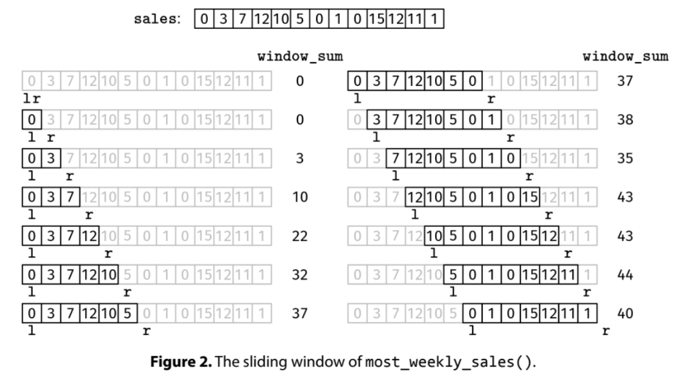

Given an array, sales, find the most sales in any 7-day period.

Example 1: sales = [0, 3, 7, 12, 10, 5, 0, 1, 0, 15, 12, 11, 1]
Output: 44
The 7-day period with the most sales is [5, 0, 1, 0, 15, 12, 11].

Example 2: sales = [0, 3, 7, 12]
Output: 0
There is no 7-day period.

Example 3: sales = [1, 2, 3, 4, 5, 6, 7]
Output: 28
The only 7-day period is the entire array.
Constraints:

The length of sales is at most 10^6
Each element in sales is a non-negative integer less than 10^3
See Solution
Recipe 1 - Fixed-length Window

def fixed_length_window(arr, k):
  initialize:
  - l and r to 0 (empty window)
  - data structures to track window info
  - cur_best to 0
  while we can grow the window (r < len(arr))
    grow the window (update data structures and increase r)
    if the window has the correct length (r - l == k)
      update cur_best if needed
      shrink the window (update data structures and increase l)
  return cur_best

  See Solution
Problem 38.1 - Most Weekly Sales: Solution
Java
This is a fixed-length window problem since we are looking for windows of length exactly 7, so we can use the fixed-length window recipe:

fixed_length_window(arr, k):
  initialize:
    - l and r to 0 (empty window)
    - data structures to track window info
    - cur_best to 0
  while we can grow the window (r < len(arr))
    grow the window (update data structures and increase r)
    if the window has the correct length (r - l == k)
      update cur_best if needed
      shrink the window (update data structures and increase l)
  return cur_best
With this recipe:

We grow the window until it has length 7
Then, we grow and shrink at the same time so that the length stays at 7
We maintain these variables:

l and r: the window boundaries, which start at zero. Our convention is that l is included in the window and r is not, making an empty window.
window_sum: the sum of elements in the window, which corresponds to the objective we have to maximize. The key is to update it whenever the window grows or shrinks and not compute it from scratch at each iteration
cur_max: where we keep the current maximum we saw so far
Each iteration starts by growing the window, which involves two things:

updating window_sum to reflect that sales[r] is now in the window
increasing r
The order of these operations matters!

After growing the window, we check if it is valid, meaning the window length (r - l) is 7. If it is valid, we check if it is the best one seen so far and update cur_max accordingly.

If the window has a length of 7, we end the iteration by shrinking it so that when we grow it in the next iteration, it will have the right size again. Like growing, shrinking consists of two actions: updating window_sum and increasing l.

The algorithm ends when the window can no longer grow (r == len(sales)).

Most Weekly Sales Solution

Here is the implementation:

class MostWeeklySales {
  public int solve(int[] sales) {
    int l = 0, r = 0;
    int windowSum = 0;
    int curMax = 0;
    while (r < sales.length) {
      windowSum += sales[r];
      r++;
      if (r - l == 7) {
        curMax = Math.max(curMax, windowSum);
        windowSum -= sales[l];
        l++;
      }
    }
    return curMax;
  }
}
Time & Space Analysis
n: the length of the sales array

Time: O(n) - we make a single pass through the sales array.

Extra space: O(1)

Tests
Here are some test cases to verify the solution:

def most_weekly_sales(sales):
  l, r = 0, 0
  window_sum = 0
  cur_max = 0
  while r < len(sales):
    window_sum += sales[r]
    r += 1
    if r - l == 7:
      cur_max = max(cur_max, window_sum)
      window_sum -= sales[l]
      l += 1
  return cur_max
  def run_tests():
  tests = [
      # Example 1 from the book
      ([0, 3, 7, 12, 10, 5, 0, 1, 0, 15, 12, 11, 1], 44),
      # Example 2 from the book
      ([0, 3, 7, 12], 0),
      # Edge case - empty array
      ([], 0),
      # Edge case - exactly 7 days
      ([1, 2, 3, 4, 5, 6, 7], 28),
      # Edge case - all zeros
      ([0, 0, 0, 0, 0, 0, 0, 0], 0),
  ]
  for sales, want in tests:
    got = most_weekly_sales(sales)
    assert got == want, f"\nmost_weekly_sales({sales}): got: {
        got}, want: {want}\n"

run_tests()

function mostWeeklySales(sales) {
  let l = 0,
    r = 0;
  let windowSum = 0;
  let curMax = 0;
  while (r < sales.length) {
    windowSum += sales[r];
    r++;
    if (r - l === 7) {
      curMax = Math.max(curMax, windowSum);
      windowSum -= sales[l];
      l++;
    }
  }
  return curMax;
}
Time & Space Analysis
n: the length of the sales array

Time: O(n) - we make a single pass through the sales array.

Extra space: O(1)

Tests
Here are some test cases to verify the solution:

function runTests() {
  const tests = [
    // Example 1 from the book
    [[0, 3, 7, 12, 10, 5, 0, 1, 0, 15, 12, 11, 1], 44],
    // Example 2 from the book
    [[0, 3, 7, 12], 0],
    // Edge case - empty array
    [[], 0],
    // Edge case - exactly 7 days
    [[1, 2, 3, 4, 5, 6, 7], 28],
    // Edge case - all zeros
    [[0, 0, 0, 0, 0, 0, 0, 0], 0],
  ];
  for (const [sales, want] of tests) {
    const got = mostWeeklySales(sales);
    if (got !== want) {
      throw new Error(
        `\nmostWeeklySales(${JSON.stringify(
          sales,
        )}): got: ${got}, want: ${want}\n`,
      );
    }
  }
}

runTests();

class MostWeeklySales {
  public int solve(int[] sales) {
    int l = 0, r = 0;
    int windowSum = 0;
    int curMax = 0;
    while (r < sales.length) {
      windowSum += sales[r];
      r++;
      if (r - l == 7) {
        curMax = Math.max(curMax, windowSum);
        windowSum -= sales[l];
        l++;
      }
    }
    return curMax;
  }
}

Time & Space Analysis
n: the length of the sales array

Time: O(n) - we make a single pass through the sales array.

Extra space: O(1)

Tests
Here are some test cases to verify the solution:

class RunTests {
  public void runTests() {
    Object[][] tests = {
        // Example 1 from the book
        { new int[] { 0, 3, 7, 12, 10, 5, 0, 1, 0, 15, 12, 11, 1 }, 44 },
        // Example 2 from the book
        { new int[] { 0, 3, 7, 12 }, 0 },
        // Edge case - empty array
        { new int[] {}, 0 },
        // Edge case - exactly 7 days
        { new int[] { 1, 2, 3, 4, 5, 6, 7 }, 28 },
        // Edge case - all zeros
        { new int[] { 0, 0, 0, 0, 0, 0, 0, 0 }, 0 },
    };

    MostWeeklySales solution = new MostWeeklySales();
    for (Object[] test : tests) {
      int[] sales = (int[]) test[0];
      int want = (int) test[1];
      int got = solution.solve(sales);
      if (got != want) {
        throw new RuntimeException(String.format(
            "\nsolve(%s): got: %d, want: %d\n",
            Arrays.toString(sales), got, want));
      }
    }
  }
}

public class Solution {
  public static void main(String[] args) {
    new RunTests().runTests();
  }
}

