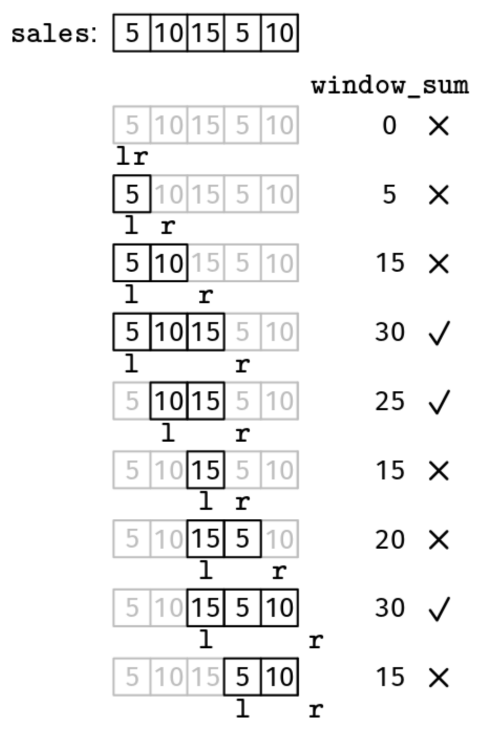

Recipe 4 - Minimum Sliding Window

def minimum_window(arr):
  initialize:
  - l and r to 0 (empty window)
  - data structures to track window info
  - cur_best to infinity
  while true
    if the window must grow to become valid
      if the window cannot grow (r == len(arr))
        break
      grow the window (update data structures and increase r)
    else
      update cur_best if needed
      shrink the window (update data structures and increase l)
  return cur_best

  Given an array, sales, where sales[i] is the number of sales on day i, find the shortest period of time with over 20 sales, or -1 if there isn't any.

Example 1: sales = [5, 10, 15, 5, 10]
Output: 2. The subarray [10, 15] has over 20 sales.

Example 2: sales = [5, 10, 4, 5, 10]
Output: 4. [5, 10, 4, 5] and [10, 4, 5, 10] have over 20 sales.

Example 3: sales = [5, 5, 5, 5]
Output: -1. There is no subarray with more than 20 sales.
Constraints:

0 <= len(sales) <= 10^5
0 <= sales[i] <= 10^3
See Solution
Problem 38.14 - Shortest Period With Over 20 Sales: Solution
JavaScript
We'll approach this problem with a sliding window.

This is a minimum window problem since we are trying to find a window as short as possible.

For minimum window problems, the empty window is invalid (in our problem, because it has fewer than 20 sales). We need to grow it until it becomes valid.

We can follow this strategy for when to grow and shrink the window:

If the window has 20 sales or fewer: grow it.
Otherwise, shrink it to look for a shorter one with over 20 sales.
We can use the minimum window recipe:

minimum_window(arr):
  initialize:
    - l and r to 0 (empty window)
    - data structures to track window info
    - cur_best to infinity
  while true
    if the window must grow to become valid
      if the window cannot grow (r == len(arr))
        break
      grow the window (update data structures and increase r)
    else
      update cur_best if needed
      shrink the window (update data structures and increase l)
  return cur_best
Unlike the other sliding window recipes, we initialize the result (cur_min) to infinity because we update it by taking the minimum. At the end, we need to check if it is still infinity, which means that we didn't find any valid windows. It is a common mistake to forget this check!

In the main loop, we start each iteration by declaring a variable, must_grow, which indicates if the current window is invalid.

If we must grow, there is one edge case to consider: if r == len(sales), we ran out of elements to grow, so we break out of the loop. We have this edge case because we don't stop as soon as r gets to the end; it might still be possible to make the window smaller and get a better answer.

If must_grow is false, then we have a valid window, so we update the current minimum first and then shrink the window to see if we can make it even smaller.

Shortest Period With Over 20 Sales Solution

Here is the implementation:

function shortestOver20Sales(sales) {
  let l = 0,
    r = 0;
  let windowSum = 0;
  let curMin = Infinity;
  while (true) {
    const mustGrow = windowSum <= 20;
    if (mustGrow) {
      if (r === sales.length) {
        break;
      }
      windowSum += sales[r];
      r++;
    } else {
      curMin = Math.min(curMin, r - l);
      windowSum -= sales[l];
      l++;
    }
  }
  return curMin !== Infinity ? curMin : -1;
}
Time & Space Analysis
n: the length of the sales array

Time: O(n) - we increment a pointer at each iteration, so there are at most 2n iterations

Extra space: O(1)

Tests
Here are some test cases to verify the solution:

function runTests() {
  const tests = [
    // Example 1 from the book
    [[5, 10, 15, 5, 10], 2],
    // Example 2 from the book
    [[5, 10, 4, 5, 10], 4],
    // Example 3 from the book
    [[5, 5, 5, 5], -1],
    // Edge case - empty array
    [[], -1],
    // Edge case - single element over 20
    [[21], 1],
    // Edge case - exactly 20 sales not enough
    [[10, 10], -1],
  ];
  for (const [sales, want] of tests) {
    const got = shortestOver20Sales(sales);
    if (got !== want) {
      throw new Error(
        `\nshortestOver20Sales(${JSON.stringify(sales)}): got: ${got}, want ${want}\n`,
      );
    }
  }
}

runTests();

def shortest_over_20_sales(sales):
  l, r = 0, 0
  window_sum = 0
  cur_min = math.inf
  while True:
    must_grow = window_sum <= 20
    if must_grow:
      if r == len(sales):
        break
      window_sum += sales[r]
      r += 1
    else:
      cur_min = min(cur_min, r - l)
      window_sum -= sales[l]
      l += 1
  return cur_min if cur_min != math.inf else -1
Time & Space Analysis
n: the length of the sales array

Time: O(n) - we increment a pointer at each iteration, so there are at most 2n iterations

Extra space: O(1)

Tests
Here are some test cases to verify the solution:

def run_tests():
  tests = [
      # Example 1 from the book
      ([5, 10, 15, 5, 10], 2),
      # Example 2 from the book
      ([5, 10, 4, 5, 10], 4),
      # Example 3 from the book
      ([5, 5, 5, 5], -1),
      # Edge case - empty array
      ([], -1),
      # Edge case - single element over 20
      ([21], 1),
      # Edge case - exactly 20 sales not enough
      ([10, 10], -1),
  ]
  for sales, want in tests:
    got = shortest_over_20_sales(sales)
    assert got == want, f"\nshortest_over_20_sales({sales}): got: {
        got}, want {want}\n"

run_tests()

class ShortestOver20Sales {
  public int solve(int[] sales) {
    int l = 0, r = 0;
    int windowSum = 0;
    int curMin = Integer.MAX_VALUE;
    while (true) {
      boolean mustGrow = windowSum <= 20;
      if (mustGrow) {
        if (r == sales.length) {
          break;
        }
        windowSum += sales[r];
        r++;
      } else {
        curMin = Math.min(curMin, r - l);
        windowSum -= sales[l];
        l++;
      }
    }
    return curMin != Integer.MAX_VALUE ? curMin : -1;
  }
}
Time & Space Analysis
n: the length of the sales array

Time: O(n) - we increment a pointer at each iteration, so there are at most 2n iterations

Extra space: O(1)

Tests
Here are some test cases to verify the solution:

class RunTests {
  public void runTests() {
    Object[][] tests = {
        // Example 1 from the book
        { new int[] { 5, 10, 15, 5, 10 }, 2 },
        // Example 2 from the book
        { new int[] { 5, 10, 4, 5, 10 }, 4 },
        // Example 3 from the book
        { new int[] { 5, 5, 5, 5 }, -1 },
        // Edge case - empty array
        { new int[] {}, -1 },
        // Edge case - single element over 20
        { new int[] { 21 }, 1 },
        // Edge case - exactly 20 sales not enough
        { new int[] { 10, 10 }, -1 },
    };

    ShortestOver20Sales solution = new ShortestOver20Sales();
    for (Object[] test : tests) {
      int[] sales = (int[]) test[0];
      int want = (int) test[1];
      int got = solution.solve(sales);
      if (got != want) {
        throw new RuntimeException(String.format(
            "\nsolve(%s): got: %d, want: %d\n",
            Arrays.toString(sales), got, want));
      }
    }
  }
}

public class Solution {
  public static void main(String[] args) {
    new RunTests().runTests();
  }
}