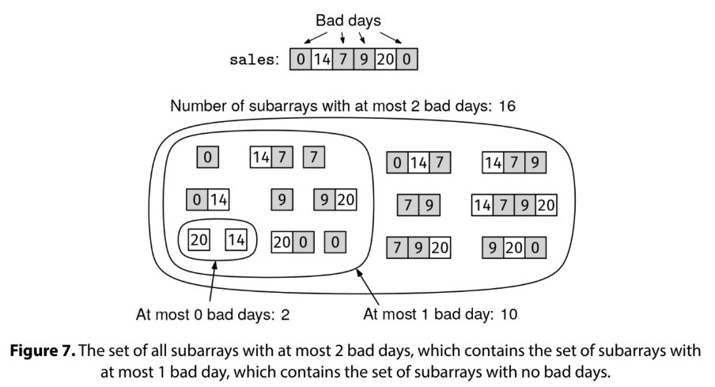
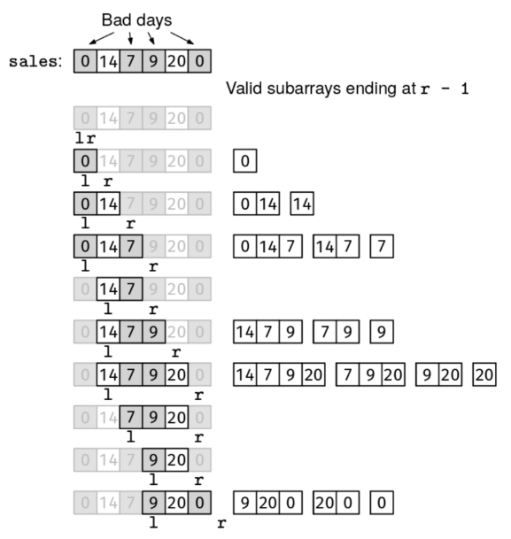

Given an array, sales, where sales[i] is the number of sales on day i, count the number of subarrays with at least k bad days.

A bad day is a day with fewer than 10 sales.

Example 1: sales = [0, 20, 5], k = 1
Output: 5
  - the subarrays [0], [0, 20], [20, 5], and [5] have 1 bad day each
  - [0, 20, 5] has 2 bad days

Example 2: sales = [10, 20, 30], k = 1
Output: 0
No subarrays have any bad days.

Example 3: sales = [0, 5, 8], k = 2
Output: 3
The subarrays [0, 5], [5, 8], and [0, 5, 8] have at least 2 bad days.
Constraints:

0 <= sales.length <= 10^5
0 <= sales[i] < 10^3
0 <= k <= 10^5
See Solution
Problem 38.20 - Count Subarrays With at Least k Bad Days: Solution
Python
There is a trick to reduce "At-Least-K" counting problems to "At-Most-K" counting problems.

We need to know one thing: an array of length n has n * (n + 1) / 2 subarrays.

If k == 0, "at least 0" just means every subarray, so we can return n * (n + 1) / 2.
For k > 0, the number of subarrays with at least k bad days is equal to the total number of subarrays (n * (n + 1) / 2) minus the number of subarrays with at most k - 1 bad days.
For example, this figure shows an example sales array and all 16 subarrays with at most 2 bad days:

Count Subarrays With Exactly K Bad Days Solution

If we want to count subarrays with at least 3 bad days, we can:

Count the total number of subarrays: 6 * (6 + 1) / 2 = 21
Count all subarrays with at most 2 bad days (meaning 0, 1, or 2 bad days): 16
Subtract the second count from the first count: 21 - 16 = 5
Here is the implementation:

def count_at_least_k_bad_days(sales, k):
  n = len(sales)
  total_subarrays = n * (n + 1) // 2
  if k == 0:
    return total_subarrays
  return total_subarrays - count_at_most_k_bad_days(sales, k - 1)
There are other algorithms for "at-least-k" counting problems, but with this trick, we can reuse our knowledge of the "at-most-k" algorithm.

At-Most-K Counting
Now, we still need to figure out how to count subarrays with at most k bad days.

We'll approach this problem with a sliding window.

In particular, we can use a trick to reuse the maximum window recipe to solve "at-most-k" counting problems.

Recall the maximum sliding window recipe, which is for problems about finding the longest subarray with some constraint:

maximum_window(arr):
  initialize:
    - l and r to 0 (empty window)
    - data structures to track window info
    - cur_best to 0
  while we can grow the window (r < len(arr))
    if the window would still be valid with one more element
      grow the window (update data structures and increase r)
      update cur_best if needed
    else if the window is empty  # skip this case if empty windows are always valid
      advance both l and r
    else
      shrink the window (update data structures and increase l)
  return cur_best
Also recall the maximum window property: growing an invalid window never makes it valid. The maximum window recipe only works for problems that have the maximum window property.

Per the convention used in the book, our sliding window always spans from l to r-1.

We can leverage an interesting property about the maximum window recipe: if a problem has the maximum window property, whenever we grow the window by adding an element (sales[r-1]) the new window is the longest valid window that ends at sales[r-1]. This means that the valid subarrays ending at sales[r-1] are those starting at sales[l], sales[l + 1], and so on, up to sales[r-1] itself. Thus, there are r - l valid subarrays ending at sales[r-1].

We can follow the maximum window recipe -- even though there is nothing to maximize -- and whenever we grow the window by adding an element sales[r-1], we add r - l to a running count of valid subarrays.

This figure shows a maximum sliding window for counting subarrays with at most 2 bad days. Every time we grow the window, we show all the valid subarrays that we add to the running count (16 in total).

Here is the implementation:

def count_at_most_k_bad_days(sales, k):
  l, r = 0, 0
  window_bad_days = 0
  count = 0
  while r < len(sales):
    can_grow = sales[r] >= 10 or window_bad_days < k
    if can_grow:
      if sales[r] < 10:
        window_bad_days += 1
      r += 1
      count += r - l
    else:
      if sales[l] < 10:
        window_bad_days -= 1
      l += 1
  return count
Time & Space Analysis
n: the length of the sales array

Time: O(n) - for the sliding window step, we increment a pointer at each iteration, so there are at most 2n iterations

Extra space: O(1)

Tests
Here are some test cases to verify the solution:

def run_tests():
  tests = [
      # Example from the book
      ([0, 20, 5], 1, 5),
      # Edge case - empty array
      ([], 1, 0),
      # Edge case - k = 0
      ([0, 20, 5], 0, 6),
      # all good days
      ([10, 20, 30], 1, 0),
      # all bad days
      ([0, 5, 8], 2, 3),
  ]
  for sales, k, want in tests:
    got = count_at_least_k_bad_days(sales, k)
    assert got == want, f"\ncount_at_least_k_bad_days({sales}, {k}): got: {
        got}, want: {want}\n"

run_tests()

function countAtLeastKBadDays(sales, k) {
  const n = sales.length;
  const totalSubarrays = (n * (n + 1)) / 2;
  if (k === 0) {
    return totalSubarrays;
  }
  return totalSubarrays - countAtMostKBadDays(sales, k - 1);
}
There are other algorithms for "at-least-k" counting problems, but with this trick, we can reuse our knowledge of the "at-most-k" algorithm.

At-Most-K Counting
Now, we still need to figure out how to count subarrays with at most k bad days.

We'll approach this problem with a sliding window.

In particular, we can use a trick to reuse the maximum window recipe to solve "at-most-k" counting problems.

Recall the maximum sliding window recipe, which is for problems about finding the longest subarray with some constraint:

maximum_window(arr):
  initialize:
    - l and r to 0 (empty window)
    - data structures to track window info
    - cur_best to 0
  while we can grow the window (r < len(arr))
    if the window would still be valid with one more element
      grow the window (update data structures and increase r)
      update cur_best if needed
    else if the window is empty  # skip this case if empty windows are always valid
      advance both l and r
    else
      shrink the window (update data structures and increase l)
  return cur_best
Also recall the maximum window property: growing an invalid window never makes it valid. The maximum window recipe only works for problems that have the maximum window property.

Per the convention used in the book, our sliding window always spans from l to r-1.

We can leverage an interesting property about the maximum window recipe: if a problem has the maximum window property, whenever we grow the window by adding an element (sales[r-1]) the new window is the longest valid window that ends at sales[r-1]. This means that the valid subarrays ending at sales[r-1] are those starting at sales[l], sales[l + 1], and so on, up to sales[r-1] itself. Thus, there are r - l valid subarrays ending at sales[r-1].

We can follow the maximum window recipe -- even though there is nothing to maximize -- and whenever we grow the window by adding an element sales[r-1], we add r - l to a running count of valid subarrays.

This figure shows a maximum sliding window for counting subarrays with at most 2 bad days. Every time we grow the window, we show all the valid subarrays that we add to the running count (16 in total).

Count Subarrays With At Most K Bad Days Solution
Here is the implementation:

function countAtMostKBadDays(sales, k) {
  let l = 0,
    r = 0;
  let windowBadDays = 0;
  let count = 0;
  while (r < sales.length) {
    const canGrow = sales[r] >= 10 || windowBadDays < k;
    if (canGrow) {
      if (sales[r] < 10) {
        windowBadDays++;
      }
      r++;
      count += r - l;
    } else {
      if (sales[l] < 10) {
        windowBadDays--;
      }
      l++;
    }
  }
  return count;
}
Time & Space Analysis
n: the length of the sales array

Time: O(n) - for the sliding window step, we increment a pointer at each iteration, so there are at most 2n iterations

Extra space: O(1)

Tests
Here are some test cases to verify the solution:

function runTests() {
  const tests = [
    // Example from the book
    [[0, 20, 5], 1, 5],
    // Edge case - empty array
    [[], 1, 0],
    // Edge case - k = 0
    [[0, 20, 5], 0, 6],
    // all good days
    [[10, 20, 30], 1, 0],
    // all bad days
    [[0, 5, 8], 2, 3],
  ];
  for (const [sales, k, want] of tests) {
    const got = countAtLeastKBadDays(sales, k);
    if (got !== want) {
      throw new Error(
        `\ncountAtLeastKBadDays(${JSON.stringify(
          sales,
        )}, ${k}): got: ${got}, want: ${want}\n`,
      );
    }
  }
}

runTests();

class CountAtLeastKBadDays {
  public long solve(int[] sales, int k) {
    int n = sales.length;
    long totalSubarrays = (long) n * (n + 1) / 2;
    if (k == 0) {
      return totalSubarrays;
    }
    return totalSubarrays - new CountAtMostKBadDays().solve(sales, k - 1);
  }
}
There are other algorithms for "at-least-k" counting problems, but with this trick, we can reuse our knowledge of the "at-most-k" algorithm.

At-Most-K Counting
Now, we still need to figure out how to count subarrays with at most k bad days.

We'll approach this problem with a sliding window.

In particular, we can use a trick to reuse the maximum window recipe to solve "at-most-k" counting problems.

Recall the maximum sliding window recipe, which is for problems about finding the longest subarray with some constraint:

maximum_window(arr):
  initialize:
    - l and r to 0 (empty window)
    - data structures to track window info
    - cur_best to 0
  while we can grow the window (r < len(arr))
    if the window would still be valid with one more element
      grow the window (update data structures and increase r)
      update cur_best if needed
    else if the window is empty  # skip this case if empty windows are always valid
      advance both l and r
    else
      shrink the window (update data structures and increase l)
  return cur_best
Also recall the maximum window property: growing an invalid window never makes it valid. The maximum window recipe only works for problems that have the maximum window property.

Per the convention used in the book, our sliding window always spans from l to r-1.

We can leverage an interesting property about the maximum window recipe: if a problem has the maximum window property, whenever we grow the window by adding an element (sales[r-1]) the new window is the longest valid window that ends at sales[r-1]. This means that the valid subarrays ending at sales[r-1] are those starting at sales[l], sales[l + 1], and so on, up to sales[r-1] itself. Thus, there are r - l valid subarrays ending at sales[r-1].

We can follow the maximum window recipe -- even though there is nothing to maximize -- and whenever we grow the window by adding an element sales[r-1], we add r - l to a running count of valid subarrays.

This figure shows a maximum sliding window for counting subarrays with at most 2 bad days. Every time we grow the window, we show all the valid subarrays that we add to the running count (16 in total).

Count Subarrays With At Most K Bad Days Solution
Here is the implementation:

class CountAtMostKBadDays {
  public long solve(int[] sales, int k) {
    int l = 0, r = 0;
    int windowBadDays = 0;
    long count = 0;
    while (r < sales.length) {
      boolean canGrow = sales[r] >= 10 || windowBadDays < k;
      if (canGrow) {
        if (sales[r] < 10) {
          windowBadDays++;
        }
        r++;
        count += r - l;
      } else {
        if (sales[l] < 10) {
          windowBadDays--;
        }
        l++;
      }
    }
    return count;
  }
}
Time & Space Analysis
n: the length of the sales array

Time: O(n) - for the sliding window step, we increment a pointer at each iteration, so there are at most 2n iterations

Extra space: O(1)

Tests
Here are some test cases to verify the solution:

class RunTests {
  public void runTests() {
    Object[][] tests = {
        // Example from the book
        { new int[] { 0, 20, 5 }, 1, 5L },
        // Edge case - empty array
        { new int[] {}, 1, 0L },
        // Edge case - k = 0
        { new int[] { 0, 20, 5 }, 0, 6L },
        // all good days
        { new int[] { 10, 20, 30 }, 1, 0L },
        // all bad days
        { new int[] { 0, 5, 8 }, 2, 3L },
    };

    CountAtLeastKBadDays solution = new CountAtLeastKBadDays();
    for (Object[] test : tests) {
      int[] sales = (int[]) test[0];
      int k = (int) test[1];
      long want = (long) test[2];
      long got = solution.solve(sales, k);
      if (got != want) {
        throw new RuntimeException(String.format(
            "\nsolve(%s, %d): got: %d, want: %d\n",
            Arrays.toString(sales), k, got, want));
      }
    }
  }
}

public class Solution {
  public static void main(String[] args) {
    new RunTests().runTests();
  }
}