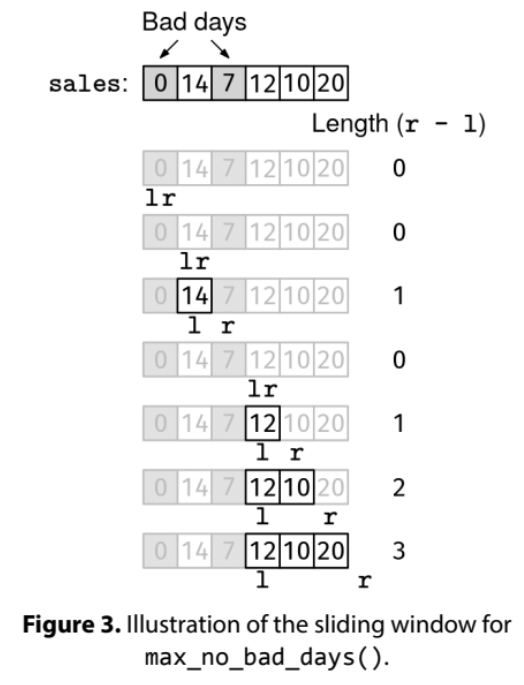

Given an array, sales, where sales[i] is the number of sales on the i-th day, find the most consecutive days with no bad days.

A bad day is a day with fewer than 10 sales.

Example 1: sales = [0, 14, 7, 12, 10, 20]
Output: 3. The subarray [12, 10, 20] has no bad days.

Example 2: sales = [10, 10, 10]
Output: 3. All days are good days.

Example 3: sales = [5, 5, 5]
Output: 0. There are no good days.
Constraints:

0 <= len(sales) <= 10^5
0 <= sales[i] <= 10^3

See Solution
Problem 38.5 - Longest Good Day Streak: Solution
JavaScript
We'll approach this problem with a sliding window.

We can classify this as a "resetting window" problem because if we encounter a bad day, whatever window we have so far needs to be discarded. This gives us a simple strategy for when to grow and shrink the window:

If the next day is good (at least 10 sales), grow the window.
If the next day is bad (fewer than 10 sales), skip it and reset the window.
We can use the resetting window recipe:

resetting_window(arr):
  initialize:
    - l and r to 0 (empty window)
    - data structures to track window info
    - cur_best to 0
  while we can grow the window (r < len(arr))
    if the window is still valid with one more element
      grow the window (update data structures and increase r)
      update cur_best if needed
    else
      reset window and data structures past the problematic element
  return cur_best
In our resetting window recipe, the window stays 'valid' throughout the algorithm. We use a can_grow variable to decide whether to grow or reset. When sales[r] is a bad day, we reset the window by moving both l and r past the problematic element.

You could skip declaring the variable can_grow and put the condition directly in the if statement, but the name can_grow makes it clear what the if/else cases correspond to, so it is extra easy for the interviewer to follow.

Once the window cannot grow anymore (r == len(sales)) we can stop, as we surely won't find a bigger window by shrinking it.

Longest Good Day Streak Solution

Here is the implementation:

function maxNoBadDays(sales) {
  let l = 0,
    r = 0;
  let curMax = 0;
  while (r < sales.length) {
    const canGrow = sales[r] >= 10;
    if (canGrow) {
      r++;
      curMax = Math.max(curMax, r - l);
    } else {
      l = r + 1;
      r = r + 1;
    }
  }
  return curMax;
}
Time & Space Analysis
n: the length of the sales array

Time: O(n) - we make a single pass through the sales array

Extra space: O(1)

Tests
Here are some test cases to verify the solution:

function runTests() {
  const tests = [
    // Example from the book
    [[0, 14, 7, 12, 10, 20], 3],
    // Edge case - empty array
    [[], 0],
    // Edge case - all good days
    [[10, 11, 12], 3],
    // Edge case - all bad days
    [[1, 2, 3], 0],
    // alternating
    [[10, 5, 10, 5], 1],
  ];
  for (const [sales, want] of tests) {
    const got = maxNoBadDays(sales);
    if (got !== want) {
      throw new Error(
        `\nmaxNoBadDays(${JSON.stringify(sales)}): got: ${got}, want ${want}\n`,
      );
    }
  }
}

runTests();

def max_no_bad_days(sales):
  l, r = 0, 0
  cur_max = 0
  while r < len(sales):
    can_grow = sales[r] >= 10
    if can_grow:
      r += 1
      cur_max = max(cur_max, r - l)
    else:
      l = r + 1
      r = r + 1
  return cur_max
Time & Space Analysis
n: the length of the sales array

Time: O(n) - we make a single pass through the sales array

Extra space: O(1)

Tests
Here are some test cases to verify the solution:

def run_tests():
  tests = [
      # Example from the book
      ([0, 14, 7, 12, 10, 20], 3),
      # Edge case - empty array
      ([], 0),
      # Edge case - all good days
      ([10, 11, 12], 3),
      # Edge case - all bad days
      ([1, 2, 3], 0),
      # alternating
      ([10, 5, 10, 5], 1),
  ]
  for sales, want in tests:
    got = max_no_bad_days(sales)
    assert got == want, f"\nmax_no_bad_days({sales}): got: {got}, want {want}\n"

run_tests()

class MaxNoBadDays {
  public int solve(int[] sales) {
    int l = 0, r = 0;
    int curMax = 0;
    while (r < sales.length) {
      boolean canGrow = sales[r] >= 10;
      if (canGrow) {
        r++;
        curMax = Math.max(curMax, r - l);
      } else {
        l = r + 1;
        r = r + 1;
      }
    }
    return curMax;
  }
}
Time & Space Analysis
n: the length of the sales array

Time: O(n) - we make a single pass through the sales array

Extra space: O(1)

Tests
Here are some test cases to verify the solution:

class RunTests {
  public void runTests() {
    Object[][] tests = {
        // Example from the book
        { new int[] { 0, 14, 7, 12, 10, 20 }, 3 },
        // Edge case - empty array
        { new int[] {}, 0 },
        // Edge case - all good days
        { new int[] { 10, 11, 12 }, 3 },
        // Edge case - all bad days
        { new int[] { 1, 2, 3 }, 0 },
        // alternating
        { new int[] { 10, 5, 10, 5 }, 1 },
    };

    MaxNoBadDays solution = new MaxNoBadDays();
    for (Object[] test : tests) {
      int[] sales = (int[]) test[0];
      int want = (int) test[1];
      int got = solution.solve(sales);
      if (got != want) {
        throw new RuntimeException(String.format(
            "\nsolve(%s): got: %d, want: %d\n",
            Arrays.toString(sales), got, want));
      }
    }
  }
}

public class Solution {
  public static void main(String[] args) {
    new RunTests().runTests();
  }
}

