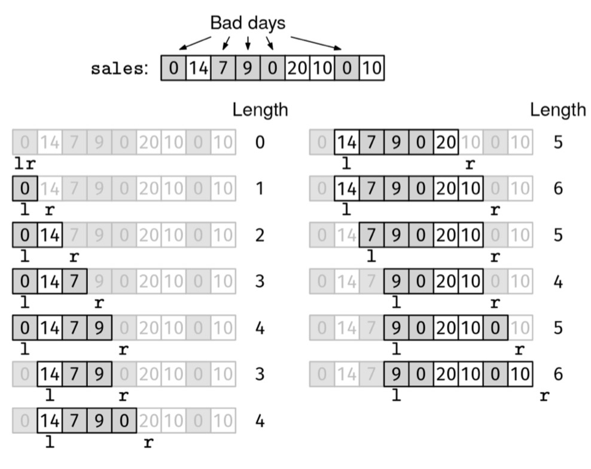

Given an array sales, where sales[i] is the number of sales on the i-th day, find the most consecutive days with at most 3 bad days.

A bad day is a day with fewer than 10 sales.

Example 1: sales = [0, 14, 7, 9, 0, 20, 10, 0, 10]
Output: 6.
There are two 6-day periods with at most 3 bad days:
  - [14, 7, 9, 0, 20, 10]
  - [9, 0, 20, 10, 0, 10]

Example 2: sales = [10, 10, 10]
Output: 3. All days are good days.

Example 3: sales = [5, 5, 5, 5]
Output: 3. We can include at most 3 bad days.
Constraints:

0 <= len(sales) <= 10^5
0 <= sales[i] <= 10^3
See Solution
Problem 38.8 - Maximum With at Most 3 Bad Days: Solution
Java
We'll tackle this problem with a sliding window.

We can classify this as a "maximum window" problem because we are trying to find the longest possible window. We can follow this strategy for when to grow and shrink the window:

If the next day is good or the window contains fewer than 3 bad days, grow the window.
Otherwise, shrink it.
We can use the maximum window recipe:

maximum_window(arr):
  initialize:
    - l and r to 0 (empty window)
    - data structures to track window info
    - cur_best to 0
  while we can grow the window (r < len(arr))
    if the window would still be valid with one more element
      grow the window (update data structures and increase r)
      update cur_best if needed
    else if the window is empty  # skip this case if empty windows are always valid
      advance both l and r
    else
      shrink the window (update data structures and increase l)
  return cur_best
We maintain a count of bad days in the current window. When we grow the window and encounter a bad day, we increment the count. When we shrink the window and remove a bad day, we decrement the count.

Here is the implementation:

class MaxAtMost3BadDays {
  public int solve(int[] sales) {
    int l = 0, r = 0;
    int windowBadDays = 0;
    int curMax = 0;
    while (r < sales.length) {
      boolean canGrow = sales[r] >= 10 || windowBadDays < 3;
      if (canGrow) {
        if (sales[r] < 10) {
          windowBadDays++;
        }
        r++;
        curMax = Math.max(curMax, r - l);
      } else {
        if (sales[l] < 10) {
          windowBadDays--;
        }
        l++;
      }
    }
    return curMax;
  }
}
Maximum With At Most 3 Bad Days Steps

Time & Space Analysis
n: the length of the sales array

Time: O(n) - we increment a pointer at each iteration, so there are at most 2n iterations

Extra space: O(1)

Tests
Here are some test cases to verify the solution:

class RunTests {
  public void runTests() {
    Object[][] tests = {
        // Example from the book
        { new int[] { 0, 14, 7, 9, 0, 20, 10, 0, 10 }, 6 },
        // Edge case - empty array
        { new int[] {}, 0 },
        // Edge case - single element
        { new int[] { 5 }, 1 },
        // all good days
        { new int[] { 10, 11, 12 }, 3 },
        // all bad days
        { new int[] { 1, 2, 3 }, 3 },
        // exactly 3 bad days
        { new int[] { 5, 10, 5, 10, 5 }, 5 },
        // More than 3 bad days
        { new int[] { 5, 10, 5, 5, 10, 5 }, 5 },
    };

    MaxAtMost3BadDays solution = new MaxAtMost3BadDays();
    for (Object[] test : tests) {
      int[] sales = (int[]) test[0];
      int want = (int) test[1];
      int got = solution.solve(sales);
      if (got != want) {
        throw new RuntimeException(String.format(
            "\nsolve(%s): got: %d, want: %d\n",
            Arrays.toString(sales), got, want));
      }
    }
  }
}

public class Solution {
  public static void main(String[] args) {
    new RunTests().runTests();
  }
}
Recipe 3 - Maximum Window

def maximum_window(arr):
  initialize:
  - l and r to 0 (empty window)
  - data structures to track window info
  - cur_best to 0
  while we can grow the window (r < len(arr))
    if the window would still be valid with one more element
      grow the window (update data structures and increase r)
      update cur_best if needed
    else if the window is empty
      advance both l and r
    else
      shrink the window (update data structures and increase l)
  return cur_best

  def max_at_most_3_bad_days(sales):
  l, r = 0, 0
  window_bad_days = 0
  cur_max = 0
  while r < len(sales):
    can_grow = sales[r] >= 10 or window_bad_days < 3
    if can_grow:
      if sales[r] < 10:
        window_bad_days += 1
      r += 1
      cur_max = max(cur_max, r - l)
    else:
      if sales[l] < 10:
        window_bad_days -= 1
      l += 1
  return cur_max
Maximum With At Most 3 Bad Days Steps
Time & Space Analysis
n: the length of the sales array

Time: O(n) - we increment a pointer at each iteration, so there are at most 2n iterations

Extra space: O(1)

Tests
Here are some test cases to verify the solution:

def run_tests():
  tests = [
      # Example from the book
      ([0, 14, 7, 9, 0, 20, 10, 0, 10], 6),
      # Edge case - empty array
      ([], 0),
      # Edge case - single element
      ([5], 1),
      # all good days
      ([10, 11, 12], 3),
      # all bad days
      ([1, 2, 3], 3),
      # exactly 3 bad days
      ([5, 10, 5, 10, 5], 5),
      # More than 3 bad days
      ([5, 10, 5, 5, 10, 5], 5),
  ]
  for sales, want in tests:
    got = max_at_most_3_bad_days(sales)
    assert got == want, f"\nmax_at_most_3_bad_days({sales}): got: {
        got}, want {want}\n"

run_tests()
function maxAtMost3BadDays(sales) {
  let l = 0,
    r = 0;
  let windowBadDays = 0;
  let curMax = 0;
  while (r < sales.length) {
    const canGrow = sales[r] >= 10 || windowBadDays < 3;
    if (canGrow) {
      if (sales[r] < 10) {
        windowBadDays++;
      }
      r++;
      curMax = Math.max(curMax, r - l);
    } else {
      if (sales[l] < 10) {
        windowBadDays--;
      }
      l++;
    }
  }
  return curMax;
}
Maximum With At Most 3 Bad Days Steps
Time & Space Analysis
n: the length of the sales array

Time: O(n) - we increment a pointer at each iteration, so there are at most 2n iterations

Extra space: O(1)

Tests
Here are some test cases to verify the solution:

function runTests() {
  const tests = [
    // Example from the book
    [[0, 14, 7, 9, 0, 20, 10, 0, 10], 6],
    // Edge case - empty array
    [[], 0],
    // Edge case - single element
    [[5], 1],
    // all good days
    [[10, 11, 12], 3],
    // all bad days
    [[1, 2, 3], 3],
    // exactly 3 bad days
    [[5, 10, 5, 10, 5], 5],
    // More than 3 bad days
    [[5, 10, 5, 5, 10, 5], 5],
  ];
  for (const [sales, want] of tests) {
    const got = maxAtMost3BadDays(sales);
    if (got !== want) {
      throw new Error(
        `\nmaxAtMost3BadDays(${JSON.stringify(
          sales,
        )}): got: ${got}, want ${want}\n`,
      );
    }
  }
}

runTests();

