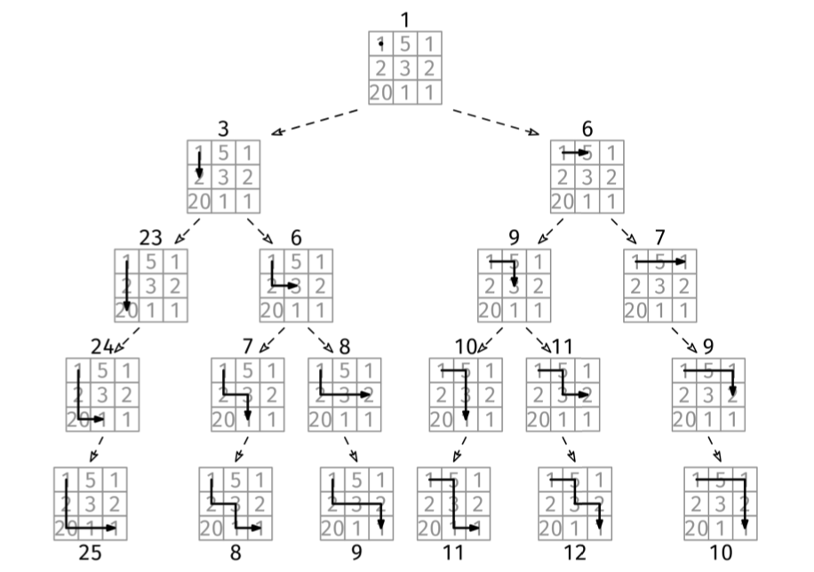
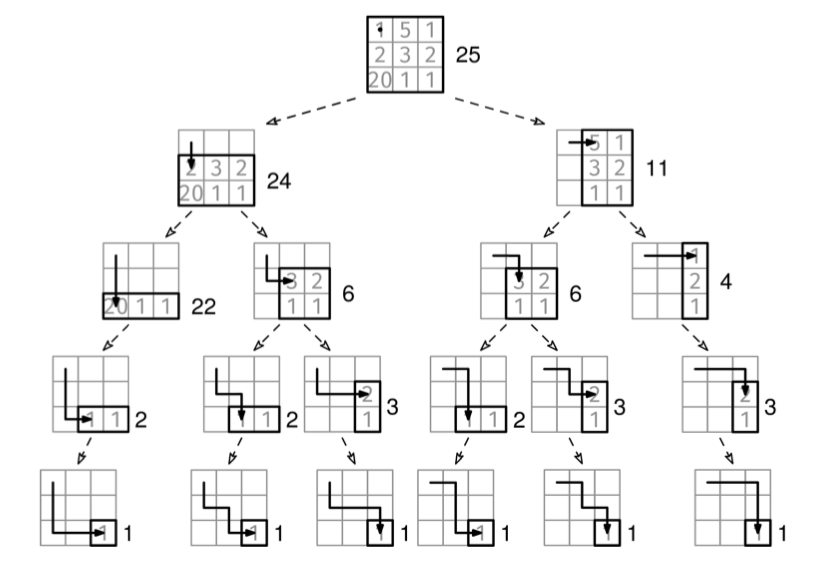

Given a non-empty grid of positive integers, grid, find the path from the top-left corner to the bottom-right corner with the largest sum. You can only go down or to the right (not diagonal).

Example 1: grid = [[1, 4, 3],
                   [2, 7, 6],
                   [5, 8, 9]]
Output: 29. The maximum path is 1 -> 4 -> 7 -> 8 -> 9.

Example 2: grid = [[5]]
Output: 5

Example 3: grid = [[1, 2, 3]]
Output: 6. The maximum path is 1 -> 2 -> 3.
Constraints:

1 <= R, C <= 1000, where R is the number of rows and C is the number of columns in the grid.
1 <= grid[i][j] <= 1000.
See Solution
Problem 39.1 - Max-Sum Path: Solution
Java
This problem can be solved sub-optimally using a backtracking approach by exploring all possible paths from the top-left to the bottom-right corner of the grid. At each step, you can move either down or to the right, and you need to keep track of the current path sum. The goal is to find the path with the maximum sum.

This list of decisions forms what is called a decision tree:

Max Sum Path Solution 1

We can use a recursive function to explore each path, updating the maximum path-sum so far each time a path reaches the bottom-right corner. The function should also handle the base case where the current position is out of bounds.

We can use the backtracking recipe:

def visit(partial_solution):
  if full_solution(partial_solution):
    # Process leaf/full solution.
  else:
    for choice in choices(partial_solution):
      # Prune children where possible.
      child = apply_choice(partial_solution)
      visit(child)

visit(empty_solution)
Here is the implementation:

class MaxSumPathBacktracking {
  private final int[][] grid;
  private int maxSum;
  private final int R, C;

  public MaxSumPathBacktracking(int[][] grid) {
    this.grid = grid;
    this.R = grid.length;
    this.C = grid[0].length;
    this.maxSum = Integer.MIN_VALUE;
  }

  private void visit(int r, int c, int curSum) {
    if (r == R - 1 && c == C - 1) {
      maxSum = Math.max(maxSum, curSum);
      return;
    }

    if (r + 1 < R) {
      visit(r + 1, c, curSum + grid[r + 1][c]); // Go down.
    }
    if (c + 1 < C) {
      visit(r, c + 1, curSum + grid[r][c + 1]); // Go right.
    }
  }

  // Inefficient backtracking solution. DP is better!
  public int solve() {
    visit(0, 0, grid[0][0]);
    return maxSum;
  }
}
We can use memoization to improve the backtracking solution. Backtracking reaches the same cell in different ways, but no matter how we get to a cell, the optimal path from there to the bottom-right corner won't change. It is wasteful and repetitive to fully explore the decision tree from the same cell more than once. Instead, the idea of DP is that we can do it only once and store the optimal path for the next time we get to that same cell. Conceptually, we can think of each subgrid as a subproblem with its own solution that we can store (or 'memoize', in DP parlance) and reuse:

The main thing with 2D inputs is that we have more out-of-bounds checks:

If we are in the last row, we can only go right.
If we are in the last column, we can only go down.
When writing down the recurrence relation, we need to be systematic about all the edge cases:

max_path(r, c): the maximum path sum starting from grid[r][c]

bottom-right corner (r == R - 1, c == C - 1):
  max_path(r, c) = grid[r][c]
last row (r == R - 1, c < C - 1):
  max_path(r, c) = grid[r][c] + max_path(r, c + 1)  # we can only go right
last column (r < R - 1, c == C - 1):
  max_path(r, c) = grid[r][c] + max_path(r + 1, c)  # we can only go down
general case (r < R - 1, c < C - 1):
  max_path(r, c) = grid[r][c] + max(max_path(r + 1, c),  # go down
                                    max_path(r, c + 1))  # go right

original problem: max_path(0, 0)
Now, we can translate it into code and add caching, as in the memoization recipe:

memo = empty map

f(subproblem_id):
  if subproblem is base case:
    return result directly
  if subproblem in memo map:
    return cached result

  memo[subproblem_id] = recurrence relation formula
  return memo[subproblem_id]

return f(initial subproblem)
Here is the implementation:

class MaxSumPathMemoization {
  private final int[][] grid;
  private final Map<String, Integer> memo;
  private final int R, C;

  public MaxSumPathMemoization(int[][] grid) {
    this.grid = grid;
    this.R = grid.length;
    this.C = grid[0].length;
    this.memo = new HashMap<>();
  }

  private int dp(int r, int c) {
    String key = r + "," + c;
    if (memo.containsKey(key)) {
      return memo.get(key);
    }

    if (r == R - 1 && c == C - 1) {
      return grid[r][c];
    }

    int maxSum = Integer.MIN_VALUE;
    // Try going down
    if (r + 1 < R) {
      maxSum = Math.max(maxSum, grid[r][c] + dp(r + 1, c));
    }
    // Try going right
    if (c + 1 < C) {
      maxSum = Math.max(maxSum, grid[r][c] + dp(r, c + 1));
    }

    memo.put(key, maxSum);
    return maxSum;
  }

  public int solve() {
    return dp(0, 0);
  }
}
Time & Space Analysis
R: number of rows in the grid
C: number of columns in the grid
For backtracking, we can use the BAD method: O(b^d * A), where:

b is the branching factor: 2
d is the depth of the call tree: R + C - 2
A is the additional (non-recursive) work per node: O(1)
Thus, we have:

Time: O(2^(R + C - 2))
Extra space: O(R + C) - for the call stack. We use O(1) extra space per call.
For the memoized version:

In DP, we usually find the runtime by multiplying the number of subproblems by the non-recursive work per subproblem (when the subproblem is not cached).

Subproblems: R * C.
Non-recursive work: O(1).
Time: O(R * C).
Extra space: O(R * C) for the memoization map.
Tests
Here are some test cases to verify the solution:

class RunTests {
  public void runTests() {
    Object[][] tests = {
        // Example 1 from the book
        { new int[][] { { 1, 4, 3 }, { 2, 7, 6 }, { 5, 8, 9 } }, 29 },
        // Example 2 from the book
        { new int[][] { { 5 } }, 5 },
        // Additional test cases
        // Edge case - single row
        { new int[][] { { 1, 2, 3, 4 } }, 10 },
        // Edge case - single column
        { new int[][] { { 1 }, { 2 }, { 3 }, { 4 } }, 10 },
        // Larger grid
        { new int[][] { { 1, 2, 3 }, { 4, 5, 6 }, { 7, 8, 9 } }, 29 },
        // Edge case - all elements are the same
        { new int[][] { { 1, 1, 1 }, { 1, 1, 1 }, { 1, 1, 1 } }, 5 },
    };

    for (Object[] test : tests) {
      int[][] grid = (int[][]) test[0];
      int want = (int) test[1];

      int gotBacktracking = new MaxSumPathBacktracking(grid).solve();
      int gotMemoization = new MaxSumPathMemoization(grid).solve();

      if (gotBacktracking != gotMemoization) {
        throw new RuntimeException(String.format(
            "\nMaxSumPathBacktracking(%s) != MaxSumPathMemoization(%s)\n",
            Arrays.deepToString(grid), Arrays.deepToString(grid)));
      }
      if (gotBacktracking != want) {
        throw new RuntimeException(String.format(
            "\nMaxSumPathBacktracking(%s): got: %d, want: %d\n",
            Arrays.deepToString(grid), gotBacktracking, want));
      }
      if (gotMemoization != want) {
        throw new RuntimeException(String.format(
            "\nMaxSumPathMemoization(%s): got: %d, want: %d\n",
            Arrays.deepToString(grid), gotMemoization, want));
      }
    }
  }
}

public class Solution {
  public static void main(String[] args) {
    new RunTests().runTests();
  }
}
Recipe 1 - Backtracking

def visit(partial_solution):
  if full_solution(partial_solution):
    # Process leaf/full solution.
  else:
    for choice in choices(partial_solution):
      # Prune children where possible.
      child = apply_choice(partial_solution)
      visit(child)

visit(empty_solution)
def max_sum_path_backtracking(grid):
  # Inefficient backtracking solution. DP is better!
  max_sum = -math.inf
  R, C = len(grid), len(grid[0])

  def visit(r, c, cur_sum):
    nonlocal max_sum
    if r == R - 1 and c == C - 1:
      max_sum = max(max_sum, cur_sum)
      return

    if r + 1 < R:
      visit(r + 1, c, cur_sum + grid[r + 1][c])  # Go down.
    if c + 1 < C:
      visit(r, c + 1, cur_sum + grid[r][c + 1])  # Go right.

  visit(0, 0, grid[0][0])
  return max_sum
  def max_sum_path_memoization(grid):
  R, C = len(grid), len(grid[0])
  memo = {}

  def dp(r, c):
    if (r, c) in memo:
      return memo[(r, c)]

    if r == R - 1 and c == C - 1:
      return grid[r][c]

    max_sum = -math.inf
    # Try going down
    if r + 1 < R:
      max_sum = max(max_sum, grid[r][c] + dp(r + 1, c))
    # Try going right
    if c + 1 < C:
      max_sum = max(max_sum, grid[r][c] + dp(r, c + 1))

    memo[(r, c)] = max_sum
    return max_sum

  return dp(0, 0)
Time & Space Analysis
R: number of rows in the grid
C: number of columns in the grid
For backtracking, we can use the BAD method: O(b^d * A), where:

b is the branching factor: 2
d is the depth of the call tree: R + C - 2
A is the additional (non-recursive) work per node: O(1)
Thus, we have:

Time: O(2^(R + C - 2))
Extra space: O(R + C) - for the call stack. We use O(1) extra space per call.
For the memoized version:

In DP, we usually find the runtime by multiplying the number of subproblems by the non-recursive work per subproblem (when the subproblem is not cached).

Subproblems: R * C.
Non-recursive work: O(1).
Time: O(R * C).
Extra space: O(R * C) for the memoization map.
Tests
Here are some test cases to verify the solution:

def run_tests():
  tests = [
      # Example 1 from the book
      ([[1, 4, 3], [2, 7, 6], [5, 8, 9]], 29),
      # Example 2 from the book
      ([[5]], 5),
      # Additional test cases
      # Edge case - single row
      ([[1, 2, 3, 4]], 10),
      # Edge case - single column
      ([[1], [2], [3], [4]], 10),
      # Larger grid
      ([[1, 2, 3], [4, 5, 6], [7, 8, 9]], 29),
      # Edge case - all elements are the same
      ([[1, 1, 1], [1, 1, 1], [1, 1, 1]], 5),
  ]
  for grid, want in tests:
    got_backtracking = max_sum_path_backtracking(grid)
    got_memoization = max_sum_path_memoization(grid)
    assert got_backtracking == got_memoization, (
        f"\nmax_sum_path_backtracking({grid}) != max_sum_path_memoization({grid})\n"
    )
    assert got_backtracking == want, (
        f"\nmax_sum_path_backtracking({grid}): got: {got_backtracking}, want: {want}\n"
    )
    assert got_memoization == want, (
        f"\nmax_sum_path_memoization({grid}): got: {got_memoization}, want: {want}\n"
    )

run_tests()
function maxSumPathBacktracking(grid) {
  // Inefficient backtracking solution. DP is better!
  const R = grid.length;
  const C = grid[0].length;
  let maxSum = -Infinity;

  function visit(r, c, curSum) {
    if (r === R - 1 && c === C - 1) {
      maxSum = Math.max(maxSum, curSum);
      return;
    }

    if (r + 1 < R) {
      visit(r + 1, c, curSum + grid[r + 1][c]); // Go down.
    }
    if (c + 1 < C) {
      visit(r, c + 1, curSum + grid[r][c + 1]); // Go right.
    }
  }

  visit(0, 0, grid[0][0]);
  return maxSum;
}
function maxSumPathMemoization(grid) {
  const R = grid.length;
  const C = grid[0].length;
  const memo = new Map();

  function dp(r, c) {
    const key = `${r},${c}`;
    if (memo.has(key)) {
      return memo.get(key);
    }

    if (r === R - 1 && c === C - 1) {
      return grid[r][c];
    }

    let maxSum = -Infinity;
    // Try going down
    if (r + 1 < R) {
      maxSum = Math.max(maxSum, grid[r][c] + dp(r + 1, c));
    }
    // Try going right
    if (c + 1 < C) {
      maxSum = Math.max(maxSum, grid[r][c] + dp(r, c + 1));
    }

    memo.set(key, maxSum);
    return maxSum;
  }

  return dp(0, 0);
}
function runTests() {
  const tests = [
    // Example 1 from the book
    [
      [
        [1, 4, 3],
        [2, 7, 6],
        [5, 8, 9],
      ],
      29,
    ],
    // Example 2 from the book
    [[[5]], 5],
    // Additional test cases
    // Edge case - single row
    [[[1, 2, 3, 4]], 10],
    // Edge case - single column
    [[[1], [2], [3], [4]], 10],
    // Larger grid
    [
      [
        [1, 2, 3],
        [4, 5, 6],
        [7, 8, 9],
      ],
      29,
    ],
    // Edge case - all elements are the same
    [
      [
        [1, 1, 1],
        [1, 1, 1],
        [1, 1, 1],
      ],
      5,
    ],
  ];

  for (const [grid, want] of tests) {
    const gotBacktracking = maxSumPathBacktracking(grid);
    const gotMemoization = maxSumPathMemoization(grid);

    if (gotBacktracking !== gotMemoization) {
      throw new Error(
        `\nmaxSumPathBacktracking(${JSON.stringify(grid)}) != ` +
          `maxSumPathMemoization(${JSON.stringify(grid)})\n`,
      );
    }
    if (gotBacktracking !== want) {
      throw new Error(
        `\nmaxSumPathBacktracking(${JSON.stringify(grid)}): ` +
          `got: ${gotBacktracking}, want: ${want}\n`,
      );
    }
    if (gotMemoization !== want) {
      throw new Error(
        `\nmaxSumPathMemoization(${JSON.stringify(grid)}): ` +
          `got: ${gotMemoization}, want: ${want}\n`,
      );
    }
  }
}

runTests();
