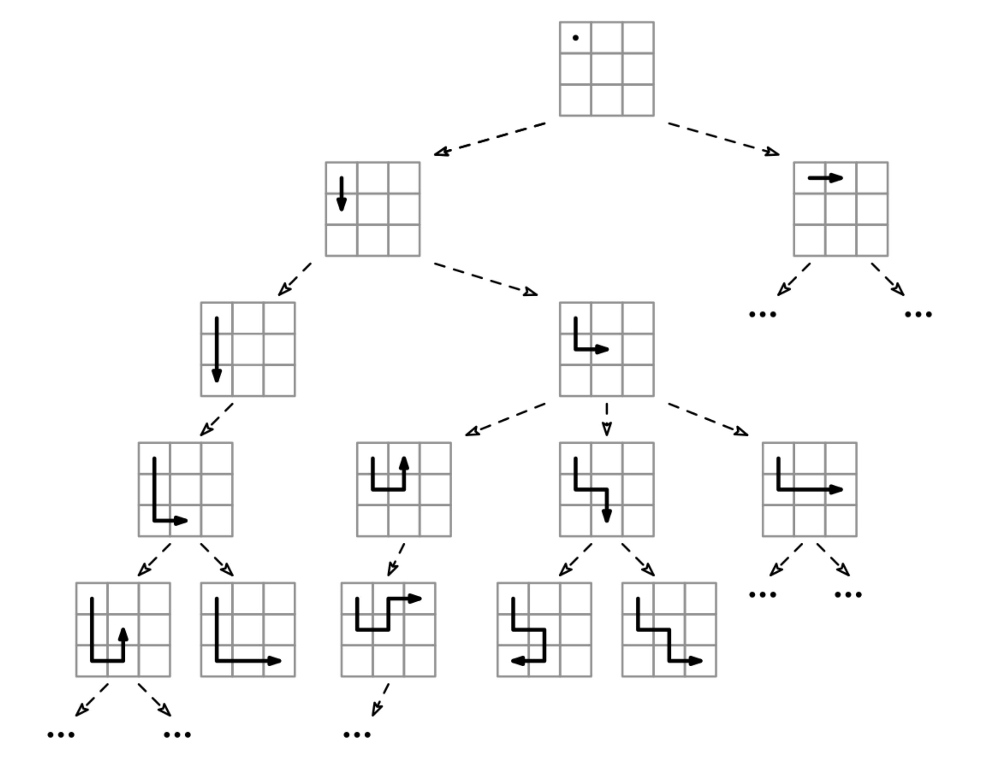

Given an RxC grid of integers (which can be negative), grid, find the path from the top-left corner to the bottom-right corner with the largest sum and return its sum. You can go in all four directions (diagonals not allowed), but you can't visit a cell more than once.

Example: grid = [[ 1, -4,  3],
                 [-2,  7, -6],
                 [ 5, -4,  9]]
Output: 12
The maximum path is 1 -> -4 -> 7 -> -2 -> 5 -> -4 -> 9, which has sum 12.
Constraints:

grid has at least 1 to 5 rows and 1 to 5 columns.
grid[i][j] is an integer between -100 and 100.
See Solution
Problem 39.10 - 4-Directional Max-Sum Path: Solution
Python
There are variants of this problem that can be optimized with DP (dynamic programming), but not this one--it is NP-hard (it's a variant of the longest-path problem). Backtracking is the best we can do.

The decision tree for this problem looks like this:

4-Directional Max-Sum Path

We start at the top-left corner, [0, 0].
At each step, we have 4 choices: go right, go left, go up, go down.
We reach a full solution when we reach the bottom-right corner, [R-1, C-1].
We have to avoid revisiting cells already in the path, which means we could end at a dead end surrounded by already-visited cells. We should prune such branches.
Now, we need to implement it. The biggest challenge is not revisiting cells (which could get us stuck in an infinite loop). We could iterate through the path we built so far to make sure we don't. Or, we can do an additional work optimization (an optimization that reduces the work at each node) and maintain a set of cells in the current path. This way, the additional work at each node will be O(1).

We can use the backtracking recipe:

def visit(partial_solution):
  if full_solution(partial_solution):
    # Process leaf/full solution.
  else:
    for choice in choices(partial_solution):
      # Prune children where possible.
      child = apply_choice(partial_solution)
      visit(child)

visit(empty_solution)
Here is the implementation:

def four_directional_max_sum_path(grid):
  R, C = len(grid), len(grid[0])
  best_sum = -math.inf
  seen = {(0, 0)}

  def visit(r, c, path_sum):
    nonlocal best_sum

    # Process leaf/full solution
    if r == R - 1 and c == C - 1:
      if path_sum > best_sum:
        best_sum = path_sum
      return

    # Try each direction
    for dr, dc in [(0, 1), (1, 0), (0, -1), (-1, 0)]:
      nr, nc = r + dr, c + dc
      if (nr, nc) not in seen and 0 <= nr < R and 0 <= nc < C:
        seen.add((nr, nc))
        visit(nr, nc, path_sum + grid[nr][nc])
        seen.remove((nr, nc))

  # Start from top-left
  visit(0, 0, grid[0][0])
  return best_sum
Time & Space Analysis
R: number of rows in the grid
C: number of columns in the grid
For the analysis, we can apply the BAD method: O(b^d * A), where

b is the branching factor: 3 (we can go up, down, left, or right, but one direction is where we come from).
d is the depth of the decision tree: R * C.
A is the additional work per node: O(R * C) (with the additional work optimization).
Thus, we have:

Time: O(3^(R*C))
Extra space: O(R*C) - for tracking the current path and for the call stack.
Tests
Here are some test cases to verify the solution:

def run_tests():
  tests = [
      # Example from the book
      ([[1, -4, 3],
        [-2, 7, -6],
        [5, -4, 9]], 12),
      # Edge case - 1x1 grid
      ([[5]], 5),
      # Edge case - 1xN grid
      ([[1, 2, 3]], 6),
      # Edge case - Nx1 grid
      ([[1], [2], [3]], 6),
      # 2x2 grid
      ([[1, 2], [3, 4]], 8),
  ]

  for grid, want in tests:
    got = four_directional_max_sum_path(grid)
    assert got == want, f"\nfour_directional_max_sum_path({grid}): got: {
        got}, want: {want}\n"

run_tests()
function fourDirectionalMaxSumPath(grid) {
  const R = grid.length;
  const C = grid[0].length;
  let bestSum = -Infinity;
  const seen = new Set(["0,0"]);

  function visit(r, c, pathSum) {
    // Process leaf/full solution
    if (r === R - 1 && c === C - 1) {
      if (pathSum > bestSum) {
        bestSum = pathSum;
      }
      return;
    }

    // Try each direction
    const directions = [
      [0, 1],
      [1, 0],
      [0, -1],
      [-1, 0],
    ];
    for (const [dr, dc] of directions) {
      const nr = r + dr;
      const nc = c + dc;
      const key = `${nr},${nc}`;
      if (!seen.has(key) && nr >= 0 && nr < R && nc >= 0 && nc < C) {
        seen.add(key);
        visit(nr, nc, pathSum + grid[nr][nc]);
        seen.delete(key);
      }
    }
  }

  // Start from top-left
  visit(0, 0, grid[0][0]);
  return bestSum;
}
Time & Space Analysis
R: number of rows in the grid
C: number of columns in the grid
For the analysis, we can apply the BAD method: O(b^d * A), where

b is the branching factor: 3 (we can go up, down, left, or right, but one direction is where we come from).
d is the depth of the decision tree: R * C.
A is the additional work per node: O(R * C) (with the additional work optimization).
Thus, we have:

Time: O(3^(R*C))
Extra space: O(R*C) - for tracking the current path and for the call stack.
Tests
Here are some test cases to verify the solution:

function runTests() {
  const tests = [
    // Example from the book
    [
      [
        [1, -4, 3],
        [-2, 7, -6],
        [5, -4, 9],
      ],
      12,
    ],
    // Edge case - 1x1 grid
    [[[5]], 5],
    // Edge case - 1xN grid
    [[[1, 2, 3]], 6],
    // Edge case - Nx1 grid
    [[[1], [2], [3]], 6],
    // 2x2 grid
    [
      [
        [1, 2],
        [3, 4],
      ],
      8,
    ],
  ];

  for (const [grid, want] of tests) {
    const got = fourDirectionalMaxSumPath(grid);
    if (got !== want) {
      throw new Error(
        `\nfourDirectionalMaxSumPath(${JSON.stringify(grid)}): got: ${got}, want: ${want}\n`,
      );
    }
  }
}

runTests();
class FourDirectionalMaxSumPath {
  private int[][] grid;
  private int bestSum;
  private Set<String> seen;
  private int R, C;

  private void visit(int r, int c, int pathSum) {
    // Process leaf/full solution
    if (r == R - 1 && c == C - 1) {
      if (pathSum > bestSum) {
        bestSum = pathSum;
      }
      return;
    }

    // Try each direction
    int[][] directions = { { 0, 1 }, { 1, 0 }, { 0, -1 }, { -1, 0 } };
    for (int[] dir : directions) {
      int nr = r + dir[0];
      int nc = c + dir[1];
      String key = nr + "," + nc;
      if (!seen.contains(key) && nr >= 0 && nr < R && nc >= 0 && nc < C) {
        seen.add(key);
        visit(nr, nc, pathSum + grid[nr][nc]);
        seen.remove(key);
      }
    }
  }

  public int solve(int[][] inputGrid) {
    grid = inputGrid;
    R = grid.length;
    C = grid[0].length;
    bestSum = Integer.MIN_VALUE;
    seen = new HashSet<>();
    seen.add("0,0");

    // Start from top-left
    visit(0, 0, grid[0][0]);
    return bestSum;
  }
}
Time & Space Analysis
R: number of rows in the grid
C: number of columns in the grid
For the analysis, we can apply the BAD method: O(b^d * A), where

b is the branching factor: 3 (we can go up, down, left, or right, but one direction is where we come from).
d is the depth of the decision tree: R * C.
A is the additional work per node: O(R * C) (with the additional work optimization).
Thus, we have:

Time: O(3^(R*C))
Extra space: O(R*C) - for tracking the current path and for the call stack.
Tests
Here are some test cases to verify the solution:

class RunTests {
  public void runTests() {
    Object[][] tests = {
        // Example from the book
        { new int[][] { { 1, -4, 3 },
            { -2, 7, -6 },
            { 5, -4, 9 } },
            12 },
        // Edge case - 1x1 grid
        { new int[][] { { 5 } },
            5 },
        // Edge case - 1xN grid
        { new int[][] { { 1, 2, 3 } },
            6 },
        // Edge case - Nx1 grid
        { new int[][] { { 1 }, { 2 }, { 3 } },
            6 },
        // 2x2 grid
        { new int[][] { { 1, 2 }, { 3, 4 } },
            8 }
    };

    FourDirectionalMaxSumPath solution = new FourDirectionalMaxSumPath();
    for (Object[] test : tests) {
      int[][] grid = (int[][]) test[0];
      int want = (int) test[1];
      int got = solution.solve(grid);

      if (got != want) {
        throw new RuntimeException(String.format(
            "\nsolve(%s): got: %d, want: %d\n",
            Arrays.deepToString(grid), got, want));
      }
    }
  }
}

public class Solution {
  public static void main(String[] args) {
    new RunTests().runTests();
  }
}