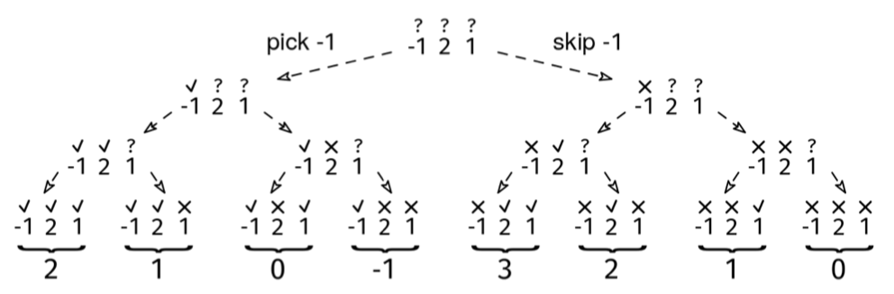
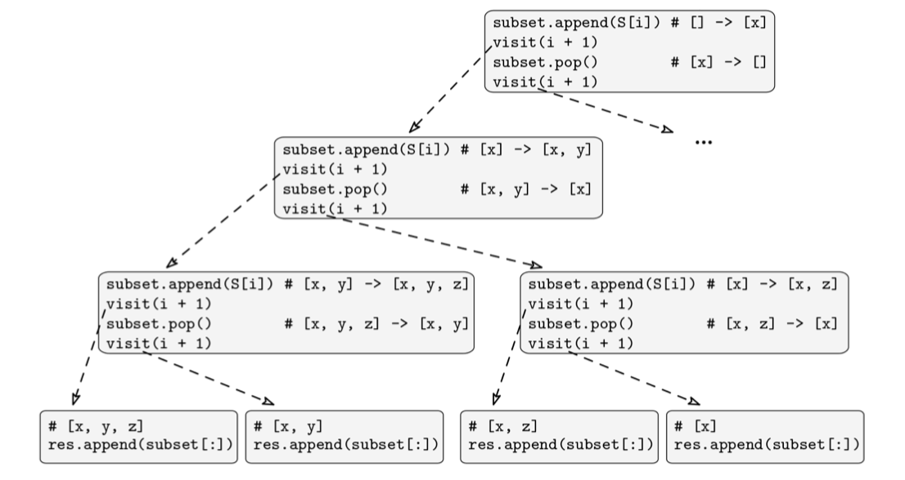

Given a set of elements, S, a subset of S is another set obtained by removing any number of elements from S (including none or all of them). As usual with sets, order does not matter.

Given an array of unique characters, S, return all possible subsets in any order.

Example: S = ['x', 'y', 'z']
Output: [[],
         ['x'],
         ['y'],
         ['z'],
         ['x', 'y'],
         ['x', 'z'],
         ['y', 'z'],
         ['x', 'y', 'z']]
Constraints:

The elements in S are unique.
The length of S is at most 12.
See Solution
Problem 39.2 - Subset Enumeration: Solution
JavaScript
Each subset is created by making a decision for each input element: pick it or skip it. For instance, the empty set excludes each element, and the full set includes every element.

Here is an example of subset enumeration but for integers instead of characters. The concept is the same:

Subset Enumeration Solution 1

We can use the backtracking recipe:

def visit(partial_solution):
  if full_solution(partial_solution):
    # Process leaf/full solution.
  else:
    for choice in choices(partial_solution):
      # Prune children where possible.
      child = apply_choice(partial_solution)
      visit(child)

visit(empty_solution)
Unlike in the recipe, we don't need a for loop for the choices because, for this problem, there are only 2.

Here is the implementation:

function allSubsets(S) {
  const res = []; // Global list of subsets
  const subset = []; // State of the current partial solution

  function visit(i) {
    if (i === S.length) {
      res.push([...subset]);
      return;
    }
    // Choice 1: pick S[i]
    subset.push(S[i]);
    visit(i + 1);
    subset.pop(); // Cleanup work: undo choice 1

    // Choice 2: skip S[i]
    visit(i + 1);
  }

  visit(0);
  return res;
}
Here is a breakdown of the implementation choices:

Solution state: subset is the current subset at each node in the decision tree, while i is the next element for which we need to make a decision.
Child creation: we share the same subset array between parents and children by modifying it in place in O(1) time. The complication that comes with that is that, after we add S[i] and recursively visit the child, we need to do the cleanup work of popping S[i] out again (see Figure 10). We recommend experimenting with this code, printing out subset at each step with and without this cleanup step.
Pruning: there's no pruning--to generate all subsets, we must always visit both children.
Leaf processing: we append a copy of subset to a global solution array res. It must be a copy (subset[:]), or we would mess it up after the fact as we start popping from subset further up the recursion tree. One of the most common (and most vexing) backtracking mistakes is forgetting to store a copy in the result variable. If you forget to do this, and your language defaults to storing references rather than copies, you'll end up with 2^n references in your result array all with the same final global state! If your output is a list of empty lists, this could be the reason.
Additional work optimization: we spend O(1) time at internal nodes and O(n) time at the leaves, which is needed to make a copy of subset, so there's no room to optimize anything for this problem.
The line that people find most confusing is the one that says: "Cleanup work: undo choice 1". Figure 10 illustrates how subset changes throughout the first half of the lifetime of the program:

Subset Enumeration Solution 2

There isn't a single option when it comes to design choices. There are often trade-offs. Here are some common alternatives for generating subsets:

Solution state: a perfectly fine alternative would be to use a boolean array with a boolean for each element, indicating whether we picked it or not. At the leaves, we would then use this array to construct the subset. An example of a non-ideal choice would be storing the remaining elements for which we still have to make a decision in a separate variable. Using the index i is cleaner.
Child creation: we could make a copy of subset for each child. Avoiding shared state between parents and children makes the implementation easier because we wouldn't need to do the cleanup step undoing the modification. However, it increases the time per internal node to O(len(S)).
Poor design choices can lead to verbose and clunky solutions.

Time & Space Analysis
n: the length of S
We use the BAD method to analyze the time and space complexity of the backtracking solution: O(b^d * A), where:

b is the branching factor: 2
d is the depth of the call tree: n + 1
A is the additional (non-recursive) work per node: O(n) (for the copy at the leaves)
Thus, we have:

Time: O(2^(n+1) * n) = O(2^n * n)
Extra space: O(2^n * n) - for the result array
Tests
Here are some test cases to verify the solution:

function runTests() {
  const tests = [
    // Example from the book
    [
      ["x", "y", "z"],
      [
        [],
        ["x"],
        ["y"],
        ["z"],
        ["x", "y"],
        ["x", "z"],
        ["y", "z"],
        ["x", "y", "z"],
      ],
    ],
    // Edge case - empty set
    [[], [[]]],
    // Single element
    [["a"], [[], ["a"]]],
    // Two elements
    [
      ["a", "b"],
      [[], ["a"], ["b"], ["a", "b"]],
    ],
    // Larger set
    [
      ["a", "b", "c", "d"],
      [
        [],
        ["a"],
        ["b"],
        ["c"],
        ["d"],
        ["a", "b"],
        ["a", "c"],
        ["a", "d"],
        ["b", "c"],
        ["b", "d"],
        ["c", "d"],
        ["a", "b", "c"],
        ["a", "b", "d"],
        ["a", "c", "d"],
        ["b", "c", "d"],
        ["a", "b", "c", "d"],
      ],
    ],
  ];

  for (const [S, want] of tests) {
    const got = allSubsets(S);
    got.sort((a, b) => {
      if (a.length !== b.length) return a.length - b.length;
      for (let i = 0; i < a.length; i++) {
        if (a[i] < b[i]) return -1;
        if (a[i] > b[i]) return 1;
      }
      return 0;
    });
    const want_sorted = [...want];
    want_sorted.sort((a, b) => {
      if (a.length !== b.length) return a.length - b.length;
      for (let i = 0; i < a.length; i++) {
        if (a[i] < b[i]) return -1;
        if (a[i] > b[i]) return 1;
      }
      return 0;
    });

    if (JSON.stringify(got) !== JSON.stringify(want_sorted)) {
      throw new Error(
        `\nallSubsets(${JSON.stringify(S)}): got: ${JSON.stringify(got)}, ` +
          `want: ${JSON.stringify(want_sorted)}\n`,
      );
    }
  }
}

runTests();
def all_subsets(S):
  res = []    # Global list of subsets.
  subset = [] # State of the current partial solution.

  def visit(i):
    if i == len(S):
      res.append(subset.copy())
      return   
    # Choice 1: pick S[i].
    subset.append(S[i])
    visit(i + 1)
    subset.pop()  # Cleanup work: undo choice 1.

    # Choice 2: skip S[i].
    visit(i + 1)

  visit(0)
  return res
  def run_tests():
  tests = [
    # Example from the book
    (['x', 'y', 'z'], [[], ['x'], ['y'], ['z'], ['x', 'y'], ['x', 'z'], ['y', 'z'], ['x', 'y', 'z']]),
    # Edge case - empty set
    ([], [[]]),
    # Single element
    (['a'], [[], ['a']]),
    # Two elements
    (['a', 'b'], [[], ['a'], ['b'], ['a', 'b']]),
    # Larger set
    (['a', 'b', 'c', 'd'], [
      [], ['a'], ['b'], ['c'], ['d'], ['a', 'b'], ['a', 'c'], ['a', 'd'],
      ['b', 'c'], ['b', 'd'], ['c', 'd'], ['a', 'b', 'c'], ['a', 'b', 'd'],
      ['a', 'c', 'd'], ['b', 'c', 'd'], ['a', 'b', 'c', 'd']
    ]),
  ]
  for S, want in tests:
    got = all_subsets(S)
    got.sort()
    want.sort()
    assert got == want, f"\nall_subsets({S}): got: {got}, want: {want}\n"

run_tests()
class AllSubsets {
  private List<List<Character>> res;
  private List<Character> subset;
  private List<Character> S;

  private void visit(int i) {
    if (i == S.size()) {
      res.add(new ArrayList<>(subset));
      return;
    }
    // Choice 1: pick S[i]
    subset.add(S.get(i));
    visit(i + 1);
    subset.remove(subset.size() - 1); // Cleanup work: undo choice 1

    // Choice 2: skip S[i]
    visit(i + 1);
  }

  public List<List<Character>> solve(char[] input) {
    res = new ArrayList<>();
    subset = new ArrayList<>();
    S = new String(input).chars()
        .mapToObj(ch -> (char) ch)
        .collect(Collectors.toList());
    visit(0);
    return res;
  }
}
class RunTests {
  public void runTests() {
    Object[][] tests = {
        // Example from the book
        {
            new char[] { 'x', 'y', 'z' },
            new char[][] {
                {},
                { 'x' },
                { 'y' },
                { 'z' },
                { 'x', 'y' },
                { 'x', 'z' },
                { 'y', 'z' },
                { 'x', 'y', 'z' }
            }
        },
        // Edge case - empty set
        {
            new char[] {},
            new char[][] { {} }
        },
        // Single element
        {
            new char[] { 'a' },
            new char[][] { {}, { 'a' } }
        },
        // Two elements
        {
            new char[] { 'a', 'b' },
            new char[][] {
                {},
                { 'a' },
                { 'b' },
                { 'a', 'b' }
            }
        },
        // Larger set
        {
            new char[] { 'a', 'b', 'c', 'd' },
            new char[][] {
                {},
                { 'a' },
                { 'b' },
                { 'c' },
                { 'd' },
                { 'a', 'b' },
                { 'a', 'c' },
                { 'a', 'd' },
                { 'b', 'c' },
                { 'b', 'd' },
                { 'c', 'd' },
                { 'a', 'b', 'c' },
                { 'a', 'b', 'd' },
                { 'a', 'c', 'd' },
                { 'b', 'c', 'd' },
                { 'a', 'b', 'c', 'd' }
            }
        }
    };

    AllSubsets solution = new AllSubsets();
    for (Object[] test : tests) {
      char[] arr = (char[]) test[0];
      char[][] wantArray = (char[][]) test[1];

      List<List<Character>> want = Arrays.stream(wantArray)
          .map(row -> new String(row).chars()
              .mapToObj(ch -> (char) ch)
              .collect(Collectors.toList()))
          .collect(Collectors.toList());

      List<List<Character>> got = solution.solve(arr);
      Collections.sort(got, (a, b) -> {
        if (a.size() != b.size())
          return a.size() - b.size();
        for (int i = 0; i < a.size(); i++) {
          int cmp = a.get(i).compareTo(b.get(i));
          if (cmp != 0)
            return cmp;
        }
        return 0;
      });
      Collections.sort(want, (a, b) -> {
        if (a.size() != b.size())
          return a.size() - b.size();
        for (int i = 0; i < a.size(); i++) {
          int cmp = a.get(i).compareTo(b.get(i));
          if (cmp != 0)
            return cmp;
        }
        return 0;
      });

      if (!got.equals(want)) {
        throw new RuntimeException(String.format(
            "\nsolve(%s): got: %s, want: %s\n",
            Arrays.toString(arr), got, want));
      }
    }
  }
}

public class Solution {
  public static void main(String[] args) {
    new RunTests().runTests();
  }
}
