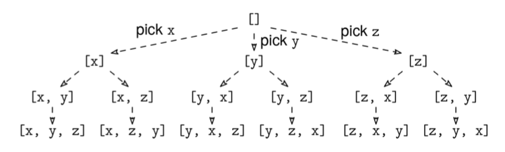
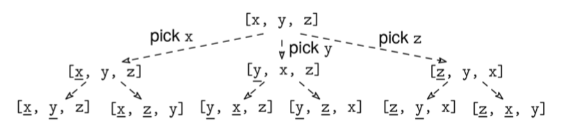

A permutation of a list is a list with the same elements but in any order. Finding all permutations means finding all possible orderings of the input elements.

Given an array of unique characters, arr, return all possible permutations, in any order.

Example 1: arr = ['x', 'y', 'z']
Output: [['x', 'y', 'z'],
         ['x', 'z', 'y'],
         ['y', 'x', 'z'],
         ['y', 'z', 'x'],
         ['z', 'x', 'y'],
         ['z', 'y', 'x']]

Example 2: arr = ['x']
Output: [['x']]
Constraints:

The elements in arr are unique.
The length of arr is at most 10.
See Solution
Problem 39.3 - Permutation Enumeration: Solution
Python
Since the number of permutations is n!, where n is the length of arr, the output size is O(n! * n). Thus, we cannot do better than O(n! * n) time, so we'll use backtracking.

First, we should model the decision tree. We start with an empty list. Then, each decision is a choice about which of the remaining elements to put next:

Permutation Enumeration Solution 1

We can use an array, perm, to store the elements we picked so far. This raises two questions:

How do we pick the next element of our current permutation?
How do we know which elements we have already used and which are still remaining?
At each node, we could (1) iterate through the input array to find elements to add next, and (2) for each one, iterate through the current partial permutation to check if it is already picked or not.

This would work, but there is a trick we can use to simplify the logic: we keep all the elements in perm, but use an index i to separate those already picked and the remaining ones. Before i is the list we picked so far, and the remaining ones are after that. The index i starts at 0. At each step, we can pick any elements between index i and n-1. When we pick an element at some index j, with j > i, we move it to index i, and swap the element that was at index i to j (it doesn't matter where the element that was at index i ends up -- it only matters that it is in the "not picked yet" region).

This figure shows the partial solution at each node when using the trick. The underlined elements are the picked ones. All the remaining elements can be picked next:

Permutation Enumeration Solution 2

For the implementation, we can use the backtracking recipe:

def visit(partial_solution):
  if full_solution(partial_solution):
    # Process leaf/full solution.
  else:
    for choice in choices(partial_solution):
      # Prune children where possible.
      child = apply_choice(partial_solution)
      visit(child)

visit(empty_solution)
Here is the implementation:

def generate_permutations(arr):
  res = []
  perm = arr.copy()

  def visit(i):
    if i == len(perm) - 1:
      res.append(perm.copy())
      return
    for j in range(i, len(perm)):
      perm[i], perm[j] = perm[j], perm[i]  # Pick perm[j]. 
      visit(i + 1)
      perm[i], perm[j] = perm[j], perm[i]  # Cleanup work: undo change.

  visit(0)
  return res
A couple of details:

The base case is len(arr) - 1 because, when there is only one element left, there are no choices left (the nodes at level 2 have only one child). Using len(arr) would work as well.
For the first choice, when i == j, the swap has no effect, but that is working as intended. We could handle that case separately and start the loop at i + 1, but that takes one extra line of code.
As usual, there isn't a single way to represent solutions. If we didn't know the "swapping" trick, we could, e.g., use a set to track remaining elements.

Time & Space Analysis
n: the length of arr
For permutation-based problems, the BAD method gives us an upper bound, but, as we'll see, it is not tight.

According to the BAD method, the time complexity of the backtracking solution is O(b^d * A), where:

b is the maximum branching factor: n (at the root, we have n choices)
d is the depth of the call tree: n
A is the additional (non-recursive) work per node: O(n) (for the copy at the leaves)
This gives a time of O(n^n * n).

This is correct in the "upper bound" sense, but it is not tight. In order to give an upper bound, the BAD method assumes the worst-case scenario where the branching factor is as large as possible at every node.

For permutation-based problems, the root has n children, which have n-2 children, and so on. The total number of nodes is n * (n-1) * (n-2) * ... * 1 = n!.

Correcting for that in the BAD formula, the actual runtime is O(n! * n) (we can also say that this is O((n+1)!), but this is not equivalent to O(n!)).

Time: O(n! * n)
Extra space: O(n! * n) - for the result array.
Tests
Here are some test cases to verify the solution:

def run_tests():
  tests = [
    # Example from the book
    (['x', 'y', 'z'], [
      ['x', 'y', 'z'], ['x', 'z', 'y'], ['y', 'x', 'z'],
      ['y', 'z', 'x'], ['z', 'x', 'y'], ['z', 'y', 'x']
    ]),
    # Single element
    (['a'], [['a']]),
    # Two elements
    (['a', 'b'], [['a', 'b'], ['b', 'a']]),
    # Larger set
    (['a', 'b', 'c'], [
      ['a', 'b', 'c'], ['a', 'c', 'b'], ['b', 'a', 'c'],
      ['b', 'c', 'a'], ['c', 'a', 'b'], ['c', 'b', 'a']
    ]),
  ]
  for arr, want in tests:
    got = generate_permutations(arr)
    got.sort()
    want.sort()
    assert got == want, f"\ngenerate_permutations({arr}): got: {got}, want: {want}\n"

run_tests()
function generatePermutations(arr) {
  const res = [];
  const perm = [...arr];

  function visit(i) {
    if (i === perm.length - 1) {
      res.push([...perm]);
      return;
    }
    for (let j = i; j < perm.length; j++) {
      [perm[i], perm[j]] = [perm[j], perm[i]]; // Pick perm[j]
      visit(i + 1);
      [perm[i], perm[j]] = [perm[j], perm[i]]; // Cleanup work: undo change
    }
  }

  visit(0);
  return res;
}
function runTests() {
  const tests = [
    // Example from the book
    [
      ["x", "y", "z"],
      [
        ["x", "y", "z"],
        ["x", "z", "y"],
        ["y", "x", "z"],
        ["y", "z", "x"],
        ["z", "x", "y"],
        ["z", "y", "x"],
      ],
    ],
    // Single element
    [["a"], [["a"]]],
    // Two elements
    [
      ["a", "b"],
      [
        ["a", "b"],
        ["b", "a"],
      ],
    ],
    // Larger set
    [
      ["a", "b", "c"],
      [
        ["a", "b", "c"],
        ["a", "c", "b"],
        ["b", "a", "c"],
        ["b", "c", "a"],
        ["c", "a", "b"],
        ["c", "b", "a"],
      ],
    ],
  ];

  for (const [arr, want] of tests) {
    const got = generatePermutations(arr);
    got.sort();
    want.sort();
    if (JSON.stringify(got) !== JSON.stringify(want)) {
      throw new Error(
        `\ngeneratePermutations(${JSON.stringify(arr)}): got: ${got}, want: ${want}\n`,
      );
    }
  }
}

runTests();
class GeneratePermutations {
  private List<List<Character>> res;
  private List<Character> perm;

  private void visit(int i) {
    if (i == perm.size() - 1) {
      res.add(new ArrayList<>(perm));
      return;
    }
    for (int j = i; j < perm.size(); j++) {
      Collections.swap(perm, i, j); // Pick perm[j]
      visit(i + 1);
      Collections.swap(perm, i, j); // Cleanup work: undo change
    }
  }

  public List<List<Character>> solve(char[] arr) {
    res = new ArrayList<>();
    perm = new String(arr).chars()
        .mapToObj(ch -> (char) ch)
        .collect(Collectors.toList());
    visit(0);
    return res;
  }
}
class RunTests {
  public void runTests() {
    Object[][] tests = {
        // Example from the book
        { new char[] { 'x', 'y', 'z' },
            new char[][] {
                { 'x', 'y', 'z' }, { 'x', 'z', 'y' },
                { 'y', 'x', 'z' }, { 'y', 'z', 'x' },
                { 'z', 'x', 'y' }, { 'z', 'y', 'x' } } },
        // Single element
        { new char[] { 'a' },
            new char[][] { { 'a' } } },
        // Two elements
        { new char[] { 'a', 'b' },
            new char[][] { { 'a', 'b' }, { 'b', 'a' } } },
        // Larger set
        { new char[] { 'a', 'b', 'c' },
            new char[][] {
                { 'a', 'b', 'c' }, { 'a', 'c', 'b' },
                { 'b', 'a', 'c' }, { 'b', 'c', 'a' },
                { 'c', 'a', 'b' }, { 'c', 'b', 'a' } } }
    };

    GeneratePermutations solution = new GeneratePermutations();
    for (Object[] test : tests) {
      char[] arr = (char[]) test[0];
      char[][] wantArray = (char[][]) test[1];

      List<List<Character>> want = Arrays.stream(wantArray)
          .map(row -> new String(row).chars()
              .mapToObj(ch -> (char) ch)
              .collect(Collectors.toList()))
          .collect(Collectors.toList());

      List<List<Character>> got = solution.solve(arr);
      Collections.sort(got, (a, b) -> {
        for (int i = 0; i < a.size(); i++) {
          int cmp = a.get(i).compareTo(b.get(i));
          if (cmp != 0)
            return cmp;
        }
        return 0;
      });
      Collections.sort(want, (a, b) -> {
        for (int i = 0; i < a.size(); i++) {
          int cmp = a.get(i).compareTo(b.get(i));
          if (cmp != 0)
            return cmp;
        }
        return 0;
      });

      if (!got.equals(want)) {
        throw new RuntimeException(String.format(
            "\nsolve(%s): got: %d permutations, want: %d permutations\n",
            Arrays.toString(arr), got.size(), want.size()));
      }
    }
  }
}

public class Solution {
  public static void main(String[] args) {
    new RunTests().runTests();
  }
}
