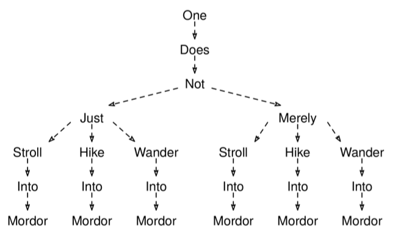

Given a non-empty string, sentence, and a non-empty map, synonyms, where each key is a single word in the sentence, and its value is a non-empty list of synonyms, return all possible sentences that can be created by replacing the words in the sentence with their synonyms. Words without synonyms should remain unchanged. The input sentence only contains lowercase letters and spaces, while the words in synonyms only contain lowercase letters. The order of the generated sentences in the output does not matter.

Example 1:
sentence = "one does not simply walk into mordor"
synonyms = {
  "walk": ["stroll", "hike", "wander"],
  "simply": ["just", "merely"]
}
Output: [
          "one does not just stroll into mordor",
          "one does not just hike into mordor",
          "one does not just wander into mordor",
          "one does not merely stroll into mordor",
          "one does not merely hike into mordor",
          "one does not merely wander into mordor"
        ]

Example 2:
sentence = "walk"
synonyms = {
  "walk": ["stroll"]
}
Output: ["stroll"]
Constraints:

sentence consists of lowercase letters and spaces.
The length of sentence is at most 500 characters.
sentence contains at most 100 words.
The synonyms map contains at most 8 entries.
The length of each synonym list is at most 6.
Each word in sentence or in the synonym lists is at most 10 characters.
See Solution
Problem 39.5 - Thesaurusly: Solution
JavaScript
We can use backtracking. We can build the output sentence one word at a time. For words without synonyms, keeping the word the same is the only choice. For words with synonyms, we have a choice per synonym.

Here is an example of how the decision tree looks like for Example 1:

Thesaurusly Solution

We can use the backtracking recipe:

def visit(partial_solution):
  if full_solution(partial_solution):
    # Process leaf/full solution.
  else:
    for choice in choices(partial_solution):
      # Prune children where possible.
      child = apply_choice(partial_solution)
      visit(child)

visit(empty_solution)
Creating partial sentences at each intermediate node would be expensive, especially if there are many words without synonyms. To avoid this, we can use the modify -> recurse -> undo reusable idea and reuse the same state (an array with the words in the current partial sentence) across all the nodes in the decision tree.

The key is to modify the state (add a word) right before the recursive call, and undo the change (remove that word) right after the recursive call.

Here is the implementation:

function generateSentences(sentence, synonyms) {
  const words = sentence.split(" ");
  const res = [];
  const curSentence = [];

  function visit(i) {
    if (i === words.length) {
      res.push(curSentence.join(" "));
      return;
    }

    const choices = synonyms[words[i]] || [words[i]];

    for (const choice of choices) {
      curSentence.push(choice);
      visit(i + 1);
      curSentence.pop(); // Undo change.
    }
  }

  visit(0);
  return res;
}
Time & Space Analysis
This problem is hard to analyze because it has many variables.

n: the length of sentence
w: the number of words in sentence
k: the number of words with synonyms
M: the maximum number of synonyms for any word
We can use the BAD method to analyze the time complexity: O(b^d * A), where

b is the maximum branching factor: M
d is the depth of the decision tree: w.
A is the additional (non-recursive) work per node: O(n) (for the copy at the leaves)
According to the BAD method, the total time is O(M^w * n).

However, we can do better. In the case of words without synonyms, the branching factor is 1, so those don't really blow up the size of the tree in the same way as words with synonyms.

The actual maximum number of leaves in the tree is M^k. The number of leaves times the height of the tree is also an upper bound for the number of nodes: M^k * w. Replacing b^d for this new value in the BAD formula, we get:

Time: O(M^k * w * n)
Extra space: O(M^k * n) - for the output array.
Tests
Here are some test cases to verify the solution:

function runTests() {
  const tests = [
    // Example from the book
    [
      "one does not simply walk into mordor",
      {
        walk: ["stroll", "hike", "wander"],
        simply: ["just", "merely"],
      },
      [
        "one does not just stroll into mordor",
        "one does not just hike into mordor",
        "one does not just wander into mordor",
        "one does not merely stroll into mordor",
        "one does not merely hike into mordor",
        "one does not merely wander into mordor",
      ],
    ],
    // Edge case - no synonyms
    ["hello world", {}, ["hello world"]],
    // Single word with synonyms
    ["walk", { walk: ["stroll", "hike"] }, ["stroll", "hike"]],
    // Multiple words, some with synonyms
    [
      "I walk to the park",
      { walk: ["stroll", "hike"] },
      ["I stroll to the park", "I hike to the park"],
    ],
  ];
  for (const [sentence, synonyms, want] of tests) {
    const got = generateSentences(sentence, synonyms);
    got.sort();
    want.sort();
    if (JSON.stringify(got) !== JSON.stringify(want)) {
      throw new Error(
        `\ngenerateSentences(${sentence}, ${JSON.stringify(synonyms)}): got: ${JSON.stringify(got)}, want: ${JSON.stringify(want)}\n`,
      );
    }
  }
}

runTests();
def generate_sentences(sentence, synonyms):
  words = sentence.split()
  res = []
  cur_sentence = []

  def visit(i):
    if i == len(words):
      res.append(" ".join(cur_sentence))
      return

    if words[i] not in synonyms:
      choices = [words[i]]
    else:
      choices = synonyms.get(words[i], [])

    for choice in choices:
      cur_sentence.append(choice)
      visit(i + 1)
      cur_sentence.pop() # Undo change.

  visit(0)
  return res

  def run_tests():
  tests = [
    # Example from the book
    ("one does not simply walk into mordor", {
      "walk": ["stroll", "hike", "wander"],
      "simply": ["just", "merely"]
    }, [
      "one does not just stroll into mordor",
      "one does not just hike into mordor",
      "one does not just wander into mordor",
      "one does not merely stroll into mordor",
      "one does not merely hike into mordor",
      "one does not merely wander into mordor"
    ]),
    # Edge case - no synonyms
    ("hello world", {}, ["hello world"]),
    # Single word with synonyms
    ("walk", {"walk": ["stroll", "hike"]}, ["stroll", "hike"]),
    # Multiple words, some with synonyms
    ("I walk to the park", {"walk": ["stroll", "hike"]}, [
      "I stroll to the park",
      "I hike to the park"
    ]),
  ]
  for sentence, synonyms, want in tests:
    got = generate_sentences(sentence, synonyms)
    got.sort()
    want.sort()
    assert got == want, f"\ngenerate_sentences({sentence}, {synonyms}): got: {got}, want: {want}\n"

run_tests()
class GenerateSentences {
  private String[] words;
  private List<String> res;
  private List<String> curSentence;
  private Map<String, List<String>> synonyms;

  private void visit(int i) {
    if (i == words.length) {
      res.add(String.join(" ", curSentence));
      return;
    }

    List<String> choices = synonyms.containsKey(words[i])
        ? synonyms.get(words[i])
        : Arrays.asList(words[i]);

    for (String choice : choices) {
      curSentence.add(choice);
      visit(i + 1);
      curSentence.remove(curSentence.size() - 1); // Undo change.
    }
  }

  public List<String> solve(String sentence, Map<String, List<String>> syns) {
    words = sentence.split(" ");
    res = new ArrayList<>();
    curSentence = new ArrayList<>();
    synonyms = syns;

    visit(0);
    return res;
  }
}
Time & Space Analysis
This problem is hard to analyze because it has many variables.

n: the length of sentence
w: the number of words in sentence
k: the number of words with synonyms
M: the maximum number of synonyms for any word
We can use the BAD method to analyze the time complexity: O(b^d * A), where

b is the maximum branching factor: M
d is the depth of the decision tree: w.
A is the additional (non-recursive) work per node: O(n) (for the copy at the leaves)
According to the BAD method, the total time is O(M^w * n).

However, we can do better. In the case of words without synonyms, the branching factor is 1, so those don't really blow up the size of the tree in the same way as words with synonyms.

The actual maximum number of leaves in the tree is M^k. The number of leaves times the height of the tree is also an upper bound for the number of nodes: M^k * w. Replacing b^d for this new value in the BAD formula, we get:

Time: O(M^k * w * n)
Extra space: O(M^k * n) - for the output array.
Tests
Here are some test cases to verify the solution:

class RunTests {
  private static class TestCase {
    String sentence;
    Map<String, List<String>> synonyms;
    String[] want;

    TestCase(String sentence, Object[][] synonymPairs, String[] want) {
      this.sentence = sentence;
      this.synonyms = Arrays.stream(synonymPairs)
          .collect(Collectors.toMap(
              pair -> (String) pair[0],
              pair -> Arrays.stream((String[]) pair[1])
                  .collect(Collectors.toList())));
      this.want = want;
    }
  }

  public void runTests() {
    TestCase[] tests = {
        // Example from the book
        new TestCase(
            "one does not simply walk into mordor",
            new Object[][] {
                { "walk", new String[] { "stroll", "hike", "wander" } },
                { "simply", new String[] { "just", "merely" } }
            },
            new String[] {
                "one does not just stroll into mordor",
                "one does not just hike into mordor",
                "one does not just wander into mordor",
                "one does not merely stroll into mordor",
                "one does not merely hike into mordor",
                "one does not merely wander into mordor"
            }),
        // Edge case - no synonyms
        new TestCase(
            "hello world",
            new Object[][] {},
            new String[] { "hello world" }),
        // Single word with synonyms
        new TestCase(
            "walk",
            new Object[][] {
                { "walk", new String[] { "stroll", "hike" } }
            },
            new String[] { "stroll", "hike" }),
        // Multiple words, some with synonyms
        new TestCase(
            "I walk to the park",
            new Object[][] {
                { "walk", new String[] { "stroll", "hike" } }
            },
            new String[] {
                "I stroll to the park",
                "I hike to the park"
            })
    };

    GenerateSentences solution = new GenerateSentences();
    for (TestCase test : tests) {
      List<String> got = solution.solve(test.sentence, test.synonyms);
      List<String> wantList = Arrays.asList(test.want);
      Collections.sort(got);
      Collections.sort(wantList);

      if (!got.equals(wantList)) {
        throw new RuntimeException(String.format(
            "\nsolve(%s, %s): got: %s, want: %s\n",
            test.sentence, test.synonyms, got, wantList));
      }
    }
  }
}

public class Solution {
  public static void main(String[] args) {
    new RunTests().runTests();
  }
}