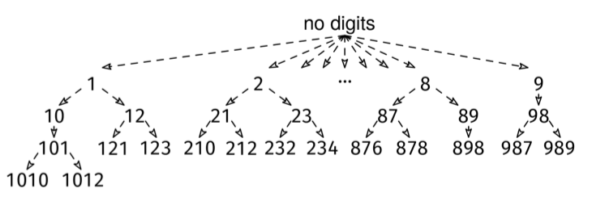

A jumping number is a positive integer where every two consecutive digits differ by one, such as 2343. Given a positive integer, n, return all jumping numbers smaller than n, ordered from smallest to largest.

Example 1: n = 34
Output: [1, 2, 3, 4, 5, 6, 7, 8, 9, 10, 12, 21, 23, 32]

Example 2: n = 1
Output: []
Constraints:

n is a positive integer less than 10^5.
See Solution
Problem 39.6 - Jumping Numbers: Solution
Java
The naive solution is to take every number from 1 to n and check if it is a jumping number. This takes O(n * T) time, where T is the time to check whether a number is jumping or not. Depending on whether we model integers as constant-size or not, T is either O(1) or O(log n).

However, most numbers are not jumping numbers, so this does a lot of unnecessary work we can skip. We can use backtracking to generate only numbers that are jumping.

The decision tree looks like this:

Jumping Numbers Solution

We start with no digits, and we add digits one by one, respecting the 'jumping number' constraint. There are two things to keep in mind:

The numbers at non-leaf nodes are valid jumping numbers too, so we need to add to the global output array at every node, not only the leaves.
The backtracking visit order is not the sorted order. In the sorted order, 2 goes after 1, but in the recursive DFS order, we would find all numbers starting with 1, like 12, before getting to 2. We can add a sorting postprocessing step at the end.
We use the backtracking recipe:

def visit(partial_solution):
  if full_solution(partial_solution):
    # Process leaf/full solution.
  else:
    for choice in choices(partial_solution):
      # Prune children where possible.
      child = apply_choice(partial_solution)
      visit(child)

visit(empty_solution)
Here is the implementation:

class JumpingNumbers {
  private List<Integer> res;
  private int n;

  private void visit(int num) {
    if (num >= n) {
      return;
    }
    res.add(num);
    int lastDigit = num % 10;
    if (lastDigit > 0) {
      visit(num * 10 + (lastDigit - 1));
    }
    if (lastDigit < 9) {
      visit(num * 10 + (lastDigit + 1));
    }
  }

  public List<Integer> solve(int n) {
    this.n = n;
    res = new ArrayList<>();
    for (int num = 1; num < 10; num++) {
      visit(num);
    }
    Collections.sort(res);
    return res;
  }
}
The logic for extracting and adding the least significant digit works as follows:

If x is a positive integer, x % 10 is the least significant digit.
If x is a positive integer and we want to add a new least significant digit, d, we can do x = x * 10 + d.
We prune numbers that are too large. For convenience, we do it lazily.

Time & Space Analysis
n: the input number
For the analysis, we can apply the BAD method: O(b^d * A), where

b is the branching factor: besides the root, the maximum branching factor is 2. The root has a branching factor of 9 but, since it is only one node, we can ignore it. Having 9 children at the root blows up the runtime by a factor of 9, which is a constant factor.
d is the depth of the decision tree: at each level, we add a digit. Numbers smaller than n have at most log_10(n) digits.
A is the additional (non-recursive) work per node: O(1).
Per the BAD method, the total runtime is O(2^(log_10(n))). Remember: the base of the exponent cannot be simplified away when the logarithm is in the exponent! But if we remember the property of logarithms that a^(log_b(c)) = c^(log_b(a)), we can further simplify this to O(n^(log_10(2))) = O(n^0.302).

The final array also contains O(n^0.302) elements.

Since we need to do a sorting step at the end, total runtime is O(n^0.302 * log(n^0.302)) = O(n^0.302 * log n).

To avoid having to sort, we could use BFS instead of DFS. Since this is an enumeration problem and we need to store all jumping numbers in the output array, the BFS queue would not be the space bottleneck. While BFS is faster by a logarithmic factor for this problem, it's probably not worth the effort learning to BFS over decision trees when DFS covers the majority of cases.

Some people may think, "Since backtracking is so slow, I might as well simply iterate through all the numbers from 1 to n and check which ones are jumping numbers." However, O(n^0.302 * log n) is much smaller than O(n). For example, 1000^0.302 is approximately 16.

Time: O(n^0.302 * log n)
Extra space: O(n^0.302) - for the output array.
Tests
Here are some test cases to verify the solution:

class RunTests {
  public void runTests() {
    Object[][] tests = {
        // Example from the book
        { 34, new int[] { 1, 2, 3, 4, 5, 6, 7, 8, 9, 10, 12, 21, 23, 32 } },
        // Edge case - n is 1
        { 1, new int[] {} },
        { 10, new int[] { 1, 2, 3, 4, 5, 6, 7, 8, 9 } },
        // Larger n
        { 50, new int[] { 1, 2, 3, 4, 5, 6, 7, 8, 9, 10, 12, 21, 23, 32, 34, 43,
            45 } },
        { 102,
            new int[] { 1, 2, 3, 4, 5, 6, 7, 8, 9, 10, 12, 21, 23, 32, 34, 43,
                45, 54, 56, 65, 67, 76, 78, 87, 89, 98, 101 } },
    };

    JumpingNumbers solution = new JumpingNumbers();
    for (Object[] test : tests) {
      int n = (int) test[0];
      int[] wantArray = (int[]) test[1];
      List<Integer> want = Arrays.stream(wantArray)
          .boxed()
          .collect(Collectors.toList());
      List<Integer> got = solution.solve(n);
      if (!got.equals(want)) {
        throw new RuntimeException(String.format(
            "\nsolve(%d): got: %s, want: %s\n",
            n, got, want));
      }
    }
  }
}

public class Solution {
  public static void main(String[] args) {
    new RunTests().runTests();
  }
}

def jumping_numbers(n):
  res = []

  def visit(num):
    if num >= n:
      return
    res.append(num)
    last_digit = num % 10
    if last_digit > 0:
      visit(num * 10 + (last_digit - 1))
    if last_digit < 9:
      visit(num * 10 + (last_digit + 1))

  for num in range(1, 10):
    visit(num)
  return sorted(res)
The logic for extracting and adding the least significant digit works as follows:

If x is a positive integer, x % 10 is the least significant digit.
If x is a positive integer and we want to add a new least significant digit, d, we can do x = x * 10 + d.
We prune numbers that are too large. For convenience, we do it lazily.

Time & Space Analysis
n: the input number
For the analysis, we can apply the BAD method: O(b^d * A), where

b is the branching factor: besides the root, the maximum branching factor is 2. The root has a branching factor of 9 but, since it is only one node, we can ignore it. Having 9 children at the root blows up the runtime by a factor of 9, which is a constant factor.
d is the depth of the decision tree: at each level, we add a digit. Numbers smaller than n have at most log_10(n) digits.
A is the additional (non-recursive) work per node: O(1).
Per the BAD method, the total runtime is O(2^(log_10(n))). Remember: the base of the exponent cannot be simplified away when the logarithm is in the exponent! But if we remember the property of logarithms that a^(log_b(c)) = c^(log_b(a)), we can further simplify this to O(n^(log_10(2))) = O(n^0.302).

The final array also contains O(n^0.302) elements.

Since we need to do a sorting step at the end, total runtime is O(n^0.302 * log(n^0.302)) = O(n^0.302 * log n).

To avoid having to sort, we could use BFS instead of DFS. Since this is an enumeration problem and we need to store all jumping numbers in the output array, the BFS queue would not be the space bottleneck. While BFS is faster by a logarithmic factor for this problem, it's probably not worth the effort learning to BFS over decision trees when DFS covers the majority of cases.

Some people may think, "Since backtracking is so slow, I might as well simply iterate through all the numbers from 1 to n and check which ones are jumping numbers." However, O(n^0.302 * log n) is much smaller than O(n). For example, 1000^0.302 is approximately 16.

Time: O(n^0.302 * log n)
Extra space: O(n^0.302) - for the output array.
Tests
Here are some test cases to verify the solution:

def run_tests():
  tests = [
      # Example from the book
      (34, [1, 2, 3, 4, 5, 6, 7, 8, 9, 10, 12, 21, 23, 32]),
      # Edge case - n is 1
      (1, []),
      (10, [1, 2, 3, 4, 5, 6, 7, 8, 9]),
      # Larger n
      (50, [1, 2, 3, 4, 5, 6, 7, 8, 9, 10, 12, 21, 23, 32, 34, 43, 45]),
      (102, [1, 2, 3, 4, 5, 6, 7, 8, 9, 10, 12, 21, 23, 32,
             34, 43, 45, 54, 56, 65, 67, 76, 78, 87, 89, 98, 101]),
  ]
  for n, want in tests:
    got = jumping_numbers(n)
    assert got == want, f"\njumping_numbers({n}): got: {got}, want: {want}\n"

run_tests()
function jumpingNumbers(n) {
  const res = [];

  function visit(num) {
    if (num >= n) {
      return;
    }
    res.push(num);
    const lastDigit = num % 10;
    if (lastDigit > 0) {
      visit(num * 10 + (lastDigit - 1));
    }
    if (lastDigit < 9) {
      visit(num * 10 + (lastDigit + 1));
    }
  }

  for (let num = 1; num < 10; num++) {
    visit(num);
  }
  return res.sort((a, b) => a - b);
}
The logic for extracting and adding the least significant digit works as follows:

If x is a positive integer, x % 10 is the least significant digit.
If x is a positive integer and we want to add a new least significant digit, d, we can do x = x * 10 + d.
We prune numbers that are too large. For convenience, we do it lazily.

Time & Space Analysis
n: the input number
For the analysis, we can apply the BAD method: O(b^d * A), where

b is the branching factor: besides the root, the maximum branching factor is 2. The root has a branching factor of 9 but, since it is only one node, we can ignore it. Having 9 children at the root blows up the runtime by a factor of 9, which is a constant factor.
d is the depth of the decision tree: at each level, we add a digit. Numbers smaller than n have at most log_10(n) digits.
A is the additional (non-recursive) work per node: O(1).
Per the BAD method, the total runtime is O(2^(log_10(n))). Remember: the base of the exponent cannot be simplified away when the logarithm is in the exponent! But if we remember the property of logarithms that a^(log_b(c)) = c^(log_b(a)), we can further simplify this to O(n^(log_10(2))) = O(n^0.302).

The final array also contains O(n^0.302) elements.

Since we need to do a sorting step at the end, total runtime is O(n^0.302 * log(n^0.302)) = O(n^0.302 * log n).

To avoid having to sort, we could use BFS instead of DFS. Since this is an enumeration problem and we need to store all jumping numbers in the output array, the BFS queue would not be the space bottleneck. While BFS is faster by a logarithmic factor for this problem, it's probably not worth the effort learning to BFS over decision trees when DFS covers the majority of cases.

Some people may think, "Since backtracking is so slow, I might as well simply iterate through all the numbers from 1 to n and check which ones are jumping numbers." However, O(n^0.302 * log n) is much smaller than O(n). For example, 1000^0.302 is approximately 16.

Time: O(n^0.302 * log n)
Extra space: O(n^0.302) - for the output array.
Tests
Here are some test cases to verify the solution:

function runTests() {
  const tests = [
    // Example from the book
    [34, [1, 2, 3, 4, 5, 6, 7, 8, 9, 10, 12, 21, 23, 32]],
    // Edge case - n is 1
    [1, []],
    [10, [1, 2, 3, 4, 5, 6, 7, 8, 9]],
    // Larger n
    [50, [1, 2, 3, 4, 5, 6, 7, 8, 9, 10, 12, 21, 23, 32, 34, 43, 45]],
    [
      102,
      [
        1, 2, 3, 4, 5, 6, 7, 8, 9, 10, 12, 21, 23, 32, 34, 43, 45, 54, 56, 65,
        67, 76, 78, 87, 89, 98, 101,
      ],
    ],
  ];
  for (const [n, want] of tests) {
    const got = jumpingNumbers(n);
    if (JSON.stringify(got) !== JSON.stringify(want)) {
      throw new Error(
        `\njumpingNumbers(${n}): got: ${JSON.stringify(got)}, want: ${JSON.stringify(want)}\n`,
      );
    }
  }
}

runTests();
