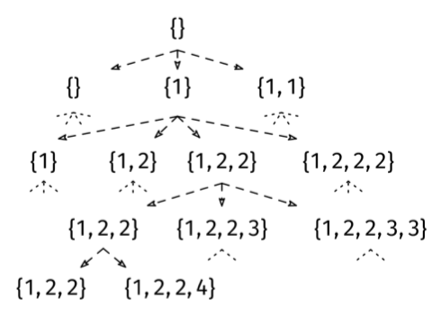

A multiset is a set that allows repeated elements. A submultiset of a multiset S is another multiset obtained by removing any number of elements from S.

We are given an array with n integers representing a multiset (it can have duplicates).

Return the number of unique submultisets of S with sum 0, ignoring which position in S the values came from.

Example 1: S = [1, 1, -1, -1]
Output: 3. The unique submultisets with sum 0 are [], [1, 1, -1, -1] and [1,
-1]. The last one can be obtained in more than one way.

Example 2: S = []
Output: 1. [] is a submultiset of [] with sum 0.

Example 3: S = [-1, 2, 1, 0, 3]
Output: 4. The unique submultiset with sum 0 are [-1, 1], [-1, 1, 0], [0], and
[].
Constraints:

The length of S is at most 20.
The elements in S are integers.
See Solution
Problem 39.9 - Count Unique Submultisets with Sum Zero: Solution
Java
First of all, this is a counting problem, which is a trigger for trying to optimize with DP (Dynamic Programming). However, just finding one subset with sum 0 is known as the subset-sum problem, and it is already an NP-complete problem, so we definitely cannot expect to do better than exponential time. Backtracking is the best we can do.

Since this is a subset-based problem, we could follow the typical backtracking where we make a decision for each element: pick it or skip it. This would work perfectly if the elements were all unique. The issue is that different sequences of choices can lead up to the same submultiset. For instance, if the input is [1, 1, -1, -1], we can get the submultiset [1, -1] with (pick, skip, pick, skip) and also with (skip, pick, pick, skip).

One workaround is to store all submultisets with sum 0 in a global set, which will take care of removing duplicates. At the end, we can return the size of the set. The issue with this approach is that our space complexity becomes exponential: the worst-case input might be something like [1, -1, 2, -2, 3, -3, ..., n/2, -n/2], which has more than 2^n/2 subsets with sum 0 (there are n/2 pairs of indices, [0, 1], [2, 3], [4, 5], ... which we can independently add or remove from any subset while keeping the sum at 0).

Recall that the main way of optimizing backtracking is picking a better decision tree. Is there a better way to model the problem as a decision tree? Yes! Instead of deciding individually for each element whether to pick it or not, our choice can be: "how many copies of this element should I pick?"

For instance, if the input is [1, 1, 2, 2, 2, 3, 3, 4], the first choice is, "should I include zero, one, or two 1's?" The second choice is, "should I include zero, one, two, or three 2's?" And so on:

Count Unique Submultisets With Sum Zero Solution

This figure shows part of the decision tree for input [1, 1, 2, 2, 2, 3, 3, 4], including two leaves.

This decision tree guarantees that we never generate repeated submultisets, allowing us to skip the global set and reduce the space complexity to O(n). In the best case, (e.g., if all the input elements are the same), the decision tree will also be much smaller. However, in the worst case (e.g., if all elements in the input are unique), the decision tree will have O(2^n) leaves, as usual.

We can use the backtracking recipe:

def visit(partial_solution):
  if full_solution(partial_solution):
    # Process leaf/full solution.
  else:
    for choice in choices(partial_solution):
      # Prune children where possible.
      child = apply_choice(partial_solution)
      visit(child)

visit(empty_solution)
In the implementation, we can start by building a frequency map mapping elements to how many times they appear in S. Each key in the frequency map becomes one of the decisions, and the value becomes the number of choices for that decision (plus one more choice for skipping the element altogether).

Here is the implementation:

class CountUniqueSubmultisetsWithSumZero {
  private List<Integer> uniqueElements;
  private Map<Integer, Integer> frequency;

  private int visit(int index, int currentSum) {
    if (index == uniqueElements.size()) {
      return currentSum == 0 ? 1 : 0;
    }

    int element = uniqueElements.get(index);
    int count = frequency.get(element);
    int totalCount = 0;

    // Try all possible counts of the current element
    for (int i = 0; i <= count; i++) {
      totalCount += visit(index + 1, currentSum + i * element);
    }

    return totalCount;
  }

  public int solve(int[] S) {
    frequency = new HashMap<>();
    uniqueElements = new ArrayList<>();

    // Build frequency map
    for (int num : S) {
      frequency.put(num, frequency.getOrDefault(num, 0) + 1);
    }

    // Extract unique elements
    uniqueElements.addAll(frequency.keySet());

    return visit(0, 0);
  }
}
Time & Space Analysis
n: the length of the input array S
The worst case is when all the input elements are unique, in which case the decision tree has O(2^n) nodes (like normal subset-based problems), and the runtime is O(2^n).

How do we know it is the worst case? Imagine that every number appeared twice instead. Then, the branching factor would be 3, but the depth would be n/2. The runtime would be O(3^(n/2)), which is approximately O(1.73^n) (this requires a bit of calculus). If each number appeared three times instead, the runtime would be O(4^(n/3)), which is approximately O(1.59^n). As you can see, more duplicates makes the decision tree smaller.

Time: O(2^n), as usual with subset-based problems.
Extra space: O(n) for the call stack and the frequency map.
Tests
Here are some test cases to verify the solution:

class RunTests {
  public void runTests() {
    Object[][] tests = {
        // Example 1 from the book
        { new int[] { 1, 1, -1, -1 }, 3 },
        // Example 2 from the book
        { new int[] {}, 1 },
        // Example 3 from the book
        { new int[] { -1, 2, 1, 0, 3 }, 4 },
        // Edge case - no zero-sum submultisets
        { new int[] { 1, 2, 3 }, 1 },
        // Edge case - all zeros
        { new int[] { 0, 0, 0 }, 4 }
    };

    CountUniqueSubmultisetsWithSumZero solution = new CountUniqueSubmultisetsWithSumZero();
    for (Object[] test : tests) {
      int[] S = (int[]) test[0];
      int want = (int) test[1];
      int got = solution.solve(S);
      if (got != want) {
        throw new RuntimeException(String.format(
            "\nsolve(%s): got: %d, want: %d\n",
            Arrays.toString(S), got, want));
      }
    }
  }
}

public class Solution {
  public static void main(String[] args) {
    new RunTests().runTests();
  }
}

def count_unique_submultisets_with_sum_zero(S):

  def visit(index, current_sum):
    if index == len(unique_elements):
      return 1 if current_sum == 0 else 0

    element = unique_elements[index]
    count = frequency[element]
    total_count = 0

    # Try all possible counts of the current element
    for i in range(count + 1):
      total_count += visit(index + 1, current_sum + i * element)

    return total_count

  frequency = Counter(S)
  unique_elements = list(frequency.keys())
  return visit(0, 0)
Time & Space Analysis
n: the length of the input array S
The worst case is when all the input elements are unique, in which case the decision tree has O(2^n) nodes (like normal subset-based problems), and the runtime is O(2^n).

How do we know it is the worst case? Imagine that every number appeared twice instead. Then, the branching factor would be 3, but the depth would be n/2. The runtime would be O(3^(n/2)), which is approximately O(1.73^n) (this requires a bit of calculus). If each number appeared three times instead, the runtime would be O(4^(n/3)), which is approximately O(1.59^n). As you can see, more duplicates makes the decision tree smaller.

Time: O(2^n), as usual with subset-based problems.
Extra space: O(n) for the call stack and the frequency map.
Tests
Here are some test cases to verify the solution:

def run_tests():
  tests = [
      # Example 1 from the book
      ([1, 1, -1, -1], 3),
      # Example 2 from the book
      ([], 1),
      # Example 3 from the book
      ([-1, 2, 1, 0, 3], 4),
      # Edge case - no zero-sum submultisets
      ([1, 2, 3], 1),
      # Edge case - all zeros
      ([0, 0, 0], 4),
  ]
  for S, want in tests:
    got = count_unique_submultisets_with_sum_zero(S)
    assert got == want, f"\ncount_unique_submultisets_with_sum_zero({S}): got: {
        got}, want: {want}\n"

run_tests()

function countUniqueSubmultisetsWithSumZero(S) {

  function visit(index, currentSum) {
    if (index === uniqueElements.length) {
      return currentSum === 0 ? 1 : 0;
    }

    const element = uniqueElements[index];
    const count = frequency.get(element);
    let totalCount = 0;

    // Try all possible counts of the current element
    for (let i = 0; i <= count; i++) {
      totalCount += visit(index + 1, currentSum + i * element);
    }

    return totalCount;
  }

  const frequency = new Map();
  // Build frequency map
  for (const num of S) {
    frequency.set(num, (frequency.get(num) || 0) + 1);
  }

  // Extract unique elements
  const uniqueElements = Array.from(frequency.keys());

  return visit(0, 0);
}
Time & Space Analysis
n: the length of the input array S
The worst case is when all the input elements are unique, in which case the decision tree has O(2^n) nodes (like normal subset-based problems), and the runtime is O(2^n).

How do we know it is the worst case? Imagine that every number appeared twice instead. Then, the branching factor would be 3, but the depth would be n/2. The runtime would be O(3^(n/2)), which is approximately O(1.73^n) (this requires a bit of calculus). If each number appeared three times instead, the runtime would be O(4^(n/3)), which is approximately O(1.59^n). As you can see, more duplicates makes the decision tree smaller.

Time: O(2^n), as usual with subset-based problems.
Extra space: O(n) for the call stack and the frequency map.
Tests
Here are some test cases to verify the solution:

function runTests() {
  const tests = [
    // Example 1 from the book
    [[1, 1, -1, -1], 3],
    // Example 2 from the book
    [[], 1],
    // Example 3 from the book
    [[-1, 2, 1, 0, 3], 4],
    // Edge case - no zero-sum submultisets
    [[1, 2, 3], 1],
    // Edge case - all zeros
    [[0, 0, 0], 4],
  ];

  for (const [S, want] of tests) {
    const got = countUniqueSubmultisetsWithSumZero(S);
    if (got !== want) {
      throw new Error(
        `\ncountUniqueSubmultisetsWithSumZero(${JSON.stringify(S)}): got: ${got}, want: ${want}\n`,
      );
    }
  }
}

runTests();

