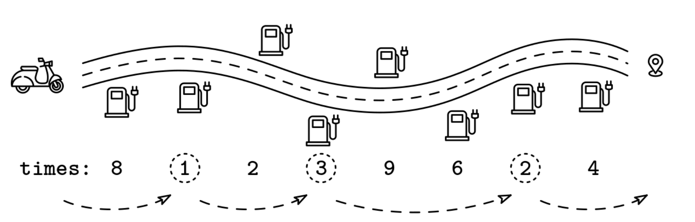
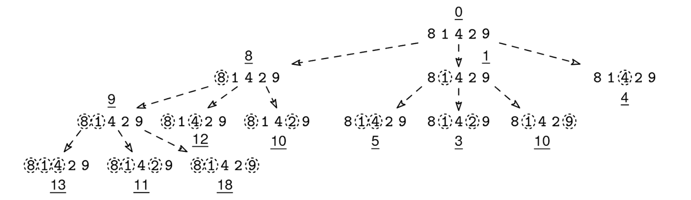
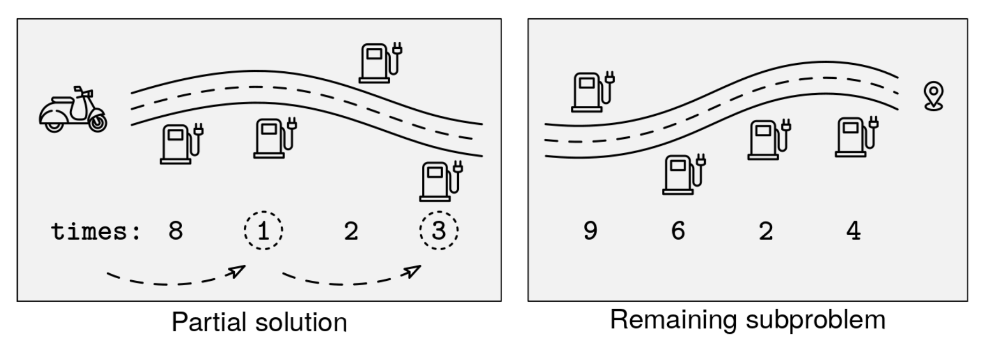
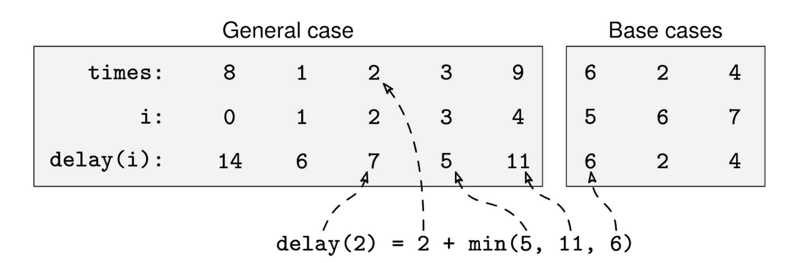
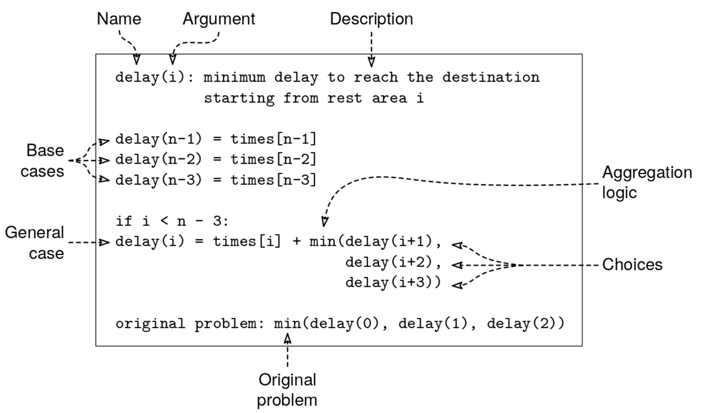

We are driving down a road with n rest stops between us and our destination. For each rest stop, our mapping software tells us how long of a detour it would be to stop there. We start before the first rest stop and our destination is past the last one.

We are given an array of n positive integers, times, indicating the delay incurred to stop at each rest stop. If we don't want to go more than 2 rest stops without taking a break, what's the least amount of time we have to spend on detours?

Example 1:
times = [8, 1, 2, 3, 9, 6, 2, 4]
Output: 6. The optimal rest stops are: [8, *1*, 2, *3*, 9, 6, *2*, 4]

Example 2:
times = [8, 1, 2, 3, 9, 3, 2, 4]
Output: 5. The optimal rest stops are: [8, 1, *2*, 3, 9, *3*, 2, 4]

Example 3:
times = [10, 10]
Output: 0. We don't need to make any stops.

Example 4:
times = [10]
Output: 0. We don't need to make any stops.

Example 5:
times = []
Output: 0. We don't need to make any stops.
Check out the figure below for an illustration of the first example:

Road trip problem

Constraints:

n is at least 0 and at most 10^6.
times[i] is at least 1 and at most 10^3.

Problem 40.1 - Road Trip: Solution
Python
You might be tempted to always just pick the smallest delay between the next three indices. This would be a greedy algorithm but, as shown in Example 1, this is suboptimal. For the second stop, we must pick 3 and not 2.

We can find the optimal stops with DP (Dynamic Programming). Let's start by finding a recurrence relation.

1. Decision tree: The first step is to frame the solution in terms of a decision tree. The root is where we start the road trip. The decisions are where to take the next break. We have three choices: we can go to the next rest stop, skip one rest stop, or skip two. Each partial solution is a list of breaks we have taken so far. A leaf is when we don't need more breaks.

This figure shows the decision tree for input [8, 1, 4, 2, 9]. The circles indicate the stops chosen at each partial solution. The total detour time so far for each partial solution is underlined. Leaves are partial solutions where we can reach the end without any more breaks.

Road trip solution 1

2. Subproblems: From the decision tree, we can think of what the subproblems should be. For each partial solution, the remaining subproblem is the suffix of rest stops after our location. It's like starting the road trip from a rest stop in the middle of the road.

Road trip solution 2

3. Recurrence relation: This is where it all comes together. Let's say we stop at the rest area at index i. We want to find a formula, delay(i), that returns the minimum delay needed to get from rest stop i to the destination. Our choices are to go to rest areas i + 1, i + 2, or i + 3. Of the three options, we want to pick the shortest one overall, so we can aggregate them by taking the min.

delay(i) = times[i] + min(delay(i+1), delay(i+2), delay(i+3))

We need to be careful around edge cases: this only works if there are at least three rest stops. If there are fewer than three, we can jump directly to the goal. Those are our base cases:

delay(n-1) = times[n-1]
delay(n-2) = times[n-2]
delay(n-3) = times[n-3]
Road trip solution 3

(There is a typo in the image above: delay(0) is 13, not 14.)

Our initial three choices are rest areas 0, 1, and 2. This means that the solution to the original problem is min(delay(0), delay(1), delay(2)).

We recommend writing down the recurrence relation before starting to code. We'd write something like this:

Road trip solution 4

If we have fully specified the recurrence relation, turning it into inefficient recursive code is straightforward. Here is the code:

def delay_inefficient(times):  # Inefficient -- do not use in interviews.
  n = len(times)
  if n < 3:
    return 0

  def delay_rec(i):
    if i >= n - 3:
      return times[i]
    return times[i] + min(delay_rec(i + 1), delay_rec(i + 2), delay_rec(i + 3))

  return min(delay_rec(0), delay_rec(1), delay_rec(2))
This code correctly solves the problem, but it is very inefficient. This code makes one call to delay() for each node in the decision tree, and, like most decision trees, it grows exponentially on the input size. The point of DP is that this is not necessary. In the decision tree, we can see that we can get to the rest area at index 2 in four different ways. That means we compute the recurrence relation for subproblem [2, 9] four times. This is what we call overlapping subproblems. Overlapping subproblems are repeated work. As you can imagine, the amount of repeated work grows exponentially as n grows.

Thankfully, the fix is straightforward: we just need to cache or 'memoize' the solutions to subproblems the first time we compute them. Then, if we reach that subproblem again, we just return the cached value. We never recurse again for the same subproblem.

In practice, this memoization looks like a hash map with subproblems as keys and subproblem solutions as values (we call it memo). Here is the memoization recipe:

memo = empty map

f(subproblem_id):
  if subproblem is base case:
    return result directly
  if subproblem in memo map:
    return cached result

  memo[subproblem_id] = recurrence relation formula
  return memo[subproblem_id]

return f(initial subproblem)
And here it is applied to this problem:

def delay_memoized(times):
  n = len(times)
  if n < 3:
    return 0

  memo = {}

  def delay_rec(i):
    if i >= n - 3:
      return times[i]
    if i in memo:
      return memo[i]
    memo[i] = times[i] + \
        min(delay_rec(i + 1), delay_rec(i + 2), delay_rec(i + 3))
    return memo[i]

  return min(delay_rec(0), delay_rec(1), delay_rec(2))
Time & Space Analysis
n: the number of rest stops
DP analysis is straightforward. We care about two things:

The number of subproblems.
The non-recursive work for each subproblem (whin it is not cached).
We multiply the two to get the overall amount of work. This works because, thanks to memoization, we only compute each subproblem once.

The space is typically the number of subproblems, since we usually only store an integer value for each one in the memo map.

For this problem, we have:

Subproblems: n.
Non-recursive work: O(1).
Time: O(n).
Extra space: O(n) - for the memo map.
Bonus: Tabulation
We marked this problem as 'easy' (as far as DP problems go), but if you start implementing the extra credit tabulation and get stuck, don't worry! That stuff is a little more advanced and probably worth a medium rating. Here is the tabulated solution for this problem:

def delay_tabulated(times):
  n = len(times)
  if n < 3:
    return 0

  dp = [0] * n
  dp[n - 1], dp[n - 2], dp[n - 3] = times[n - 1], times[n - 2], times[n - 3]
  for i in range(n - 4, -1, -1):
    dp[i] = times[i] + min(dp[i + 1], dp[i + 2], dp[i + 3])
  return min(dp[0], dp[1], dp[2])
And for the serious studiers, here is the tabulated solution with the rolling space optimization:

def delay_tabulated_w_space_optimization(times):
  n = len(times)
  if n < 3:
    return 0
  dp1, dp2, dp3 = times[n - 3], times[n - 2], times[n - 1]
  for i in range(n - 4, -1, -1):
    cur = times[i] + min(dp1, dp2, dp3)
    dp1, dp2, dp3 = cur, dp1, dp2
  return min(dp1, dp2, dp3)
This improves the extra space from O(n) to O(1).

Tests
Here are some test cases to verify the solution:

def run_tests():
  tests = [
      ([8, 1, 2, 3, 9, 6, 2, 4], 6),
      ([8, 1, 2, 3, 9, 3, 2, 4], 5),
      ([10, 10], 0),
      ([1, 2, 3, 4, 5, 6, 7, 8, 9], 12),
      ([5, 5, 5, 5, 5, 5, 5, 5, 5], 15),
      ([1, 1, 1, 1, 1, 1, 1, 1, 1, 1], 3),
      ([1, 2, 3], 1),
      ([1, 2], 0),
      ([1], 0),
      ([], 0),
  ]
  for times, want in tests:
    got = delay_inefficient(times)
    got_memoized = delay_memoized(times)
    got_tabulated = delay_tabulated(times)
    got_tabulated_w_space_optimization = delay_tabulated_w_space_optimization(
        times)
    assert got == got_memoized == got_tabulated == got_tabulated_w_space_optimization, f"\ndelay_inefficient({
        times}) != delay_memoized({times}) != delay_tabulated({times}) != delay_tabulated_w_space_optimization({times})\n"
    assert got == want, f"\ndelay({times}): got: {got}, want: {want}\n"

run_tests()
Recipe 1 - Memoization

memo = empty map

def f(subproblem_id):
  if subproblem is base case:
    return result directly
  if subproblem in memo map:
    return cached result

  memo[subproblem_id] = recurrence relation formula
  return memo[subproblem_id]

return f(initial subproblem)

function delayInefficient(times) {
  const n = times.length;
  if (n < 3) {
    return 0;
  }

  function delayRec(i) {
    if (i >= n - 3) {
      return times[i];
    }
    return (
      times[i] + Math.min(delayRec(i + 1), delayRec(i + 2), delayRec(i + 3))
    );
  }

  return Math.min(delayRec(0), delayRec(1), delayRec(2));
}
This code correctly solves the problem, but it is very inefficient. This code makes one call to delay() for each node in the decision tree, and, like most decision trees, it grows exponentially on the input size. The point of DP is that this is not necessary. In the decision tree, we can see that we can get to the rest area at index 2 in four different ways. That means we compute the recurrence relation for subproblem [2, 9] four times. This is what we call overlapping subproblems. Overlapping subproblems are repeated work. As you can imagine, the amount of repeated work grows exponentially as n grows.

Thankfully, the fix is straightforward: we just need to cache or 'memoize' the solutions to subproblems the first time we compute them. Then, if we reach that subproblem again, we just return the cached value. We never recurse again for the same subproblem.

In practice, this memoization looks like a hash map with subproblems as keys and subproblem solutions as values (we call it memo). Here is the memoization recipe:

memo = empty map

f(subproblem_id):
  if subproblem is base case:
    return result directly
  if subproblem in memo map:
    return cached result

  memo[subproblem_id] = recurrence relation formula
  return memo[subproblem_id]

return f(initial subproblem)
And here it is applied to this problem:

function delayMemoized(times) {
  const n = times.length;
  if (n < 3) {
    return 0;
  }

  const memo = new Array(n).fill(-1);

  function delayRec(i) {
    if (i >= n - 3) {
      return times[i];
    }
    if (memo[i] !== -1) {
      return memo[i];
    }
    memo[i] =
      times[i] + Math.min(delayRec(i + 1), delayRec(i + 2), delayRec(i + 3));
    return memo[i];
  }

  return Math.min(delayRec(0), delayRec(1), delayRec(2));
}
Time & Space Analysis
n: the number of rest stops
DP analysis is straightforward. We care about two things:

The number of subproblems.
The non-recursive work for each subproblem (whin it is not cached).
We multiply the two to get the overall amount of work. This works because, thanks to memoization, we only compute each subproblem once.

The space is typically the number of subproblems, since we usually only store an integer value for each one in the memo map.

For this problem, we have:

Subproblems: n.
Non-recursive work: O(1).
Time: O(n).
Extra space: O(n) - for the memo map.
Bonus: Tabulation
We marked this problem as 'easy' (as far as DP problems go), but if you start implementing the extra credit tabulation and get stuck, don't worry! That stuff is a little more advanced and probably worth a medium rating. Here is the tabulated solution for this problem:

function delayTabulated(times) {
  const n = times.length;
  if (n < 3) {
    return 0;
  }

  const dp = new Array(n);
  dp[n - 1] = times[n - 1];
  dp[n - 2] = times[n - 2];
  dp[n - 3] = times[n - 3];
  for (let i = n - 4; i >= 0; i--) {
    dp[i] = times[i] + Math.min(dp[i + 1], dp[i + 2], dp[i + 3]);
  }
  return Math.min(dp[0], dp[1], dp[2]);
}
And for the serious studiers, here is the tabulated solution with the rolling space optimization:

function delayTabulatedWSpaceOptimization(times) {
  const n = times.length;
  if (n < 3) {
    return 0;
  }
  let dp1 = times[n - 3],
    dp2 = times[n - 2],
    dp3 = times[n - 1];
  for (let i = n - 4; i >= 0; i--) {
    const cur = times[i] + Math.min(dp1, dp2, dp3);
    dp3 = dp2;
    dp2 = dp1;
    dp1 = cur;
  }
  return Math.min(dp1, dp2, dp3);
}
This improves the extra space from O(n) to O(1).

Tests
Here are some test cases to verify the solution:

function runTests() {
  const tests = [
    [[8, 1, 2, 3, 9, 6, 2, 4], 6],
    [[8, 1, 2, 3, 9, 3, 2, 4], 5],
    [[10, 10], 0],
    [[1, 2, 3, 4, 5, 6, 7, 8, 9], 12],
    [[5, 5, 5, 5, 5, 5, 5, 5, 5], 15],
    [[1, 1, 1, 1, 1, 1, 1, 1, 1, 1], 3],
    [[1, 2, 3], 1],
    [[1, 2], 0],
    [[1], 0],
    [[], 0],
  ];

  for (const [times, want] of tests) {
    const gotInefficient = delayInefficient(times);
    const gotMemoized = delayMemoized(times);
    const gotTabulated = delayTabulated(times);
    const gotSpaceOpt = delayTabulatedWSpaceOptimization(times);

    if (
      !(
        gotInefficient === gotMemoized &&
        gotMemoized === gotTabulated &&
        gotTabulated === gotSpaceOpt &&
        gotInefficient === want
      )
    ) {
      throw new Error(
        `\ndelay(${JSON.stringify(times)}): got inefficient: ${gotInefficient}, ` +
        `got memoized: ${gotMemoized}, got tabulated: ${gotTabulated}, ` +
        `got space opt: ${gotSpaceOpt}, want: ${want}\n`,
      );
    }
  }
}

runTests();

class DelayInefficient {
  private int delayRec(int[] times, int i) {
    int n = times.length;
    if (i >= n - 3) {
      return times[i];
    }
    return times[i] + Math.min(Math.min(delayRec(times, i + 1),
        delayRec(times, i + 2)),
        delayRec(times, i + 3));
  }

  public int solve(int[] times) {
    int n = times.length;
    if (n < 3) {
      return 0;
    }
    return Math.min(Math.min(delayRec(times, 0),
        delayRec(times, 1)),
        delayRec(times, 2));
  }
}
This code correctly solves the problem, but it is very inefficient. This code makes one call to delay() for each node in the decision tree, and, like most decision trees, it grows exponentially on the input size. The point of DP is that this is not necessary. In the decision tree, we can see that we can get to the rest area at index 2 in four different ways. That means we compute the recurrence relation for subproblem [2, 9] four times. This is what we call overlapping subproblems. Overlapping subproblems are repeated work. As you can imagine, the amount of repeated work grows exponentially as n grows.

Thankfully, the fix is straightforward: we just need to cache or 'memoize' the solutions to subproblems the first time we compute them. Then, if we reach that subproblem again, we just return the cached value. We never recurse again for the same subproblem.

In practice, this memoization looks like a hash map with subproblems as keys and subproblem solutions as values (we call it memo). Here is the memoization recipe:

memo = empty map

f(subproblem_id):
  if subproblem is base case:
    return result directly
  if subproblem in memo map:
    return cached result

  memo[subproblem_id] = recurrence relation formula
  return memo[subproblem_id]

return f(initial subproblem)
And here it is applied to this problem:

class DelayMemoized {
  private int[] memo;

  private int delayRec(int[] times, int i) {
    int n = times.length;
    if (i >= n - 3) {
      return times[i];
    }
    if (memo[i] != -1) {
      return memo[i];
    }
    memo[i] = times[i] + Math.min(Math.min(delayRec(times, i + 1),
        delayRec(times, i + 2)),
        delayRec(times, i + 3));
    return memo[i];
  }

  public int solve(int[] times) {
    int n = times.length;
    if (n < 3) {
      return 0;
    }
    memo = new int[n];
    Arrays.fill(memo, -1);
    return Math.min(Math.min(delayRec(times, 0),
        delayRec(times, 1)),
        delayRec(times, 2));
  }
}
Time & Space Analysis
n: the number of rest stops
DP analysis is straightforward. We care about two things:

The number of subproblems.
The non-recursive work for each subproblem (whin it is not cached).
We multiply the two to get the overall amount of work. This works because, thanks to memoization, we only compute each subproblem once.

The space is typically the number of subproblems, since we usually only store an integer value for each one in the memo map.

For this problem, we have:

Subproblems: n.
Non-recursive work: O(1).
Time: O(n).
Extra space: O(n) - for the memo map.
Bonus: Tabulation
We marked this problem as 'easy' (as far as DP problems go), but if you start implementing the extra credit tabulation and get stuck, don't worry! That stuff is a little more advanced and probably worth a medium rating. Here is the tabulated solution for this problem:

class DelayTabulated {
  public int solve(int[] times) {
    int n = times.length;
    if (n < 3) {
      return 0;
    }

    int[] dp = new int[n];
    dp[n - 1] = times[n - 1];
    dp[n - 2] = times[n - 2];
    dp[n - 3] = times[n - 3];
    for (int i = n - 4; i >= 0; i--) {
      dp[i] = times[i] + Math.min(Math.min(dp[i + 1], dp[i + 2]), dp[i + 3]);
    }
    return Math.min(Math.min(dp[0], dp[1]), dp[2]);
  }
}
And for the serious studiers, here is the tabulated solution with the rolling space optimization:

class DelayTabulatedWSpaceOptimization {
  public int solve(int[] times) {
    int n = times.length;
    if (n < 3) {
      return 0;
    }
    int dp1 = times[n - 3], dp2 = times[n - 2], dp3 = times[n - 1];
    for (int i = n - 4; i >= 0; i--) {
      int cur = times[i] + Math.min(Math.min(dp1, dp2), dp3);
      dp3 = dp2;
      dp2 = dp1;
      dp1 = cur;
    }
    return Math.min(Math.min(dp1, dp2), dp3);
  }
}
This improves the extra space from O(n) to O(1).

Tests
Here are some test cases to verify the solution:

class RunTests {
  public void runTests() {
    Object[][] tests = {
        { new int[] { 8, 1, 2, 3, 9, 6, 2, 4 }, 6 },
        { new int[] { 8, 1, 2, 3, 9, 3, 2, 4 }, 5 },
        { new int[] { 10, 10 }, 0 },
        { new int[] { 1, 2, 3, 4, 5, 6, 7, 8, 9 }, 12 },
        { new int[] { 5, 5, 5, 5, 5, 5, 5, 5, 5 }, 15 },
        { new int[] { 1, 1, 1, 1, 1, 1, 1, 1, 1, 1 }, 3 },
        { new int[] { 1, 2, 3 }, 1 },
        { new int[] { 1, 2 }, 0 },
        { new int[] { 1 }, 0 },
        { new int[] {}, 0 }
    };

    DelayInefficient inefficient = new DelayInefficient();
    DelayMemoized memoized = new DelayMemoized();
    DelayTabulated tabulated = new DelayTabulated();
    DelayTabulatedWSpaceOptimization spaceOpt = new DelayTabulatedWSpaceOptimization();

    for (Object[] test : tests) {
      int[] times = (int[]) test[0];
      int want = (int) test[1];
      int gotInefficient = inefficient.solve(times);
      int gotMemoized = memoized.solve(times);
      int gotTabulated = tabulated.solve(times);
      int gotSpaceOpt = spaceOpt.solve(times);

      if (gotInefficient != gotMemoized || gotMemoized != gotTabulated ||
          gotTabulated != gotSpaceOpt || gotInefficient != want) {
        throw new RuntimeException(String.format(
            "\ndelay(%s): got inefficient: %d, got memoized: %d, " +
                "got tabulated: %d, got space opt: %d, want: %d\n",
            Arrays.toString(times), gotInefficient, gotMemoized,
            gotTabulated, gotSpaceOpt, want));
      }
    }
  }
}

public class Solution {
  public static void main(String[] args) {
    new RunTests().runTests();
  }
}
