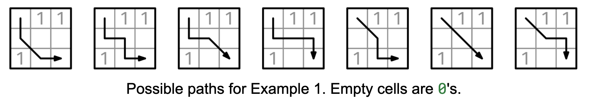

Given a non-empty RxC binary grid, grid, return the number of paths from the top-left corner to the bottom-right corner with a sum of 0. You can only go down, to the right, or diagonally down and to the right.

Example 1:
grid = [
  [0, 1, 1],
  [0, 0, 0],
  [1, 0, 0]
]
Output: 7

Example 2:
grid = [
  [1]
]
Output: 0

Example 3:
grid = [
  [0, 0],
  [0, 0]
]
Output: 3
The figure below illustrates the possible paths for Example 1:

Count 0-sum paths 1
Constraints:

R is at least 1 and at most 1000.
C is at least 1 and at most 1000.
Each element in the grid is either 0 or 1.

See Solution
Problem 40.4 - Count 0-Sum Paths: Solution
Java
We can use dynamic programming to solve this problem.

This is a grid-based problem with 3 choices at each subproblem (down, right, and diagonal), but not all choices are valid at every cell -- it depends on where the 1's are located. Also, since it's a counting problem, we aggregate the three options with 'sum'.

Here is a full recurrence relation:

num_paths(r, c): number of paths without any 1's starting from grid[r][c]

any cell (r, c) with a 1:
    num_paths(r, c) = 0

for cells with a 0:

bottom-right corner (r == R-1 and c == C-1):
    num_paths(r, c) = 1
last row (r == R-1, c < C-1):
    num_paths(r, c) = num_paths(r, c+1)  # we can only go right
last column (r < R-1, c == C-1):
    num_paths(r, c) = num_paths(r+1, c)  # we can only go down
general case (r < R-1, c < C-1):
    num_paths(r, c) = num_paths(r+1, c) +  # go down
                      num_paths(r, c+1) +  # go right
                      num_paths(r+1, c+1)  # go diagonal

original problem:
    num_paths(0, 0)
We can use the memoization recipe to turn the recurrence relation into efficient code:

memo = empty map

f(subproblem_id):
  if subproblem is base case:
    return result directly
  if subproblem in memo map:
    return cached result

  memo[subproblem_id] = recurrence relation formula
  return memo[subproblem_id]

return f(initial subproblem)
Here is the implementation:

class Count0SumPaths {
  private final int[][] grid;
  private final int R, C;
  private final Map<String, Integer> memo;

  public Count0SumPaths(int[][] grid) {
    this.grid = grid;
    this.R = grid.length;
    this.C = grid[0].length;
    this.memo = new HashMap<>();
  }

  private int numPaths(int r, int c) {
    if (r >= R || c >= C || grid[r][c] == 1) {
      return 0;
    }
    String key = r + "," + c;
    if (memo.containsKey(key)) {
      return memo.get(key);
    }
    if (r == R - 1 && c == C - 1) {
      return 1;
    }
    int result = numPaths(r + 1, c) + numPaths(r, c + 1)
        + numPaths(r + 1, c + 1);
    memo.put(key, result);
    return result;
  }

  public int solve() {
    return numPaths(0, 0);
  }
}
Time & Space Analysis
R: the number of rows in the grid
C: the number of columns in the grid
For DP, we can analyze the time complexity as the product of two things: the number of subproblems and the non-recursive work per subproblem (when the subproblem is not cached).

For this problem, we have:

Subproblems: R * C.
Non-recursive work: O(1).
Time: O(R * C).
Extra space: O(R * C) for the memoization map.
We can optimize the space to O(min(R, C)) by using tabulation with the rolling array optimization.

Tests
Here are some test cases to verify the solution:

class RunTests {
  public void runTests() {
    Object[][] tests = {
        { new int[][] { { 0, 1, 1 },
            { 0, 0, 0 },
            { 1, 0, 0 } }, 7 },
        { new int[][] { { 1 } }, 0 },
        { new int[][] { { 0, 0 },
            { 0, 0 } }, 3 },
        { new int[][] { { 0 } }, 1 },
        { new int[][] { { 0, 0, 0 },
            { 0, 1, 0 },
            { 0, 0, 0 } }, 4 },
    };

    for (Object[] test : tests) {
      int[][] grid = (int[][]) test[0];
      int want = (int) test[1];
      Count0SumPaths solution = new Count0SumPaths(grid);
      int got = solution.solve();
      if (got != want) {
        throw new RuntimeException(String.format(
            "\nsolve(%s): got: %d, want: %d\n",
            Arrays.deepToString(grid), got, want));
      }
    }
  }
}

public class Solution {
  public static void main(String[] args) {
    new RunTests().runTests();
  }
}

def count_0_sum_paths(grid):
  R, C = len(grid), len(grid[0])
  memo = {}

  def num_paths(r, c):
    if r >= R or c >= C or grid[r][c] == 1:
      return 0
    if (r, c) in memo:
      return memo[(r, c)]
    if r == R - 1 and c == C - 1:
      return 1
    memo[(r, c)] = num_paths(r + 1, c) + \
        num_paths(r, c + 1) + num_paths(r + 1, c + 1)
    return memo[(r, c)]

  return num_paths(0, 0)
Time & Space Analysis
R: the number of rows in the grid
C: the number of columns in the grid
For DP, we can analyze the time complexity as the product of two things: the number of subproblems and the non-recursive work per subproblem (when the subproblem is not cached).

For this problem, we have:

Subproblems: R * C.
Non-recursive work: O(1).
Time: O(R * C).
Extra space: O(R * C) for the memoization map.
We can optimize the space to O(min(R, C)) by using tabulation with the rolling array optimization.

Tests
Here are some test cases to verify the solution:

def run_tests():
  tests = [
      ([[0, 1, 1],
        [0, 0, 0],
          [1, 0, 0]], 7),
      ([[1]], 0),
      ([[0, 0],
        [0, 0]], 3),
      ([[0]], 1),
      ([[0, 0, 0],
        [0, 1, 0],
          [0, 0, 0]], 4),
  ]
  for grid, want in tests:
    got = count_0_sum_paths(grid)
    assert got == want, f"\ncount_0_sum_paths({grid}): got: {
        got}, want: {want}\n"

run_tests()

function count0SumPaths(grid) {
  const R = grid.length;
  const C = grid[0].length;
  const memo = new Map();

  function numPaths(r, c) {
    if (r >= R || c >= C || grid[r][c] === 1) {
      return 0;
    }
    const key = `${r},${c}`;
    if (memo.has(key)) {
      return memo.get(key);
    }
    if (r === R - 1 && c === C - 1) {
      return 1;
    }
    const result =
      numPaths(r + 1, c) + numPaths(r, c + 1) + numPaths(r + 1, c + 1);
    memo.set(key, result);
    return result;
  }

  return numPaths(0, 0);
}
Time & Space Analysis
R: the number of rows in the grid
C: the number of columns in the grid
For DP, we can analyze the time complexity as the product of two things: the number of subproblems and the non-recursive work per subproblem (when the subproblem is not cached).

For this problem, we have:

Subproblems: R * C.
Non-recursive work: O(1).
Time: O(R * C).
Extra space: O(R * C) for the memoization map.
We can optimize the space to O(min(R, C)) by using tabulation with the rolling array optimization.

Tests
Here are some test cases to verify the solution:

function runTests() {
  const tests = [
    [
      [
        [0, 1, 1],
        [0, 0, 0],
        [1, 0, 0],
      ],
      7,
    ],
    [[[1]], 0],
    [
      [
        [0, 0],
        [0, 0],
      ],
      3,
    ],
    [[[0]], 1],
    [
      [
        [0, 0, 0],
        [0, 1, 0],
        [0, 0, 0],
      ],
      4,
    ],
  ];
  for (const [grid, want] of tests) {
    const got = count0SumPaths(grid);
    if (got !== want) {
      throw new Error(
        `\ncount0SumPaths(${JSON.stringify(grid)}): got: ${got}, want: ${want}\n`,
      );
    }
  }
}

runTests();

