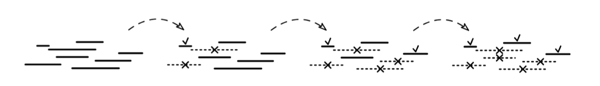
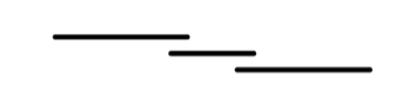
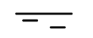

Given a list, intervals, where each element is a pair of integers [l, r], with l ≤ r, representing an interval (with both endpoints included). Return the largest number of non-overlapping intervals.

Example 1:
intervals = [[2, 3], [1, 4], [2, 3], [3, 6], [8, 9]]
Output: 2
For instance, [2, 3] and [8, 9] don't overlap. We can't add [3, 6] because it
overlaps with [2, 3] at value 3.

Example 2:
intervals = [[1, 2], [2, 3], [3, 4]]
Output: 2

Example 3:
intervals = [[1, 10], [8, 9], [2, 3]]
Output: 2
Constraints:

0 ≤ intervals.length ≤ 10^5
intervals[i].length = 2
0 ≤ intervals[i][j] ≤ 10^9
See Solution
Problem 41.1 - Most Non-Overlapping Intervals: Solution
Python
We have to find a subset of non-overlapping intervals as large as possible. For each interval, we need to make a decision whether to pick it for the subset or not. All intervals contribute 1 to the solution size, so we can't pick them based on how much they add to the objective. Instead, we should pick intervals that conflict the least with other intervals. Intuitively, shorter intervals are 'better'.

Based on this logic, we can propose a greedy algorithm:

Start with an empty subset
Always pick the shortest remaining interval 'available', meaning that it doesn't overlap with intervals we already picked
Greedy figure 2

Can you find a counterexample?

Here's one:

Greedy figure 3

In this counterexample, we should have picked the leftmost interval, which would have allowed us to also pick the rightmost one. So, perhaps the key is to always pick the available interval that starts the earliest?

Can you find a counterexample for this new rule?

Here is one:

Greedy figure 4

Which might look something like this: [[1, 10], [8, 9], [2, 3]]

This counterexample shows that how early an interval starts is not a good choice criterion because an interval could be super long.

What if we always pick the available interval that ends the earliest instead? Try to find a counterexample.

This greedy choice actually works -- there are no counterexamples.

If we can't find counterexamples, the next step should be to explain the intuition for why it works to the interviewer (with examples and diagrams, if it helps). Something like this:

"Imagine [2, 7] is the interval that ends the earliest. All intervals that overlap with it reach further to the right than 7. So, if we don't pick [2, 7] to pick another interval that overlaps with it, we'd just be restricting our options more than if we picked [2, 7]. So, picking [2, 7] is a safe bet (it might not be better, but it's definitely not worse). We can repeat the same logic for the remaining intervals."

Finally, let's talk about the implementation. A very common pattern for Greedy algorithms is using a custom-comparator sort (~pg 365 in BCtCI) to sort the input elements in the order that greedy would consider them. For this problem, that means:

Sorting the input intervals based on the right endpoint.
Iterating through them, keeping track of which ones we can add.
Here is the implementation:

def most_non_overlapping_intervals(intervals):
  intervals.sort(key=lambda x: x[1])
  count = 0
  prev_end = -math.inf
  for l, r in intervals:
    if l > prev_end:
      count += 1
      prev_end = r
  return count
Time & Space Analysis
n: the number of intervals

Time: O(n log n) - for sorting

Extra space: O(n) - for sorting

The sorting step dominates the runtime and the extra space. Even if we sort the intervals in-place, most in-place sorting algorithms still use O(n) extra space.

Tests
Here are some test cases to verify the solution:

def run_tests():
  # Example test cases
  tests = [
      # Example 1
      ([[2, 3], [1, 4], [2, 3], [3, 6], [8, 9]], 2),

      # Additional test cases
      # Edge case: No intervals
      ([], 0),
      # Edge case: All intervals overlap
      ([[1, 5], [2, 6], [3, 7]], 1),
      ([[1, 2], [2, 3], [3, 4]], 2),
      # Edge case: Non-overlapping intervals (considering inclusive endpoints)
      ([[1, 2], [3, 4], [5, 6]], 3),
      # Edge case: Single interval
      ([[1, 2]], 1),
      # Edge case: Large number of intervals
      ([[i, i + 1] for i in range(100)], 50),
  ]

  for intervals, want in tests:
    got = most_non_overlapping_intervals(intervals)
    assert got == want, f"\nmost_non_overlapping_intervals({intervals}): got: {
        got}, want: {want}\n"

run_tests()
function mostNonOverlappingIntervals(intervals) {
  intervals.sort((a, b) => a[1] - b[1]);
  let count = 0;
  let prevEnd = -Infinity;
  for (const [l, r] of intervals) {
    if (l > prevEnd) {
      count++;
      prevEnd = r;
    }
  }
  return count;
}
Time & Space Analysis
n: the number of intervals

Time: O(n log n) - for sorting

Extra space: O(n) - for sorting

The sorting step dominates the runtime and the extra space. Even if we sort the intervals in-place, most in-place sorting algorithms still use O(n) extra space.

Tests
Here are some test cases to verify the solution:

function runTests() {
  const tests = [
    // Example 1
    [
      [
        [2, 3],
        [1, 4],
        [2, 3],
        [3, 6],
        [8, 9],
      ],
      2,
    ],

    // Additional test cases
    // Edge case: No intervals
    [[], 0],
    // Edge case: All intervals overlap
    [
      [
        [1, 5],
        [2, 6],
        [3, 7],
      ],
      1,
    ],
    [
      [
        [1, 2],
        [2, 3],
        [3, 4],
      ],
      2,
    ],
    // Edge case: Non-overlapping intervals (considering inclusive endpoints)
    [
      [
        [1, 2],
        [3, 4],
        [5, 6],
      ],
      3,
    ],
    // Edge case: Single interval
    [[[1, 2]], 1],
  ];

  for (const [intervals, want] of tests) {
    const testIntervals = JSON.parse(JSON.stringify(intervals)); // Deep copy
    const got = mostNonOverlappingIntervals(testIntervals);
    if (got !== want) {
      throw new Error(
        `\nmostNonOverlappingIntervals(${JSON.stringify(intervals)}): got: ${got}, want: ${want}\n`,
      );
    }
  }
}

runTests();
class MostNonOverlappingIntervals {
  public int solve(int[][] intervals) {
    Arrays.sort(intervals, Comparator.comparingInt(a -> a[1]));
    int count = 0;
    int prevEnd = Integer.MIN_VALUE;
    for (int[] interval : intervals) {
      if (interval[0] > prevEnd) {
        count++;
        prevEnd = interval[1];
      }
    }
    return count;
  }
}
Time & Space Analysis
n: the number of intervals

Time: O(n log n) - for sorting

Extra space: O(n) - for sorting

The sorting step dominates the runtime and the extra space. Even if we sort the intervals in-place, most in-place sorting algorithms still use O(n) extra space.

Tests
Here are some test cases to verify the solution:

class RunTests {
  public void runTests() {
    Object[][] tests = {
        // Example 1
        { new int[][] { { 2, 3 }, { 1, 4 }, { 2, 3 }, { 3, 6 }, { 8, 9 } }, 2 },

        // Additional test cases
        // Edge case: No intervals
        { new int[][] {}, 0 },
        // Edge case: All intervals overlap
        { new int[][] { { 1, 5 }, { 2, 6 }, { 3, 7 } }, 1 },
        { new int[][] { { 1, 2 }, { 2, 3 }, { 3, 4 } }, 2 },
        // Edge case: Non-overlapping intervals (considering inclusive
        // endpoints)
        { new int[][] { { 1, 2 }, { 3, 4 }, { 5, 6 } }, 3 },
        // Edge case: Single interval
        { new int[][] { { 1, 2 } }, 1 },
    };

    MostNonOverlappingIntervals solution = new MostNonOverlappingIntervals();
    for (Object[] test : tests) {
      int[][] intervals = (int[][]) test[0];
      int want = (int) test[1];
      int got = solution.solve(intervals);
      if (got != want) {
        throw new RuntimeException(String.format(
            "\nsolve(%s): got: %d, want: %d\n",
            Arrays.deepToString(intervals), got, want));
      }
    }
  }
}

public class Solution {
  public static void main(String[] args) {
    new RunTests().runTests();
  }
}
