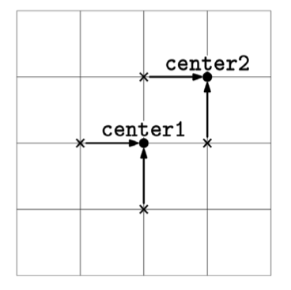
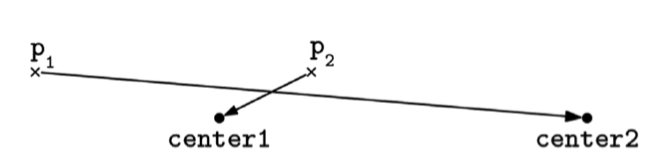

You are given:

A list of points on a 2D plane, points, where each point is represented as [x, y] (floating-point coordinates). The list always contains an even number of points.
Two additional points, center1 and center2, each also represented as [x, y].
Your task is to divide the points in points into two groups of equal size:

Assign half of the points to center1.
Assign the other half to center2.
The goal is to minimize the sum of the (Euclidean) distance from each point to its assigned center. Return the sum of distances for an optimal assignment.

Greedy figure 7

Example 1:
points = [[0, 1], [1, 0], [-1, 0], [0, -1]]
center1 = [0, 0]
center2 = [1, 1]

Output: 4
We can assign [-1, 0] and [0, -1] to center1 and [0, 1] and [1, 0] to center2.

Example 2:
points = [[0, 0], [0, 0]]
center1 = [0, 0]
center2 = [1, 1]

Output: 1.414
One of the points has to be assigned to center2, which is at distance sqrt(2)
from [0, 0].

Example 3:
points = [[0, 0.5], [1, 0.5]]
center1 = [0, 0]
center2 = [1, 1]

Output: 1

Example 4:
points = []
center1 = [0.3, -3.3]
center2 = [-1.6, 4.6]

Output: 0
Constraints:

points.length is even.
0 <= points.length <= 10^5.
All coordinates are between -10^4 and 10^4.
The answer should be a real-point within 10^-3 of the correct answer.

See Solution
Problem 41.3 - Center Assignment: Solution
Python
Intuitively, points closer to center1 should be assigned to center1. This suggests using a greedy algorithm.

Let's formalize this intuition as a greedy choice, look for counterexamples, and, if we can't find any, give an intuitive explanation for why it works.

Greedy choice: take the closest n/2 points to center1 and assign them to center1. Assign the rest to center2.

Counterexample:

Greedy figure 8

Consider this input:

points = [[0, 0], [3, 0]]
center1 = [2, 0]
center2 = [5, 0]
For this input, the optimal solution is to assign [0, 0] to center1 and [3, 0] to center2, with a total distance of 2 + 2 = 4.

The greedy choice would assign [3, 0] to center1 because it is closer than [0, 0], and then [0, 0] would have to be assigned to center2. The total distance would be 1 + 5 = 6.

This is a counterexample to the greedy choice.

Since we found a counterexample, we need to brainstorm for a different greedy choice (or give up on Greedy and use a different approach).

Let's try something different: start with every point assigned to its closest center. A center may have more than n/2 points, so we need to pick some of them to assign to the other center. The cost for switching a point p from center1 to center2 is dist(p, center2) - dist(p, center1). We can greedily switch the points with the smallest switching cost until the balance is restored.

Greedy choice: start with every point assigned to its closest center. Switch the points with the smallest switching cost until the balance is restored.

Counterexample: none.

In particular, we should make sure that this new greedy algorithm works for the counterexample that we found for the previous one.

We would start by assigning both [0, 0] and [3, 0] to center1 ([2, 0]). We need to switch one of them to center2 ([5, 0]). The cost for switching [0, 0] is 5, and the cost of switching [3, 0] is 2, so we would switch the latter point. This results in the optimal solution.

Intuitive explanation: assigning each point to its nearest center produces a baseline assignment that is locally minimal for each individual point. Then, when rebalancing the assignments to ensure each center has exactly half the points, choosing the points that incur the smallest additional cost to switch guarantees that no alternative reassignment could produce a lower total distance.

Here is the implementation:

def minimize_distance(points, center1, center2):
  # Function to calculate Euclidean distance between two points
  def dist(point1, point2):
    return math.sqrt((point1[0] - point2[0]) ** 2 + (point1[1] - point2[1]) ** 2)

  n = len(points)
  assignment = [0] * n
  baseline = 0
  for i, p in enumerate(points):
    if dist(p, center1) <= dist(p, center2):
      assignment[i] = 1
      baseline += dist(p, center1)
    else:
      assignment[i] = 2
      baseline += dist(p, center2)

  c1_count = assignment.count(1)
  if c1_count == n // 2:
    return baseline

  switch_costs = []
  for i, p in enumerate(points):
    if assignment[i] == 1 and c1_count > n // 2:
      switch_costs.append(dist(p, center2) - dist(p, center1))
    if assignment[i] == 2 and c1_count < n // 2:
      switch_costs.append(dist(p, center1) - dist(p, center2))

  res = baseline
  switch_costs.sort()
  for cost in switch_costs[:abs(c1_count - n // 2)]:
    res += cost
  return res
Time & Space Analysis
n: the number of points

Time: O(n log n) - for sorting.

Extra space: O(n) - for storing the switching costs.

Tests
Here are some test cases to verify the solution:

def run_tests():
  # Example test cases
  tests = [
      # Example 1
      ([[0, 1], [1, 0], [-1, 0], [0, -1]], [0, 0], [1, 1], 4),
      # Example 2
      ([[0, 0], [0, 0]], [0, 0], [1, 1], 1.414),
      # Example 3
      ([[0, 0.5], [1, 0.5]], [0, 0], [1, 1], 1),
      # Example 4
      ([], [0.3, -3.3], [-1.6, 4.6], 0),
      # Example 5
      ([[0, 0], [3, 0]], [2, 0], [5, 0], 4),

      # Additional test cases
      # Edge case: All points are the same
      ([[0, 0], [0, 0], [0, 0], [0, 0]], [0, 0], [0, 0], 0),
  ]

  for points, center1, center2, want in tests:
    got = minimize_distance(points, center1, center2)
    assert abs(
        got - want) < 1e-3, f"\nminimize_distance({points}, {center1}, {center2}): got: {got}, want: {want}\n"

run_tests()
function minimizeDistance(points, center1, center2) {
  // Function to calculate Euclidean distance between two points
  function dist(point1, point2) {
    return Math.sqrt(
      Math.pow(point1[0] - point2[0], 2) + Math.pow(point1[1] - point2[1], 2),
    );
  }

  const n = points.length;
  const assignment = new Array(n).fill(0);
  let baseline = 0;
  for (let i = 0; i < n; i++) {
    if (dist(points[i], center1) <= dist(points[i], center2)) {
      assignment[i] = 1;
      baseline += dist(points[i], center1);
    } else {
      assignment[i] = 2;
      baseline += dist(points[i], center2);
    }
  }

  const c1Count = assignment.filter((x) => x === 1).length;
  if (c1Count === Math.floor(n / 2)) {
    return baseline;
  }

  const switchCosts = [];
  for (let i = 0; i < n; i++) {
    if (assignment[i] === 1 && c1Count > Math.floor(n / 2)) {
      switchCosts.push(dist(points[i], center2) - dist(points[i], center1));
    }
    if (assignment[i] === 2 && c1Count < Math.floor(n / 2)) {
      switchCosts.push(dist(points[i], center1) - dist(points[i], center2));
    }
  }

  let res = baseline;
  switchCosts.sort((a, b) => a - b);
  for (let i = 0; i < Math.abs(c1Count - Math.floor(n / 2)); i++) {
    res += switchCosts[i];
  }
  return res;
}
Time & Space Analysis
n: the number of points

Time: O(n log n) - for sorting.

Extra space: O(n) - for storing the switching costs.

Tests
Here are some test cases to verify the solution:

function runTests() {
  const tests = [
    // Example 1
    [
      [
        [0, 1],
        [1, 0],
        [-1, 0],
        [0, -1],
      ],
      [0, 0],
      [1, 1],
      4,
    ],
    // Example 2
    [
      [
        [0, 0],
        [0, 0],
      ],
      [0, 0],
      [1, 1],
      1.414,
    ],
    // Example 3
    [
      [
        [0, 0.5],
        [1, 0.5],
      ],
      [0, 0],
      [1, 1],
      1,
    ],
    // Example 4
    [[], [0.3, -3.3], [-1.6, 4.6], 0],
    // Example 5
    [
      [
        [0, 0],
        [3, 0],
      ],
      [2, 0],
      [5, 0],
      4,
    ],
    // Additional test cases
    // Edge case: All points are the same
    [
      [
        [0, 0],
        [0, 0],
        [0, 0],
        [0, 0],
      ],
      [0, 0],
      [0, 0],
      0,
    ],
  ];

  for (const [points, center1, center2, want] of tests) {
    const got = minimizeDistance(points, center1, center2);
    if (!(Math.abs(got - want) < 1e-3)) {
      throw new Error(
        `\nminimizeDistance(${JSON.stringify(points)}, ${JSON.stringify(center1)}, ${JSON.stringify(center2)}): got: ${got}, want: ${want}\n`,
      );
    }
  }
}

runTests();
Intuitively, points closer to center1 should be assigned to center1. This suggests using a greedy algorithm.

Let's formalize this intuition as a greedy choice, look for counterexamples, and, if we can't find any, give an intuitive explanation for why it works.

Greedy choice: take the closest n/2 points to center1 and assign them to center1. Assign the rest to center2.

Counterexample:

Greedy figure 8
Consider this input:

points = [[0, 0], [3, 0]]
center1 = [2, 0]
center2 = [5, 0]
For this input, the optimal solution is to assign [0, 0] to center1 and [3, 0] to center2, with a total distance of 2 + 2 = 4.

The greedy choice would assign [3, 0] to center1 because it is closer than [0, 0], and then [0, 0] would have to be assigned to center2. The total distance would be 1 + 5 = 6.

This is a counterexample to the greedy choice.

Since we found a counterexample, we need to brainstorm for a different greedy choice (or give up on Greedy and use a different approach).

Let's try something different: start with every point assigned to its closest center. A center may have more than n/2 points, so we need to pick some of them to assign to the other center. The cost for switching a point p from center1 to center2 is dist(p, center2) - dist(p, center1). We can greedily switch the points with the smallest switching cost until the balance is restored.

Greedy choice: start with every point assigned to its closest center. Switch the points with the smallest switching cost until the balance is restored.

Counterexample: none.

In particular, we should make sure that this new greedy algorithm works for the counterexample that we found for the previous one.

We would start by assigning both [0, 0] and [3, 0] to center1 ([2, 0]). We need to switch one of them to center2 ([5, 0]). The cost for switching [0, 0] is 5, and the cost of switching [3, 0] is 2, so we would switch the latter point. This results in the optimal solution.

Intuitive explanation: assigning each point to its nearest center produces a baseline assignment that is locally minimal for each individual point. Then, when rebalancing the assignments to ensure each center has exactly half the points, choosing the points that incur the smallest additional cost to switch guarantees that no alternative reassignment could produce a lower total distance.

Here is the implementation:

class MinimizeDistance {
  private double dist(double[] point1, double[] point2) {
    return Math.sqrt(Math.pow(point1[0] - point2[0], 2) +
        Math.pow(point1[1] - point2[1], 2));
  }

  public double solve(double[][] points, double[] center1, double[] center2) {
    int n = points.length;
    int[] assignment = new int[n];
    double baseline = 0;
    for (int i = 0; i < n; i++) {
      if (dist(points[i], center1) <= dist(points[i], center2)) {
        assignment[i] = 1;
        baseline += dist(points[i], center1);
      } else {
        assignment[i] = 2;
        baseline += dist(points[i], center2);
      }
    }

    int c1Count = 0;
    for (int a : assignment) {
      if (a == 1)
        c1Count++;
    }
    if (c1Count == n / 2) {
      return baseline;
    }

    List<Double> switchCosts = new ArrayList<>();
    for (int i = 0; i < n; i++) {
      if (assignment[i] == 1 && c1Count > n / 2) {
        switchCosts.add(dist(points[i], center2) - dist(points[i], center1));
      }
      if (assignment[i] == 2 && c1Count < n / 2) {
        switchCosts.add(dist(points[i], center1) - dist(points[i], center2));
      }
    }

    double res = baseline;
    Collections.sort(switchCosts);
    for (int i = 0; i < Math.abs(c1Count - n / 2); i++) {
      res += switchCosts.get(i);
    }
    return res;
  }
}
Time & Space Analysis
n: the number of points

Time: O(n log n) - for sorting.

Extra space: O(n) - for storing the switching costs.

Tests
Here are some test cases to verify the solution:

class RunTests {
  public void runTests() {
    Object[][] tests = {
        // Example 1
        {
            new double[][] { { 0.0, 1.0 }, { 1.0, 0.0 }, { -1.0, 0.0 },
                { 0.0, -1.0 } },
            new double[] { 0.0, 0.0 },
            new double[] { 1.0, 1.0 },
            4.0
        },
        // Example 2
        {
            new double[][] { { 0.0, 0.0 }, { 0.0, 0.0 } },
            new double[] { 0.0, 0.0 },
            new double[] { 1.0, 1.0 },
            1.414
        },
        // Example 3
        {
            new double[][] { { 0.0, 0.5 }, { 1.0, 0.5 } },
            new double[] { 0.0, 0.0 },
            new double[] { 1.0, 1.0 },
            1.0
        },
        // Example 4
        {
            new double[][] {},
            new double[] { 0.3, -3.3 },
            new double[] { -1.6, 4.6 },
            0.0
        },
        // Example 5
        {
            new double[][] { { 0.0, 0.0 }, { 3.0, 0.0 } },
            new double[] { 2.0, 0.0 },
            new double[] { 5.0, 0.0 },
            4.0
        },
        // Additional test cases
        // Edge case: All points are the same
        {
            new double[][] { { 0.0, 0.0 }, { 0.0, 0.0 }, { 0.0, 0.0 },
                { 0.0, 0.0 } },
            new double[] { 0.0, 0.0 },
            new double[] { 0.0, 0.0 },
            0.0
        },
    };

    MinimizeDistance solution = new MinimizeDistance();
    for (Object[] test : tests) {
      double[][] points = (double[][]) test[0];
      double[] center1 = (double[]) test[1];
      double[] center2 = (double[]) test[2];
      double want = (double) test[3];
      double got = solution.solve(points, center1, center2);
      if (Math.abs(got - want) >= 1e-3) {
        throw new RuntimeException(String.format(
            "\nsolve(%s, %s, %s): got: %f, want: %f\n",
            Arrays.deepToString(points),
            Arrays.toString(center1),
            Arrays.toString(center2),
            got,
            want));
      }
    }
  }
}

public class Solution {
  public static void main(String[] args) {
    new RunTests().runTests();
  }
}
