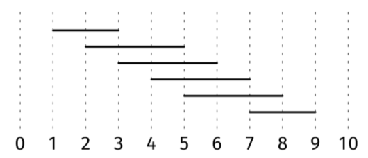

There are n meetings scheduled, each with a start time and an end time. We have a script that, when run, captures some information about all ongoing meetings. Given an array, meetings, where each element is a tuple [l, r] with l < r, what's the minimum number of times we need to run the script to capture information from all meetings?

If the script runs at the same time that a meeting starts or ends, it captures the information for that meeting.

Example 1:
meetings = [[2, 3], [1, 4], [2, 3], [3, 6], [8, 10]]

Output: 2
We can run the script at t = 3 and t = 9.
Constraints:

0 <= n <= 10^5
0 <= meetings[i][0] < meetings[i][1] <= 10^9
See Solution
Problem 41.5 - Fewest Script Runs: Solution
JavaScript
We want to maximize the number of meetings we take care of with each run. Intuitively, we want to "check off" as many meetings as possible in a single run.

We can consider a greedy algorithm (interval problems are a common application of greedy algorithms). Let's capture the intuition as a greedy choice, look for counterexamples, and, if we can't find any, give an intuitive explanation for why it works.

Greedy choice: run the script at the time with the most meetings, discard those meetings, and repeat.

Counterexample: Here is a counterexample:

Greedy figure 9

meetings = [[1, 3], [2, 5], [3, 6], [4, 7], [5, 8], [7, 9]]
Greedy would pick 5 first because it overlaps with the most intervals (4), and end up with a solution of size 3 like [5, 2, 8]. However, the optimal solution has size 2: [3, 7].

Since our first idea didn't work, let's try something different.

Let's focus on the meeting, [l, r], with the earliest end time. We need to run the script at some point between l and r. Of all the options, r will overlap the most with other meetings, so r is a "safe bet."

Let's capture this as a greedy choice:

Greedy choice: run the script at the end time of the meeting that ends the earliest. Repeat for meetings not covered yet.

Counterexample: None.

Intuitive explanation: See above.

Here is the implementation:

function minimumScriptRuns(meetings) {
  meetings.sort((a, b) => a[1] - b[1]);
  let count = 0;
  let prevEnd = -Infinity;
  for (const [l, r] of meetings) {
    if (l > prevEnd) {
      count++;
      prevEnd = r;
    }
  }
  return count;
}
Time & Space Analysis
n: the number of meetings

Time: O(n log n) - for sorting.

Extra space: O(n) - for sorting.

Even if we sort meetings in place, most built-in sorting algorithms use O(n) extra space.

Tests
Here are some test cases to verify the solution:

function runTests() {
  const tests = [
    // Example 1
    [
      [
        [2, 3],
        [1, 4],
        [2, 3],
        [3, 6],
        [8, 10],
      ],
      2,
    ],
    // Example 2 - Counterexample from solution
    [
      [
        [1, 3],
        [2, 5],
        [3, 6],
        [4, 7],
        [5, 8],
        [7, 9],
      ],
      2,
    ],
    // Edge case: No meetings
    [[], 0],
    // Edge case: All meetings overlap
    [
      [
        [1, 5],
        [2, 6],
        [3, 7],
      ],
      1,
    ],
    // Edge case: Non-overlapping meetings
    [
      [
        [1, 2],
        [3, 4],
        [5, 6],
      ],
      3,
    ],
    // Edge case: Single meeting
    [[[1, 2]], 1],
  ];

  for (const [meetings, want] of tests) {
    const got = minimumScriptRuns(meetings);
    if (got !== want) {
      throw new Error(
        `\nminimumScriptRuns(${JSON.stringify(meetings)}): got: ${got}, want: ${want}\n`,
      );
    }
  }
}

runTests();
def minimum_script_runs(meetings):
  meetings.sort(key=lambda x: x[1])
  count = 0
  prev_end = -math.inf
  for l, r in meetings:
    if l > prev_end:
      count += 1
      prev_end = r
  return count
Time & Space Analysis
n: the number of meetings

Time: O(n log n) - for sorting.

Extra space: O(n) - for sorting.

Even if we sort meetings in place, most built-in sorting algorithms use O(n) extra space.

Tests
Here are some test cases to verify the solution:

def run_tests():
  # Example test cases
  tests = [
      # Example 1
      ([[2, 3], [1, 4], [2, 3], [3, 6], [8, 10]], 2),
      # Example 2 - Counterexample from solution
      ([[1, 3], [2, 5], [3, 6], [4, 7], [5, 8], [7, 9]], 2),

      # Additional test cases
      # Edge case: No meetings
      ([], 0),
      # Edge case: All meetings overlap
      ([[1, 5], [2, 6], [3, 7]], 1),
      # Edge case: Non-overlapping meetings
      ([[1, 2], [3, 4], [5, 6]], 3),
      # Edge case: Single meeting
      ([[1, 2]], 1),
      # Edge case: Large number of meetings
      ([[i, i + 1] for i in range(100)], 50),
  ]

  for meetings, want in tests:
    got = minimum_script_runs(meetings)
    assert got == want, f"\nminimum_script_runs({meetings}): got: {
        got}, want: {want}\n"

run_tests()
class MinimumScriptRuns {
  public int solve(int[][] meetings) {
    // Sort meetings by end time
    Arrays.sort(meetings, Comparator.comparingInt(a -> a[1]));

    int count = 0;
    int prevEnd = Integer.MIN_VALUE;
    for (int[] meeting : meetings) {
      if (meeting[0] > prevEnd) {
        count++;
        prevEnd = meeting[1];
      }
    }
    return count;
  }
}
Time & Space Analysis
n: the number of meetings

Time: O(n log n) - for sorting.

Extra space: O(n) - for sorting.

Even if we sort meetings in place, most built-in sorting algorithms use O(n) extra space.

Tests
Here are some test cases to verify the solution:

class RunTests {
  public void runTests() {
    Object[][] tests = {
        // Example 1
        { new int[][] { { 2, 3 }, { 1, 4 }, { 2, 3 }, { 3, 6 }, { 8, 10 } },
            2 },
        // Example 2 - Counterexample from solution
        { new int[][] { { 1, 3 }, { 2, 5 }, { 3, 6 }, { 4, 7 }, { 5, 8 },
            { 7, 9 } },
            2 },
        // Edge case: No meetings
        { new int[][] {}, 0 },
        // Edge case: All meetings overlap
        { new int[][] { { 1, 5 }, { 2, 6 }, { 3, 7 } }, 1 },
        // Edge case: Non-overlapping meetings
        { new int[][] { { 1, 2 }, { 3, 4 }, { 5, 6 } }, 3 },
        // Edge case: Single meeting
        { new int[][] { { 1, 2 } }, 1 },
    };

    MinimumScriptRuns solution = new MinimumScriptRuns();
    for (Object[] test : tests) {
      int[][] meetings = (int[][]) test[0];
      int want = (int) test[1];
      int got = solution.solve(meetings);
      if (got != want) {
        throw new RuntimeException(String.format(
            "\nsolve(%s): got: %d, want: %d\n",
            Arrays.deepToString(meetings), got, want));
      }
    }
  }
}

public class Solution {
  public static void main(String[] args) {
    new RunTests().runTests();
  }
}
