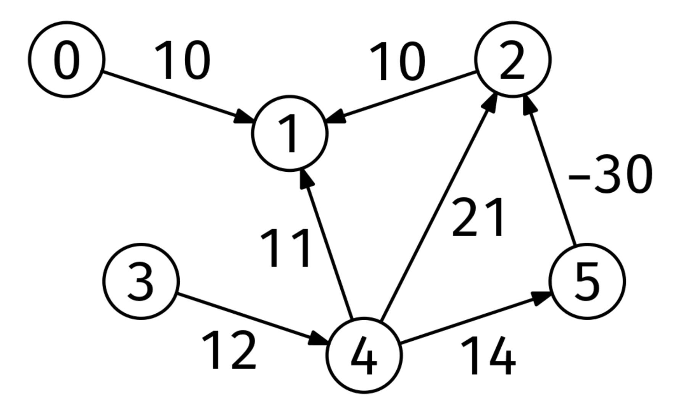
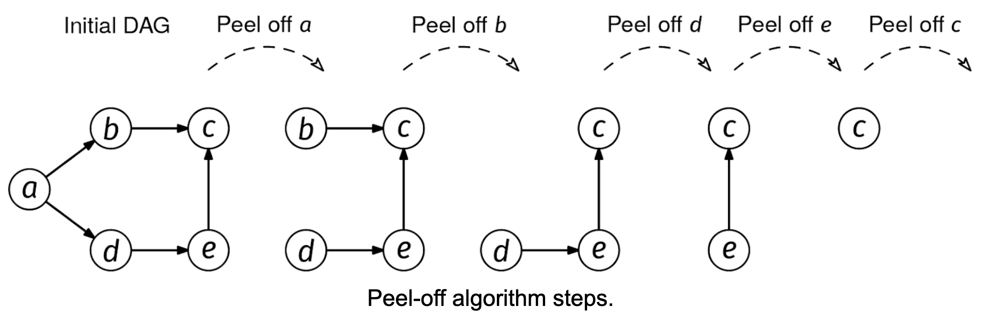
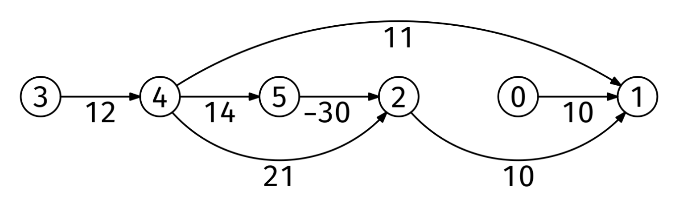

Chapter 42: Topological Sort
Recipe 1 - Peel-Off Algorithm

topo_order = empty list
while not every node is in topo_order:
  pick a node with in-degree 0
  add it to topo_order
  decrease the in-degree of its neighbors by 1

if not all nodes were peeled off, there is a cycle
Recipe 2 - DAG Problem Recipe

compute a topological ordering (Khan's peel-off algorithm)
for node in topological ordering
  for each edge node -> nbr
    update some information about nbr
Problem 42.1 - DAG Distances
Get asked this question by our AI Interviewer
Interview now
Given the adjacency list of a DAG (Directed Acyclic Graph) with edge weights, graph, and a node, start, return the distances from start to every other node in an array of length V (the number of nodes). Element i should be the distance from start to node i. If i cannot be reached from start, that element should be infinity. The edge weights can be negative.

Example:
graph = [
  [[1, 10]],                    # Neighbors of node 0
  [],                           # Neighbors of node 1
  [[1, 10]],                    # Neighbors of node 2
  [[4, 12]],                    # Neighbors of node 3
  [[1, 11], [2, 21], [5, 14]],  # Neighbors of node 4
  [[2, -30]]                    # Neighbors of node 5
]
start = 4

Output: [infinity, -6, -16, infinity, 0, 14]
Nodes 0 and 3 are unreachable from node 4.
ode 4 is at distance 0 from itself.
The shortest path from node 4 to node 1 is 4 -> 5 -> 2 -> 1.
Here is the DAG from the example:

DAG distances 1

Constraints:

The number of nodes is at most 10^5
The number of edges is at most 10^6
Each node is labeled from 0 to V-1
The edge weights are integers between -10^4 and 10^4
 we can use the topological sort recipe:

compute a topological ordering (Kahn's peel-off algorithm)
for node in topological ordering
  for each edge node -> nbr
    update some information about nbr
We start by computing a topological ordering, as usual. We can use the 'peel-off' algorithm:

topo_order = empty list
while not every node is in topo_order:
  pick a node with in-degree 0
  add it to topo_order
  decrease the in-degree of its neighbors by 1

if not all nodes were peeled off, there is a cycle
Peel off algorithm

Here is a topological ordering for the example in the problem statement:

Similar to BFS and Dijkstra's algorithm, we maintain a distances map, where distances[u] is the shortest distance we have found so far from start to u. Initially, all we know is that distances[start] is 0.

We iterate through the topological ordering from left to right. Nodes before start are unreachable, so we can ignore them. Starting from start, when we process a node u, we check if any of the outgoing edges u -> w produces a shorter path to w.

For instance, imagine that start is node 4 in the example. When processing node 4, since distances[4] is 0 and there is an edge with length 11 from node 4 to node 1, we can set distances[1] to 11. This indicates that, at worst, there is a path with length 11 from node 4 to node 1. However, this distance is not definitive. There is, in fact, a shorter path, which is 4 -> 5 -> 2 -> 1. The point of the algorithm is that, since we are following a topological ordering, we will visit nodes 4, 5, 2, and 1 in that order, and we'll find the correct distance by doing a sequence of updates:

Initialization: distances[4] = 0
Processing edge 4 -> 5: distances[5] = distances[4] + 14 = 14
Processing edge 5 -> 2: distances[2] = distances[5] - 30 = -16
Processing edge 2 -> 1: distances[1] = distances[2] + 10 = -6
Here is the implementation:

function topologicalSort(graph) {
  // Initialization
  const V = graph.length;
  const inDegrees = new Array(V).fill(0);
  for (let node = 0; node < V; node++) {
    for (const [nbr, _] of graph[node]) {
      inDegrees[nbr]++;
    }
  }
  const degreeZero = [];
  for (let node = 0; node < V; node++) {
    if (inDegrees[node] === 0) {
      degreeZero.push(node);
    }
  }

  // Main 'peel-off' loop
  const topoOrder = [];
  while (degreeZero.length > 0) {
    const node = degreeZero.pop();
    topoOrder.push(node);
    for (const [nbr, _] of graph[node]) {
      inDegrees[nbr]--;
      if (inDegrees[nbr] === 0) {
        degreeZero.push(nbr);
      }
    }
  }

  if (topoOrder.length < V) {
    return []; // There is a cycle; some nodes couldn't be peeled off
  }
  return topoOrder;
}

function distance(graph, start) {
  const topoOrder = topologicalSort(graph);

  const distances = new Map();
  distances.set(start, 0);
  for (const node of topoOrder) {
    if (!distances.has(node)) continue;
    for (const [nbr, weight] of graph[node]) {
      if (
        !distances.has(nbr) ||
        distances.get(node) + weight < distances.get(nbr)
      ) {
        distances.set(nbr, distances.get(node) + weight);
      }
    }
  }

  const res = [];
  for (let i = 0; i < graph.length; i++) {
    if (distances.has(i)) {
      res.push(distances.get(i));
    } else {
      res.push(Infinity);
    }
  }
  return res;
}
Time & Space Analysis
V: the number of nodes

E: the number of edges

Time: O(V + E) for topological sort and distance computation.

Extra space: O(V).

Note: if the graph was given as an edge list instead (which is common in interviews), we would need to convert it to an adjacency list, so the space complexity would be O(V+E).

Tests
Here are some test cases to verify the solution:

function runTests() {
  const tests = [
    // Example from the book
    [
      [
        [[1, 10]],
        [],
        [[1, 10]],
        [[4, 12]],
        [
          [1, 11],
          [2, 21],
          [5, 14],
        ],
        [[2, -30]],
      ],
      4,
      [Infinity, -6, -16, Infinity, 0, 14],
    ],
    // Edge case: Single node graph
    [[[]], 0, [0]],
    // Edge case: Disconnected graph
    [[[[1, 5]], [], [[3, 2]], []], 0, [0, 5, Infinity, Infinity]],
    // Edge case: Graph with negative weights
    [[[[1, -1]], [[2, -2]], []], 0, [0, -1, -3]],
    // Edge case: Start node with no outgoing edges
    [[[[1, 2]], [[2, 3]], []], 2, [Infinity, Infinity, 0]],
  ];

  for (const [graph, start, want] of tests) {
    const got = distance(graph, start);
    if (JSON.stringify(got) !== JSON.stringify(want)) {
      throw new Error(
        `\ndistance(${JSON.stringify(graph)}, ${start}): got: ${JSON.stringify(got)}, want: ${JSON.stringify(want)}\n`,
      );
    }
  }
}

runTests();
def topological_sort(graph):
  # Initialization
  V = len(graph)
  in_degrees = [0 for _ in range(V)]
  for node in range(V):
    for nbr, _ in graph[node]:
      in_degrees[nbr] += 1
  degree_zero = []
  for node in range(V):
    if in_degrees[node] == 0:
      degree_zero.append(node)

  # Main 'peel-off' loop
  topo_order = []
  while degree_zero:
    node = degree_zero.pop()
    topo_order.append(node)
    for nbr, _ in graph[node]:
      in_degrees[nbr] -= 1
      if in_degrees[nbr] == 0:
        degree_zero.append(nbr)
  
  if len(topo_order) < V:
    return []  # There is a cycle; some nodes couldn't be peeled off
  return topo_order

def distance(graph, start):
  topo_order = topological_sort(graph)  # Recipe 1.

  distances = {start: 0}
  for node in topo_order:
    if node not in distances: continue
    for nbr, weight in graph[node]:
      if nbr not in distances or distances[node] + weight < distances[nbr]:
        distances[nbr] = distances[node] + weight

  res = []
  for i in range(len(graph)):
    if i in distances:
      res.append(distances[i])
    else:
      res.append(math.inf)
  return res
Time & Space Analysis
V: the number of nodes

E: the number of edges

Time: O(V + E) for topological sort and distance computation.

Extra space: O(V).

Note: if the graph was given as an edge list instead (which is common in interviews), we would need to convert it to an adjacency list, so the space complexity would be O(V+E).

Tests
Here are some test cases to verify the solution:

def run_tests():
  tests = [
    # Example from the book
    ([[[1, 10]], 
      [], 
      [[1, 10]], 
      [[4, 12]], 
      [[1, 11], 
       [2, 21], 
       [5, 14]], 
       [[2, -30]]], 
       4, 
       [math.inf, -6, -16, math.inf, 0, 14]),
    # Edge case: Single node graph
    ([[]], 0, [0]),
    # Edge case: Disconnected graph
    ([[[1, 5]], [], [[3, 2]], []], 0, [0, 5, math.inf, math.inf]),
    # Edge case: Graph with negative weights
    ([[[1, -1]], [[2, -2]], []], 0, [0, -1, -3]),
    # Edge case: Start node with no outgoing edges
    ([[[1, 2]], [[2, 3]], []], 2, [math.inf, math.inf, 0]),
  ]

  for graph, start, want in tests:
    got = distance(graph, start)
    assert got == want, f"\ndistance({graph}, {start}): got: {got}, want: {want}\n"

run_tests()
record Edge(int node, int weight) {
}

class TopologicalSort {
  public List<Integer> solve(List<List<Edge>> graph) {
    // Initialization
    int V = graph.size();
    int[] inDegrees = new int[V];
    for (int node = 0; node < V; node++) {
      for (Edge edge : graph.get(node)) {
        inDegrees[edge.node()]++;
      }
    }
    List<Integer> degreeZero = new ArrayList<>();

    for (int node = 0; node < V; node++) {
      if (inDegrees[node] == 0) {
        degreeZero.add(node);
      }
    }

    // Main 'peel-off' loop
    List<Integer> topoOrder = new ArrayList<>();
    while (!degreeZero.isEmpty()) {
      int node = degreeZero.remove(degreeZero.size() - 1);
      topoOrder.add(node);
      for (Edge edge : graph.get(node)) {
        inDegrees[edge.node()]--;
        if (inDegrees[edge.node()] == 0) {
          degreeZero.add(edge.node());
        }
      }

    }

    if (topoOrder.size() < V) {
      return new ArrayList<>(); // There is a cycle; some nodes couldn't be
                                // peeled off
    }
    return topoOrder;
  }
}

class Distance {
  public double[] solve(List<List<Edge>> graph, int start) {
    List<Integer> topoOrder = new TopologicalSort().solve(graph);

    double[] distances = new double[graph.size()];
    Arrays.fill(distances, Double.POSITIVE_INFINITY);
    distances[start] = 0;
    for (int node : topoOrder) {
      if (distances[node] == Double.POSITIVE_INFINITY)
        continue;
      for (Edge edge : graph.get(node)) {
        if (distances[node] + edge.weight() < distances[edge.node()]) {
          distances[edge.node()] = distances[node] + edge.weight();
        }
      }

    }

    return distances;
  }
}
Time & Space Analysis
V: the number of nodes

E: the number of edges

Time: O(V + E) for topological sort and distance computation.

Extra space: O(V).

Note: if the graph was given as an edge list instead (which is common in interviews), we would need to convert it to an adjacency list, so the space complexity would be O(V+E).

Tests
Here are some test cases to verify the solution:

class RunTests {
  private List<List<Edge>> makeGraph(int[][][] edges) {
    List<List<Edge>> graph = new ArrayList<>();
    for (int i = 0; i < edges.length; i++) {
      graph.add(new ArrayList<>());
      for (int[] edge : edges[i]) {
        graph.get(i).add(new Edge(edge[0], edge[1]));
      }
    }
    return graph;
  }

  public void runTests() {
    Object[][] tests = {
        // Example from the book
        {
            new int[][][] {
                { { 1, 10 } },
                {},
                { { 1, 10 } },
                { { 4, 12 } },
                { { 1, 11 }, { 2, 21 }, { 5, 14 } },
                { { 2, -30 } }
            },
            4,
            new double[] { Double.POSITIVE_INFINITY, -6, -16,
                Double.POSITIVE_INFINITY, 0, 14 }
        },
        // Edge case: Single node graph
        { new int[][][] { {} }, 0, new double[] { 0 } },
        // Edge case: Disconnected graph
        {
            new int[][][] { { { 1, 5 } }, {}, { { 3, 2 } }, {} },
            0,
            new double[] { 0, 5, Double.POSITIVE_INFINITY,
                Double.POSITIVE_INFINITY }
        },
        // Edge case: Graph with negative weights
        {
            new int[][][] { { { 1, -1 } }, { { 2, -2 } }, {} },
            0,
            new double[] { 0, -1, -3 }
        },
        // Edge case: Start node with no outgoing edges
        {
            new int[][][] { { { 1, 2 } }, { { 2, 3 } }, {} },
            2,
            new double[] { Double.POSITIVE_INFINITY, Double.POSITIVE_INFINITY,
                0 }
        }
    };

    Distance solution = new Distance();
    for (Object[] test : tests) {
      int[][][] edgeArrays = (int[][][]) test[0];
      int start = (int) test[1];
      double[] want = (double[]) test[2];

      List<List<Edge>> graph = makeGraph(edgeArrays);
      double[] got = solution.solve(graph, start);

      if (!Arrays.equals(got, want)) {
        StringBuilder graphStr = new StringBuilder("[");
        for (int i = 0; i < edgeArrays.length; i++) {
          graphStr.append("[");
          for (int j = 0; j < edgeArrays[i].length; j++) {
            if (j > 0)
              graphStr.append(", ");
            graphStr.append(Arrays.toString(edgeArrays[i][j]));
          }
          graphStr.append("]");
          if (i < edgeArrays.length - 1)
            graphStr.append(", ");
        }
        graphStr.append("]");

        StringBuilder gotStr = new StringBuilder("[");
        StringBuilder wantStr = new StringBuilder("[");
        for (int i = 0; i < got.length; i++) {
          if (i > 0) {
            gotStr.append(", ");
            wantStr.append(", ");
          }
          gotStr.append(got[i] == Double.POSITIVE_INFINITY ? "inf" : got[i]);
          wantStr.append(want[i] == Double.POSITIVE_INFINITY ? "inf" : want[i]);
        }
        gotStr.append("]");
        wantStr.append("]");

        throw new RuntimeException(String.format(
            "\nsolve(%s, %d): got: %s, want: %s\n",
            graphStr.toString(), start, gotStr.toString(), wantStr.toString()));
      }
    }
  }
}

public class Solution {
  public static void main(String[] args) {
    new RunTests().runTests();
  }
}
