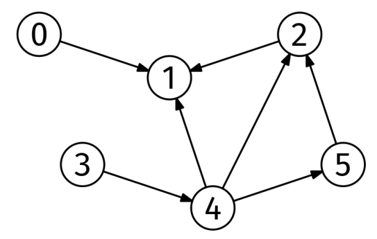

Given the adjacency list of an unweighted DAG, graph, and a node, start, return an array of length V (the number of nodes) with the number of different paths from start to every node.

Example:
graph = [
  [1],        # Neighbors of node 0
  [],         # Neighbors of node 1
  [1],        # Neighbors of node 2
  [4],        # Neighbors of node 3
  [1, 2, 5],  # Neighbors of node 4
  [2]         # Neighbors of node 5
]
start = 4

Output: [0, 3, 2, 0, 1, 1]
Nodes 0 and 3 are unreachable from node 4.
There is a single path from 4 to itself, the empty path.
There are 3 paths from node 4 to node 1:
    4 -> 1,
    4 -> 2 -> 1,
    4 -> 5 -> 2 -> 1
Here is the DAG from the example:

DAG Example

Constraints:

The number of nodes is at most 10^5
The number of edges is at most 10^6
Each node is labeled from 0 to V-1

See Solution
Problem 42.4 - Counting Paths: Solution
Java
Since this is a DAG problem, we can use the topological sort recipe:

compute a topological ordering (Kahn's peel-off algorithm)
for node in topological ordering
  for each edge node -> nbr
    update some information about nbr
We start by computing a topological ordering, as usual. We can use the 'peel-off' algorithm:

topo_order = empty list
while not every node is in topo_order:
  pick a node with in-degree 0
  add it to topo_order
  decrease the in-degree of its neighbors by 1

if not all nodes were peeled off, there is a cycle
Peel off algorithm

Once we have the topological sorting, we use it to count the paths.

We follow a very similar approach to the one for shortest and longest paths in DAGs. Instead of a distances map, we have a counts array, which starts at 1 for start. When we process a node, u, in the topological order, if counts[u] is k, we increase the count of all its neighbors by k.

For instance, if the starting node is 4 in the graph from the statement example, the counts evolve as follows:

- Initialization:     [0, 0, 0, 0, 1, 0]
- After processing 4: [0, 1, 1, 0, 1, 1]
- After processing 5: [0, 1, 2, 0, 1, 1]
- After processing 2: [0, 3, 2, 0, 1, 1]
Since there are 2 ways of getting from 4 to 2 (4 -> 2 and 4 -> 5 -> 2), when we process edge 2 -> 1, we increase counts[1] by 2 to account for the two paths from 4 to 1 that go through 2 (4 -> 2 -> 1 and 4 -> 5 -> 2 -> 1).

Here is the implementation:

class TopologicalSort {
  public List<Integer> solve(List<List<Integer>> graph) {
    // Initialization
    int V = graph.size();
    int[] inDegrees = new int[V];
    for (int node = 0; node < V; node++) {
      for (int nbr : graph.get(node)) {
        inDegrees[nbr]++;
      }
    }
    List<Integer> degreeZero = new ArrayList<>();
    for (int node = 0; node < V; node++) {
      if (inDegrees[node] == 0) {
        degreeZero.add(node);
      }
    }

    // Main 'peel-off' loop
    List<Integer> topoOrder = new ArrayList<>();
    while (!degreeZero.isEmpty()) {
      int node = degreeZero.remove(degreeZero.size() - 1);
      topoOrder.add(node);
      for (int nbr : graph.get(node)) {
        inDegrees[nbr]--;
        if (inDegrees[nbr] == 0) {
          degreeZero.add(nbr);
        }
      }
    }
    return topoOrder;
  }
}

class PathCount {
  public int[] solve(List<List<Integer>> graph, int start) {
    List<Integer> topoOrder = new TopologicalSort().solve(graph);

    int[] counts = new int[graph.size()];
    counts[start] = 1;
    for (int node : topoOrder) {
      for (int nbr : graph.get(node)) {
        counts[nbr] += counts[node];
      }
    }
    return counts;
  }
}
Time & Space Analysis
V: the number of nodes

E: the number of edges

Time: O(V + E) for topological sort and path count.

Extra space: O(V).

Note: if the graph was given as an edge list instead (which is common in interviews), we would need to convert it to an adjacency list, so the space complexity would be O(V+E).

Tests
Here are some test cases to verify the solution:

class RunTests {
  public void runTests() {
    Object[][] tests = {
        // Example from the book
        {
            new int[][] {
                { 1 },
                {},
                { 1 },
                { 4 },
                { 1, 2, 5 },
                { 2 }
            },
            4,
            new int[] { 0, 3, 2, 0, 1, 1 }
        },
        // Edge case: Single node graph
        {
            new int[][] { {} },
            0,
            new int[] { 1 }
        },
        {
            new int[][] { { 1 }, {} },
            0,
            new int[] { 1, 1 }
        },
        {
            new int[][] { { 1 }, { 2 }, {} },
            1,
            new int[] { 0, 1, 1 }
        },
        {
            new int[][] { { 1, 2 }, { 3 }, { 3 }, {} },
            0,
            new int[] { 1, 1, 1, 2 }
        }
    };

    PathCount solution = new PathCount();
    for (Object[] test : tests) {
      int[][] graphArray = (int[][]) test[0];
      List<List<Integer>> graph = Arrays.stream(graphArray)
          .map(row -> Arrays.stream(row)
              .boxed()
              .collect(Collectors.toList()))
          .collect(Collectors.toList());
      int start = (int) test[1];
      int[] want = (int[]) test[2];
      int[] got = solution.solve(graph, start);
      if (!Arrays.equals(got, want)) {
        throw new RuntimeException(String.format(
            "\nsolve(%s, %d): got: %s, want: %s\n",
            graph, start, Arrays.toString(got), Arrays.toString(want)));
      }
    }
  }
}

public class Solution {
  public static void main(String[] args) {
    new RunTests().runTests();
  }
}

def topological_sort(graph):
  # Initialization
  V = len(graph)
  in_degrees = [0 for _ in range(V)]
  for node in range(V):
    for nbr in graph[node]:
      in_degrees[nbr] += 1
  degree_zero = []
  for node in range(V):
    if in_degrees[node] == 0:
      degree_zero.append(node)

  # Main 'peel-off' loop
  topo_order = []
  while degree_zero:
    node = degree_zero.pop()
    topo_order.append(node)
    for nbr in graph[node]:
      in_degrees[nbr] -= 1
      if in_degrees[nbr] == 0:
        degree_zero.append(nbr)
  return topo_order

def path_count(graph, start):
  topo_order = topological_sort(graph)  # Recipe 1.

  counts = [0] * len(graph)
  counts[start] = 1
  for node in topo_order:
    for nbr in graph[node]:
      counts[nbr] += counts[node]
  return counts
Time & Space Analysis
V: the number of nodes

E: the number of edges

Time: O(V + E) for topological sort and path count.

Extra space: O(V).

Note: if the graph was given as an edge list instead (which is common in interviews), we would need to convert it to an adjacency list, so the space complexity would be O(V+E).

Tests
Here are some test cases to verify the solution:

def run_tests():
  tests = [
      # Example from the book
      ([[1], [], [1], [4], [1, 2, 5], [2]], 4, [0, 3, 2, 0, 1, 1]),
      # Edge case: Single node graph
      ([[]], 0, [1]),
      ([[1], []], 0, [1, 1]),
      ([[1], [2], []], 1, [0, 1, 1]),
      ([[1, 2], [3], [3], []], 0, [1, 1, 1, 2]),
  ]

  for graph, start, want in tests:
    got = path_count(graph, start)
    assert got == want, f"\npath_count({graph}, {start}): got: {
        got}, want: {want}\n"

run_tests()

function topologicalSort(graph) {
  // Initialization
  const V = graph.length;
  const inDegrees = new Array(V).fill(0);
  for (let node = 0; node < V; node++) {
    for (const nbr of graph[node]) {
      inDegrees[nbr]++;
    }
  }
  const degreeZero = [];
  for (let node = 0; node < V; node++) {
    if (inDegrees[node] === 0) {
      degreeZero.push(node);
    }
  }

  // Main 'peel-off' loop
  const topoOrder = [];
  while (degreeZero.length > 0) {
    const node = degreeZero.pop();
    topoOrder.push(node);
    for (const nbr of graph[node]) {
      inDegrees[nbr]--;
      if (inDegrees[nbr] === 0) {
        degreeZero.push(nbr);
      }
    }
  }
  return topoOrder;
}

function pathCount(graph, start) {
  const topoOrder = topologicalSort(graph);

  const counts = new Array(graph.length).fill(0);
  counts[start] = 1;
  for (const node of topoOrder) {
    for (const nbr of graph[node]) {
      counts[nbr] += counts[node];
    }
  }
  return counts;
}
Time & Space Analysis
V: the number of nodes

E: the number of edges

Time: O(V + E) for topological sort and path count.

Extra space: O(V).

Note: if the graph was given as an edge list instead (which is common in interviews), we would need to convert it to an adjacency list, so the space complexity would be O(V+E).

Tests
Here are some test cases to verify the solution:

function runTests() {
  const tests = [
    // Example from the book
    [[[1], [], [1], [4], [1, 2, 5], [2]], 4, [0, 3, 2, 0, 1, 1]],
    // Edge case: Single node graph
    [[[]], 0, [1]],
    [[[1], []], 0, [1, 1]],
    [[[1], [2], []], 1, [0, 1, 1]],
    [[[1, 2], [3], [3], []], 0, [1, 1, 1, 2]],
  ];

  for (const [graph, start, want] of tests) {
    const got = pathCount(graph, start);
    if (JSON.stringify(got) !== JSON.stringify(want)) {
      throw new Error(
        `\npathCount(${JSON.stringify(graph)}, ${start}): got: ${JSON.stringify(got)}, want: ${JSON.stringify(want)}\n`,
      );
    }
  }
}

runTests();