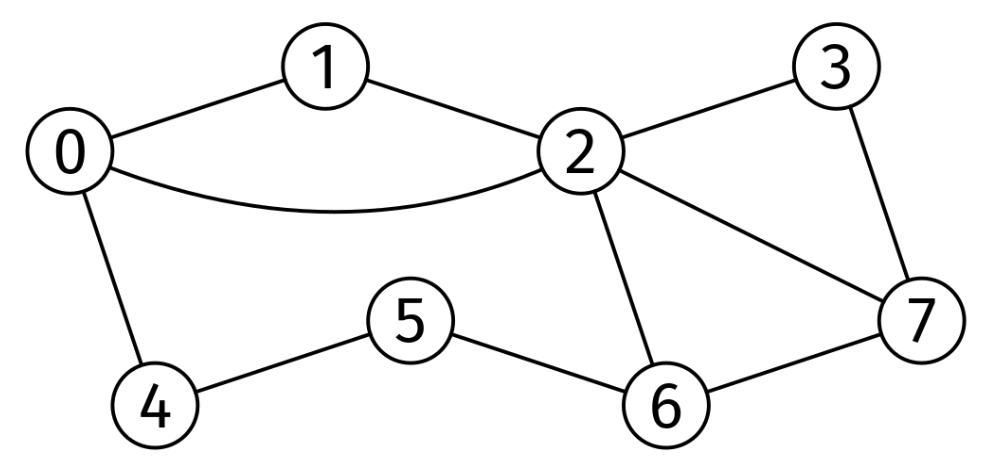
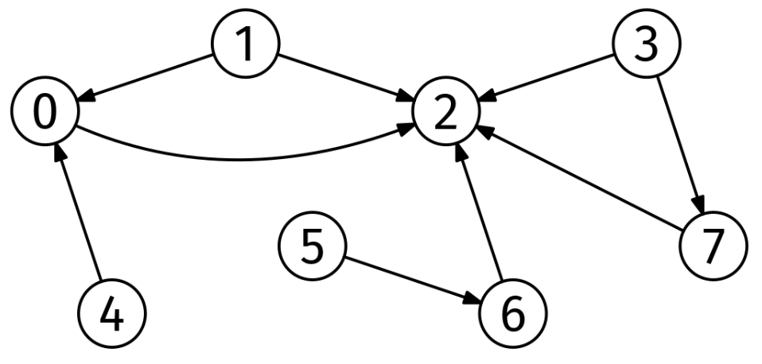

Given the number of nodes and the edge list of an unweighted, undirected graph, V and edges, find the longest path where every node has a higher degree than the previous one and return its length.

Example:
V = 8
edges = [
  [0, 1], [1, 2], [2, 3], [0, 2], [0, 4], [2, 6],
  [3, 7], [2, 7], [4, 5], [5, 6], [6, 7]
]

Output: 3
One of the longest paths with increasing degrees is 5 -> 6 -> 2 (degrees 2, 3,
and 5). Other longest paths include 1 -> 0 -> 2.
Here is the graph from the example:

Longest path of increasing degrees

Constraints:

The number of nodes is at most 10^5
The number of edges is at most 10^6
Each node is labeled from 0 to V-1
edges[i].length == 2

Problem 42.6 - Longest Path of Increasing Degrees: Solution
Java
This is clearly a graph problem but what graph algorithm can we use to solve this problem?

At first, it may seem that topological order cannot be used because the graph is undirected and may have cycles. However, we can only follow edges in one direction, from smaller to larger degree. And, more importantly, we cannot have a cycle of increasing degrees. Thus, when we restrict the edges to the directions we can use, the graph becomes a DAG, and we can reframe the problem as finding the longest path in a DAG.

For example, if we have this original graph:

Longest path of increasing degrees

We can think of it as this DAG:

Longest path of increasing degrees solution

Now that we know how to model the graph as a DAG, we can use the recipe for DAG problems:

Now that we know how to model the graph as a DAG, we can use the recipe for DAG problems:

compute a topological ordering (Kahn's peel-off algorithm)
for node in topological ordering
  for each edge node -> nbr
    update some information about nbr
We start by computing a topological ordering, as usual. We can use the 'peel-off' algorithm:

topo_order = empty list
while not every node is in topo_order:
  pick a node with in-degree 0
  add it to topo_order
  decrease the in-degree of its neighbors by 1

if not all nodes were peeled off, there is a cycle
Peel off algorithm

Now that we have a topological ordering, we can compute the longest path in the DAG.

We maintain a lengths map, where lengths[u] is the longest path we have found so far ending at node u. Initially, all we know is that lenghts[u] = 0 for nodes with no incoming degrees.

Since we can start from any node, we initialize every node's longest path to 0 rather than just one specific start node, and end by returning the maximum longest path across all nodes. We also treat all the edge weights as 1.

We iterate through the topological ordering from left to right. When we process a node u, we check if any of the outgoing edges u -> w produces a longer path to w. If so, we update lengths[w] to lengths[u] + 1.

In the implementation, instead of explicitly constructing the DAG, we can find the correct neighbors on the fly: whenever we need to iterate through the neighbors of a node, we skip those with lower or equal degree.

Here is the implementation:

class LongestPathOfIncreasingDegrees {
  private List<List<Integer>> graph;

  private List<Integer> dagNeighbors(int node) {
    List<Integer> nbrs = new ArrayList<>();
    for (int nbr : graph.get(node)) {
      if (graph.get(nbr).size() > graph.get(node).size()) {
        nbrs.add(nbr);
      }
    }
    return nbrs;
  }

  private List<Integer> topologicalSort() {
    // Initialization
    int V = graph.size();
    int[] inDegrees = new int[V];
    for (int node = 0; node < V; node++) {
      for (int nbr : dagNeighbors(node)) {
        inDegrees[nbr]++;
      }
    }

    List<Integer> degreeZero = new ArrayList<>();
    for (int node = 0; node < V; node++) {
      if (inDegrees[node] == 0) {
        degreeZero.add(node);
      }
    }

    // Main 'peel-off' loop
    List<Integer> topoOrder = new ArrayList<>();
    while (!degreeZero.isEmpty()) {
      int node = degreeZero.remove(degreeZero.size() - 1);
      topoOrder.add(node);
      for (int nbr : dagNeighbors(node)) {
        inDegrees[nbr]--;
        if (inDegrees[nbr] == 0) {
          degreeZero.add(nbr);
        }
      }
    }

    return topoOrder;
  }

  public int solve(int V, List<int[]> edges) {
    graph = new ArrayList<>(V);
    for (int i = 0; i < V; i++) {
      graph.add(new ArrayList<>());
    }
    for (int[] edge : edges) {
      graph.get(edge[0]).add(edge[1]);
      graph.get(edge[1]).add(edge[0]);
    }

    List<Integer> topoOrder = topologicalSort();

    int[] lengths = new int[V];
    for (int node : topoOrder) {
      for (int nbr : dagNeighbors(node)) {
        if (lengths[node] + 1 > lengths[nbr]) {
          lengths[nbr] = lengths[node] + 1;
        }
      }
    }

    int maxLength = 0;
    for (int length : lengths) {
      maxLength = Math.max(maxLength, length);
    }
    return maxLength;
  }
}
Time & Space Analysis
V: the number of nodes

E: the number of edges

Time: O(V + E) for topological sort and longest path computation.

Extra space: O(V + E) for the adjacency list.

Tests
Here are some test cases to verify the solution:

record TestCase(int V, List<int[]> edges, int want) {
}

class RunTests {
  public void runTests() {
    TestCase[] tests = {
        // Example from the book.
        new TestCase(
            8,
            Arrays.asList(
                new int[] { 0, 1 }, new int[] { 1, 2 }, new int[] { 2, 3 },
                new int[] { 0, 2 },
                new int[] { 0, 4 }, new int[] { 2, 6 }, new int[] { 3, 7 },
                new int[] { 2, 7 },
                new int[] { 4, 5 }, new int[] { 5, 6 }, new int[] { 6, 7 }),
            2),
        // Edge case: Single node.
        new TestCase(1, Arrays.asList(), 0),
        // Can do 0 -> 1 or 2 -> 1.
        new TestCase(3, Arrays.asList(new int[] { 0, 1 }, new int[] { 1, 2 }),
            1),
        // Cycle graph.
        new TestCase(
            4,
            Arrays.asList(
                new int[] { 0, 1 }, new int[] { 1, 2 }, new int[] { 2, 3 },
                new int[] { 3, 0 }),
            0),
        // Star graph.
        new TestCase(
            4,
            Arrays.asList(new int[] { 0, 1 }, new int[] { 0, 2 },
                new int[] { 0, 3 }),
            1),
        // Can do 3 -> 2 -> 1 -> 0.
        new TestCase(
            10,
            Arrays.asList(
                new int[] { 0, 1 }, new int[] { 1, 2 }, new int[] { 2, 3 },
                new int[] { 2, 4 },
                new int[] { 3, 5 }, new int[] { 3, 6 }, new int[] { 3, 7 }),
            3)
    };

    LongestPathOfIncreasingDegrees solution = new LongestPathOfIncreasingDegrees();
    for (TestCase test : tests) {
      int got = solution.solve(test.V(), test.edges());
      if (got != test.want()) {
        throw new RuntimeException(String.format(
            "\nsolve(%d, %s): got: %d, want: %d\n",
            test.V(), Arrays.deepToString(test.edges().toArray()), got,
            test.want()));
      }
    }
  }
}

public class Solution {
  public static void main(String[] args) {
    new RunTests().runTests();
  }
}
def dag_neighbors(graph, node):
  return [nbr for nbr in graph[node] if len(graph[nbr]) > len(graph[node])]
Here is the modified topological sort:

def topological_sort(graph):
  # Initialization
  V = len(graph)
  in_degrees = [0 for _ in range(V)]
  for node in range(V):
    for nbr in dag_neighbors(graph, node):
      in_degrees[nbr] += 1

  degree_zero = []
  for node in range(V):
    if in_degrees[node] == 0:
      degree_zero.append(node)

  # Main 'peel-off' loop
  topo_order = []
  while degree_zero:
    node = degree_zero.pop()
    topo_order.append(node)
    for nbr in dag_neighbors(graph, node):
      in_degrees[nbr] -= 1
      if in_degrees[nbr] == 0:
        degree_zero.append(nbr)

  return topo_order

def longest_path_of_increasing_degrees(V, edges):
  graph = [[] for _ in range(V)]
  for u, v in edges:
    graph[u].append(v)
    graph[v].append(u)

  topo_order = topological_sort(graph)  # Recipe 1 (modified).

  lengths = {i: 0 for i in range(V)}
  for node in topo_order:
    for nbr in dag_neighbors(graph, node):
      if lengths[node] + 1 > lengths[nbr]:
        lengths[nbr] = lengths[node] + 1
  return max(lengths.values())
Time & Space Analysis
V: the number of nodes

E: the number of edges

Time: O(V + E) for topological sort and longest path computation.

Extra space: O(V + E) for the adjacency list.

Tests
Here are some test cases to verify the solution:

def run_tests():
  tests = [
      # Example from the book.
      (8, [[0, 1], [1, 2], [2, 3], [0, 2], [0, 4], [
          2, 6], [3, 7], [2, 7], [4, 5], [5, 6], [6, 7]], 2),
      # Edge case: Single node.
      (1, [], 0),
      # Can do 0 -> 1 or 2 -> 1.
      (3, [[0, 1], [1, 2]], 1),
      # Cycle graph.
      (4, [[0, 1], [1, 2], [2, 3], [3, 0]], 0),
      # Star graph.
      (4, [[0, 1], [0, 2], [0, 3]], 1),
      # Can do 3 -> 2 -> 1 -> 0.
      (10, [[0, 1], [1, 2], [2, 3], [2, 4], [3, 5], [3, 6], [3, 7]], 3),
  ]

  for V, edges, want in tests:
    got = longest_path_of_increasing_degrees(V, edges)
    assert got == want, f"\nlongest_path_of_increasing_degrees({V}, {edges}): got: {
        got}, want: {want}\n"

run_tests()
function dagNeighbors(graph, node) {
  return graph[node].filter((nbr) => graph[nbr].length > graph[node].length);
}
Here is the modified topological sort:

function topologicalSort(graph) {
  // Initialization
  const V = graph.length;
  const inDegrees = new Array(V).fill(0);
  for (let node = 0; node < V; node++) {
    for (const nbr of dagNeighbors(graph, node)) {
      inDegrees[nbr]++;
    }
  }

  const degreeZero = [];
  for (let node = 0; node < V; node++) {
    if (inDegrees[node] === 0) {
      degreeZero.push(node);
    }
  }

  // Main 'peel-off' loop
  const topoOrder = [];
  while (degreeZero.length > 0) {
    const node = degreeZero.pop();
    topoOrder.push(node);
    for (const nbr of dagNeighbors(graph, node)) {
      inDegrees[nbr]--;
      if (inDegrees[nbr] === 0) {
        degreeZero.push(nbr);
      }
    }
  }

  return topoOrder;
}

function longestPathOfIncreasingDegrees(V, edges) {
  const graph = Array.from({ length: V }, () => []);
  for (const [u, v] of edges) {
    graph[u].push(v);
    graph[v].push(u);
  }

  const topoOrder = topologicalSort(graph);

  const lengths = new Array(V).fill(0);
  for (const node of topoOrder) {
    for (const nbr of dagNeighbors(graph, node)) {
      if (lengths[node] + 1 > lengths[nbr]) {
        lengths[nbr] = lengths[node] + 1;
      }
    }
  }

  return Math.max(...lengths);
}
Time & Space Analysis
V: the number of nodes

E: the number of edges

Time: O(V + E) for topological sort and longest path computation.

Extra space: O(V + E) for the adjacency list.

Tests
Here are some test cases to verify the solution:

function runTests() {
  const tests = [
    // Example from the book.
    {
      V: 8,
      edges: [
        [0, 1],
        [1, 2],
        [2, 3],
        [0, 2],
        [0, 4],
        [2, 6],
        [3, 7],
        [2, 7],
        [4, 5],
        [5, 6],
        [6, 7],
      ],
      want: 2,
    },
    // Edge case: Single node.
    {
      V: 1,
      edges: [],
      want: 0,
    },
    // Can do 0 -> 1 or 2 -> 1.
    {
      V: 3,
      edges: [
        [0, 1],
        [1, 2],
      ],
      want: 1,
    },
    // Cycle graph.
    {
      V: 4,
      edges: [
        [0, 1],
        [1, 2],
        [2, 3],
        [3, 0],
      ],
      want: 0,
    },
    // Star graph.
    {
      V: 4,
      edges: [
        [0, 1],
        [0, 2],
        [0, 3],
      ],
      want: 1,
    },
    // Can do 3 -> 2 -> 1 -> 0.
    {
      V: 10,
      edges: [
        [0, 1],
        [1, 2],
        [2, 3],
        [2, 4],
        [3, 5],
        [3, 6],
        [3, 7],
      ],
      want: 3,
    },
  ];

  for (const { V, edges, want } of tests) {
    const got = longestPathOfIncreasingDegrees(V, edges);
    if (got !== want) {
      throw new Error(
        `\nlongestPathOfIncreasingDegrees(${V}, ${JSON.stringify(edges)}): ` +
          `got: ${got}, want: ${want}\n`,
      );
    }
  }
}

runTests();