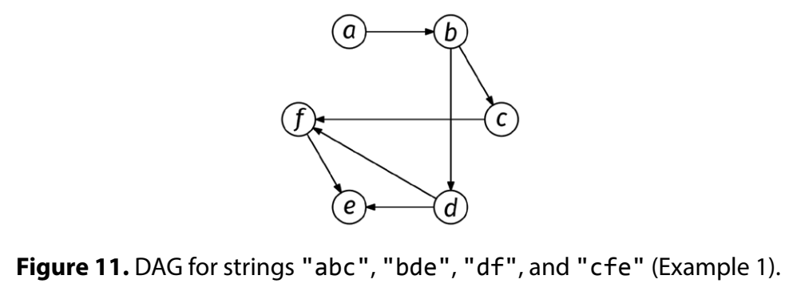

A supersequence of a string s is another string that contains all the same letters of s in the same relative order. For instance, "aabbcc" is a supersequence of "abc", but not of "bca".

Given a non-empty array of strings, arr, where each string consists only of lowercase English letters, determine if it is possible to construct a single supersequence of all the strings in arr such that no letter appears more than once. Return true if such a supersequence exists and false otherwise.

Example 1. arr = ["abc", "bde", "df", "cfe"]
Output: True. "abcdfe" is a supersequence.

Example 2. arr = ["ab", "ba"]
Output: False. Any supersequence would have to
- include 'a' twice (like "aba") or
- include 'b' twice (like "bab").

Example 3. arr = ["aa"]
Output: False.
Constraints:

The length of each string is at most 100
Each string consists of lowercase English letters
See Solution
Problem 42.7 - Supersequence: Solution
Python
Even though the input consists of strings, there is a clue that this might be a graph-related problem: we have pairwise relationships between letters.

The fact that those relationships indicate dependencies of the kind "letter x must go before letter y" further narrows it down to a DAG (directed Acyclic Graph). Interestingly, the DAG's nodes are not the input strings, but rather individual letters.

We can model this problem as a graph where there is one node per English letter and edges represent that a letter must appear before another. If we have a string in arr like "xyz", we add edges x -> y and y -> z (we could also add x -> z, but that is redundant).

Graph Example

After building this graph, the problem becomes the cycle-detection problem: if there is a cycle between letters, then there is no supersequence.

We can tackle the cycle-detection problem with the peel-off algorithm:

topo_order = empty list
while not every node is in topo_order:
  pick a node with in-degree 0
  add it to topo_order
  decrease the in-degree of its neighbors by 1

if not all nodes were peeled off, there is a cycle
Peel off algorithm

We detect that there is a cycle if we can't peel any more nodes, and we haven't peeled off all the nodes yet.

Here is the implementation:

def has_cycle(graph):
  # Use topological sort to return whether there is a cycle.

  # Initialization
  in_degree = {}
  for node in graph:
    in_degree[node] = 0
  for node in graph:
    for nbr in graph[node]:
      in_degree[nbr] += 1
  degree_zero = []
  for node in in_degree:
    if in_degree[node] == 0:
      degree_zero.append(node)

  # Main 'peel-off' loop
  topo_order = []
  while degree_zero:
    node = degree_zero.pop()
    topo_order.append(node)
    for nbr in graph[node]:
      in_degree[nbr] -= 1
      if in_degree[nbr] == 0:
        degree_zero.append(nbr)

  return len(topo_order) != len(graph)

def can_form_supersequence(arr):
  # Build the graph
  graph = {}
  for word in arr:
    for c in word:
      if c not in graph:
        graph[c] = set()
  for word in arr:
    for i in range(len(word) - 1):
      graph[word[i]].add(word[i + 1])

  # Check for cycles using topological sort
  return not has_cycle(graph)
Time & Space Analysis
n: the total length of all strings in arr

Time: O(n) - to build the graph and for the peel-off algorithm

Extra space: O(n) - for the adjacency list

The graph will have at most 26 nodes and at most 26*26 = 676 edges. Thus, we can also consider that the space is O(1).

Tests
Here are some test cases to verify the solution:

def run_tests():
  tests = [
      (["abc", "bde", "df", "cfe"], True),
      # Cycle present
      (["ab", "ba"], False),
      # Edge case: Single letter
      (["a"], True),
      # Edge case: Empty array
      ([], True),
      # Multiple words with no dependencies
      (["a", "b", "c"], True),
      # Long chain
      (["ab", "bc", "cd", "de", "ef", "fg"], True),
      # Cycle
      (["abc", "bcd", "cda"], False),
      # Same letter multiple times
      (["aba", "bab"], False),
  ]

  for arr, want in tests:
    got = can_form_supersequence(arr)
    assert got == want, f"\ncan_form_supersequence({arr}): got: {
        got}, want: {want}\n"

run_tests()
function hasCycle(graph) {
  // Use topological sort to return whether there is a cycle.

  // Initialization
  const inDegree = {};
  for (const node in graph) {
    inDegree[node] = 0;
  }
  for (const node in graph) {
    for (const nbr of graph[node]) {
      inDegree[nbr] = (inDegree[nbr] || 0) + 1;
    }
  }
  const degreeZero = [];
  for (const node in inDegree) {
    if (inDegree[node] === 0) {
      degreeZero.push(node);
    }
  }

  // Main 'peel-off' loop
  const topoOrder = [];
  while (degreeZero.length > 0) {
    const node = degreeZero.pop();
    topoOrder.push(node);
    for (const nbr of graph[node]) {
      inDegree[nbr]--;
      if (inDegree[nbr] === 0) {
        degreeZero.push(nbr);
      }
    }
  }

  return topoOrder.length !== Object.keys(graph).length;
}

function canFormSupersequence(arr) {
  // Build the graph
  const graph = {};
  for (const word of arr) {
    for (const c of word) {
      if (!(c in graph)) {
        graph[c] = new Set();
      }
    }
  }
  for (const word of arr) {
    for (let i = 0; i < word.length - 1; i++) {
      graph[word[i]].add(word[i + 1]);
    }
  }

  // Check for cycles using topological sort
  return !hasCycle(graph);
}
Time & Space Analysis
n: the total length of all strings in arr

Time: O(n) - to build the graph and for the peel-off algorithm

Extra space: O(n) - for the adjacency list

The graph will have at most 26 nodes and at most 26*26 = 676 edges. Thus, we can also consider that the space is O(1).

Tests
Here are some test cases to verify the solution:

function runTests() {
  const tests = [
    [["abc", "bde", "df", "cfe"], true],
    // Cycle present
    [["ab", "ba"], false],
    // Edge case: Single letter
    [["a"], true],
    // Edge case: Empty array
    [[], true],
    // Multiple words with no dependencies
    [["a", "b", "c"], true],
    // Long chain
    [["ab", "bc", "cd", "de", "ef", "fg"], true],
    // Cycle
    [["abc", "bcd", "cda"], false],
    // Same letter multiple times
    [["aba", "bab"], false],
  ];

  for (const [arr, want] of tests) {
    const got = canFormSupersequence(arr);
    if (got !== want) {
      throw new Error(
        `\ncanFormSupersequence(${JSON.stringify(arr)}): got: ${got}, want: ${want}\n`,
      );
    }
  }
}

runTests();

class CanFormSupersequence {
  private boolean hasCycle(Map<Character, Set<Character>> graph) {
    // Use topological sort to return whether there is a cycle.

    // Initialization
    Map<Character, Integer> inDegree = new HashMap<>();
    for (char node : graph.keySet()) {
      inDegree.put(node, 0);
    }
    for (char node : graph.keySet()) {
      for (char nbr : graph.get(node)) {
        inDegree.put(nbr, inDegree.get(nbr) + 1);
      }
    }
    List<Character> degreeZero = new ArrayList<>();
    for (Map.Entry<Character, Integer> entry : inDegree.entrySet()) {
      if (entry.getValue() == 0) {
        degreeZero.add(entry.getKey());
      }
    }

    // Main 'peel-off' loop
    List<Character> topoOrder = new ArrayList<>();
    while (!degreeZero.isEmpty()) {
      char node = degreeZero.remove(degreeZero.size() - 1);
      topoOrder.add(node);
      for (char nbr : graph.get(node)) {
        inDegree.put(nbr, inDegree.get(nbr) - 1);
        if (inDegree.get(nbr) == 0) {
          degreeZero.add(nbr);
        }
      }
    }

    return topoOrder.size() != graph.size();
  }

  public boolean solve(String[] arr) {
    // Build the graph
    Map<Character, Set<Character>> graph = new HashMap<>();
    for (String word : arr) {
      for (char c : word.toCharArray()) {
        if (!graph.containsKey(c)) {
          graph.put(c, new HashSet<>());
        }
      }
    }
    for (String word : arr) {
      for (int i = 0; i < word.length() - 1; i++) {
        graph.get(word.charAt(i)).add(word.charAt(i + 1));
      }
    }

    // Check for cycles using topological sort
    return !hasCycle(graph);
  }
}
Time & Space Analysis
n: the total length of all strings in arr

Time: O(n) - to build the graph and for the peel-off algorithm

Extra space: O(n) - for the adjacency list

The graph will have at most 26 nodes and at most 26*26 = 676 edges. Thus, we can also consider that the space is O(1).

Tests
Here are some test cases to verify the solution:

class RunTests {
  public void runTests() {
    Object[][] tests = {
        { new String[] { "abc", "bde", "df", "cfe" }, true },
        // Cycle present
        { new String[] { "ab", "ba" }, false },
        // Edge case: Single letter
        { new String[] { "a" }, true },
        // Edge case: Empty array
        { new String[] {}, true },
        // Multiple words with no dependencies
        { new String[] { "a", "b", "c" }, true },
        // Long chain
        { new String[] { "ab", "bc", "cd", "de", "ef", "fg" }, true },
        // Cycle
        { new String[] { "abc", "bcd", "cda" }, false },
        // Same letter multiple times
        { new String[] { "aba", "bab" }, false },
    };

    CanFormSupersequence solution = new CanFormSupersequence();
    for (Object[] test : tests) {
      String[] arr = (String[]) test[0];
      boolean want = (boolean) test[1];
      boolean got = solution.solve(arr);
      if (got != want) {
        throw new RuntimeException(String.format(
            "\nsolve(%s): got: %b, want: %b\n",
            Arrays.toString(arr), got, want));
      }
    }
  }
}

public class Solution {
  public static void main(String[] args) {
    new RunTests().runTests();
  }
}

