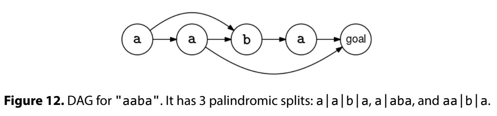

A palindrome is a string that reads the same forward and backward, like "abba".

A palindromic split of a string is a way of dividing a string into substrings where every substring is a palindrome.

Given a string, s, return the number of palindromic splits.

Example 1:
s = "abbaab"

Output: 6
The palindromic splits are:
- `a|b|b|a|a|b`
- `a|bb|a|a|b`
- `a|b|b|aa|b`
- `a|bb|aa|b`
- `abba|a|b`
- `a|b|baab`

Example 2:
s = "aabaa"

Output: 6
The palindromic splits are:
- `a|a|b|a|a`
- `aa|b|a|a`
- `a|a|b|aa`
- `aa|b|aa`
- `a|aba|a`
- `aabaa`

Example 3:
s = "aaaaa"

Output: 16

Example 4:
s = ""

Output: 0
Constraints:

The length of the string is at most 10^4
Each character in the string is a lowercase English letter
See Solution
Problem 42.8 - Number of Palindromic Splits: Solution
Java
This is a counting problem, which is a trigger for backtracking and dynamic programming, and it can indeed be solved efficiently with DP.

DP Solution with Memoization
We can use dynamic programming to solve this problem.

To derive a recurrence relation, let's think about our choices. Starting at the beginning, we need to choose what will be the first palindromic substring. Our choices are all the palindromic prefixes of s (a single character is a palindrome, so there should be at least one choice if s is not empty).

For each possible choice for the first palindromic substring, we are left with a suffix of the original string, which itself is a smaller subproblem that can be solved recursively. If the suffix is empty, it means we have successfully created a complete split.

Here are the elements of the recurrence relation:

1. Signature: we'll have one subproblem, count_splits(i), per suffix of the input string.

2. Description: count_splits(i) is the number of palindromic splits of s[i:] (the suffix starting at i).

3. Base case: count_splits(len(s)) = 1 (we've successfully created a complete split).

4. General case:

Choices: where to end the current palindromic substring starting at position i.
For each valid ending position j where s[i:j+1] is a palindrome, we recursively count splits for the remaining substring.
Aggregation logic: Since it's a counting problem, we sum up all the possibilities:
count_splits(i) = sum(count_splits(j+1) for all j where s[i:j+1] is palindrome)

5. Original problem: count_splits(0).

We can use the memoization recipe to turn the recurrence relation into efficient code:

memo = empty map

f(subproblem_id):
  if subproblem is base case:
    return result directly
  if subproblem in memo map:
    return cached result

  memo[subproblem_id] = recurrence relation formula
  return memo[subproblem_id]

return f(initial subproblem)
The hard part is finding all the choices of a subproblem. For subproblem i, we have to address this question:

"Given a start letter s[i], list all the indices j where s[i:j+1] is a palindrome"

There is actually an algorithm to do this in O(n) time, known as Manacher's algorithm. However, this is beyond what's expected for interviews, so we will not get into it (and we don't recommend spending time learning it).

Instead, we can use the preprocessing pattern and compute, in a preprocessing step, all the palindromic substrings of s.

For now, we'll assume that we have a helper function, find_palindromes(s), that returns all palindromes of s as pairs of indices, (l, r). We can leave the implementation for later and focus on our main task.

With this helper function, we can precompute a set of all (l, r) pairs that are palindromes. Then, we can easily find all the palindromic substrings starting at every letter of s in O(n) time (just like Manacher's algorithm).

Here is the implementation:

class CountPalindromicSplitsDp {
  public int solve(String s) {
    int n = s.length();
    if (n == 0) {
      return 0;
    }

    // Preprocessing: compute all palindromic substrings
    List<int[]> palindromes = FindPalindromes.solve(s);
    Set<String> palindromeSet = new HashSet<>();
    for (int[] p : palindromes) {
      palindromeSet.add(p[0] + "," + p[1]);
    }

    Map<Integer, Integer> memo = new HashMap<>();

    return countSplits(0, s, n, palindromeSet, memo);
  }

  private int countSplits(int i, String s, int n, Set<String> palindromeSet,
      Map<Integer, Integer> memo) {
    // Base case: reached the end of string
    if (i == n) {
      return 1;
    }

    if (memo.containsKey(i)) {
      return memo.get(i);
    }

    // Try all possible palindromic substrings starting at i
    int total = 0;
    for (int j = i; j < n; j++) {
      if (palindromeSet.contains(i + "," + j)) {
        total += countSplits(j + 1, s, n, palindromeSet, memo);
      }
    }

    memo.put(i, total);
    return total;
  }
}
Find All Palindromes
Now, let's implement the find_palindromes(s) function.

We can start at each character in s, which is a palindrome by itself, and then try to grow outward for as long as possible while remaining a palindrome.

E.g., if s is "aabaa" and we start at 'b', we will find three nodes: "b", "aba", and "aabaa". This will find all palindromes of odd length. For the ones with even length, we need to grow outward from every pair of consecutive characters.

Here is the implementation:

class FindPalindromes {
  public static List<int[]> solve(String s) {
    int n = s.length();
    List<int[]> palindromes = new ArrayList<>();
    for (int i = 0; i < n; i++) {
      int l = i, r = i;
      while (l >= 0 && r < n && s.charAt(l) == s.charAt(r)) {
        palindromes.add(new int[] { l, r });
        l--;
        r++;
      }
      l = i;
      r = i + 1;
      while (l >= 0 && r < n && s.charAt(l) == s.charAt(r)) {
        palindromes.add(new int[] { l, r });
        l--;
        r++;
      }
    }
    return palindromes;
  }
}
Topological Sort Solution
The topological sort solution shows just how many problems can be modeled as graphs.

We can think of s as a path we need to traverse. We can go character by character, or we can take a 'shortcut' over a palindromic substring in a single step. We can model this as a DAG (Directed Acyclic Graph) with a node for each character in s, and an edge from s[i] to s[j] if s[i:j] is a palindrome. A single character is a palindrome, so there is an edge from s[0] to s[1], from s[1] to s[2], and so on. There are additional edges for each palindromic substring of length > 1. For instance, if the string is "abacdc", one of the edges would be from the first 'a' to the first 'c'. All edges go from left to right, meaning that there is no cycle.

Now we can reframe the problem as counting the number of paths that go from s[0] to the end of s. To make it a bit simpler, we can also add a special goal node with an incoming edge from every letter that is the start of a palindromic suffix. Then, the problem can be reframed as counting the number of paths in a DAG from s[0] to goal.

DAG Example

Counting paths in a DAG is one of the classic DAG problems.

The tedious part of this problem is first creating the DAG. To populate the edges, we need to find all the palindromic substrings. Thankfully, we can reuse the find_palindromes(s) function to find all the palindromic substrings.

After we have the DAG, we can use the recipe for DAG problems:
compute a topological ordering (Kahn's peel-off algorithm)
for node in topological ordering
  for each edge node -> nbr
    update some information about nbr
We start by computing a topological ordering, as usual. We can use the 'peel-off' algorithm:

topo_order = empty list
while not every node is in topo_order:
  pick a node with in-degree 0
  add it to topo_order
  decrease the in-degree of its neighbors by 1

if not all nodes were peeled off, there is a cycle
Peel off algorithm

Once we have the topological sorting, we use it to count the paths.

We follow a very similar approach to the one for shortest and longest paths in DAGs. Instead of a distances map, we have a counts array, which starts at 1 for s[0]. When we process a node, s[i], in the topological order, if counts[i] is k, we increase the count of all its neighbors by k.

Here is the implementation:
class CountPalindromicSplits {
  private List<Integer> topologicalSort(List<List<Integer>> graph) {
    int V = graph.size();
    int[] inDegrees = new int[V];
    for (int node = 0; node < V; node++) {
      for (int nbr : graph.get(node)) {
        inDegrees[nbr]++;
      }
    }
    List<Integer> degreeZero = new ArrayList<>();
    for (int node = 0; node < V; node++) {
      if (inDegrees[node] == 0) {
        degreeZero.add(node);
      }
    }

    List<Integer> topoOrder = new ArrayList<>();
    while (!degreeZero.isEmpty()) {
      int node = degreeZero.remove(degreeZero.size() - 1);
      topoOrder.add(node);
      for (int nbr : graph.get(node)) {
        inDegrees[nbr]--;
        if (inDegrees[nbr] == 0) {
          degreeZero.add(nbr);
        }
      }
    }
    return topoOrder;
  }

  public int solve(String s) {
    List<int[]> palindromes = FindPalindromes.solve(s);
    int n = s.length();
    if (n == 0) {
      return 0;
    }

    List<List<Integer>> graph = new ArrayList<>();
    for (int i = 0; i <= n; i++) {
      graph.add(new ArrayList<>());
    }
    for (int[] p : palindromes) {
      graph.get(p[0]).add(p[1] + 1);
    }

    List<Integer> topoOrder = topologicalSort(graph);

    long[] counts = new long[n + 1];
    counts[0] = 1;
    for (int node : topoOrder) {
      for (int nbr : graph.get(node)) {
        counts[nbr] += counts[node];
      }
    }
    return (int) counts[n];
  }
}
Time & Space Analysis
n: the length of the string s
The worst case for both DP and topological sort is when all the letters are the same. In this case, every substring is palindromic, so the graph has O(n^2) edges.

For the DP solution:

Time: O(n^2) - s has O(n^2) substrings
Extra space: O(n^2) - for the preprocessing table and the memo map
For the topological sort solution:

Time: O(n^2)
Extra space: O(n^2) - for the adjacency list
Tests
Here are some test cases to verify the solution:

class RunTests {
  public void runTests() {
    Object[][] tests = {
        { "abbaab", 6 },
        { "aabaa", 6 },
        { "a", 1 },
        { "aa", 2 },
        { "aaa", 4 },
        { "aaaa", 8 },
        { "aaaaa", 16 },
        { "abc", 1 },
        { "aaba", 3 },
        { "abcdedcba", 5 },
        { "", 0 },
    };

    CountPalindromicSplits solution = new CountPalindromicSplits();
    CountPalindromicSplitsDp solutionDp = new CountPalindromicSplitsDp();
    for (Object[] test : tests) {
      String s = (String) test[0];
      int want = (int) test[1];
      int got = solution.solve(s);
      if (got != want) {
        throw new RuntimeException(String.format(
            "\nTopological sort: solve(\"%s\"): got: %d, want: %d\n",
            s, got, want));
      }
      int gotDp = solutionDp.solve(s);
      if (gotDp != want) {
        throw new RuntimeException(String.format(
            "\nDP: solve(\"%s\"): got: %d, want: %d\n",
            s, gotDp, want));
      }
    }
  }
}

public class Solution {
  public static void main(String[] args) {
    new RunTests().runTests();
  }
}
def count_palindromic_splits_dp(s):
  n = len(s)
  if n == 0:
    return 0

  # Preprocessing: compute all palindromic substrings
  palindrome_set = set(find_palindromes(s))

  memo = {}

  def count_splits(i):
    # Base case: reached the end of string
    if i == n:
      return 1

    if i in memo:
      return memo[i]

    # Try all possible palindromic substrings starting at i
    total = 0
    for j in range(i, n):
      if (i, j) in palindrome_set:
        total += count_splits(j + 1)

    memo[i] = total
    return total

  return count_splits(0)
Find All Palindromes
Now, let's implement the find_palindromes(s) function.

We can start at each character in s, which is a palindrome by itself, and then try to grow outward for as long as possible while remaining a palindrome.

E.g., if s is "aabaa" and we start at 'b', we will find three nodes: "b", "aba", and "aabaa". This will find all palindromes of odd length. For the ones with even length, we need to grow outward from every pair of consecutive characters.

Here is the implementation:

def find_palindromes(s):
  n = len(s)
  palindromes = []
  for i in range(n):
    l, r = i, i
    while l >= 0 and r < n and s[l] == s[r]:
      palindromes.append((l, r))
      l -= 1
      r += 1
    l, r = i, i + 1
    while l >= 0 and r < n and s[l] == s[r]:
      palindromes.append((l, r))
      l -= 1
      r += 1
  return palindromes
Topological Sort Solution
The topological sort solution shows just how many problems can be modeled as graphs.

We can think of s as a path we need to traverse. We can go character by character, or we can take a 'shortcut' over a palindromic substring in a single step. We can model this as a DAG (Directed Acyclic Graph) with a node for each character in s, and an edge from s[i] to s[j] if s[i:j] is a palindrome. A single character is a palindrome, so there is an edge from s[0] to s[1], from s[1] to s[2], and so on. There are additional edges for each palindromic substring of length > 1. For instance, if the string is "abacdc", one of the edges would be from the first 'a' to the first 'c'. All edges go from left to right, meaning that there is no cycle.

Now we can reframe the problem as counting the number of paths that go from s[0] to the end of s. To make it a bit simpler, we can also add a special goal node with an incoming edge from every letter that is the start of a palindromic suffix. Then, the problem can be reframed as counting the number of paths in a DAG from s[0] to goal.

DAG Example
Counting paths in a DAG is one of the classic DAG problems.

The tedious part of this problem is first creating the DAG. To populate the edges, we need to find all the palindromic substrings. Thankfully, we can reuse the find_palindromes(s) function to find all the palindromic substrings.

After we have the DAG, we can use the recipe for DAG problems:

compute a topological ordering (Kahn's peel-off algorithm)
for node in topological ordering
  for each edge node -> nbr
    update some information about nbr
We start by computing a topological ordering, as usual. We can use the 'peel-off' algorithm:

topo_order = empty list
while not every node is in topo_order:
  pick a node with in-degree 0
  add it to topo_order
  decrease the in-degree of its neighbors by 1

if not all nodes were peeled off, there is a cycle
Peel off algorithm
Once we have the topological sorting, we use it to count the paths.

We follow a very similar approach to the one for shortest and longest paths in DAGs. Instead of a distances map, we have a counts array, which starts at 1 for s[0]. When we process a node, s[i], in the topological order, if counts[i] is k, we increase the count of all its neighbors by k.

Here is the implementation:

def topological_sort(graph):
  # Initialization
  V = len(graph)
  in_degrees = [0 for _ in range(V)]
  for node in range(V):
    for nbr in graph[node]:
      in_degrees[nbr] += 1
  degree_zero = []
  for node in range(V):
    if in_degrees[node] == 0:
      degree_zero.append(node)

  # Main 'peel-off' loop
  topo_order = []
  while degree_zero:
    node = degree_zero.pop()
    topo_order.append(node)
    for nbr in graph[node]:
      in_degrees[nbr] -= 1
      if in_degrees[nbr] == 0:
        degree_zero.append(nbr)
  return topo_order

def count_palindromic_splits(s):
  palindromes = find_palindromes(s)
  n = len(s)
  if n == 0:
    return 0

  # Use nodes 0 to n, where an edge from i to j indicates that s[i:j] is a
  # palindrome.
  # Node n is the special goal node.
  graph = [[] for _ in range(n + 1)]
  for l, r in palindromes:
    graph[l].append(r + 1)

  topo_order = topological_sort(graph)  # Recipe 1.

  counts = [0] * (n + 1)
  counts[0] = 1
  for node in topo_order:
    for nbr in graph[node]:
      counts[nbr] += counts[node]
  return counts[n]
Time & Space Analysis
n: the length of the string s
The worst case for both DP and topological sort is when all the letters are the same. In this case, every substring is palindromic, so the graph has O(n^2) edges.

For the DP solution:

Time: O(n^2) - s has O(n^2) substrings
Extra space: O(n^2) - for the preprocessing table and the memo map
For the topological sort solution:

Time: O(n^2)
Extra space: O(n^2) - for the adjacency list
Tests
Here are some test cases to verify the solution:

def run_tests():
  tests = [
      ("abbaab", 6),
      ("aabaa", 6),
      ("a", 1),
      ("aa", 2),
      ("aaa", 4),
      ("aaaa", 8),
      ("aaaaa", 16),
      ("abc", 1),
      ("aaba", 3),
      ("abcdedcba", 5),
      ("", 0),
  ]
  for s, want in tests:
    got = count_palindromic_splits(s)
    assert got == want, f"\ncount_palindromic_splits(\"{s}\"): got: {got}, want: {want}\n"
    got_dp = count_palindromic_splits_dp(s)
    assert got_dp == want, f"\ncount_palindromic_splits_dp(\"{s}\"): got: {got_dp}, want: {want}\n"

run_tests()
function countPalindromicSplitsDp(s) {
  const n = s.length;
  if (n === 0) {
    return 0;
  }

  // Preprocessing: compute all palindromic substrings
  const palindromes = findPalindromes(s);
  const palindromeSet = new Set(palindromes.map(([l, r]) => `${l},${r}`));

  const memo = {};

  function countSplits(i) {
    // Base case: reached the end of string
    if (i === n) {
      return 1;
    }

    if (i in memo) {
      return memo[i];
    }

    // Try all possible palindromic substrings starting at i
    let total = 0;
    for (let j = i; j < n; j++) {
      if (palindromeSet.has(`${i},${j}`)) {
        total += countSplits(j + 1);
      }
    }

    memo[i] = total;
    return total;
  }

  return countSplits(0);
}
Find All Palindromes
Now, let's implement the find_palindromes(s) function.

We can start at each character in s, which is a palindrome by itself, and then try to grow outward for as long as possible while remaining a palindrome.

E.g., if s is "aabaa" and we start at 'b', we will find three nodes: "b", "aba", and "aabaa". This will find all palindromes of odd length. For the ones with even length, we need to grow outward from every pair of consecutive characters.

Here is the implementation:

function findPalindromes(s) {
  const n = s.length;
  const palindromes = [];
  for (let i = 0; i < n; i++) {
    let l = i,
      r = i;
    while (l >= 0 && r < n && s[l] === s[r]) {
      palindromes.push([l, r]);
      l--;
      r++;
    }
    l = i;
    r = i + 1;
    while (l >= 0 && r < n && s[l] === s[r]) {
      palindromes.push([l, r]);
      l--;
      r++;
    }
  }
  return palindromes;
}
Topological Sort Solution
The topological sort solution shows just how many problems can be modeled as graphs.

We can think of s as a path we need to traverse. We can go character by character, or we can take a 'shortcut' over a palindromic substring in a single step. We can model this as a DAG (Directed Acyclic Graph) with a node for each character in s, and an edge from s[i] to s[j] if s[i:j] is a palindrome. A single character is a palindrome, so there is an edge from s[0] to s[1], from s[1] to s[2], and so on. There are additional edges for each palindromic substring of length > 1. For instance, if the string is "abacdc", one of the edges would be from the first 'a' to the first 'c'. All edges go from left to right, meaning that there is no cycle.

Now we can reframe the problem as counting the number of paths that go from s[0] to the end of s. To make it a bit simpler, we can also add a special goal node with an incoming edge from every letter that is the start of a palindromic suffix. Then, the problem can be reframed as counting the number of paths in a DAG from s[0] to goal.

DAG Example
Counting paths in a DAG is one of the classic DAG problems.

The tedious part of this problem is first creating the DAG. To populate the edges, we need to find all the palindromic substrings. Thankfully, we can reuse the find_palindromes(s) function to find all the palindromic substrings.

After we have the DAG, we can use the recipe for DAG problems:

compute a topological ordering (Kahn's peel-off algorithm)
for node in topological ordering
  for each edge node -> nbr
    update some information about nbr
We start by computing a topological ordering, as usual. We can use the 'peel-off' algorithm:

topo_order = empty list
while not every node is in topo_order:
  pick a node with in-degree 0
  add it to topo_order
  decrease the in-degree of its neighbors by 1

if not all nodes were peeled off, there is a cycle
Peel off algorithm
Once we have the topological sorting, we use it to count the paths.

We follow a very similar approach to the one for shortest and longest paths in DAGs. Instead of a distances map, we have a counts array, which starts at 1 for s[0]. When we process a node, s[i], in the topological order, if counts[i] is k, we increase the count of all its neighbors by k.

Here is the implementation:

function topologicalSort(graph) {
  const V = graph.length;
  const inDegrees = new Array(V).fill(0);
  for (let node = 0; node < V; node++) {
    for (const nbr of graph[node]) {
      inDegrees[nbr]++;
    }
  }
  const degreeZero = [];
  for (let node = 0; node < V; node++) {
    if (inDegrees[node] === 0) {
      degreeZero.push(node);
    }
  }

  const topoOrder = [];
  while (degreeZero.length > 0) {
    const node = degreeZero.pop();
    topoOrder.push(node);
    for (const nbr of graph[node]) {
      inDegrees[nbr]--;
      if (inDegrees[nbr] === 0) {
        degreeZero.push(nbr);
      }
    }
  }
  return topoOrder;
}

function countPalindromicSplits(s) {
  const palindromes = findPalindromes(s);
  const n = s.length;
  if (n === 0) {
    return 0;
  }

  const graph = Array(n + 1)
    .fill()
    .map(() => []);
  for (const [l, r] of palindromes) {
    graph[l].push(r + 1);
  }

  const topoOrder = topologicalSort(graph);

  const counts = new Array(n + 1).fill(0);
  counts[0] = 1;
  for (const node of topoOrder) {
    for (const nbr of graph[node]) {
      counts[nbr] += counts[node];
    }
  }
  return counts[n];
}
Time & Space Analysis
n: the length of the string s
The worst case for both DP and topological sort is when all the letters are the same. In this case, every substring is palindromic, so the graph has O(n^2) edges.

For the DP solution:

Time: O(n^2) - s has O(n^2) substrings
Extra space: O(n^2) - for the preprocessing table and the memo map
For the topological sort solution:

Time: O(n^2)
Extra space: O(n^2) - for the adjacency list
Tests
Here are some test cases to verify the solution:

function runTests() {
  const tests = [
    ["abbaab", 6],
    ["aabaa", 6],
    ["a", 1],
    ["aa", 2],
    ["aaa", 4],
    ["aaaa", 8],
    ["aaaaa", 16],
    ["abc", 1],
    ["aaba", 3],
    ["abcdedcba", 5],
    ["", 0],
  ];

  for (const [s, want] of tests) {
    const got = countPalindromicSplits(s);
    if (got !== want) {
      throw new Error(
        `\ncountPalindromicSplits("${s}"): got: ${got}, want: ${want}\n`,
      );
    }
    const gotDp = countPalindromicSplitsDp(s);
    if (gotDp !== want) {
      throw new Error(
        `\ncountPalindromicSplitsDp("${s}"): got: ${gotDp}, want: ${want}\n`,
      );
    }
  }
}

runTests();
