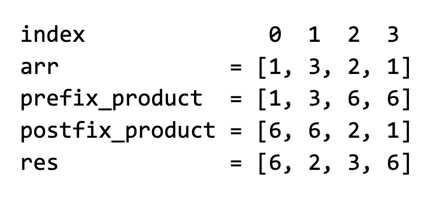

Given an array of non-negative integers, arr, return an array with the same length where index i contains the product of all the elements in arr except arr[i]. Since the values could be very large, return them modulo 10^9 + 7.

Example 1:
arr = [1, 3, 2, 1]
Output: [6, 2, 3, 6]

Example 2:
arr = [0, 1, 0]
Output: [0, 0, 0]
Constraints:

For any i, 0 ≤ arr[i] ≤ 10000.
2 ≤ n ≤ 10^6, where n is the length of arr.
Note: the "obvious" solution is to compute the total product and then divide it by each element. However, the total product could be up to 10000^n = 10^4000000. Even if your language supports arbitrary integers, we don't want to work with numbers that large (at that point, arithmetic operations are not 'constant time' anymore).

Instead, we should use the fact that, instead of applying modulo at the end, we can apply at each step without affecting the final result. This will keep any products we compute below 10^9 + 7. However, applying the modulo at each step only works for addition, subtraction, and multiplication, not division. Dividing first and then applying modulo yields different results than applying modulo and then dividing: (12 / 3) % 5 != (12 % 5) / 3.

This means that we need to find a way to solve this problem without using division at the end.

See Solution
Problem 43.3 - Exclusive Product: Solution
Python
Whenever a problem requires us to compute something at each index based on all other indices, it is an excellent candidate for the prefix-sum technique.

This is the classic use of the (first half of the) range-sum-queries recipe:

# Initialization
Initialize prefix_sum with the same length as the input array
prefix_sum[0] = arr[0]  # There must be at least one element.
for i from 1 to len(arr) - 1:
  prefix_sum[i] = prefix_sum[i-1] + arr[i]

# Query: sum of subarray [l, r]
if l == 0:
  return prefix_sum[r]
return prefix_sum[r] - prefix_sum[l-1]
For this problem, we need to customize it as follows:

We need to compute prefix products instead of prefix sums
We need to compute products for all prefixes and suffixes. To compute the postfix products, we can iterate backward through the array
We apply the modulo at each step to prevent the intermediate prefix or suffix products from getting too large
Then, we can compute the result at each index i as:

    res[i] = (prefix[i-1] * postfix[i+1]) % (10^9 + 7)
If i - 1 or i + 1 is out of bounds, we just omit that term. For example:

Prefix sums problem 3

Here is the implementation:

def exclusive_product_array(arr):
  m = 10**9 + 7
  n = len(arr)
  prefix_product = [1] * n
  prefix_product[0] = arr[0]
  for i in range(1, n):
    prefix_product[i] = (prefix_product[i - 1] * arr[i]) % m

  postfix_product = [1] * n
  postfix_product[n - 1] = arr[n - 1]
  for i in range(n - 2, -1, -1):
    postfix_product[i] = (postfix_product[i + 1] * arr[i]) % m

  res = [1] * n
  res[0] = postfix_product[1]
  res[n - 1] = prefix_product[n - 2]
  for i in range(1, n - 1):
    res[i] = (prefix_product[i - 1] * postfix_product[i + 1]) % m
  return res
Time & Space Analysis
n: the length of the arr array

Time: O(n) - O(n) to compute the prefix/suffix products, and O(n) to compute the result

Extra space: O(n) - for the prefix/suffix products

Tests
Here are some test cases to verify the solution:

def run_tests():
  tests = [
      # Example from the book
      ([1, 3, 2, 1], [6, 2, 3, 6]),
      # Edge case: Contains zero
      ([0, 1, 2, 3], [6, 0, 0, 0]),
      # Edge case: All ones
      ([1, 1, 1, 1], [1, 1, 1, 1]),
      # Edge case: Large numbers
      ([10000, 10000], [10000, 10000]),
  ]

  for arr, want in tests:
    got = exclusive_product_array(arr)
    assert got == want, f"\nexclusive_product_array({arr}): got: {
        got}, want: {want}\n"

run_tests()

function exclusiveProductArray(arr) {
  const m = 10 ** 9 + 7;
  const n = arr.length;
  const prefixProduct = new Array(n).fill(1);
  prefixProduct[0] = arr[0];
  for (let i = 1; i < n; i++) {
    prefixProduct[i] = (prefixProduct[i - 1] * arr[i]) % m;
  }

  const postfixProduct = new Array(n).fill(1);
  postfixProduct[n - 1] = arr[n - 1];
  for (let i = n - 2; i >= 0; i--) {
    postfixProduct[i] = (postfixProduct[i + 1] * arr[i]) % m;
  }

  const res = new Array(n).fill(1);
  res[0] = postfixProduct[1];
  res[n - 1] = prefixProduct[n - 2];
  for (let i = 1; i < n - 1; i++) {
    res[i] = (prefixProduct[i - 1] * postfixProduct[i + 1]) % m;
  }
  return res;
}
Time & Space Analysis
n: the length of the arr array

Time: O(n) - O(n) to compute the prefix/suffix products, and O(n) to compute the result

Extra space: O(n) - for the prefix/suffix products

Tests
Here are some test cases to verify the solution:

function runTests() {
  const tests = [
    // Example from the book
    [
      [1, 3, 2, 1],
      [6, 2, 3, 6],
    ],
    // Edge case: Contains zero
    [
      [0, 1, 2, 3],
      [6, 0, 0, 0],
    ],
    // Edge case: All ones
    [
      [1, 1, 1, 1],
      [1, 1, 1, 1],
    ],
    // Edge case: Large numbers
    [
      [10000, 10000],
      [10000, 10000],
    ],
  ];

  for (const [arr, want] of tests) {
    const got = exclusiveProductArray(arr);
    if (JSON.stringify(got) !== JSON.stringify(want)) {
      throw new Error(
        `\nexclusiveProductArray(${JSON.stringify(arr)}): got: ${JSON.stringify(got)}, want: ${JSON.stringify(want)}\n`,
      );
    }
  }
}

runTests();
class ExclusiveProductArray {
  public int[] solve(int[] arr) {
    final int m = 1000000007; // 10^9 + 7
    int n = arr.length;
    int[] prefixProduct = new int[n];
    prefixProduct[0] = arr[0];
    for (int i = 1; i < n; i++) {
      prefixProduct[i] = (int) (((long) prefixProduct[i - 1] * arr[i]) % m);
    }

    int[] postfixProduct = new int[n];
    postfixProduct[n - 1] = arr[n - 1];
    for (int i = n - 2; i >= 0; i--) {
      postfixProduct[i] = (int) (((long) postfixProduct[i + 1] * arr[i]) % m);
    }

    int[] res = new int[n];
    res[0] = postfixProduct[1];
    res[n - 1] = prefixProduct[n - 2];
    for (int i = 1; i < n - 1; i++) {
      res[i] = (int) (((long) prefixProduct[i - 1] * postfixProduct[i + 1])
          % m);
    }
    return res;
  }
}
Time & Space Analysis
n: the length of the arr array

Time: O(n) - O(n) to compute the prefix/suffix products, and O(n) to compute the result

Extra space: O(n) - for the prefix/suffix products

Tests
Here are some test cases to verify the solution:

class RunTests {
  public void runTests() {
    Object[][] tests = {
        // Example from the book
        { new int[] { 1, 3, 2, 1 }, new int[] { 6, 2, 3, 6 } },
        // Edge case: Contains zero
        { new int[] { 0, 1, 2, 3 }, new int[] { 6, 0, 0, 0 } },
        // Edge case: All ones
        { new int[] { 1, 1, 1, 1 }, new int[] { 1, 1, 1, 1 } },
        // Edge case: Large numbers
        { new int[] { 10000, 10000 }, new int[] { 10000, 10000 } },
    };

    ExclusiveProductArray solution = new ExclusiveProductArray();
    for (Object[] test : tests) {
      int[] arr = (int[]) test[0];
      int[] want = (int[]) test[1];
      int[] got = solution.solve(arr);
      if (!java.util.Arrays.equals(got, want)) {
        throw new RuntimeException(String.format(
            "\nsolve(%s): got: %s, want: %s\n",
            java.util.Arrays.toString(arr),
            java.util.Arrays.toString(got),
            java.util.Arrays.toString(want)));
      }
    }
  }
}

public class Solution {
  public static void main(String[] args) {
    new RunTests().runTests();
  }
}