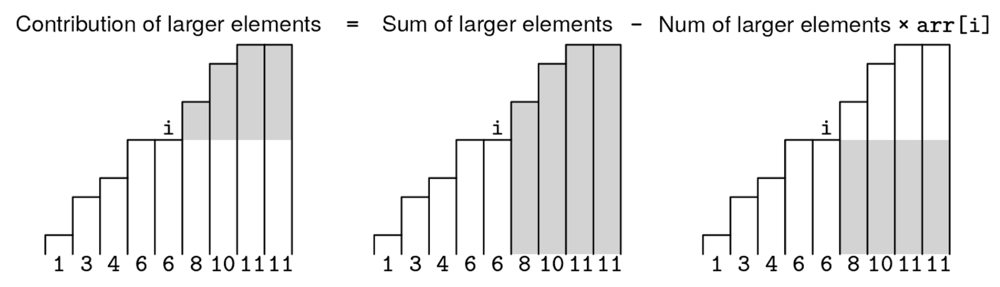
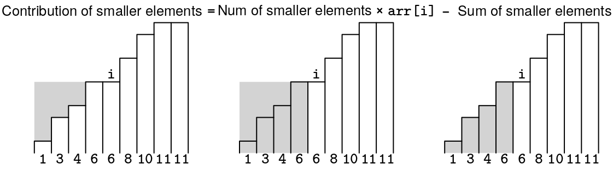

A YouTuber has fetched the number of likes and dislikes of a video each day since its publication, with the goal of finding days with unusually high or low like-to-dislike ratios.

We are given two arrays, likes and dislikes, of length n, representing the likes and dislikes on each day.

The reception score of a day is the number of likes minus the number of dislikes. The deviation between two days is the absolute value of the difference in their reception scores. The total deviation of a given day is the sum of the deviations between it and every other day.

Find the highest total deviation of any day and return it.

Example:
likes    = [3, 6, 1]
dislikes = [0, 1, 9]

Output: 24
The reception scores are [3, 5, -8]. The total deviation of each day is:
day 0: |3 - 5| + |3 - (-8)| = 2 + 11 = 13
day 1: |5 - 3| + |5 - (-8)| = 2 + 13 = 15
day 2: |-8 - 3| + |-8 - 5| = 11 + 13 = 24
Constraints:

The length of likes and dislikes is at most 10^5
Each element in likes and dislikes is a non-negative integer less than 10^4
See Solution
Problem 43.5 - YouTube Video Unusual Days: Solution
Python
First, it is clear that 'likes' and 'dislikes' are not what really matters. We can start by computing a scores array with the reception score (likes minus dislikes) for each day.

The naive solution would take O(n^2) time to compute the 'total deviation' of each day one by one. Improving the naive algorithm is hard because we can't simply compute "prefix absolute differences" -- they depend on each element.

To tackle this problem, we can break it down into two parts. For each day, we can:

Compute the contribution of days with larger scores to the total deviation
Compute the contribution of days with smaller scores to the total deviation
If we can do that, then we can add up the two parts.

Sorting the reception scores as a preprocessing step is helpful here because:

It puts all the smaller elements on one side and all the larger elements on the other
We do not care about the original order of the reception scores: we're only interested in finding the day with the highest total deviation, and reordering the days does not change their deviations
So, let's focus on the first part, assuming the input is sorted. For a value at index i, each larger index contributes scores[j] - scores[i] (since the input is sorted, we don't need to worry about computing absolute values anymore).

Drawing a sketch can help us come up with a formula to compute all those contributions at once:

Prefix sums problem 5 figure 1

The contribution of larger scores to the 'total deviation' of day i is the sum of the larger scores minus the area of a rectangle. The base of the rectangle is the number of larger scores and the height is scores[i].

Similar to how we can get a subarray sum as the difference of two prefix sums (this is the idea behind the Prefix Sums data structure), the sketch shows a similar idea: calculating a sum that's too large and then subtracting the unwanted portion.

Working out the index math, the contribution of all larger elements is:

    range_sum(i + 1, n - 1) - (n - i - 1) * scores[i]
By range sum, we mean the sum of all the elements between two indices. We can answer range sum queries with this recipe:

# Initialization
Initialize prefix_sum with the same length as the input array
prefix_sum[0] = arr[0]  # There must be at least one element.
for i from 1 to len(arr) - 1:
  prefix_sum[i] = prefix_sum[i-1] + arr[i]

# Query: sum of subarray [l, r]
if l == 0:
  return prefix_sum[r]
return prefix_sum[r] - prefix_sum[l-1]
Next, let's tackle smaller elements, again assuming the input is sorted. For a value at index i, each smaller index j contributes scores[i] - scores[j]. We can draw a similar sketch to figure out the formula to compute all those contributions at once:

Prefix sums problem 5 figure 2

In other words, the contribution of all smaller elements is:

    i * scores[i] - range_sum(0, i - 1)
Here is the implementation:

def max_total_deviation(likes, dislikes):
  scores = [likes[i] - dislikes[i] for i in range(len(likes))]
  scores = sorted(scores)
  n = len(scores)
  prefix_sum = [0] * n
  prefix_sum[0] = scores[0]
  for i in range(1, n):
    prefix_sum[i] = prefix_sum[i - 1] + scores[i]
  max_deviation = 0
  for i in range(n):
    left, right = 0, 0
    if i > 0:
      left = i * scores[i] - prefix_sum[i - 1]
    if i < n - 1:
      right = prefix_sum[n - 1] - prefix_sum[i] - (n - i - 1) * scores[i]
    max_deviation = max(max_deviation, left + right)
  return max_deviation
Time & Space Analysis
n: the number of days

Time: O(n log n) - Sorting is the bottleneck.

Extra space: O(n)

Tests
Here are some test cases to verify the solution:

def run_tests():
  tests = [
      # Example from the book
      ([3, 6, 1], [0, 1, 9], 24),
      # Edge case: All same scores
      ([1, 1, 1], [1, 1, 1], 0),
      # Edge case: Increasing scores
      ([1, 2, 3], [0, 0, 0], 3),
      # Edge case: Decreasing scores
      ([3, 2, 1], [0, 0, 0], 3),
  ]

  for likes, dislikes, want in tests:
    got = max_total_deviation(likes, dislikes)
    assert got == want, f"\nmax_total_deviation({likes}, {dislikes}): got: {
        got}, want: {want}\n"

run_tests()
function maxTotalDeviation(likes, dislikes) {
  const scores = likes
    .map((like, i) => like - dislikes[i])
    .sort((a, b) => a - b);
  const n = scores.length;
  const prefixSum = new Array(n).fill(0);
  prefixSum[0] = scores[0];
  for (let i = 1; i < n; i++) {
    prefixSum[i] = prefixSum[i - 1] + scores[i];
  }
  let maxDeviation = 0;
  for (let i = 0; i < n; i++) {
    let left = 0,
      right = 0;
    if (i > 0) {
      left = i * scores[i] - prefixSum[i - 1];
    }
    if (i < n - 1) {
      right = prefixSum[n - 1] - prefixSum[i] - (n - i - 1) * scores[i];
    }
    maxDeviation = Math.max(maxDeviation, left + right);
  }
  return maxDeviation;
}
Time & Space Analysis
n: the number of days

Time: O(n log n) - Sorting is the bottleneck.

Extra space: O(n)

Tests
Here are some test cases to verify the solution:

function runTests() {
  const tests = [
    // Example from the book
    [[3, 6, 1], [0, 1, 9], 24],
    // Edge case: All same scores
    [[1, 1, 1], [1, 1, 1], 0],
    // Edge case: Increasing scores
    [[1, 2, 3], [0, 0, 0], 3],
    // Edge case: Decreasing scores
    [[3, 2, 1], [0, 0, 0], 3],
  ];

  for (const [likes, dislikes, want] of tests) {
    const got = maxTotalDeviation(likes, dislikes);
    if (got !== want) {
      throw new Error(
        `\nmaxTotalDeviation(${JSON.stringify(likes)}, ${JSON.stringify(dislikes)}): got: ${got}, want: ${want}\n`,
      );
    }
  }
}

runTests();
class MaxTotalDeviation {
  public int solve(int[] likes, int[] dislikes) {
    int n = likes.length;
    int[] scores = new int[n];
    for (int i = 0; i < n; i++) {
      scores[i] = likes[i] - dislikes[i];
    }
    java.util.Arrays.sort(scores);

    int[] prefixSum = new int[n];
    prefixSum[0] = scores[0];
    for (int i = 1; i < n; i++) {
      prefixSum[i] = prefixSum[i - 1] + scores[i];
    }

    int maxDeviation = 0;
    for (int i = 0; i < n; i++) {
      int left = 0, right = 0;
      if (i > 0) {
        left = i * scores[i] - prefixSum[i - 1];
      }
      if (i < n - 1) {
        right = prefixSum[n - 1] - prefixSum[i] - (n - i - 1) * scores[i];
      }
      maxDeviation = Math.max(maxDeviation, left + right);
    }
    return maxDeviation;
  }
}
Time & Space Analysis
n: the number of days

Time: O(n log n) - Sorting is the bottleneck.

Extra space: O(n)

Tests
Here are some test cases to verify the solution:

class RunTests {
  public void runTests() {
    Object[][] tests = {
        // Example from the book
        { new int[] { 3, 6, 1 },
            new int[] { 0, 1, 9 },
            24 },
        // Edge case: All same scores
        { new int[] { 1, 1, 1 },
            new int[] { 1, 1, 1 },
            0 },
        // Edge case: Increasing scores
        { new int[] { 1, 2, 3 },
            new int[] { 0, 0, 0 },
            3 },
        // Edge case: Decreasing scores
        { new int[] { 3, 2, 1 },
            new int[] { 0, 0, 0 },
            3 },
    };

    MaxTotalDeviation solution = new MaxTotalDeviation();
    for (Object[] test : tests) {
      int[] likes = (int[]) test[0];
      int[] dislikes = (int[]) test[1];
      int want = (int) test[2];
      int got = solution.solve(likes, dislikes);
      if (got != want) {
        throw new RuntimeException(String.format(
            "\nsolve(%s, %s): got: %d, want: %d\n",
            java.util.Arrays.toString(likes),
            java.util.Arrays.toString(dislikes),
            got, want));
      }
    }
  }
}

public class Solution {
  public static void main(String[] args) {
    new RunTests().runTests();
  }
}