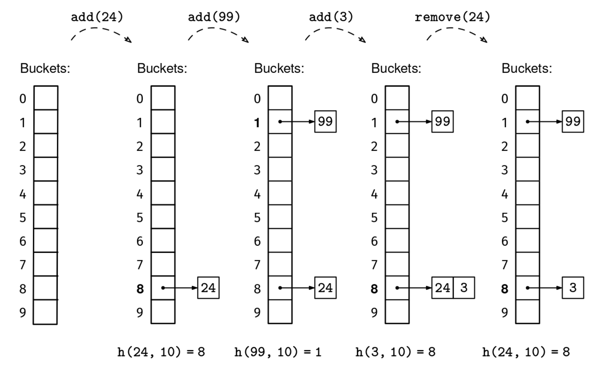
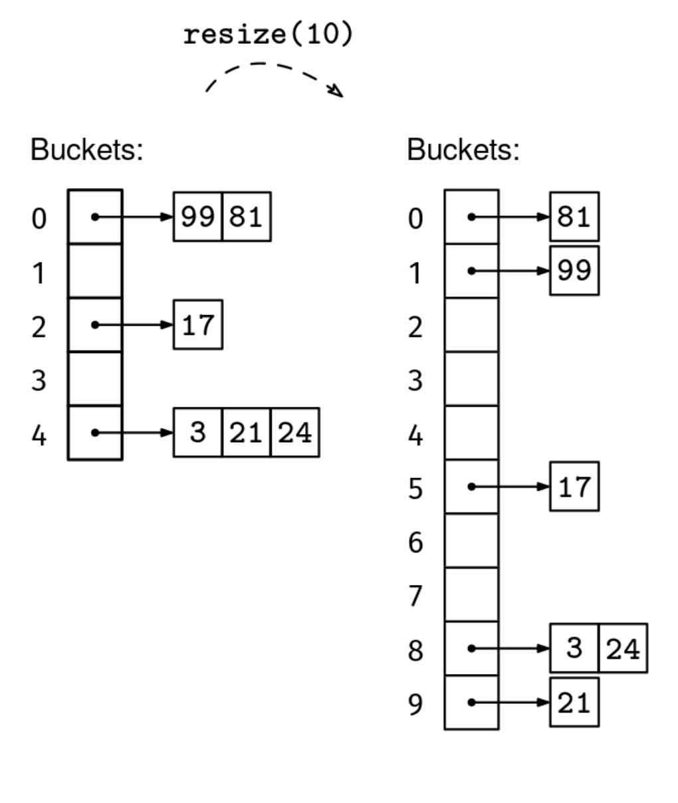

Implement a hash set data structure with the following API:

add(x): if x is not in the set, add x to the set. If x is already in the set, do nothing.
remove(x): if x is in the set, remove it from the set.
contains(x): return whether the element x is in the set.
size(): return the number of elements in the set.
Constraints:

If your language is typed, you can either implement a hash set for integers, or make it generic.
The set will contain at most 10^6 elements.
See Solution
Problem 1 - Hash Set Class: Solution
Python
This problem relies on a solid understanding of dynamic arrays and how they are implemented. If you are not familiar with dynamic arrays, we strongly encourage you to review that problem: Implement Dynamic Array.

Our set implementation will consist of a dynamic array of buckets, each bucket being itself a dynamic array of elements. The outer array is called a hash table. The number of elements is called the size, and the number of buckets is called the capacity. We can start with a modest capacity, like 10.

We use a hash function h() (that we receive in the constructor to make the set work with different types of elements) to determine in which bucket to put elements: element x goes in the bucket at index h(x, m), where m is the number of buckets in the hash table (the capacity). Using a good hash function will guarantee that the buckets' lengths are well-balanced.

Below you can see an illustration of the evolution of a set of integers after a sequence of additions and removals. We are using multiplicative hashing (described in more detail in the book). Integers 24 and 3 both have hash 8, so they get stored sequentially in the same bucket.

Hash Set Class

We need to dynamically adjust the number of buckets based on the number of elements in the set. On the one hand, we do not want to waste space by having a lot of empty buckets. On the other hand, in order for lookups to take constant time, each bucket should contain at most a constant number of elements. The size/capacity ratio is called the load factor. In other words, the load factor is the average length of the buckets.

A good load factor to aim for is 1. That means that, on average, each bucket contains one element. Of course, some buckets will be longer than others, depending on how lucky we get with collisions, which are unavoidable. But, if the hash function manages to map elements to buckets approximately uniformly, with a load factor of 1 the expected longest bucket length is still constant.

Remember dynamic resizing in dynamic arrays (from the Implement Dynamic Array problem)? With hash tables, we will do the same: we will relocate all the elements to a hash table twice as big whenever we reach a load factor of 1. The only complication is that when we move the elements to the new hash table, we will have to re-hash them because the output range of the hash function will have also changed. We now have all the pieces for a full set implementation.

Below you can see and illustration where we resize the hash table with a load factor of 6/5 > 1. We need to rehash every element. (We show just 5 buckets for illustration purposes, even though our implementation starts with 10.)

Hash Set Class

Here is the implementation:

class HashSet:
  def __init__(self, h):
    self.h = h
    self.capacity = 10
    self._size = 0
    self.buckets = [[] for _ in range(self.capacity)]

  def size(self):
    return self._size

  def contains(self, x):
    hash = self.h(x, self.capacity)
    for elem in self.buckets[hash]:
      if elem == x:
        return True
    return False

  def add(self, x):
    hash = self.h(x, self.capacity)
    for elem in self.buckets[hash]:
      if elem == x:
        return
    self.buckets[hash].append(x)
    self._size += 1
    load_factor = self._size / self.capacity
    if load_factor > 1:
      self.resize(self.capacity * 2)

  def resize(self, new_capacity):
    new_buckets = [[] for _ in range(new_capacity)]
    for bucket in self.buckets:
      for elem in bucket:
        hash = self.h(elem, new_capacity)
        new_buckets[hash].append(elem)
    self.buckets = new_buckets
    self.capacity = new_capacity

  def remove(self, x):
    hash = self.h(x, self.capacity)
    for i, elem in enumerate(self.buckets[hash]):
      if elem == x:
        self.buckets[hash].pop(i)
        self._size -= 1
        load_factor = self._size / self.capacity
        if load_factor < 0.25 and self.capacity > 10:
          self.resize(self.capacity // 2)
Time & Space Analysis
n = the number of elements in the set
All operations:

Time: O(1) average - with a good hash function and load factor maintenance around 1, each bucket contains a constant number of elements on average.
Resize operations take O(n) time, but happen infrequently enough to maintain amortized constant time. This assumes that hashing takes constant time (this may not be true for key types like strings).

Data structure size:

Space: O(n) - the hash table maintains approximately n buckets with a total of n elements, plus some overhead for dynamic resizing.
The key insight is maintaining a load factor around 1 through dynamic resizing, which keeps bucket lengths small and operations efficient.

Tests
Here are some test cases to verify the solution:

def h_int(x, m):
  C = 0.6180339887  # A "random-looking" fraction between 0 and 1.
  x *= C            # A product with "random-looking" decimals.
  x -= int(x)       # Keep only the fractional part.
  x *= m            # Scale the number in [0, 1) up to [0, m).
  return int(x)     # Return the integer part.

def run_tests():
  # Test basic operations
  s = HashSet(h_int)
  assert s.size() == 0, f"\nsize(): got: {s.size()}, want: 0\n"
  assert not s.contains(1), f"\ncontains(1): got: true, want: false\n"

  s.add(1)
  assert s.size() == 1, f"\nsize(): got: {s.size()}, want: 1\n"
  assert s.contains(1), f"\ncontains(1): got: false, want: true\n"

  s.add(2)
  s.add(3)
  assert s.size() == 3, f"\nsize(): got: {s.size()}, want: 3\n"

  s.remove(2)
  assert s.size() == 2, f"\nsize(): got: {s.size()}, want: 2\n"
  assert not s.contains(2), f"\ncontains(2): got: true, want: false\n"

  # Test resize
  s3 = HashSet(h_int)
  for i in range(20):
    s3.add(i)
  assert s3.size() == 20, f"\nsize(): got: {s3.size()}, want: 20\n"

  # Remove elements to test downsize
  for i in range(15):
    s3.remove(i)
  assert s3.size() == 5, f"\nsize(): got: {s3.size()}, want: 5\n"

run_tests()

class HashSet {
  constructor(h) {
    this.h = h;
    this.capacity = 10;
    this._size = 0;
    this.buckets = Array(this.capacity)
      .fill()
      .map(() => []);
  }

  size() {
    return this._size;
  }

  contains(x) {
    const hash = this.h(x, this.capacity);
    for (const elem of this.buckets[hash]) {
      if (elem === x) {
        return true;
      }
    }
    return false;
  }

  add(x) {
    const hash = this.h(x, this.capacity);
    for (const elem of this.buckets[hash]) {
      if (elem === x) {
        return;
      }
    }
    this.buckets[hash].push(x);
    this._size++;
    const loadFactor = this._size / this.capacity;
    if (loadFactor > 1) {
      this.resize(this.capacity * 2);
    }
  }

  resize(newCapacity) {
    const newBuckets = Array(newCapacity)
      .fill()
      .map(() => []);
    for (const bucket of this.buckets) {
      for (const elem of bucket) {
        const hash = this.h(elem, newCapacity);
        newBuckets[hash].push(elem);
      }
    }
    this.buckets = newBuckets;
    this.capacity = newCapacity;
  }

  remove(x) {
    const hash = this.h(x, this.capacity);
    const bucket = this.buckets[hash];
    const index = bucket.findIndex((elem) => elem === x);
    if (index !== -1) {
      bucket.splice(index, 1);
      this._size--;
      const loadFactor = this._size / this.capacity;
      if (loadFactor < 0.25 && this.capacity > 10) {
        this.resize(Math.floor(this.capacity / 2));
      }
    }
  }
}
Time & Space Analysis
n = the number of elements in the set
All operations:

Time: O(1) average - with a good hash function and load factor maintenance around 1, each bucket contains a constant number of elements on average.
Resize operations take O(n) time, but happen infrequently enough to maintain amortized constant time. This assumes that hashing takes constant time (this may not be true for key types like strings).

Data structure size:

Space: O(n) - the hash table maintains approximately n buckets with a total of n elements, plus some overhead for dynamic resizing.
The key insight is maintaining a load factor around 1 through dynamic resizing, which keeps bucket lengths small and operations efficient.

Tests
Here are some test cases to verify the solution:

function hInt(x, m) {
  const C = 0.6180339887; // A "random-looking" fraction between 0 and 1.
  x *= C; // A product with "random-looking" decimals.
  x -= Math.floor(x); // Keep only the fractional part.
  x *= m; // Scale the number in [0, 1) up to [0, m).
  return Math.floor(x); // Return the integer part.
}

function runTests() {
  // Test basic operations
  const s = new HashSet(hInt);
  if (s.size() !== 0) {
    throw new Error(`\nsize(): got: ${s.size()}, want: 0\n`);
  }
  if (!!s.contains(1)) {
    throw new Error(`\ncontains(1): got: true, want: false\n`);
  }

  s.add(1);
  if (s.size() !== 1) {
    throw new Error(`\nsize(): got: ${s.size()}, want: 1\n`);
  }
  if (!s.contains(1)) {
    throw new Error(`\ncontains(1): got: false, want: true\n`);
  }

  s.add(2);
  s.add(3);
  if (s.size() !== 3) {
    throw new Error(`\nsize(): got: ${s.size()}, want: 3\n`);
  }

  s.remove(2);
  if (s.size() !== 2) {
    throw new Error(`\nsize(): got: ${s.size()}, want: 2\n`);
  }
  if (!!s.contains(2)) {
    throw new Error(`\ncontains(2): got: true, want: false\n`);
  }

  // Test resize
  const s3 = new HashSet(hInt);
  for (let i = 0; i < 20; i++) {
    s3.add(i);
  }
  if (s3.size() !== 20) {
    throw new Error(`\nsize(): got: ${s3.size()}, want: 20\n`);
  }

  // Remove elements to test downsize
  for (let i = 0; i < 15; i++) {
    s3.remove(i);
  }
  if (s3.size() !== 5) {
    throw new Error(`\nsize(): got: ${s3.size()}, want: 5\n`);
  }
}

runTests();
class HashSet {
  private BiFunction<Integer, Integer, Integer> h;
  private int capacity;
  private int size;
  private List<List<Integer>> buckets;

  public HashSet(BiFunction<Integer, Integer, Integer> h) {
    this.h = h;
    this.capacity = 10;
    this.size = 0;
    this.buckets = new ArrayList<>(capacity);
    for (int i = 0; i < capacity; i++) {
      this.buckets.add(new ArrayList<>());
    }
  }

  public int size() {
    return size;
  }

  public boolean contains(int x) {
    int hash = h.apply(x, capacity);
    for (int elem : buckets.get(hash)) {
      if (elem == x) {
        return true;
      }
    }
    return false;
  }

  public void add(int x) {
    int hash = h.apply(x, capacity);
    for (int elem : buckets.get(hash)) {
      if (elem == x) {
        return;
      }
    }
    buckets.get(hash).add(x);
    size++;
    double loadFactor = (double) size / capacity;
    if (loadFactor > 1) {
      resize(capacity * 2);
    }
  }

  public void remove(int x) {
    int hash = h.apply(x, capacity);
    List<Integer> bucket = buckets.get(hash);
    for (int i = 0; i < bucket.size(); i++) {
      if (bucket.get(i) == x) {
        bucket.remove(i);
        size--;
        double loadFactor = (double) size / capacity;
        if (loadFactor < 0.25 && capacity > 10) {
          resize(capacity / 2);
        }
        return;
      }
    }
  }

  private void resize(int newCapacity) {
    List<List<Integer>> newBuckets = new ArrayList<>(newCapacity);
    for (int i = 0; i < newCapacity; i++) {
      newBuckets.add(new ArrayList<>());
    }
    for (List<Integer> bucket : buckets) {
      for (int elem : bucket) {
        int hash = h.apply(elem, newCapacity);
        newBuckets.get(hash).add(elem);
      }
    }
    buckets = newBuckets;
    capacity = newCapacity;
  }
}
Time & Space Analysis
n = the number of elements in the set
All operations:

Time: O(1) average - with a good hash function and load factor maintenance around 1, each bucket contains a constant number of elements on average.
Resize operations take O(n) time, but happen infrequently enough to maintain amortized constant time. This assumes that hashing takes constant time (this may not be true for key types like strings).

Data structure size:

Space: O(n) - the hash table maintains approximately n buckets with a total of n elements, plus some overhead for dynamic resizing.
The key insight is maintaining a load factor around 1 through dynamic resizing, which keeps bucket lengths small and operations efficient.

Tests
Here are some test cases to verify the solution:

class HInt {
  public static int solve(int x, int m) {
    double C = 0.6180339887; // A "random-looking" fraction between 0 and 1.
    double val = x * C; // A product with "random-looking" decimals.
    val -= (int) val; // Keep only the fractional part.
    val *= m; // Scale the number in [0, 1) up to [0, m).
    return (int) val; // Return the integer part.
  }
}

class RunTests {
  public void runTests() {
    // Test basic operations
    HashSet s = new HashSet(HInt::solve);
    if (s.size() != 0) {
      throw new RuntimeException(
          String.format("\nsize(): got: %d, want: 0\n", s.size()));
    }
    if (s.contains(1)) {
      throw new RuntimeException("\ncontains(1): got: true, want: false\n");
    }

    s.add(1);
    if (s.size() != 1) {
      throw new RuntimeException(
          String.format("\nsize(): got: %d, want: 1\n", s.size()));
    }
    if (!s.contains(1)) {
      throw new RuntimeException("\ncontains(1): got: false, want: true\n");
    }

    s.add(2);
    s.add(3);
    if (s.size() != 3) {
      throw new RuntimeException(
          String.format("\nsize(): got: %d, want: 3\n", s.size()));
    }

    s.remove(2);
    if (s.size() != 2) {
      throw new RuntimeException(
          String.format("\nsize(): got: %d, want: 2\n", s.size()));
    }
    if (s.contains(2)) {
      throw new RuntimeException("\ncontains(2): got: true, want: false\n");
    }

    // Test resize
    HashSet s3 = new HashSet(HInt::solve);
    for (int i = 0; i < 20; i++) {
      s3.add(i);
    }
    if (s3.size() != 20) {
      throw new RuntimeException(
          String.format("\nsize(): got: %d, want: 20\n", s3.size()));
    }

    // Remove elements to test downsize
    for (int i = 0; i < 15; i++) {
      s3.remove(i);
    }
    if (s3.size() != 5) {
      throw new RuntimeException(
          String.format("\nsize(): got: %d, want: 5\n", s3.size()));
    }
  }
}

public class Solution {
  public static void main(String[] args) {
    new RunTests().runTests();
  }
}
