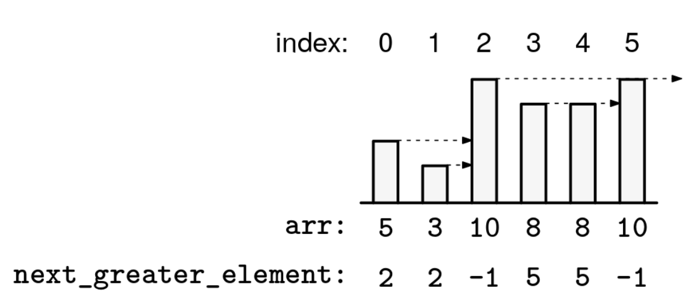

Given an array of integers, arr, return an array of the same length, NGE, such that NGE[i] is the first index j after i such that arr[j] > arr[i]. If there is no such j, then NGE[i] = -1.

Example 1:
Index:   0  1   2  3  4   5
arr =   [5, 3, 10, 8, 8, 10]
Output: [2, 2, -1, 5, 5, -1]

Example 2:
Index:   0  1  2  3  4  5  6   7  8   9
arr =   [4, 2, 6, 4, 5, 2, 4,  7, 3,  7]
Output: [2, 2, 7, 4, 7, 6, 7, -1, 9, -1]

Example 3:
Index:    0   1   2   3   4
arr =   [ 5,  5,  5,  5,  5]
Output: [-1, -1, -1, -1, -1]

Example 4:
Index:   0  1  2  3   4
arr =   [5, 6, 7, 8,  9]
Output: [1, 2, 3, 4, -1]
Constraints:

1 <= arr.length <= 10^5
-10^9 <= arr[i] <= 10^9
See Solution
Problem 5 - Next Greater Element: Solution
Python
The naive solution starts at each index, scans forward to find the next greater element, and repeats that for each index. This takes O(n^2) time, where n is the size of the array. We'll see how to use a monotonic stack to do it in linear time.

The key is that it is easier to populate the NGE array from right to left. At each index i, from n-1 to 0, we keep track of all the elements to the right of i that are potential candidates to be the NGE of some index to the left of i. We can think of this geometrically: if we think of each element in the array as a bar in a plot, the candidates are all the elements "visible when looking to the right" from index i:

Next Greater Element

As we iterate right to left, we can track the NGE candidates in a stack, with candidates further left positioned higher in the stack. A small number to the right of a large number is not visible from the left side, so candidates will be ordered from smallest (top of the stack) to largest (bottom of the stack). In other words, the stack will be strictly monotonic, with the smallest candidate at the top. When we process each element arr[i], we discard any candidates smaller than or equal to arr[i], as they'll be behind arr[i] from this point onward. The first remaining candidate is the NGE of arr[i]. Or, if there are no candidates left, arr[i] has no NGE. Finally, arr[i] becomes a candidate for future iterations.

We can capture this logic in a recipe:

next_greater_element(arr)
  initialize empty stack for NGE candidates
  for each index i from right to left
    pop all NGE candidates from the stack that are <= arr[i]
    if the stack is not empty
      the top of the stack is the NGE of i
    else
      index i has no NGE
    add i to the stack
Here is the implementation:

def next_greater_element(arr):
  n = len(arr)
  nge = [-1] * n
  stack = []

  # Iterate right to left
  for i in range(n - 1, -1, -1):
    # Pop all NGE candidates from stack that are <= arr[i]
    while stack and arr[stack[-1]] <= arr[i]:
      stack.pop()

    # If stack not empty, top is NGE of i
    if stack:
      nge[i] = stack[-1]

    # Add i to stack as candidate for future elements
    stack.append(i)

  return nge
Time & Space Analysis
n: the length of the input array

Time: O(n) - each element is pushed onto and popped from the stack at most once, giving amortized constant time per element.

Extra space: O(n) - the output has size n.

Tests
Here are some test cases to verify the solution:

def run_tests():
  tests = [
      # Example 1 from the book
      ([5, 3, 10, 8, 8, 10], [2, 2, -1, 5, 5, -1]),
      # Example 2 from the book
      ([4, 2, 6, 4, 5, 2, 4, 7, 3, 7], [2, 2, 7, 4, 7, 6, 7, -1, 9, -1]),
      # Example 3 from the book
      ([5, 5, 5, 5, 5], [-1, -1, -1, -1, -1]),
      # Example 4 from the book
      ([5, 6, 7, 8, 9], [1, 2, 3, 4, -1]),
      # Edge case - empty array
      ([], []),
      # Edge case - single element
      ([1], [-1])
  ]

  for arr, want in tests:
    got = next_greater_element(arr)
    assert got == want, f"\nnext_greater_element({arr}): got: {got}, want: {want}\n"

run_tests()
function nextGreaterElement(arr) {
  const n = arr.length;
  const nge = new Array(n).fill(-1);
  const stack = new Deque();

  // Iterate right to left
  for (let i = n - 1; i >= 0; i--) {
    // Pop all NGE candidates from stack that are <= arr[i]
    while (!stack.empty() && arr[stack.peekBack()] <= arr[i]) {
      stack.popBack();
    }

    // If stack not empty, top is NGE of i
    if (!stack.empty()) {
      nge[i] = stack.peekBack();
    }

    // Add i to stack as candidate for future elements
    stack.pushBack(i);
  }

  return nge;
}
Time & Space Analysis
n: the length of the input array

Time: O(n) - each element is pushed onto and popped from the stack at most once, giving amortized constant time per element.

Extra space: O(n) - the output has size n.

Tests
Here are some test cases to verify the solution:

function runTests() {
  const tests = [
    // Example 1 from the book
    [
      [5, 3, 10, 8, 8, 10],
      [2, 2, -1, 5, 5, -1],
    ],
    // Example 2 from the book
    [
      [4, 2, 6, 4, 5, 2, 4, 7, 3, 7],
      [2, 2, 7, 4, 7, 6, 7, -1, 9, -1],
    ],
    // Example 3 from the book
    [
      [5, 5, 5, 5, 5],
      [-1, -1, -1, -1, -1],
    ],
    // Example 4 from the book
    [
      [5, 6, 7, 8, 9],
      [1, 2, 3, 4, -1],
    ],
    // Edge case - empty array
    [[], []],
    // Edge case - single element
    [[1], [-1]],
  ];

  for (const [arr, want] of tests) {
    const got = nextGreaterElement(arr);
    if (JSON.stringify(got) !== JSON.stringify(want)) {
      throw new Error(
        `\nnextGreaterElement(${JSON.stringify(arr)}): got: ${JSON.stringify(got)}, want: ${JSON.stringify(want)}\n`,
      );
    }
  }
}

runTests();
class NextGreaterElement {
  public int[] solve(int[] arr) {
    int n = arr.length;
    int[] nge = new int[n];
    Arrays.fill(nge, -1);
    Deque<Integer> stack = new ArrayDeque<>();

    // Iterate right to left
    for (int i = n - 1; i >= 0; i--) {
      // Pop all NGE candidates from stack that are <= arr[i]
      while (!stack.isEmpty() && arr[stack.getLast()] <= arr[i]) {
        stack.removeLast();
      }

      // If stack not empty, top is NGE of i
      if (!stack.isEmpty()) {
        nge[i] = stack.getLast();
      }

      // Add i to stack as candidate for future elements
      stack.addLast(i);
    }

    return nge;
  }
}
Time & Space Analysis
n: the length of the input array

Time: O(n) - each element is pushed onto and popped from the stack at most once, giving amortized constant time per element.

Extra space: O(n) - the output has size n.

Tests
Here are some test cases to verify the solution:

class RunTests {
  public void runTests() {
    Object[][] tests = {
        // Example 1 from the book
        { new int[] { 5, 3, 10, 8, 8, 10 },
            new int[] { 2, 2, -1, 5, 5, -1 } },
        // Example 2 from the book
        { new int[] { 4, 2, 6, 4, 5, 2, 4, 7, 3, 7 },
            new int[] { 2, 2, 7, 4, 7, 6, 7, -1, 9, -1 } },
        // Example 3 from the book
        { new int[] { 5, 5, 5, 5, 5 },
            new int[] { -1, -1, -1, -1, -1 } },
        // Example 4 from the book
        { new int[] { 5, 6, 7, 8, 9 },
            new int[] { 1, 2, 3, 4, -1 } },
        // Edge case - empty array
        { new int[] {},
            new int[] {} },
        // Edge case - single element
        { new int[] { 1 },
            new int[] { -1 } }
    };

    NextGreaterElement solution = new NextGreaterElement();
    for (Object[] test : tests) {
      int[] arr = (int[]) test[0];
      int[] want = (int[]) test[1];
      int[] got = solution.solve(arr);

      if (!Arrays.equals(got, want)) {
        throw new RuntimeException(String.format(
            "\nsolve(%s): got: %s, want: %s\n",
            Arrays.toString(arr), Arrays.toString(got),
            Arrays.toString(want)));
      }
    }
  }
}

public class Solution {
  public static void main(String[] args) {
    new RunTests().runTests();
  }
}
