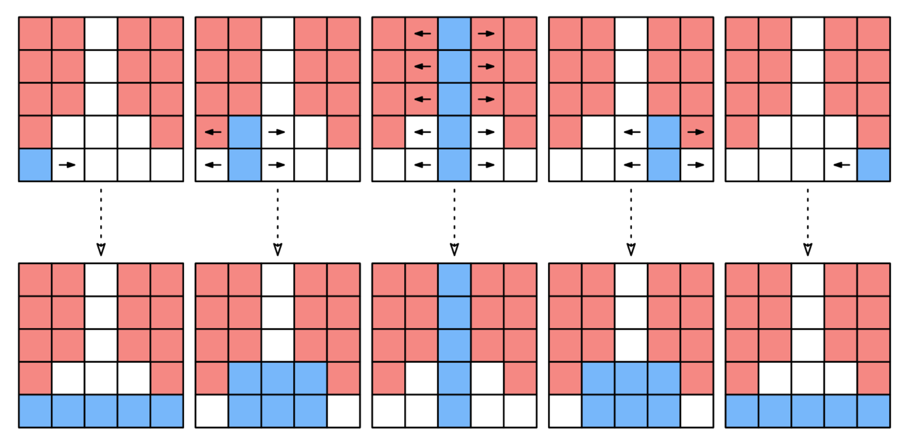

You have an n x n mosaic made of blue and red tiles, where n > 0. You are given an array of integers, tiles, of length n, where tiles[i] indicates the number of blue tiles in column i of the mosaic (columns are 0-indexed). For each column, all the blue tiles are contiguously at the bottom and the red tiles are contiguously at the top.

Return the size of the largest rectangle that can be formed using only blue tiles. The rectangle cannot contain partial tiles.

Example 1: tiles = [1, 2, 3]
Output: 4. The mosaic is 3x3, and it looks like:
R R B
R B B
B B B
The largest blue rectangle is 2x2 at the bottom left corner.

Example 2: tiles = [2, 1, 2]
Output: 3.
R R R
B R B
B B B

Example 3: tiles = [1, 2, 5, 2, 1]
Output: 6.
R R B R R
R R B R R
R R B R R
R B B B R
B B B B B
Constraints:

1 <= n <= 10^6
0 <= tiles[i] <= n
See Solution
Problem 6 - Largest Rectangle: Solution
Python
One thing we can say for sure is that the base of the rectangle will be at the base of the mosaic. The problem is figuring out the other 3 boundaries.

The naive solution would be to consider all possible left and right boundaries (i.e., columns of the mosaic), 0 <= l <= r < n, and then look for the tallest blue rectangle that fits between those columns. The height of the tallest rectangle would be min(tiles[l:r+1]). The total runtime would be O(n^3).

The property we need for this problem is: the top of the largest blue rectangle will be touching at least one red tile (otherwise, we could make it taller and get a bigger one). That is, the height of the rectangle is tiles[i] for some i.

So, we can take each index i in tiles and ask, "What is the largest rectangle that includes column i and has height tiles[i]?

Per the property above, one of the rectangles found in this way must be the largest one.

So now let's focus on the question: "given a fixed i, what is the largest rectangle that includes column i and has height tiles[i]?"

This question is easier because we have already fixed two of the boundaries: the base and the top. So we just need to know how far to the left and right we can extend the rectangle.

Largest Rectangle

So, how far can we extend to the right? We can go up to the first column after i that has a height less than tiles[i].

The data structure that we need to answer this type of questions is the "NSE" (Next Smaller Element) array. If NSE[i] = j, the right boundary is j-1.

Similarly, to find the left boundary, we can use the "PSE" (Previous Smaller Element) array. If PSE[i] = j, the left boundary is j+1.

So, for each i, the largest rectangle that includes column i and has height tiles[i] goes from PSE[i] + 1 (inclusive) to NSE[i] - 1 (inclusive) and has a width of NSE[i] - PSE[i] - 1. The area of this rectangle is (NSE[i] - PSE[i] - 1) * tiles[i].

We can compute the NSE and PSE arrays in O(n) time using a monotonic stack, and then use them to consider all columns in O(n) time. The total runtime is O(n).

To compute the NSE and PSE arrays, we can adapt the same recipe we saw in the Monotonic Stacks and Queues chapter. We just modify the comparison operator and the direction of the traversal appropriately.

next_greater_element(arr)
  initialize empty stack for NGE candidates
  for each index i from right to left
    pop all NGE candidates from the stack that are <= arr[i]
    if the stack is not empty
      the top of the stack is the NGE of i
    else
      index i has no NGE
    add i to the stack
Here is the implementation:

def next_smaller_element(arr):
  n = len(arr)
  nse = [n] * n
  stack = []
  for i in range(n - 1, -1, -1):
    while stack and arr[stack[-1]] >= arr[i]:
      stack.pop()
    if stack:
      nse[i] = stack[-1]
    stack.append(i)
  return nse

def prev_smaller_element(arr):
  n = len(arr)
  pse = [-1] * n
  stack = []
  for i in range(n):
    while stack and arr[stack[-1]] >= arr[i]:
      stack.pop()
    if stack:
      pse[i] = stack[-1]
    stack.append(i)
  return pse

def largest_rectangle(tiles):
  n = len(tiles)
  nse = next_smaller_element(tiles)
  pse = prev_smaller_element(tiles)

  max_area = 0
  for i in range(n):
    width = nse[i] - pse[i] - 1
    area = width * tiles[i]
    max_area = max(max_area, area)
  return max_area
Time & Space Analysis
n: the length of the tiles array

Time: O(n)

Extra space: O(n) - the NSE and PSE arrays each require O(n) space, and the monotonic stack uses O(n) space in the worst case.

Tests
Here are some test cases to verify the solution:

def run_tests():
  tests = [
      # Example 1 from the book
      ([1, 2, 3], 4),
      # Example 2 from the book
      ([2, 1, 2], 3),
      # Example 3 from the book
      ([1, 2, 5, 2, 1], 6),
      # Edge cases
      ([1], 1),
      ([0], 0),
      ([5, 5, 5, 5, 5], 25),
      ([0, 0, 0, 0, 0], 0),
      ([1, 0, 1], 1),
  ]

  for tiles, want in tests:
    got = largest_rectangle(tiles)
    assert got == want, f"\nlargest_rectangle({tiles}): got: {got}, want: {want}\n"

run_tests()
function nextSmallerElement(arr) {
  const n = arr.length;
  const nse = new Array(n).fill(n);
  const stack = new Deque();

  for (let i = n - 1; i >= 0; i--) {
    while (!stack.empty() && arr[stack.peekBack()] >= arr[i]) {
      stack.popBack();
    }
    if (!stack.empty()) {
      nse[i] = stack.peekBack();
    }
    stack.pushBack(i);
  }
  return nse;
}

function prevSmallerElement(arr) {
  const n = arr.length;
  const pse = new Array(n).fill(-1);
  const stack = new Deque();

  for (let i = 0; i < n; i++) {
    while (!stack.empty() && arr[stack.peekBack()] >= arr[i]) {
      stack.popBack();
    }
    if (!stack.empty()) {
      pse[i] = stack.peekBack();
    }
    stack.pushBack(i);
  }
  return pse;
}

function largestRectangle(tiles) {
  const n = tiles.length;
  const nse = nextSmallerElement(tiles);
  const pse = prevSmallerElement(tiles);

  let maxArea = 0;
  for (let i = 0; i < n; i++) {
    const width = nse[i] - pse[i] - 1;
    const area = width * tiles[i];
    maxArea = Math.max(maxArea, area);
  }
  return maxArea;
}
Time & Space Analysis
n: the length of the tiles array

Time: O(n)

Extra space: O(n) - the NSE and PSE arrays each require O(n) space, and the monotonic stack uses O(n) space in the worst case.

Tests
Here are some test cases to verify the solution:

function runTests() {
  const tests = [
    // Example 1 from the book
    [[1, 2, 3], 4],
    // Example 2 from the book
    [[2, 1, 2], 3],
    // Example 3 from the book
    [[1, 2, 5, 2, 1], 6],
    // Edge cases
    [[1], 1],
    [[0], 0],
    [[5, 5, 5, 5, 5], 25],
    [[0, 0, 0, 0, 0], 0],
    [[1, 0, 1], 1],
  ];

  for (const [tiles, want] of tests) {
    const got = largestRectangle(tiles);
    if (got !== want) {
      throw new Error(
        `\nlargestRectangle(${JSON.stringify(tiles)}): got: ${got}, want: ${want}\n`,
      );
    }
  }
}

runTests();
class LargestRectangle {
  private int[] nextSmallerElement(int[] arr) {
    int n = arr.length;
    int[] nse = new int[n];
    Arrays.fill(nse, n);
    Deque<Integer> stack = new ArrayDeque<>();

    for (int i = n - 1; i >= 0; i--) {
      while (!stack.isEmpty() && arr[stack.getLast()] >= arr[i]) {
        stack.removeLast();
      }
      if (!stack.isEmpty()) {
        nse[i] = stack.getLast();
      }
      stack.addLast(i);
    }
    return nse;
  }

  private int[] prevSmallerElement(int[] arr) {
    int n = arr.length;
    int[] pse = new int[n];
    Arrays.fill(pse, -1);
    Deque<Integer> stack = new ArrayDeque<>();

    for (int i = 0; i < n; i++) {
      while (!stack.isEmpty() && arr[stack.getLast()] >= arr[i]) {
        stack.removeLast();
      }
      if (!stack.isEmpty()) {
        pse[i] = stack.getLast();
      }
      stack.addLast(i);
    }
    return pse;
  }

  public int solve(int[] tiles) {
    int n = tiles.length;
    int[] nse = nextSmallerElement(tiles);
    int[] pse = prevSmallerElement(tiles);

    int maxArea = 0;
    for (int i = 0; i < n; i++) {
      int width = nse[i] - pse[i] - 1;
      int area = width * tiles[i];
      maxArea = Math.max(maxArea, area);
    }
    return maxArea;
  }
}
Time & Space Analysis
n: the length of the tiles array

Time: O(n)

Extra space: O(n) - the NSE and PSE arrays each require O(n) space, and the monotonic stack uses O(n) space in the worst case.

Tests
Here are some test cases to verify the solution:

class RunTests {
  public void runTests() {
    Object[][] tests = {
        // Example 1 from the book
        { new int[] { 1, 2, 3 }, 4 },
        // Example 2 from the book
        { new int[] { 2, 1, 2 }, 3 },
        // Example 3 from the book
        { new int[] { 1, 2, 5, 2, 1 }, 6 },
        // Edge cases
        { new int[] { 1 }, 1 },
        { new int[] { 0 }, 0 },
        { new int[] { 5, 5, 5, 5, 5 }, 25 },
        { new int[] { 0, 0, 0, 0, 0 }, 0 },
        { new int[] { 1, 0, 1 }, 1 }
    };

    LargestRectangle solution = new LargestRectangle();
    for (Object[] test : tests) {
      int[] tiles = (int[]) test[0];
      int want = (int) test[1];
      int got = solution.solve(tiles);

      if (got != want) {
        throw new RuntimeException(String.format(
            "\nsolve(%s): got: %d, want: %d\n",
            Arrays.toString(tiles), got, want));
      }
    }
  }
}

public class Solution {
  public static void main(String[] args) {
    new RunTests().runTests();
  }
}

