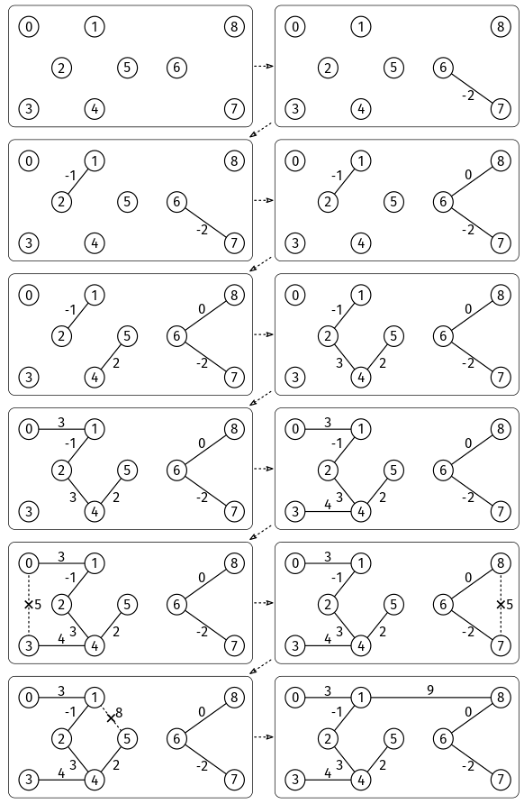

Given a weighted, undirected, connected graph, find a minimum spanning tree (MST) and return the sum of its edge weights.

A spanning tree is a subset of edges that connects (i.e., "spans") every node and has no cycles.
The minimum spanning tree is the spanning tree with minimum edge weight sum. The MST may not be unique.
The graph is given as an edge list. We are given V, the number of nodes, and edges, an edge list where each entry is a triplet [u, v, w], where u and v are the endpoints of an edge, and w is the weight. Nodes are identified by integers from 0 to V-1. Weights can be positive, zero, or negative.

Example: V = 9,
edges = [[0, 1, 3], [1, 8, 9], [8, 7, 5], [7, 4, 13], [4, 3, 4], [3, 0, 5],
         [1, 5, 8], [5, 4, 2], [4, 2, 3], [2, 1, -1], [2, 5, 10], [5, 6, 11],
         [6, 8, 0], [6, 7, -2]]
Output: 18. The sum of weights of MST edges is -2 + -1 + 0 + 2 + 3 + 3 + 4 + 9.
Constraints:

2 <= V <= 1000 (number of vertices)
V-1 <= edges.length <= V*(V-1)/2 (connected graph)
0 <= u, v < V for each edge [u, v, w]
-10^6 <= w <= 10^6 for each edge [u, v, w]
The graph is connected (spanning tree exists)
Here is the graph from the example:

Minimum Spanning Tree

See Solution
Problem 1 - Minimum Spanning Tree: Solution
Python
There are multiple algorithms for this problem. The two most common ones are Prim's and Kruskal's (you only need to know one).

Prim's Algorithm
Prim's algorithm is similar to Dijkstra's algorithm for finding shortest paths. It grows the MST from a starting node by always adding the minimum-weight edge that connects a node in the MST to a node outside the MST.

The algorithm maintains:

A priority queue of (edge_weight, node) pairs, where edge_weight is the minimum weight edge connecting the node to the current MST
A visited array to track which nodes are already in the MST
The minimum edge weight to connect each node to the MST
We start with an arbitrary node (node 0) and initialize its minimum edge weight to 0. Then, we repeatedly extract the node with the smallest edge weight from the priority queue. When we extract a node, we add its edge weight to the MST cost and mark it as visited. For each unvisited neighbor, we update its minimum edge weight if we found a smaller edge connecting it to the MST.

Analogously to lazy Dijkstra, we use a priority queue that doesn't support the 'change priority' operation, so we add a copy of the same node with the new (smaller) edge weight. The previous copy stays in the heap but it's obsolete. When we extract a node, if it is not the first time we extract that node, it means it is an obsolete copy, and we just ignore it. We call this implementation "lazy" because obsolete copies are not removed immediately.

As a preprocessing step, we build the adjacency list.

Here is the implementation:

def build_adjacency_list(edges, V):
  adj_list = [[] for _ in range(V)]
  for u, v, w in edges:
    adj_list[u].append((v, w))
    adj_list[v].append((u, w))
  return adj_list

def prim(V, edges):  # Assumes the graph is connected.
  adj_list = build_adjacency_list(edges, V)
  min_edge = [math.inf for _ in range(V)]
  min_edge[0] = 0
  vis = [False for _ in range(V)]
  PQ = [(0, 0)]
  mst_cost = 0
  while len(PQ) > 0:
    _, u = heappop(PQ)  # Only need the node, not the edge weight
    if vis[u]:
      continue  # Not first extraction -- obsolete copy
    vis[u] = True
    mst_cost += min_edge[u]
    for v, w in adj_list[u]:
      if not vis[v] and w < min_edge[v]:
        min_edge[v] = w
        heappush(PQ, (w, v))
  return mst_cost
Kruskal's Algorithm
Kruskal's algorithm is a greedy algorithm that works as follows:

Order all the edges from smallest to largest weight.
Build the MST one edge at a time. Starting with an empty tree, for each edge in order, add it to the MST unless it creates a cycle.
We'll see it in action for the following graph:

Minimum Spanning Tree

Edges are processed in order by weight. Edges connecting two nodes already in the same CC are discarded (marked with an X).

Minimum Spanning Tree

Union–find is ideal for Kruskal's algorithm:

We start with each node in its own connected component and connect them over time.
For each edge, we need to know whether it makes a cycle, i.e., whether the endpoints are already in the same connected component. This type of cycle-detection question--or connectivity-related questions in general--is easy to answer with the union–find data structure: we just check if the two nodes have the same representative.
It is important that we add the edges in a specific order, from smallest to largest (otherwise, we will get a spanning tree, but it may not be the minimum). This is our trigger for union–find as opposed to DFS or BFS.
Here is the implementation:

def kruskal(V, edges):  # Assumes the graph is connected.
  uf = UnionFind()
  for u in range(V):
    uf.add(u)
  mst_cost = 0
  edges.sort(key=lambda edge: edge[2])
  for u, v, weight in edges:
    repr_u, repr_v = uf.find(u), uf.find(v)
    if repr_u != repr_v:
      uf.union(u, v)
      mst_cost += weight
  return mst_cost
We need to implement the union-find data structure manually:

class UnionFind:
  def __init__(self):
    self.parent = {}
    self.size = {}

  # Assumes x is not already in the UnionFind.
  def add(self, x):
    self.parent[x] = x
    self.size[x] = 1

  # Assumes x is already in the UnionFind.
  def find(self, x):
    root = self.parent[x]
    while self.parent[root] != root:
      root = self.parent[root]
    while x != root:
      self.parent[x], x = root, self.parent[x]
    return root

  # Assumes x and y are already in the UnionFind.
  def union(self, x, y):
    repr_x, repr_y = self.find(x), self.find(y)
    if repr_x == repr_y:
      return  # They are already in the same set.
    if self.size[repr_x] < self.size[repr_y]:
      self.size[repr_y] += self.size[repr_x]
      self.parent[repr_x] = repr_y
    else:
      self.size[repr_x] += self.size[repr_y]
      self.parent[repr_y] = repr_x
Time & Space Analysis
V: the number of vertices
E: the number of edges
We can use a couple of big O simplifications that apply to graphs:

O(log E) can be simplified to O(log V) because log E < log (V²) = 2 log V = O(log V).
In connected graphs, E >= V - 1, so V is O(E).
Prim's algorithm:

Building the adjacency list takes O(V + E) time and space, which we can simplify to O(E) because the graph is connected.

Non-lazy versions of Prim's algorithm take O(V) space because each node can only be in the priority queue once. However, non-lazy versions require a heap with an 'update priority' operation, which is not as easily available.

With our lazy implementation, each edge is processed once, and each edge may result in a priority queue insertion, so the space complexity is O(E).

We do O(E) 'extract_min' and 'insert' operations on a priority queue of size O(E). With a standard binary min-heap implementation for the priority queue, those operations take O(log E) time each, so the total runtime is O(E * log E).

Time: O(V + E + E log E) = O(E log E) = O(E log V)
Extra space: O(V + E) = O(E) - for the adjacency list and priority queue
Kruskal's algorithm:

The union-find operations take O(E * α(V)) time, where α is the inverse Ackermann function (practically constant).

Time: O(E log E + E * α(V)) = O(E log E) = O(E log V) - the bottleneck is sorting the edges by weight.
Extra space: O(V + E) = O(E) - union-find data structure requires O(V) space, and sorting the edge list requires O(E) space.
Tests
Here are some test cases to verify the solution:

def run_tests():
  tests = [
      # Example from book
      (9, [[0, 1, 3], [1, 8, 9], [8, 7, 5], [7, 4, 13], [4, 3, 4], [3, 0, 5],
           [1, 5, 8], [5, 4, 2], [4, 2, 3], [2, 1, -1], [2, 5, 10], [5, 6, 11],
           [6, 8, 0], [6, 7, -2]], 18),
      # Single edge
      (2, [[0, 1, 5]], 5),
      # Triangle graph
      (3, [[0, 1, 1], [1, 2, 2], [0, 2, 3]], 3),
      # Square graph
      (4, [[0, 1, 1], [1, 2, 2], [2, 3, 3], [3, 0, 4]], 6),
      # Negative weights
      (3, [[0, 1, -2], [1, 2, -3], [0, 2, 1]], -5),
  ]

  for n, edges, want in tests:
    got_prim = prim(n, edges)
    assert got_prim == want, f"\nprim({n}, {edges}): got: {got_prim}, want: {want}\n"
    got_kruskal = kruskal(n, edges)
    assert got_kruskal == want, f"\nkruskal({n}, {edges}): got: {got_kruskal}, want: {want}\n"

run_tests()
function buildAdjacencyList(edges, V) {
  const adjList = Array(V).fill(null).map(() => []);
  for (const [u, v, w] of edges) {
    adjList[u].push([v, w]);
    adjList[v].push([u, w]);
  }
  return adjList;
}

function prim(V, edges) {
  // Assumes the graph is connected.
  const adjList = buildAdjacencyList(edges, V);
  const minEdge = Array(V).fill(Infinity);
  minEdge[0] = 0;
  const vis = Array(V).fill(false);
  const PQ = new Heap((a, b) => a[0] < b[0]);
  PQ.push([0, 0]);
  let mstCost = 0;
  while (PQ.size() > 0) {
    const [, u] = PQ.pop();  // Only need the node, not the edge weight
    if (vis[u]) continue;  // Not first extraction -- obsolete copy
    vis[u] = true;
    mstCost += minEdge[u];
    for (const [v, w] of adjList[u]) {
      if (!vis[v] && w < minEdge[v]) {
        minEdge[v] = w;
        PQ.push([w, v]);
      }
    }
  }
  return mstCost;
}
JS doesn't have a built-in heap, so you either have to provide your own or use a third-party library. You probably don't have to worry about building a heap from scratch in a real interview, but for completeness, here is the full heap definition we saw in the Heaps chapter:

class Heap {
  // A binary heap implementation that can act as either min-heap or max-heap.
  // By default, it creates a min-heap (the smallest element has highest priority).
  // For max-heap behavior, provide a custom 'higherPriority' function.
  // higherPriority: Function that returns True if x has higher priority than y.
  // heap:           Optional list of initial elements to heapify.
  constructor(higherPriority = (x, y) => x < y, heap = null) {
    this.higherPriority = higherPriority;
    this.heap = [];
    if (heap) {
      this.heap = [...heap];
      this.heapify();
    }
  }

  // Returns the number of elements in the heap.
  size() {
    return this.heap.length;
  }

  // Returns the highest priority element without removing it.
  top() {
    if (this.heap.length === 0) {
      return null;
    }
    return this.heap[0];
  }

  // Adds an element to the heap.
  push(elem) {
    this.heap.push(elem);
    this._bubbleUp(this.heap.length - 1);
  }

  // Removes and returns the highest priority element.
  pop() {
    if (this.heap.length === 0) {
      return null;
    }

    const top = this.heap[0];
    if (this.heap.length === 1) {
      this.heap = [];
      return top;
    }

    // Move last element to root and bubble down
    this.heap[0] = this.heap[this.heap.length - 1];
    this.heap.pop();
    this._bubbleDown(0);

    return top;
  }

  // Converts an array into a valid heap in O(n) time.
  heapify() {
    for (let idx = Math.floor(this.heap.length / 2); idx >= 0; idx--) {
      this._bubbleDown(idx);
    }
  }

  // Get parent index.
  _parent(idx) {
    if (idx === 0) {
      return -1; // The root has no parent.
    }
    return Math.floor((idx - 1) / 2);
  }

  // Get left child index.
  _leftChild(idx) {
    return 2 * idx + 1;
  }

  // Get right child index.
  _rightChild(idx) {
    return 2 * idx + 2;
  }

  // Move element up until heap property is restored.
  _bubbleUp(idx) {
    if (idx === 0) {
      return;
    }

    const parentIdx = this._parent(idx);
    if (
      parentIdx >= 0 &&
      this.higherPriority(this.heap[idx], this.heap[parentIdx])
    ) {
      [this.heap[idx], this.heap[parentIdx]] = [
        this.heap[parentIdx],
        this.heap[idx],
      ];
      this._bubbleUp(parentIdx);
    }
  }

  // Move element down until heap property is restored.
  _bubbleDown(idx) {
    const leftIdx = this._leftChild(idx);
    const isLeaf = leftIdx >= this.heap.length;
    if (isLeaf) {
      return;
    }

    // Find child with higher priority
    let childIdx = leftIdx;
    const rightIdx = this._rightChild(idx);
    if (
      rightIdx < this.heap.length &&
      this.higherPriority(this.heap[rightIdx], this.heap[leftIdx])
    ) {
      childIdx = rightIdx;
    }

    // Swap with child if it has higher priority
    if (this.higherPriority(this.heap[childIdx], this.heap[idx])) {
      [this.heap[idx], this.heap[childIdx]] = [
        this.heap[childIdx],
        this.heap[idx],
      ];
      this._bubbleDown(childIdx);
    }
  }
}
function kruskal(V, edges) {
  // Assumes the graph is connected.
  const uf = new UnionFind();
  for (let u = 0; u < V; u++) {
    uf.add(u);
  }
  let mstCost = 0;
  edges.sort((a, b) => a[2] - b[2]);

  for (const [u, v, weight] of edges) {
    const reprU = uf.find(u);
    const reprV = uf.find(v);
    if (reprU !== reprV) {
      uf.union(u, v);
      mstCost += weight;
    }
  }
  return mstCost;
}
We need to implement the union-find data structure manually:

class UnionFind {
  constructor() {
    this.parent = {};
    this.size = {};
  }

  // Assumes x is not already in the UnionFind.
  add(x) {
    this.parent[x] = x;
    this.size[x] = 1;
  }

  // Assumes x is already in the UnionFind.
  find(x) {
    let root = this.parent[x];
    while (this.parent[root] !== root) {
      root = this.parent[root];
    }
    while (x !== root) {
      const parent = this.parent[x];
      this.parent[x] = root;
      x = parent;
    }
    return root;
  }

  // Assumes x and y are already in the UnionFind.
  union(x, y) {
    const reprX = this.find(x);
    const reprY = this.find(y);
    if (reprX === reprY) return; // They are already in the same set.

    if (this.size[reprX] < this.size[reprY]) {
      this.size[reprY] += this.size[reprX];
      this.parent[reprX] = reprY;
    } else {
      this.size[reprX] += this.size[reprY];
      this.parent[reprY] = reprX;
    }
  }
}
Time & Space Analysis
V: the number of vertices
E: the number of edges
We can use a couple of big O simplifications that apply to graphs:

O(log E) can be simplified to O(log V) because log E < log (V²) = 2 log V = O(log V).
In connected graphs, E >= V - 1, so V is O(E).
Prim's algorithm:

Building the adjacency list takes O(V + E) time and space, which we can simplify to O(E) because the graph is connected.

Non-lazy versions of Prim's algorithm take O(V) space because each node can only be in the priority queue once. However, non-lazy versions require a heap with an 'update priority' operation, which is not as easily available.

With our lazy implementation, each edge is processed once, and each edge may result in a priority queue insertion, so the space complexity is O(E).

We do O(E) 'extract_min' and 'insert' operations on a priority queue of size O(E). With a standard binary min-heap implementation for the priority queue, those operations take O(log E) time each, so the total runtime is O(E * log E).

Time: O(V + E + E log E) = O(E log E) = O(E log V)
Extra space: O(V + E) = O(E) - for the adjacency list and priority queue
Kruskal's algorithm:

The union-find operations take O(E * α(V)) time, where α is the inverse Ackermann function (practically constant).

Time: O(E log E + E * α(V)) = O(E log E) = O(E log V) - the bottleneck is sorting the edges by weight.
Extra space: O(V + E) = O(E) - union-find data structure requires O(V) space, and sorting the edge list requires O(E) space.
Tests
Here are some test cases to verify the solution:

function runTests() {
  const tests = [
    // Example from book
    [
      9,
      [
        [0, 1, 3],
        [1, 8, 9],
        [8, 7, 5],
        [7, 4, 13],
        [4, 3, 4],
        [3, 0, 5],
        [1, 5, 8],
        [5, 4, 2],
        [4, 2, 3],
        [2, 1, -1],
        [2, 5, 10],
        [5, 6, 11],
        [6, 8, 0],
        [6, 7, -2],
      ],
      18,
    ],
    // Single edge
    [2, [[0, 1, 5]], 5],
    // Triangle graph
    [
      3,
      [
        [0, 1, 1],
        [1, 2, 2],
        [0, 2, 3],
      ],
      3,
    ],
    // Square graph
    [
      4,
      [
        [0, 1, 1],
        [1, 2, 2],
        [2, 3, 3],
        [3, 0, 4],
      ],
      6,
    ],
    // Negative weights
    [
      3,
      [
        [0, 1, -2],
        [1, 2, -3],
        [0, 2, 1],
      ],
      -5,
    ],
  ];

  for (const [n, edges, want] of tests) {
    const gotPrim = prim(n, edges);
    if (gotPrim !== want) {
      throw new Error(
        `\nprim(${n}, ${JSON.stringify(edges)}): got: ${gotPrim}, want: ${want}\n`,
      );
    }
    const gotKruskal = kruskal(n, edges);
    if (gotKruskal !== want) {
      throw new Error(
        `\nkruskal(${n}, ${JSON.stringify(edges)}): got: ${gotKruskal}, want: ${want}\n`,
      );
    }
  }
}

runTests();

class BuildAdjacencyList {
  public List<List<int[]>> solve(int[][] edges, int V) {
    List<List<int[]>> adjList = new ArrayList<>();
    for (int i = 0; i < V; i++) {
      adjList.add(new ArrayList<>());
    }
    for (int[] edge : edges) {
      int u = edge[0];
      int v = edge[1];
      int w = edge[2];
      adjList.get(u).add(new int[] { v, w });
      adjList.get(v).add(new int[] { u, w });
    }
    return adjList;
  }
}

class Prim {
  public int solve(int V, int[][] edges) { // Assumes the graph is connected.
    BuildAdjacencyList builder = new BuildAdjacencyList();
    List<List<int[]>> adjList = builder.solve(edges, V);
    int[] minEdge = new int[V];
    for (int i = 0; i < V; i++) {
      minEdge[i] = Integer.MAX_VALUE;
    }
    minEdge[0] = 0;
    boolean[] vis = new boolean[V];
    PriorityQueue<int[]> PQ = new PriorityQueue<>((a, b) -> a[0] - b[0]);
    PQ.add(new int[] { 0, 0 });
    int mstCost = 0;
    while (!PQ.isEmpty()) {
      int u = PQ.poll()[1]; // Only need the node, not the edge weight
      if (vis[u])
        continue; // Not first extraction -- obsolete copy
      vis[u] = true;
      mstCost += minEdge[u];
      for (int[] edge : adjList.get(u)) {
        int v = edge[0];
        int w = edge[1];
        if (!vis[v] && w < minEdge[v]) {
          minEdge[v] = w;
          PQ.add(new int[] { w, v });
        }
      }
    }
    return mstCost;
  }
}
class Kruskal {
  public int solve(int V, int[][] edges) { // Assumes the graph is connected.
    UnionFind uf = new UnionFind();
    for (int u = 0; u < V; u++) {
      uf.add(u);
    }
    int mstCost = 0;

    // Create a copy of edges to sort
    List<int[]> sortedEdges = new ArrayList<>();
    for (int[] edge : edges) {
      sortedEdges.add(edge);
    }
    Collections.sort(sortedEdges, (a, b) -> Integer.compare(a[2], b[2]));

    for (int[] edge : sortedEdges) {
      int u = edge[0], v = edge[1], weight = edge[2];
      int reprU = uf.find(u), reprV = uf.find(v);
      if (reprU != reprV) {
        uf.union(u, v);
        mstCost += weight;
      }
    }
    return mstCost;
  }
}
We need to implement the union-find data structure manually:

public class UnionFind {
  private HashMap<Integer, Integer> parent;
  private HashMap<Integer, Integer> size;

  public UnionFind() {
    parent = new HashMap<>();
    size = new HashMap<>();
  }

  // Assumes x is not already in the UnionFind.
  public void add(int x) {
    parent.put(x, x);
    size.put(x, 1);
  }

  // Assumes x is already in the UnionFind.
  public int find(int x) {
    int root = parent.get(x);
    while (parent.get(root) != root) {
      root = parent.get(root);
    }

    // Path compression
    while (x != root) {
      int next = parent.get(x);
      parent.put(x, root);
      x = next;
    }

    return root;
  }

  // Assumes x and y are already in the UnionFind.
  public void union(int x, int y) {
    int reprX = find(x);
    int reprY = find(y);

    if (reprX == reprY) {
      return; // They are already in the same set
    }

    if (size.get(reprX) < size.get(reprY)) {
      size.put(reprY, size.get(reprY) + size.get(reprX));
      parent.put(reprX, reprY);
    } else {
      size.put(reprX, size.get(reprX) + size.get(reprY));
      parent.put(reprY, reprX);
    }
  }

  // Returns the size of the set containing x.
  // Assumes x is already in the UnionFind.
  public int getSetSize(int x) {
    return size.get(find(x));
  }
}
class RunTests {
  public void runTests() {
    Object[][] tests = {
        // Example from book
        { 9,
            new int[][] {
                { 0, 1, 3 }, { 1, 8, 9 }, { 8, 7, 5 }, { 7, 4, 13 },
                { 4, 3, 4 },
                { 3, 0, 5 }, { 1, 5, 8 }, { 5, 4, 2 }, { 4, 2, 3 },
                { 2, 1, -1 },
                { 2, 5, 10 }, { 5, 6, 11 }, { 6, 8, 0 }, { 6, 7, -2 }
            },
            18 },
        // Single edge
        { 2, new int[][] { { 0, 1, 5 } }, 5 },
        // Triangle graph
        { 3, new int[][] { { 0, 1, 1 }, { 1, 2, 2 }, { 0, 2, 3 } }, 3 },
        // Square graph
        { 4, new int[][] { { 0, 1, 1 }, { 1, 2, 2 }, { 2, 3, 3 }, { 3, 0, 4 } },
            6 },
        // Negative weights
        { 3, new int[][] { { 0, 1, -2 }, { 1, 2, -3 }, { 0, 2, 1 } }, -5 },
    };

    Prim primSolution = new Prim();
    Kruskal kruskalSolution = new Kruskal();
    for (Object[] test : tests) {
      int V = (int) test[0];
      int[][] edges = (int[][]) test[1];
      int want = (int) test[2];
      int gotPrim = primSolution.solve(V, edges);
      if (gotPrim != want) {
        StringBuilder edgesStr = new StringBuilder("[");
        for (int j = 0; j < edges.length; j++) {
          if (j > 0)
            edgesStr.append(", ");
          edgesStr.append(String.format("[%d, %d, %d]",
              edges[j][0], edges[j][1], edges[j][2]));
        }
        edgesStr.append("]");

        throw new RuntimeException(String.format(
            "\nprim(%d, %s): got: %d, want: %d\n",
            V, edgesStr, gotPrim, want));
      }
      int gotKruskal = kruskalSolution.solve(V, edges);
      if (gotKruskal != want) {
        StringBuilder edgesStr = new StringBuilder("[");
        for (int j = 0; j < edges.length; j++) {
          if (j > 0)
            edgesStr.append(", ");
          edgesStr.append(String.format("[%d, %d, %d]",
              edges[j][0], edges[j][1], edges[j][2]));
        }
        edgesStr.append("]");

        throw new RuntimeException(String.format(
            "\nsolve(%d, %s): got: %d, want: %d\n",
            V, edgesStr, gotKruskal, want));
      }
    }
  }
}

public class Solution {
  public static void main(String[] args) {
    new RunTests().runTests();
  }
}
