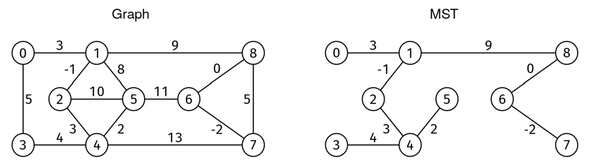

Given a weighted, undirected graph, find a minimum spanning tree (MST) and return an array with the edges in it. If the MST is not unique, return any of them. If the graph is not connected, return an empty list.

A spanning tree is a subset of edges that connects (i.e., "spans") every node and has no cycles.
The minimum spanning tree is the spanning tree with minimum edge weight sum.
The graph is given as an edge list. We are given V, the number of nodes, and edges, an edge list where each entry is a triplet [u, v, w], where u and v are the endpoints of an edge, and w is the weight. Nodes are identified by integers from 0 to V-1. Weights can be positive, zero, or negative.

Example 1: V = 9, edges = [[0, 1, 3], [1, 8, 9], [8, 7, 5], [7, 4, 13], [4, 3,
4], [3, 0, 5], [1, 5, 8], [5, 4, 2], [4, 2, 3], [2, 1, -1], [2, 5, 10], [5, 6,
11], [6, 8, 0], [6, 7, -2]]
Output: [[0, 1, 3], [1, 8, 9], [4, 3, 4], [5, 4, 2], [4, 2, 3], [2, 1, -1],
[6, 8, 0], [6, 7, -2]].

Example 2: V = 3, edges = [[0, 1, 1]]
Output: []. The graph is not connected.

Example 3: V = 3, edges = [[0, 1, 1], [1, 2, 1], [2, 0, 1]]
Output: [[0, 1, 1], [1, 2, 1]]. The solution is not unique.
Here is the graph from Example 1:

MST Reconstruction

Constraints:

0 <= V <= 1000 (number of vertices, can be empty graph)
0 <= edges.length <= V*(V-1)/2 (from no edges to a complete graph)
0 <= u, v < V for each edge [u, v, w]
-10^6 <= w <= 10^6 for each edge [u, v, w]
See Solution
Problem 3 - MST Reconstruction: Solution
Python
There are multiple algorithms for the MST problem. The two most common ones are Prim's and Kruskal's (you only need to know one). Here, we'll use Kruskal's. See the MST problem problem for Prim's implementation.

We'll adapt Kruskal's algorithm to the case where we do not know upfront if the graph is connected.

Kruskal's algorithm is a greedy algorithm for the MST problem that works as follows:

Order all the edges from smallest to largest weight.
Build the MST one edge at a time. Starting with an empty tree, for each edge in order, add it to the MST unless it creates a cycle.
We'll see it in action for the following graph:

Edges are processed in order by weight. Edges connecting two nodes already in the same CC are discarded (marked with an X).

MST Reconstruction

Kruskal's algorithm is implemented with a union-find data structure.

We can approach this problem in a few ways:

Of course, we could do a separate DFS just to check for connectivity at the beginning (but that is not in the spirit of the question!).

If we are using the union-by-size optimization, we can check in the size array if everyone is in the same group. We can add a check at the end:

if uf.size[uf.find(0)] != n:
  return -1
Without relying on the size array, we could instead keep track of the number of edges that we added to the MST and then check at the end if we added n-1 (recall that we need at least n-1 edges to connect n nodes).
Here is approach 3:

def kruskal(V, edges):
  uf = UnionFind()
  for u in range(V):
    uf.add(u)
  mst_edges = []
  edges.sort(key=lambda edge: edge[2])
  for u, v, weight in edges:
    repr_u, repr_v = uf.find(u), uf.find(v)
    if repr_u != repr_v:
      uf.union(u, v)
      mst_edges.append([u, v, weight])

  if len(mst_edges) == V - 1:
    return mst_edges
  return []  # The graph was not connected.
We need to implement the union-find data structure manually:

class UnionFind:
  def __init__(self):
    self.parent = {}
    self.size = {}

  # Assumes x is not already in the UnionFind.
  def add(self, x):
    self.parent[x] = x
    self.size[x] = 1

  # Assumes x is already in the UnionFind.
  def find(self, x):
    root = self.parent[x]
    while self.parent[root] != root:
      root = self.parent[root]
    while x != root:
      self.parent[x], x = root, self.parent[x]
    return root

  # Assumes x and y are already in the UnionFind.
  def union(self, x, y):
    repr_x, repr_y = self.find(x), self.find(y)
    if repr_x == repr_y:
      return  # They are already in the same set.
    if self.size[repr_x] < self.size[repr_y]:
      self.size[repr_y] += self.size[repr_x]
      self.parent[repr_x] = repr_y
    else:
      self.size[repr_x] += self.size[repr_y]
      self.parent[repr_y] = repr_x
Time & Space Analysis
V: the number of vertices

E: the number of edges

Time: O(E log E) - the bottleneck is sorting the edges by weight. The union-find operations take O(E * α(V)) time, where α is the inverse Ackermann function (practically constant).

Extra space: O(V + E) - union-find data structure requires O(V) space, sorting the edge list requires O(E) space, and storing the MST edges requires O(V) space (at most V-1 edges in MST).

The algorithm uses Kruskal's approach to build the MST and checks connectivity by counting the number of edges added (should be V-1 for a connected graph).

Tests
Here are some test cases to verify the solution:

def run_tests():
  tests = [
      # Example 1 from book
      (9, [[0, 1, 3], [1, 8, 9], [8, 7, 5], [7, 4, 13], [4, 3, 4], [3, 0, 5],
           [1, 5, 8], [5, 4, 2], [4, 2, 3], [2, 1, -1], [2, 5, 10], [5, 6, 11],
           [6, 8, 0], [6, 7, -2]],
       [[0, 1, 3], [1, 8, 9], [4, 3, 4], [5, 4, 2], [4, 2, 3], [2, 1, -1],
          [6, 8, 0], [6, 7, -2]]),
      # Example 2 - not connected
      (3, [[0, 1, 1]], []),
      # Example 3 - not unique solution
      (3, [[0, 1, 1], [1, 2, 1], [2, 0, 1]], [[0, 1, 1], [1, 2, 1]]),
      # Single edge
      (2, [[0, 1, 5]], [[0, 1, 5]]),
      # Triangle graph
      (3, [[0, 1, 1], [1, 2, 2], [0, 2, 3]], [[0, 1, 1], [1, 2, 2]]),
      # Empty graph
      (0, [], []),
  ]

  for V, edges, want in tests:
    got = kruskal(V, edges)
    # We check that 'got' has (1) the right number of edges, (2) the right cost,
    # and (3) no cycles.
    assert len(got) == len(want), f"\nkruskal({V}, {edges}): got:\n{
        got}, want: {len(want)} edges"
    assert sum([w for _, _, w in got]) == sum([w for _, _, w in want]), f"\nkruskal({V}, {edges}): got:\n{
        got}, want cost {sum([w for _, _, w in want])}"

    if not got:
      continue

    # Check that 'got' has no cycles with BFS
    graph = [[] for _ in range(V)]
    for u, v, _ in got:
      graph[u].append(v)
      graph[v].append(u)

    visited = {0}
    parent = {0: -1}
    Q = deque([0])

    while Q:
      u = Q.popleft()
      for v in graph[u]:
        if v not in visited:
          visited.add(v)
          parent[v] = u
          Q.append(v)
        elif parent.get(u) != v:  # Found a cycle
          assert False, f"\nkruskal({V}, {edges}): got contains a cycle"

run_tests()

function kruskal(V, edges) {
  const uf = new UnionFind();
  for (let u = 0; u < V; u++) {
    uf.add(u);
  }
  const mstEdges = [];
  edges.sort((a, b) => a[2] - b[2]);

  for (const [u, v, weight] of edges) {
    const reprU = uf.find(u);
    const reprV = uf.find(v);
    if (reprU !== reprV) {
      uf.union(u, v);
      mstEdges.push([u, v, weight]);
    }
  }

  if (mstEdges.length === V - 1) {
    return mstEdges;
  }
  return []; // The graph was not connected.
}
We need to implement the union-find data structure manually:

class UnionFind {
  constructor() {
    this.parent = {};
    this.size = {};
  }

  // Assumes x is not already in the UnionFind.
  add(x) {
    this.parent[x] = x;
    this.size[x] = 1;
  }

  // Assumes x is already in the UnionFind.
  find(x) {
    let root = this.parent[x];
    while (this.parent[root] !== root) {
      root = this.parent[root];
    }
    while (x !== root) {
      const parent = this.parent[x];
      this.parent[x] = root;
      x = parent;
    }
    return root;
  }

  // Assumes x and y are already in the UnionFind.
  union(x, y) {
    const reprX = this.find(x);
    const reprY = this.find(y);
    if (reprX === reprY) return; // They are already in the same set.

    if (this.size[reprX] < this.size[reprY]) {
      this.size[reprY] += this.size[reprX];
      this.parent[reprX] = reprY;
    } else {
      this.size[reprX] += this.size[reprY];
      this.parent[reprY] = reprX;
    }
  }
}
Time & Space Analysis
V: the number of vertices

E: the number of edges

Time: O(E log E) - the bottleneck is sorting the edges by weight. The union-find operations take O(E * α(V)) time, where α is the inverse Ackermann function (practically constant).

Extra space: O(V + E) - union-find data structure requires O(V) space, sorting the edge list requires O(E) space, and storing the MST edges requires O(V) space (at most V-1 edges in MST).

The algorithm uses Kruskal's approach to build the MST and checks connectivity by counting the number of edges added (should be V-1 for a connected graph).

Tests
Here are some test cases to verify the solution:

function runTests() {
  const tests = [
    // Example 1 from book
    [
      9,
      [
        [0, 1, 3],
        [1, 8, 9],
        [8, 7, 5],
        [7, 4, 13],
        [4, 3, 4],
        [3, 0, 5],
        [1, 5, 8],
        [5, 4, 2],
        [4, 2, 3],
        [2, 1, -1],
        [2, 5, 10],
        [5, 6, 11],
        [6, 8, 0],
        [6, 7, -2],
      ],
      [
        [0, 1, 3],
        [1, 8, 9],
        [4, 3, 4],
        [5, 4, 2],
        [4, 2, 3],
        [2, 1, -1],
        [6, 8, 0],
        [6, 7, -2],
      ],
    ],
    // Example 2 - not connected
    [3, [[0, 1, 1]], []],
    // Example 3 - not unique solution
    [
      3,
      [
        [0, 1, 1],
        [1, 2, 1],
        [2, 0, 1],
      ],
      [
        [0, 1, 1],
        [1, 2, 1],
      ],
    ],
    // Single edge
    [2, [[0, 1, 5]], [[0, 1, 5]]],
    // Triangle graph
    [
      3,
      [
        [0, 1, 1],
        [1, 2, 2],
        [0, 2, 3],
      ],
      [
        [0, 1, 1],
        [1, 2, 2],
      ],
    ],
    // Empty graph
    [0, [], []],
  ];

  for (const [V, edges, want] of tests) {
    const got = kruskal(V, edges);
    // We check that 'got' has (1) the right number of edges, (2) the right cost,
    // and (3) no cycles.
    if (got.length !== want.length) {
      throw new Error(
        `\nkruskal(${V}, ${JSON.stringify(edges)}): got:\n${JSON.stringify(got)}, want: ${want.length} edges`,
      );
    }

    const gotCost = got.reduce((sum, [_, __, w]) => sum + w, 0);
    const wantCost = want.reduce((sum, [_, __, w]) => sum + w, 0);
    if (gotCost !== wantCost) {
      throw new Error(
        `\nkruskal(${V}, ${JSON.stringify(edges)}): got:\n${JSON.stringify(got)}, want cost ${wantCost}`,
      );
    }

    if (!got.length) {
      continue;
    }

    // Check that 'got' has no cycles with BFS
    const graph = Array(V)
      .fill()
      .map(() => []);
    for (const [u, v] of got) {
      graph[u].push(v);
      graph[v].push(u);
    }

    const visited = new Set([0]);
    const parent = new Map([[0, -1]]);
    const Q = [0];

    while (Q.length) {
      // Be mindful that shift() may take linear time, so in an interview,
      // we may not want to code BFS like this.
      const u = Q.shift();
      for (const v of graph[u]) {
        if (!visited.has(v)) {
          visited.add(v);
          parent.set(v, u);
          Q.push(v);
        } else if (parent.get(u) !== v) {
          // Found a cycle
          throw new Error(
            `\nkruskal(${V}, ${JSON.stringify(edges)}): got contains a cycle`,
          );
        }
      }
    }
  }
  return true;
}

runTests();

class Kruskal {
  public int[][] solve(int V, int[][] edges) {
    if (V == 0)
      return new int[0][];

    UnionFind uf = new UnionFind();
    for (int u = 0; u < V; u++) {
      uf.add(u);
    }

    // Create a copy of edges to sort
    List<EdgeWithIndex> sortedEdges = new ArrayList<>();
    for (int i = 0; i < edges.length; i++) {
      sortedEdges.add(new EdgeWithIndex(edges[i], i));
    }
    Collections.sort(sortedEdges);

    List<int[]> mst = new ArrayList<>();
    int edgesInMst = 0;

    for (EdgeWithIndex edge : sortedEdges) {
      int u = edge.edge[0], v = edge.edge[1];
      int reprU = uf.find(u), reprV = uf.find(v);
      if (reprU != reprV) {
        uf.union(u, v);
        mst.add(edge.edge);
        edgesInMst++;
      }
    }

    // Check if we have a valid MST (n-1 edges)
    if (edgesInMst != V - 1) {
      return new int[0][];
    }

    return mst.toArray(new int[0][]);
  }

  private static class EdgeWithIndex implements Comparable<EdgeWithIndex> {
    int[] edge;
    int index;

    EdgeWithIndex(int[] edge, int index) {
      this.edge = edge;
      this.index = index;
    }

    @Override
    public int compareTo(EdgeWithIndex other) {
      return Integer.compare(this.edge[2], other.edge[2]);
    }
  }
}
We need to implement the union-find data structure manually:

public class UnionFind {
  private HashMap<Integer, Integer> parent;
  private HashMap<Integer, Integer> size;

  public UnionFind() {
    parent = new HashMap<>();
    size = new HashMap<>();
  }

  // Assumes x is not already in the UnionFind.
  public void add(int x) {
    parent.put(x, x);
    size.put(x, 1);
  }

  // Assumes x is already in the UnionFind.
  public int find(int x) {
    int root = parent.get(x);
    while (parent.get(root) != root) {
      root = parent.get(root);
    }

    // Path compression
    while (x != root) {
      int next = parent.get(x);
      parent.put(x, root);
      x = next;
    }

    return root;
  }

  // Assumes x and y are already in the UnionFind.
  public void union(int x, int y) {
    int reprX = find(x);
    int reprY = find(y);

    if (reprX == reprY) {
      return; // They are already in the same set
    }

    if (size.get(reprX) < size.get(reprY)) {
      size.put(reprY, size.get(reprY) + size.get(reprX));
      parent.put(reprX, reprY);
    } else {
      size.put(reprX, size.get(reprX) + size.get(reprY));
      parent.put(reprY, reprX);
    }
  }

  // Returns the size of the set containing x.
  // Assumes x is already in the UnionFind.
  public int getSetSize(int x) {
    return size.get(find(x));
  }
}
Time & Space Analysis
V: the number of vertices

E: the number of edges

Time: O(E log E) - the bottleneck is sorting the edges by weight. The union-find operations take O(E * α(V)) time, where α is the inverse Ackermann function (practically constant).

Extra space: O(V + E) - union-find data structure requires O(V) space, sorting the edge list requires O(E) space, and storing the MST edges requires O(V) space (at most V-1 edges in MST).

The algorithm uses Kruskal's approach to build the MST and checks connectivity by counting the number of edges added (should be V-1 for a connected graph).

Tests
Here are some test cases to verify the solution:

class RunTests {
  public void runTests() {
    Object[][] tests = {
        // Example 1 from book
        { 9,
            new int[][] {
                { 0, 1, 3 }, { 1, 8, 9 }, { 8, 7, 5 }, { 7, 4, 13 },
                { 4, 3, 4 },
                { 3, 0, 5 }, { 1, 5, 8 }, { 5, 4, 2 }, { 4, 2, 3 },
                { 2, 1, -1 },
                { 2, 5, 10 }, { 5, 6, 11 }, { 6, 8, 0 }, { 6, 7, -2 }
            },
            new int[][] {
                { 0, 1, 3 }, { 1, 8, 9 }, { 4, 3, 4 }, { 5, 4, 2 }, { 4, 2, 3 },
                { 2, 1, -1 }, { 6, 8, 0 }, { 6, 7, -2 }
            } },
        // Example 2 - not connected
        { 3, new int[][] { { 0, 1, 1 } }, new int[][] {} },
        // Example 3 - not unique solution
        { 3, new int[][] { { 0, 1, 1 }, { 1, 2, 1 }, { 2, 0, 1 } },
            new int[][] { { 0, 1, 1 }, { 1, 2, 1 } } },
        // Single edge
        { 2, new int[][] { { 0, 1, 5 } }, new int[][] { { 0, 1, 5 } } },
        // Triangle graph
        { 3, new int[][] { { 0, 1, 1 }, { 1, 2, 2 }, { 0, 2, 3 } },
            new int[][] { { 0, 1, 1 }, { 1, 2, 2 } } },
        // Empty graph
        { 0, new int[][] {}, new int[][] {} },
    };

    Kruskal solution = new Kruskal();
    for (Object[] test : tests) {
      int V = (int) test[0];
      int[][] edges = (int[][]) test[1];
      int[][] want = (int[][]) test[2];
      int[][] got = solution.solve(V, edges);

      // Check length
      if (got.length != want.length) {
        StringBuilder edgesStr = new StringBuilder("[");
        for (int j = 0; j < edges.length; j++) {
          if (j > 0)
            edgesStr.append(", ");
          edgesStr.append(String.format("[%d, %d, %d]",
              edges[j][0], edges[j][1], edges[j][2]));
        }
        edgesStr.append("]");

        throw new RuntimeException(String.format(
            "\nsolve(%d, %s): got wrong number of edges: %d, want: %d\n",
            V, edgesStr, got.length, want.length));
      }

      // Check total cost
      int gotCost = 0, wantCost = 0;
      for (int[] edge : got)
        gotCost += edge[2];
      for (int[] edge : want)
        wantCost += edge[2];

      if (gotCost != wantCost) {
        StringBuilder edgesStr = new StringBuilder("[");
        for (int j = 0; j < edges.length; j++) {
          if (j > 0)
            edgesStr.append(", ");
          edgesStr.append(String.format("[%d, %d, %d]",
              edges[j][0], edges[j][1], edges[j][2]));
        }
        edgesStr.append("]");

        throw new RuntimeException(String.format(
            "\nsolve(%d, %s): got wrong cost: %d, want: %d\n",
            V, edgesStr, gotCost, wantCost));
      }
    }
  }
}

public class Solution {
  public static void main(String[] args) {
    new RunTests().runTests();
  }
}
